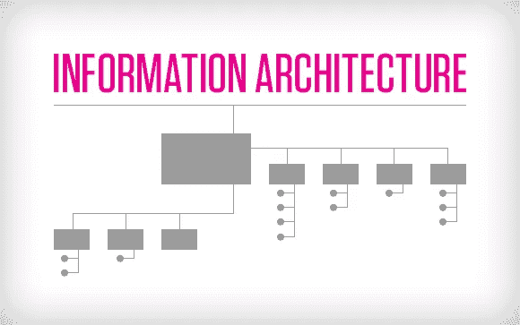
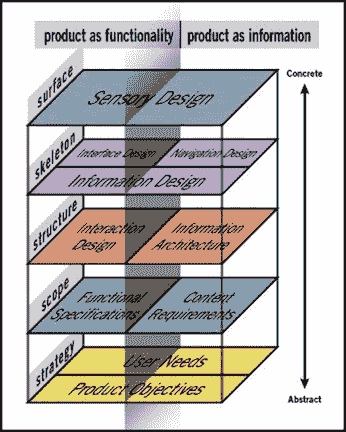
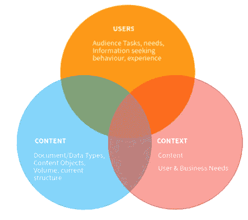

# 如何在你的项目中融入“信息架构”的概念？

> 原文：<https://blog.devgenius.io/how-to-integrate-the-concept-of-information-architecture-in-your-project-14cd49af350e?source=collection_archive---------9----------------------->



图片来自[https://www.dragon1.com/resources/information-architecture](https://www.dragon1.com/resources/information-architecture)

**目的**

当我作为一名前端开发人员开始一项新服务时，我应该学习“信息架构”。我听到了这个词，但我不知道具体是什么。所以，我将分享我关于信息结构的知识。这是一个很长的词，所以我称之为“IA”。基本上，IA 是一个稍微复杂的概念，所以我将更多地关注如何在实际项目中集成这一概念。

**什么是 IA？**

基本上，这是一种通过安排信息结构将一些信息容易地告诉用户的方法。信息的定义如下(很概念性，很抽象，但不用太担心)。

```
・Combination of Information structure, labeling , navigation system・Understanding contents intuitive, and the design to access for users easily・Easy to find and manage by doing sort and organize
```

**IA 的设计**

杰西·詹姆斯·加勒特(Jesse James Garrett)发明的五面模型(In 5 planes Model)是定义用户需求和目的的模型，将视觉设计分为五个层次。在这个模型中，信息架构位于结构层。



图片来自[http://mason.gmu.edu/~kprichar/375/module5-theoretical.html](http://mason.gmu.edu/~kprichar/375/module5-theoretical.html)

构成 IA 的要素是“用户”、“内容”、“语境”，这三个要素是相互依存的。这个概念有助于为整个项目成员创造一个共同的认知。



图片来自[https://www . content active . com/blog/posts/2018/9 月/information-architecture-principles-best-practices-and-tools/](https://www.contentactive.com/blog/posts/2018/september/information-architecture-principles-best-practices-and-tools/)

**为什么 IA 有用，我们如何在实际项目中集成 IA？**

因为它可以让我们轻松地共享生产布局。

在真实的项目中，很难创造出每个人都能理解的真正的“UI UX 设计”。尤其是对客户而言。如果您共享基本的色调和方式图像以及原型，那么它可能会与生产图像有所不同。在这种情况下，由于大多数客户提出了不同的形象或概念，你可以重新创建所有的东西，因为概念是设计的基础，显然，当概念发生变化的其余内容应该从基础重新开始。

虽然开发阶段可能会有同样的问题，但与过去相比，最近原型法和敏捷方法更受关注，因为正如我所提到的，客户可能会在开发结束时说“不，这不是我的产品图像”。特别是，如果你的团队引入了尽可能不返回先前流量的瀑布方法，这是一种噩梦。

就 UI 和 UX 设计而言，你也可以创建原型，但这不同于开发。因为开发的重点是功能，而设计的重点是设计“整体”结构。即使你可以在原型中创建“UI ”,你也不能在这个原型中表达整个设计结构。

所以，基本上我们应该做的是安排 IA，因为它需要在设计师和非设计师(尤其是公司高管或客户)之间建立一种认知

你要带着问题把你想做的事情安排在信息层。

例如

```
“What should you tell or show customers and clients?”“What should you let customers do?”“What is the relation between informations which you searched for?”“How should you prioritize these information? Which one is the essential? and which one is optional?”
```

你需要讨论“你应该如何设计 IA”。你可以使用原型来讨论它，他们会在开始创作产品设计之前给你一些反馈。真正重要的是“创造一种共同的认同”。虽然设计师应该解释信息架构，但非设计师也需要深入理解信息架构。这种共同认识防止客户说“这不是我的产品图像”。

这是一种旁注，当我作为销售人员工作时，这种创造“共同认知”的技能非常有用，因为一些客户可能会根据阶段或时间说不同的话。所以，我写了一份关于我和客户之间讨论过程的文件作为证据，分享客户并检查它是否正确。这只是一个旁注，但在使用 IA 方面还是很有用的。

如果这个 IA 层的讨论没有做好，接下来会发生什么？嗯，如果你从基础重新开始，你需要立即创建一个新的设计。在这种情况下，由于你没有太多的时间去创造，你可以听听客户或高管的意见，然后就去创造。这并不坏，但这种设计不是为用户创造，只是为客户或高管创造。有时这个产品对用户来说也不错，但大多数情况下还不够好，这就是为什么我认为我们需要高效地使用 IA。

**结论**

IA 的概念不是很容易，但创建“为用户”的网站或应用程序非常有用。而且你不需要从基础重新开始，你可以保护自己(即使你应该花很多时间来讨论和分享你的知识，以创造一个共同的认可)。

**参考**

内容策略的 5 个平面:【https://ozchen.com/5-planes-content-strategy/ 

信息架构:原则、最佳实践和工具:[https://www . content active . com/blog/posts/2018/September/information-Architecture-Principles-Best-practices-and-tools/](https://www.contentactive.com/blog/posts/2018/september/information-architecture-principles-best-practices-and-tools/)

信息架构完全初学者指南:[https://www . UX booth . com/articles/complete-初学者指南-信息架构/](https://www.uxbooth.com/articles/complete-beginners-guide-to-information-architecture/)

情報アーキテクチャとは: [https://murashun.jp/article/seo/information-architecture.html](https://murashun.jp/article/seo/information-architecture.html)

デザインの悲劇を減らすための IA :[https://note.com/ikutani41/n/nf6bb53eb13c9](https://note.com/ikutani41/n/nf6bb53eb13c9)

感谢您的阅读！！