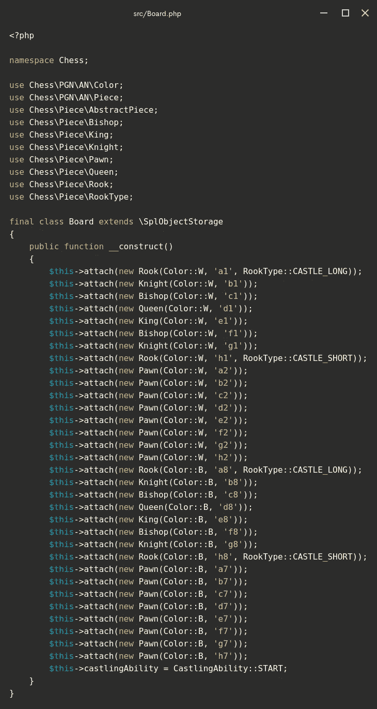
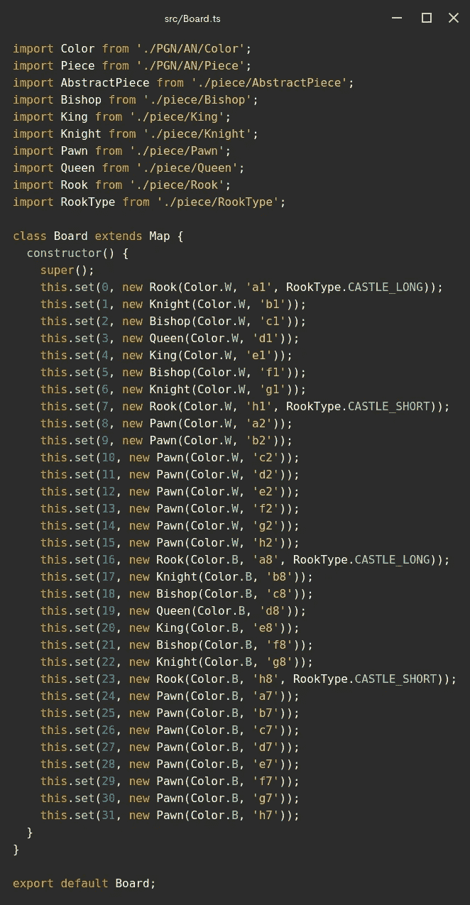
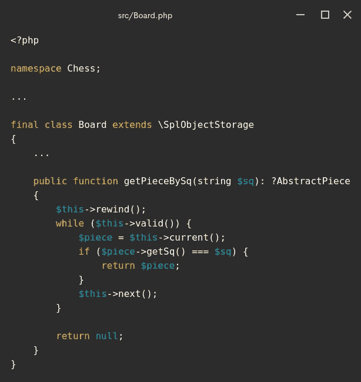
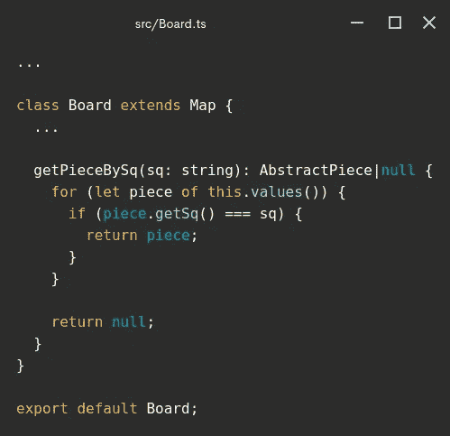
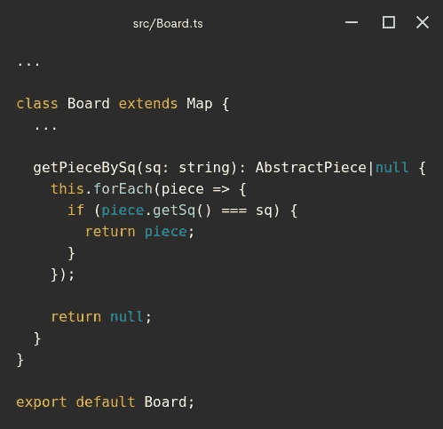
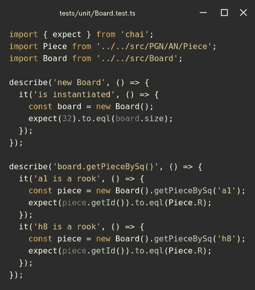

# 如何迭代 TypeScript 映射

> 原文：<https://blog.devgenius.io/how-to-iterate-over-a-typescript-map-c62ca11cc69c?source=collection_archive---------7----------------------->

## 并在不使用 forEach 循环的情况下返回值


Photo by [愚木混株 cdd20](https://unsplash.com/@cdd20?utm_source=unsplash&utm_medium=referral&utm_content=creditCopyText) on [Unsplash](https://unsplash.com/s/photos/escher?utm_source=unsplash&utm_medium=referral&utm_content=creditCopyText)

H ello world，欢迎回来，这是“为什么 TypeScript 和 PHP 是好朋友”系列中的另一篇文章，在这里我们来看看这两种编程语言是如何相似的。不要错过了解更多相关信息的机会，点击下面的链接。

[](https://medium.com/geekculture/why-typescript-and-php-are-good-friends-964360fb75f6) [## 为什么 TypeScript 和 PHP 是好朋友

### 完整指南

medium.com](https://medium.com/geekculture/why-typescript-and-php-are-good-friends-964360fb75f6) 

在许多其他事情中，我们已经知道 TypeScript 错误等同于 PHP 异常，并且我们还实现了一种变通方法，使 TypeScript Chess 和 PHP Chess 看起来非常相似。

[](https://github.com/chesslablab/php-chess) [## GitHub-chess lab/PHP-chess:PHP 的国际象棋库。

### PHP 国际象棋库。via composer:$ composer require chess lab/PHP-chess 对$game->play 方法的调用…

github.com](https://github.com/chesslablab/php-chess) [](https://github.com/chesslablab/ts-chess) [## GitHub-chess lab/ts-chess:一个用于 TypeScript 的国际象棋库。

### 此时您不能执行该操作。您已使用另一个标签页或窗口登录。您已在另一个选项卡中注销，或者…

github.com](https://github.com/chesslablab/ts-chess) 

毕竟，让两个代码库看起来相似并没有那么复杂，因为 TypeScript 和 PHP 都是现代的面向对象编程语言。

# 数据结构呢？

PHP 和 TypeScript 提供了数据结构，如果使用得当，肯定会使开发人员的生活更加轻松。

PHP 附带了 [SplObjectStorage](https://www.php.net/manual/en/class.splobjectstorage.php) 类，而 TypeScript 提供了开箱即用的 Map 类。两者的目的是一样的，都是用来存储对象的，所以我想可以说 TypeScript 的 Map 相当于 PHP 的 SplObjectStorage。

我们将 PHP Chess 转录为 TypeScript Chess 的原因是为了在协作环境中练习软件开发技能——OOP、软件设计模式等等——以便您可以将这些技能转移到理想的工作中！

需要注意的重要一点是，这两个代码库依赖于一个名为`Board`的对象存储的概念，其中包含了以前用面向对象方法设计的棋子。

根据[文件](https://php-chess.readthedocs.io/en/latest/board/):

> 国际象棋\棋盘是一种棋盘表示，允许以可移植游戏符号(PGN)格式下棋。但不仅如此，它还是创建多个特性的基石:FEN 字符串处理、ASCII 表示、PNG 图像创建、位置评估等。

因此，在开发过程的某个时候，您可能会以下面的代码结束。



**图一**。 [src/Board.php](https://github.com/chesslablab/php-chess/blob/master/src/Board.php)



**图二**。 [src/Board.ts](https://github.com/chesslablab/ts-chess/blob/master/src/Board.ts)

请注意，`Board.php`一方面扩展了`SplObjectStorage`类，而`Board.ts`另一方面扩展了`Map`类。到目前为止一切顺利。现在让我们写一个名为`getPieceBySq()`的方法来返回一个给定了代数符号的正方形。



**图 3** 。在 src/Board.php 中实现的 getPieceBySq()



**图 4** 。在 src/Board.ts 中实现的 getPieceBySq()

在这两种情况下，都需要遍历容器的对象(棋盘上的棋子)来搜索占据指定方格的棋子，这意味着调用适当的 API 方法。

有几种不同的方法可以循环键值对的 TypeScript 映射:

```
let board = new Board();
```

*   `board.keys()`在按键上循环
*   `board.values()`在值上循环
*   `board.entries()`在条目上循环

有趣的是，您知道在 TypeScript 版本中,`forEach`循环不能用于返回值吗？事情不应该是这样的。

根据 [MDN 网络文档](https://developer.mozilla.org/en-US/docs/Web/JavaScript/Reference/Global_Objects/Array/forEach?v=example):

> 除了抛出异常之外，没有其他方法可以停止或中断 forEach()循环。如果您需要这样的行为，forEach()方法是错误的工具。

我不知道这一点，最初在`Board.ts`中写了下面的`getPieceBySq()`方法，它并不像单元测试报告的那样正常工作。



**图 5** 。在 src/Board.ts 中错误地实现了 getPieceBySq()



**图六**。board.getPieceBySq()中的测试最初失败是因为在 forEach()循环中返回值。

然而,`for...of`语句成功了。

# 结论

TypeScript 的 Map 相当于 PHP 的 SplObjectStorage。两者都是数据结构，帮助您将对象存储在集合中，以供进一步处理，如检索或删除数据。

PHP Chess 和 TypeScript Chess 依赖于名为`Board`的包含面向对象棋子的对象存储的思想。

棋盘的 TypeScript 版本是扩展了`Map`类的键值对的映射。今天，我们实现了名为`getPieceBySq()`的第一个方法，它返回一个给定了代数符号中的正方形的棋子。

有必要迭代一个类型脚本映射来搜索一个特定的对象，`for...of`语句拯救了这个对象。记住，除了抛出异常之外，没有其他方法可以停止`forEach`循环。