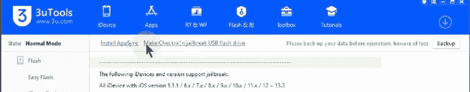
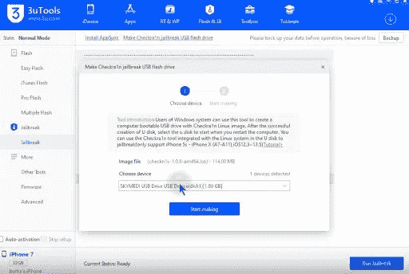
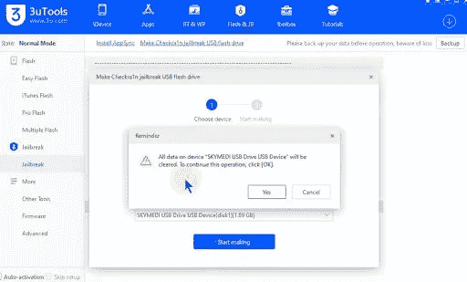
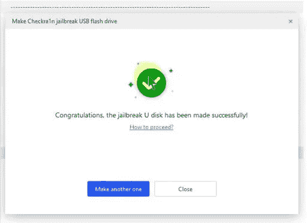

# 如何越狱 iOS 14.7.1

> 原文：<https://blog.devgenius.io/how-to-jailbreak-ios-14-7-1-3f5c9ee9228a?source=collection_archive---------1----------------------->

Checkra1n / Unc0ver 越狱工具可用安装 Cydia for iOS/iPadOS 14.7.1 版本

Zeon repo 提取器方法也适用于所有 iOS 14.7.1 设备

你可以从这个页面获得所有安装 Cydia 的 Checkra1n 越狱指南/ Unc0ver 越狱指南。

# 适用于 iOS 14.7.1 的 Unc0ver

Unc0ver 最新发布版本支持 iOS 14.7.1 越狱，自动安装 Cydia。但是 Unc0ver 最新版本只支持运行 A12 到 A13 设备的 iOS / iPadOS 14.7.1。

iOS 和 iPadOS 14.7.1 用户可以在线(无 PC)和离线(AltStore 方法)使用 Unc0ver 最新版本

点击以下链接安装 Unc0ver 最新版本。

[un cover 在线安装](https://silzee.com/unc0ver/)

[未覆盖替代商店安装](https://silzee.com/unc0ver/)

# iOS 14.7.1 版 Zeon 越狱

Zeon 是流行的越狱回购提取方法，用于安装 iOS 14.7.1 的调整/应用/定制应用和 lite Cydia。

对于以上 A11 设备，Zeon 是感受 iOS 14.7.1 特性的最好方法之一。

[安装 Zeon](https://zeon-app.com/install/affiliate/zeon/)

# Zeon 支持运行 iOS 14.7.1 的设备

iPhone 12 (Mini / 12 Pro / Pro Max)、iPhone 11(Pro Max/Pro)iPhone Xs/Xs Max、iPhone Xr、iPhone X、iPhone 8 / 8 Plus、iPhone 7 / 7 Plus

Zeon 专题回顾视频

# Checkra1n 支持 iOS 14.7.1 设备

iPhone 6s、6s Plus、SE、7 和 7 Plus ipad 5、6 和 7 代 Air 2iPad mini 4iPad Pro 1st 和 2 代 iPod touch 7 **A11 支持设备列表** iPhone 8 和 8 PlusiPhone X

如果您的设备没有在上面列出，您就不能使用 Checkra1n。

# checkra1n 不支持的设备

iPhone 11 Pro、iPhone 11、iPhone 11 Pro Max、iPhone XR、iPhone XS Max、iPhone XS、iPhone XS Max、iPhone 12/iPhone 12 Mini/iPhone 12 Pro/iPhone 12 Pro Max

# Checkra1n iOS 14.7.1 MacOS 指南

步骤 01。点击从[下载 Checkra1n 工具](https://silzee.com/Checkm8/)

步骤 02。现在，您应该将 Checkra1n 文件拖放到 MacOS 应用程序文件夹中

步骤 03。现在去 finder，打开 Checkra1n 应用

步骤 04。将您的设备连接到 Mac

步骤 05。点击开始按钮

步骤 06。进入选项>**允许不可信的 iOS/iPadOS/tvOS 版本**

请注意— **iPhone X、iPhone 8 和 8 Plus 用户应启用跳过 A11 BPR 检查**

步骤 07。转到 Checkra1n home 并点击下一步进入 DFU 模式(您可以按照屏幕上的说明操作)

步骤 08。等待重启>重启完成后>转到主屏幕并找到 Checkra1n 应用程序

步骤 09。打开 Checkra1n 应用程序，点击安装 Cydia 按钮

# Checkra1n 工具(Windows)指南

步骤 01。获取闪存驱动器(1GB 以上)

步骤 02。将您的 USB 驱动器插入 PC

步骤 03。下载最新的 3uTools 版本(转到 3uTools 网站并下载)

步骤 04。从 Windows 启动 3uTools >进入 Flash&JB-Jailbreak > Jailbreak

步骤 05。选择>“检查越狱 USB 闪存驱动器”

步骤 06。从菜单中选择您的 USB 驱动器

步骤 07。点击开始制作

步骤 08。等待 USB 驱动器越狱

步骤 09。是，用于弹出消息

第十步。等待该过程完成

第十一步。现在关闭 3uTools 并将你的 iPhone 连接到 PC

第十二步。重启你的电脑

第十三步。打开后>进入启动管理器

第十四步。选择 USB 驱动器>按回车键

第十五步。现在，您可以在电脑主屏幕上看到 Checkra1n 应用程序

第十六步。打开 Checkra1n 应用程序

进入选项>**允许不受信任的 iOS/iPadOS/tvOS 版本**

请注意— **iPhone X、iPhone 8 和 8 Plus 用户应启用跳过 A11 BPR 检查**

第十七步。转到 Checkra1n home 并点击下一步进入 DFU 模式(您可以按照屏幕上的说明操作)

第十八步。等待重启>重启完成后>转到主屏幕并找到 Checkra1n 应用程序

第十九步。打开 Checkra1n 应用程序，点击安装 Cydia 按钮