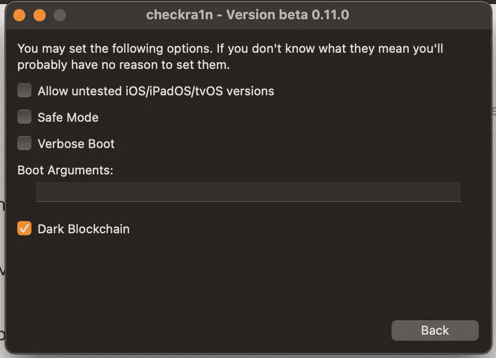
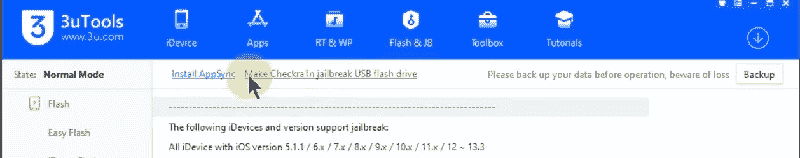
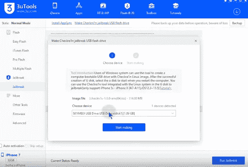
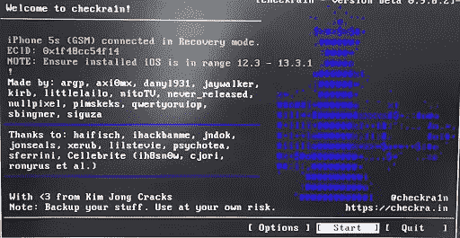

# 如何越狱 iOS 14.8

> 原文：<https://blog.devgenius.io/how-to-jailbreak-ios-14-8-8b2cb696dbc0?source=collection_archive---------0----------------------->

Checkra1n 越狱/ Unc0ver 越狱/ iBundles 服务，zeon repo 提取器支持 iOS 14.8 和 iPadOS 14.8 版本。

iBundles 和 zeon repo extractor 支持所有运行 iOS 14.8 版本的 iPhone 和 iPad 设备。

Checkra1n 越狱不支持最新的 14 / A13 / A12 / A12Z / A12X 和 M1 设备。

Unc0ver 仅支持运行 14.8 版本的 A12 至 A13 设备

# 适用于 iOS 14.8 的 Unc0ver

Unc0ver 最新版本支持为 iOS 14.8 版本安装 Cydia，但 Unc0ver 最新版本仅支持 14.8 运行 A12 至 A13 设备。

您可以通过在线和 AltStore PC 方法安装 Unc0ver 14.8 版本。

[在线安装 Unc0ver 14.8】](https://silzee.com/unc0ver/)

[安装 Unc0ver 14.8 — AltStore 方法](https://silzee.com/unc0ver/)

# iOS 14.8 版 Checkra1n 越狱工具

Checkra1n 是唯一支持 iOS 14.8 安装 Cydia 的越狱工具。目前，checkra1n 支持 Mac 和 Windows 操作系统。按照下面的 Checkra1n 越狱指南为你的 iOS 和 iPadOS 14.8 版本安装 Cydia。

# 检查 ra1n 越狱设备兼容性

a14—iPhone 12 mini/iPhone 12/iPhone 12 Pro/iPhone 12 Pro Max

a13—iPhone SE 2/iPhone 11/iPhone 11 Pro/iPhone 11 Pro Max

a12—iPhone XS/iPhone XS Max/iPhone XR

a11—iPhone X/iPhone 8/iPhone 8 Plus

A10X — iPad Pro 12.9 英寸(第二代)/ iPad Pro 10.5 英寸

A10——iPad(第七代)/ iPad(第六代)

A9X — iPad Pro 12.9 英寸(第一代)/ iPad Pro 9.7 英寸

A9 — iPad(第五代)

# Checkra1n 越狱 Mac 指南

步骤 01。从[这里](https://silzee.com/jailbreak/14.8/#Checkra1nJbtool)下载最新的 Checkra1n 版本

步骤 02。将 Checkra1n dmg 文件拖放到 Mac 应用程序文件夹中

步骤 03。前往 finder，找到 Checkra1n 应用程序，然后轻按以启动它

步骤 04。现在轻按“选项”>“启用”>“允许不受信任的 iOS/iPadOS 以及 iPhone X / iPhone 8/ 8 Plus 用户应该启用”>“跳过 A11 BPR 检查”

步骤 05。现在将您的设备连接到 Mac

步骤 06。一旦您的设备被工具识别，点击开始按钮

步骤 07。设备将进入 DFU 模式。您可以按照屏幕上的说明进行操作。

步骤 08。一旦设备重新启动>进入主屏幕并找到 Checkra1n 应用程序

步骤 09。打开 Checkra1n 应用程序并点击 Cydia 进行安装

# Checkra1n 越狱 Mac 指南

步骤 01。获取至少 1GB 容量的 USB 闪存驱动器

步骤 02。将您的设备连接到 Windows 机器

步骤 03。下载 3uTools 的最新版本— [从此处下载](http://url.3u.com/zmAJjyaa)

步骤 04。现在打开 3uTools >进入 Flash & JB-越狱选项>越狱

步骤 05。现在选择“检查越狱 u 盘”选择权

步骤 06。转到 3uTools 下拉菜单，选择您的闪存驱动器

步骤 07。等待完成闪存驱动器越狱

步骤 08。现在点击是弹出窗口，等待出现祝贺信息

步骤 09。完成后>关闭 3u 工具

第十步。将你的 iPhone 或 iPad 接入电脑

第十一步。立即重新启动你的电脑

第十二步。重启完成后>启动管理器

第十三步。选择 USB 驱动器>点击输入按钮

第十四步。现在，您可以在主屏幕上看到 Checkra1n 应用程序

第十五步。现在轻按“选项”>“启用”>“允许不受信任的 iOS/iPadOS 以及 iPhone X / iPhone 8/ 8 Plus 用户应该启用”>“跳过 A11 BPR 检查”

第十六步。一旦您的设备被工具识别，点击开始按钮

第十七步。设备将进入 DFU 模式。您可以按照屏幕上的说明进行操作。

第十八步。一旦设备重新启动>进入主屏幕并找到 Checkra1n 应用程序

第十九步。打开 Checkra1n 应用程序并点击 Cydia 进行安装

# zeon Repo extractor for iOS/IP ados 14.8

Zeon 是获得 iOS 和 iPad 设备越狱功能的著名方法。现在 Zeon 已经完全兼容 iOS 14.8 版本。

Zeon 是一种为 iPhone 和 iPad 设备安装优秀越狱功能的回购提取方法。

[**安装 Zeon**](https://zeon-app.com/install/affiliate/zeon/)

# Zeon 完整回顾视频

# Zeon iOS 14.8 的最佳特性

Zeon 越狱回购提取器可以通过提取回购安装越狱功能

zeon Tweaks——通过 Siri 快捷方式安装越狱补丁的可用方法

Cydia—Zeon 可用的 cy dia 精简版

越狱应用——可以安装很棒的越狱应用

越狱应用商店—列出了所有流行的第三方应用商店

定制应用——可以安装非越狱支持主题

# 适用于 iOS 14.8 / iPadOS 14.8 的 iBundles

iBundles 是一项包含 18 项服务的服务。此时，iBundles 是 Checkra1n 不兼容设备获得 [iOS 14.8 越狱](https://silzee.com/jailbreak/14.8/)体验的最佳途径。

还有，iBundles 支持所有最新的 iPhone 12 系列。

# iBundles 全功能视频

[**获取 iBundles for iOS 14.8**](https://ibundles.org/af1025)