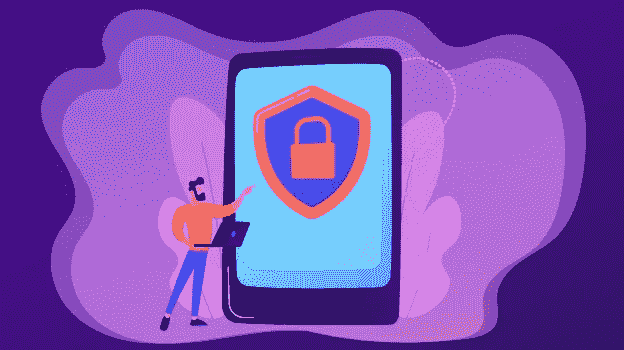

# 如何保证手机安全？安全三元组

> 原文：<https://blog.devgenius.io/how-to-keep-mobile-phones-secure-secure-triad-4ef4d0e2bc77?source=collection_archive---------8----------------------->

# 如何保证手机安全？

智能手机是我们生活中不可分割的一部分。如果我们的手机被拿走一天，对我们大多数人来说，就像被剥夺了基本需求。我们在手机中存储各种数据——联系人、照片、视频、个人数据、文档；我们使用大量的应用程序让我们的生活变得简单——银行、保险、网上购物、股票、房地产；

我们依靠手机进行交流和社交——聊天和视频通话、社交媒体、电子邮件、专业团体；手机的用途不胜枚举。不用说，如果一个人的手机丢失或被盗，所有的数据和信息都处于危险之中。如果手机上没有屏幕锁定，拥有或发现手机的人可以严重破坏手机。例如:

*   访问照片和视频，并不道德地使用它们。
*   访问手机中的联系人，并通过骚扰电话、发送不道德或威胁性信息或更糟的方式来骚扰他们。
*   我们登录应用程序，从不注销。在一些应用程序上，如网上购物或食品配送，我们会保存我们的卡详细信息。这个人可以用它来为自己订购东西，费用由我们承担。
*   在最糟糕的情况下，手机可能被用于灾难性和可怕的公共场合，这可能会使人陷入严重的法律纠纷。

# 黑客和手机

今天，使用我们的手机也有可能造成这种损害，甚至更多的损害，而不需要一个恶棍亲自拥有它。这些是黑客、网络朋克、网络恐怖分子，他们为了勒索金钱、控制生命或损害他人名誉而实施犯罪行为。

如果他们能够侵入我们的手机，他们就可以做到这一点，而且他们会不断搜索和利用易受攻击的手机。移动数据、WiFi、网站和移动应用——我们绝对需要的东西——使得黑客试图访问我们的手机变得可能和容易。

以下是黑客入侵手机的一些方法:

## 网络钓鱼

黑客发送包含链接或图像的电子邮件或文本消息，要求您点击它以获得某些东西或执行某项操作。他们冒充一家公司，通常是一个人可能与之有业务关系的公司，并且电子邮件或文本消息与该公司真正发送的任何电子邮件或消息相似。然而，他们发送的内容带有病毒或恶意软件，如果被点击，将获得您手机上的所有信息或远程控制您的手机。

## 罐头猪肉

这种攻击类似于网络钓鱼，但是，通过垃圾邮件，您可能会在短时间内收到多封电子邮件或消息。发送者不是自然人，而是软件或“机器人”,其唯一目的是一次生成数千条消息，并以多个电话号码为目标。在垃圾邮件攻击中，黑客希望人们至少可以错误地点击打开电子邮件或消息以及其中的内容，然后将病毒或黑客软件下载到手机上。

黑客使用诱人的信息，比如你赢得了一大笔钱，或者一份免费赠品，或者被列入度假候选名单，等等。以吸引他们的目标对这种电子邮件和消息采取行动。

## SIM 卡交换

黑客打电话给你的网络提供商，假装是你，编造一个电话丢失的故事，并要求更换 SIM 卡。如果他们成功地说服提供商他们是你，他们会得到替换的 SIM 卡，而你原来的 SIM 卡会被停用。因此，现在黑客可以有效地访问你的电子邮件、联系人、信息、硬盘内容等。

## 蓝牙黑客或 WiFi 黑客

如果黑客在你手机的范围内，并且你手机上的蓝牙被激活，黑客就可以连接到你的手机并访问其中的所有数据。黑客通常会在人群密集的区域尝试这种攻击。对连接到免费公共 WiFi 的手机的黑客攻击也是如此。

# 智能手机安全和保护

那么，每个人应该做些什么来保护他们的智能手机或其他移动设备的安全呢？移动电话用户应该采取哪些常见而有效的预防措施来保护他们的电话以及他们自己的安全呢？我们都知道以下预防措施，这些都是常识，而且大多数人都遵循这些措施。

1.  用密码保护手机。使用数字或模式密钥，或者更高级的指纹或面部识别。
2.  启用自动锁定。如果没有启用自动锁定，您的手机会有很大的风险，尤其是当您在其他人面前无人看管时。
3.  从谷歌 Play 商店或苹果应用商店等真实来源下载应用。不要通过发送给您的任何链接或从第三方应用商店下载。在下载应用程序之前，阅读应用程序的评论，检查是否有多个关于安全性的投诉。[统计显示，应用是黑客将恶意软件插入](https://dataprot.net/statistics/hacking-statistics/)的热点。
4.  警惕陌生人打来电话询问你的个人信息，如出生日期、电子邮件地址、住址、护照号码等。询问打电话的人他们是谁，他们从哪里打电话，以及他们为什么需要这些信息。
5.  如上所述，不要点击通过电子邮件或短信发送的链接，它们可能是网络钓鱼或垃圾邮件。即使信息来自你认识的人——家庭成员或朋友——也不要这样做，因为他们可能在不知情的情况下转发了信息，或者他们的电话可能被黑客攻击。
6.  浏览真实安全的网站。
7.  不要使用免费的公共 WiFi，或在公共场所激活蓝牙，因为上面提到的原因，你的手机可能会有黑客连接的风险。

> 引用一个亲身经历…不久前我丢失了我的银行借记卡/自动提款卡。我一发现就立马屏蔽了。那天晚些时候，我接到了一个未知座机号码的电话，打电话的人说他们来自我的银行，想核实我的详细信息——出生日期和地址。在透露任何事情之前，我问他们为什么需要这些数据，他们说这与当天早上向当地警察局报失的一张银行卡有关。又问了几个问题，我终于承认打电话的人是可信的，然后才继续提供我的详细资料。我真的很幸运能拿回我的卡！]

还要考虑其他一些非常重要的保护措施，但是我们并不真正了解它们或者没有采用它们。

## 定期更新你的手机操作系统

安装您的智能手机公司和/或操作系统提供商发布的更新。它们通常包含为抵御新威胁而发布的最新安全补丁。不要仅仅因为更新占用内存和需要时间来安装就一直推迟更新。

## 在你的手机上安装杀毒软件

我们都为了个人/专业需求和娱乐下载了无数的应用程序，但我们有多少人有意识地安装了一个杀毒软件？您的手机应该得到与笔记本电脑或电脑类似的保护。

## 克制越狱(iPhone)和 root(Android 手机)

试图绕过手机的标准配置，会导致手机内置的大部分安全设置丢失。这些活动将您的手机置于不适当的风险中，尤其是来自某些专门试图获得 root 访问权限的恶意软件。越狱/生根还会进一步阻止你的手机获得提供商推出的常规操作系统更新。

## 设置远程擦除

如果手机被盗或丢失，此功能允许您擦除手机中的所有数据。

## 立即向您的网络提供商报告丢失/被盗的手机，以便他们可以阻止该手机并阻止任何人使用它。

取回你手机的 IMEI 号码，并向当地警察局报案。这两个步骤对保护你自己非常重要，因为，首先，你不需要继续为服务付费(电话、信息等)。)你没在用的；其次，如果你的手机被盗后被用于有害和恶意的活动，你没有责任。

# 结论

智能手机包含大量的数据和信息。如果它落入坏人之手，或者黑客成功入侵，他们所能造成的损失是无限的。我们不能再随意使用智能手机了；我们需要时刻注意我们的手机在哪里，尤其是在户外的时候。关键是要改变我们对智能手机安全性的看法，并采取尽可能多的预防措施来保护我们自己。

为确保您的移动应用具备必要的安全功能，请通过 **Secure Triad** 联系我们，了解更多关于[移动应用渗透测试](https://securetriad.io/mobile-application-penetration-testing/)的信息。

*原载于 2021 年 1 月 11 日*[*https://securetriad . io*](https://securetriad.io/how-to-keep-mobile-phones-secure/)*。*