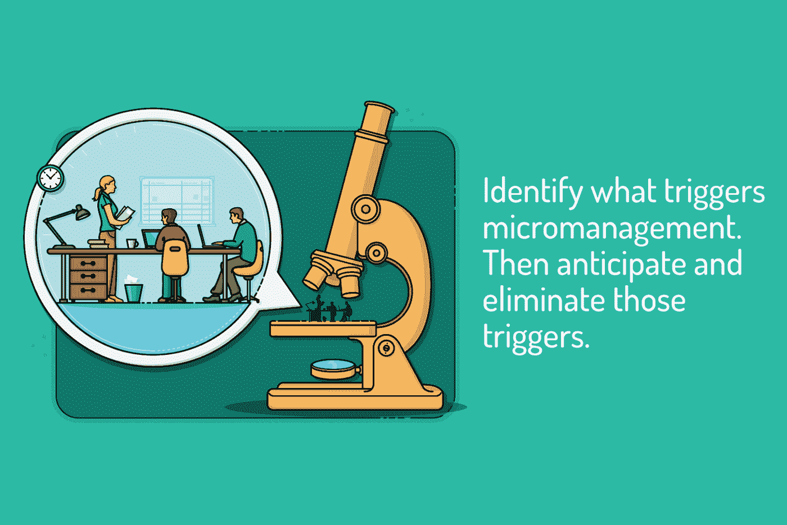

# 如何让你在家工作的团队保持积极性

> 原文：<https://blog.devgenius.io/how-to-keep-your-work-from-home-team-motivated-bde9652ff803?source=collection_archive---------21----------------------->

疫情冠状病毒毫无预警地袭击了我们。一个晴朗的日子，在漫长的一天后，我们在办公室工作，打出租车回家，就在下一刻，我们的世界在我们眼前暴跌。

为了我们自己的安全，大多数人都被关在自己的家里，想着等待传染病的到来，但很明显，这一次不会很快改变，人们别无选择，只能重新开始工作。

现在，在这种情况下，你如何激励你新加入远程操作世界的团队？

在我们开始做什么事情来保持远程工作团队的积极性之前，我们必须理解每种业务都有自己的一套要求。相同的标准不会适用于所有情况，因此，您所采用的技术必须准确适用于您自己的业务。所以，让我们放纵一下:

# 概述明确的期望

大多数企业家面临的最大挑战是确保他们的团队在家工作时交付高质量的产品。现在，当有人在离你很近的地方工作或在你身边时，你可以很容易地走到他们面前，告诉他们需要做什么。

同样频繁地给某人打电话既不实际也不方便。这就是为什么，如果您希望确保您的远程团队有足够的动力来完成给定的任务，您必须根据他们和您心目中的时间表创建一个您的期望大纲。

确保在任务交付方面给他们一定的灵活性，这样他们就可以轻松地管理工作，而不会成为一种痛苦和拖延。

为了确保人们遵守时间表，你可以创建谷歌表单让他们登记。有许多[项目管理工具，你可以使用](https://www.thirdrocktechkno.com/blog/top-8-best-task-management-software-to-use-in-2020/)来为你的远程团队组织事情。

如果没有，你可以简单地选择邮件系统，每个人都可以在一天结束时与你联系，让你了解他们工作的最新情况。无论你是在办公室还是在家工作，这种每日更新都是必要的。如果你的团队觉得他们每天不对任何人负责，你可以预期他们会有严重的拖延。

# 制定一个时间表，并坚持下去

时间表很重要。至少可以说，在家工作很容易让人分心。在一个人的个人环境中有如此多的事情发生，以至于他或她有时很难将一切都置之不理，专注于手头的工作。

当你创建一个时间表时，它有助于整个团队保持一致。一个旨在让团队中的一个成员与其他成员保持同步的时间表是确保所有协作性工作能够无缝管理的关键。

我们做了一点调查，发现这是最有效的方法；但是，您可以根据自己的需求对此进行修改。

> 周一:讨论一周日程的团队会议。
> 
> 每个人都可以讨论他们从上周溢出的东西，然后根据他们这一周的时间分配新的工作。
> 
> **周二:讨论所有问题的个人会议。**
> 
> 一个好的团队成员是一个心态平和的人。如果你的团队成员有什么烦心事，你应该能说出来。与你的员工或团队单独交谈将有助于你更好地与他们沟通，并激励他们尽最大努力完成手头的任务。
> 
> **星期三:随他们去吧。**
> 
> 除非你赶不上最后期限，否则在一周中间不要管你的团队。毫无疑问，与一周的其他时间相比，工作会相对缓慢，但你要提高动力，而不是让他们喘不过气来。
> 
> 周四:轻轻推他们一下。
> 
> 鉴于本周即将结束，小小的推动似乎是合适的。提醒您的团队，他们一周只剩下两天时间，只要他们在明天结束前准备好报告，就可以慢慢完成工作。记住你不想听起来太严厉。在即将到来的周末，你想让自己听起来真诚而愉快。
> 
> **周五:报到时间。**
> 
> 对每个员工来说，对他们一周的工作负责是非常重要的。这就是为什么你必须坚持让他们提交一份工作报告。这可能看起来是最初的一小步，然而，当一个人能够看到他们实际上完成了什么，这激励他们在下周做得更好。你肯定会经历每周的增量增长。

# 放弃微观管理

当他们的团队就在他们面前时，习惯于微观管理的人会发现当他们不在时，很难不这样做。如果不能密切关注每一秒钟发生的事情，他们会发疯的。一句忠告:不要成为那样的人。

你看，在你职业生涯的某个时刻，你超越了你的团队是否“喜欢”你，所以这与此无关。这是为了确保一个已经被干扰得千疮百孔的远程工作团队不会再有借口停止为你工作。这不符合贵公司的最佳利益。

史蒂夫·乔布斯说得好:“雇佣聪明人，然后告诉他们该做什么是没有意义的。”相信他们，给他们一些余地，他们会以高质量的产出作为回报。

# **保持增长**

除了为你的员工设定每周或每月的职业目标，你还必须鼓励你的团队设定个人目标。

有没有一个在线课程可以帮助你的员工表现得更好，同时为他或她自己的简历增光添彩？如果是，鼓励他们服用。

我们已经谈过周二要举行的个人会议。向你的团队敞开你的耳朵和心扉，倾听他们的心声。

如果他们渴望有所成就，不管是在组织内部还是在个人层面，试着为他们提供。当然，要做到这一点，必须有某种基于绩效的奖励制度。例如，如果你的内部网页设计师想在涂鸦方面做一个快速速成班，那么你可以给他一个短期目标，并根据其成就，奖励他课程选项。

这是一个巨大的动力。在很大程度上，员工认为企业家是唯一从他们的辛勤工作中获利的人，他们辛苦工作是为了固定的报酬。如果你能以某种方式向他们展示，除了职业发展之外，他们的工作还带来了个人成长，那么你肯定会看到他们工作效率的转变。

# 花些时间放松一下

你知道他们怎么说杰克是个无趣的男孩，因为他只工作不玩耍。仅仅因为你的团队远程工作并不意味着他们不需要办公室人力资源部门开展的任何活动来建立团队精神和动力。

远程工作的最大缺点是无法与同事进行个人交流。

在一个共享的物理空间，人们被迫彼此在场。因此，他们试图让它变得礼貌和快乐。人们分享午餐，谈论他们如何想念《权力的游戏》，计划晚餐，闲逛，放松。

这是培养友好工作文化的重要一步。通过剥夺共享的物理空间，远程操作常常迫使人们变成隐士。这对他们的整体心理健康来说是很糟糕的，这会直接导致生产力下降。

呆在室内，限制各种各样的互动对我们每个人都有负面影响。对一些人来说，这还不算太糟，而另一些人则觉得很难应付。随意地与你的团队互动可以大大减轻他们的情绪，帮助他们更有效地工作。

制作完全与工作无关的休闲频道，鼓励你的员工找点乐子。请他们分享他们怪异的隔离故事，看着对话变成一个戏剧性的线索，比值得狂欢的网飞秀更有趣。

# 包扎

激励远程工作人员可能比最初看起来更具挑战性。然而，如果你能利用技术，并专注于提高整体生产力，而不仅仅是团队内部的活动，你应该会取得成功。你试过其他方法来激励你的团队吗？有用吗？请在下面分享。