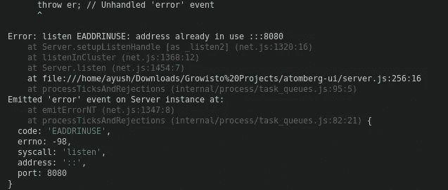

# 如何在 Linux/mac 中杀死运行在 localhost 特定端口上的进程？

> 原文：<https://blog.devgenius.io/how-to-kill-a-process-running-on-a-particular-port-on-localhost-in-linux-mac-81e946eeffef?source=collection_archive---------2----------------------->

> 在 Mac/Linux 上，如何从终端关闭一个打开的端口？


停止/终止正在运行的端口

在构建 web 应用程序时，我在 Linux 中多次遇到的一个问题是，一个端口已经在使用中。

是的，当然，我们可以通过更改配置文件中的端口号在不同的端口上启动服务器，或者我们可以关闭终端或重新启动我们正在使用的代码编辑器，或者最糟糕的是，我们可以重新启动我们的计算机来解决这个问题。但是这不是一个理想的解决方案，因为它也很耗时。

下面是一个错误的截图，我得到端口 8080 已经在使用中。



端口已被使用

你会发现很多文章或不同的解决方案来杀死一个端口，通过找到 PID(进程标识号)，然后另一个命令停止该端口。但是我会和你分享一个**单行命令**，它遵循上面的过程，只有一个命令。

因此，下面是我用来终止在端口 8080 上运行的进程的方法，这样我们就可以再次运行我们的应用程序。

## 方法 1:如果您的系统上安装了 npx

如果您的系统安装了 npx(节点包 execute，它带有 npm，当您安装的 npm 高于 5 时，npx 将自动安装),您可以运行以下命令来终止正在运行的端口。

```
npx kill-port 8080
```

这将停止/终止在特定端口上运行的进程，用您的端口号替换 8080。然后呼呼！！！

## 方法 2:一行程序只监听特定的端口:

你现在可以很容易地杀死你的 PID。一个命令是终止特定端口上的进程。
我会解释这个命令的意思，只是用您的端口号替换 8080。

```
sudo kill -9 $(lsof -t -i:8080 -sTCP:LISTEN)
```

这里，

*   **须藤** -管理员权限
*   **杀死** -命令杀死进程
*   **-9** -用力
*   **lsof** -文件列表(也用于列出相关流程)
*   **-t** -仅显示进程 ID
*   **-i** -仅显示互联网连接相关过程
*   **:8080** -仅显示该端口号中的进程

## **就这样**

通过以上两种方法，你可以很容易地停止/终止一个端口号上正在运行的进程。
*注:如果你对我的写作有任何疑问或任何改进或任何错误，请给我评论和建议。永远热烈欢迎你。*

除此之外，如果你在 Linux/Mac 中找到任何其他方法来终止在本地主机的特定端口上运行的进程，请在评论部分告诉我，我会添加这些方法，如果你在上述方法中发现任何差异，请在评论部分分享你的问题。

> 请在评论区分享你的观点，欢迎反馈。
> 希望你会喜欢并分享这篇文章，以便更好地到达
> 查看我的其他文章——[***https://medium.com/@aayushtibra1997***](https://medium.com/@aayushtibra1997) ***感谢阅读:)***