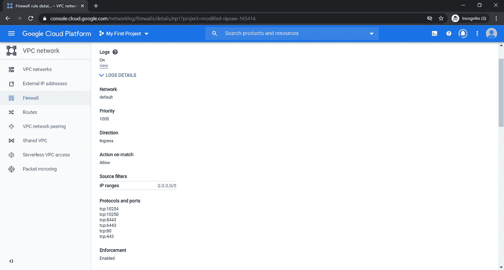
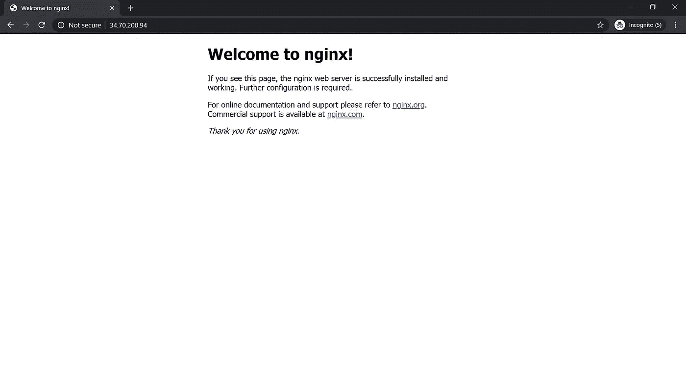
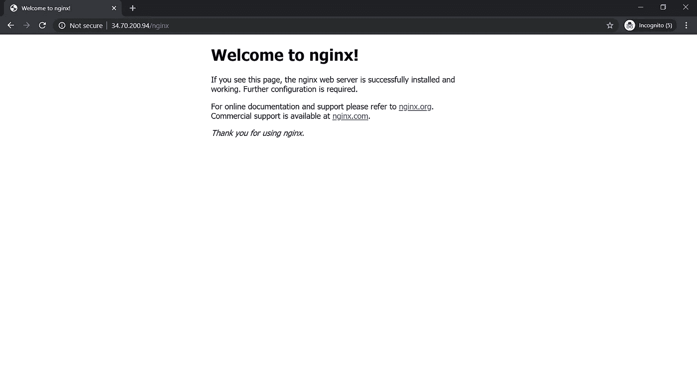

# 如何为 GCP 集群配置负载平衡器和 Nginx 入口控制器

> 原文：<https://blog.devgenius.io/how-to-kubectl-loadbalancer-and-configure-nginx-ingress-controller-for-a-gcp-cluster-bc2f2599f8f1?source=collection_archive---------10----------------------->


你有没有想过你可以为 K8s 编写自己的负载平衡器，而不是浏览所有的文档，那么就不要再看了！我将带您完成在 Kubernetes GCP 集群上启动 Nginx 入口控制器和第 4 层负载平衡器的设置。

Kubernetes 将特定于云的控制回路从 kube-controller 中分离出来。因此，如果您需要特定云平台上的负载平衡器、节点控制，那么您必须单独安装云控制器管理器。这仍然不支持这些节点上的存储，其中一个节点的存储仍然由 kube 控制器处理。对特定云上的有状态集合的修改可以在这里找到[。](https://medium.com/@rangapv/dynamic-provisioning-of-storage-on-a-gcp-kubernetes-cluster-using-helm-charts-795f576e0cab)

现在让我们看看如何安装和配置云控制器管理器。

先决条件:在所有节点上运行的所有 kubelets 都应该启用“cloud-provider=external”标志。此外,“cloud-config”标志应该指向一个文件，该文件应该具有以下格式。所有节点上的“节点标签”必须相同。密钥是从 GCP 即时消息凭证选项卡访问 GCP 云 API 的 API 密钥。

```
**[Global]
project-id = rosy-cache-200605
node-tags = kubernetes**
**key = AIza**************MVZhpLp62GkA**
```

kube-api-server 和 kube-controller **不应该**有“云提供商”标志。如果你有它，那么就把它注释掉或者从配置文件中删除它。

1.  如下图所示设置主节点:这一步在[这篇文章](https://medium.com/@rangapv/kubernetes-install-101-with-kubeadm-149b70626a9f)中已经介绍过了，需要在设置所需的标志时进行调整。作为一个总结，如果你要重新开始，那么就做这些步骤……

```
**From your home directory : Installing or Upgrading python** $ mkdir pyup;cd pyup;git init;git pull [https://github.com/rangapv/pyUpgrade.git;./py.sh](https://github.com/rangapv/pyUpgrade.git;./py.sh)**Again from your home directory : Installing docker**$ mkdir doker;cd doker;git init;git pull [https://github.com/rangapv/doker.git;./dock.sh](https://github.com/rangapv/doker.git;./dock.sh)**Again from your home directory : pulling all the required k8s YAML definitions from the github** $ mkdir adm;cd adm;git init;git pull [https://github.com/rangapv/k8s.git](https://github.com/rangapv/k8s.git)$ ls **ccm  kube_adm  kube_dash  kube_flannel  kube_node  pods Readme**
```

现在让我们为主节点安装不同的 k8s 组件:

```
$ cd kube_adm$ ls **adm_install.sh** $./adm_install.sh
```

并且**不要**执行 kubeadm init 命令，该命令是从上面命令的屏幕输出中得到的，这是针对 kubeadm 安装的，无需修改——普通的设置。相反，我们将创建一个配置文件，并在下面的步骤 3 中使用标志执行 kubeadm init。

2.将 gce.conf 复制到/etc/kubernetes 文件夹；这个文件应该有你的 GCP 帐户的项目标识，也有你的 IAM 帐户的 API 密匙，可以从 GCP 控制台得到

```
$ sudo vi /etc/kubernetes/gce.conf **[Global]
project-id = rosy-cache-200605
node-tags = kubernetes
key = AIzaSy*****************************p62GkA**
```

3.使用 kubeadm init 安装主节点集群，并在下面列出的“adm-conf”文件中更改配置

```
$ sudo kubeadm init --config=./adm-conf.yaml**This will give a "kube adm join ..." output as shown below** **mkdir -p $HOME/.kube
  sudo cp -i /etc/kubernetes/admin.conf $HOME/.kube/config
  sudo chown $(id -u):$(id -g) $HOME/.kube/config.
.
.
kubeadm join 10.128.0.52:6443 --token bw1oyz.h5mfl6tdicnhmtf1 \
    --discovery-token-ca-cert-hash sha256:c121****************27245d5b4d455f1c03f87eaf7ce4b7f30098107b**
```

将 kubeadm join 命令复制到 notepad++中，稍后工作节点将使用该命令加入集群。将主配置文件复制到您的$HOME/。kube/配置

4.安装网络绒布:从上面步骤 1 的“git pull”开始；adm 目录下有一个“kube _ 法兰绒”子文件夹，里面有法兰绒 YAML，应用吧。

```
$ kubectl apply -f ./kube-flannel.yml **
podsecuritypolicy.policy/psp.flannel.unprivileged created
clusterrole.rbac.authorization.k8s.io/flannel created
clusterrolebinding.rbac.authorization.k8s.io/flannel created
serviceaccount/flannel created
configmap/kube-flannel-cfg created
daemonset.apps/kube-flannel-ds-amd64 created
daemonset.apps/kube-flannel-ds-arm64 created
daemonset.apps/kube-flannel-ds-arm created
daemonset.apps/kube-flannel-ds-ppc64le created
daemonset.apps/kube-flannel-ds-s390x created**
```

5.部署仪表板(可选) :从上面第 1 步的“git pull”中，adm 目录有一个“kube_dash”子文件夹，建议 rbac YAML 应用它。

```
$ kubectl apply -f ./recommended.yaml **
namespace/kubernetes-dashboard created
serviceaccount/kubernetes-dashboard created
service/kubernetes-dashboard created
secret/kubernetes-dashboard-certs created
secret/kubernetes-dashboard-csrf created
secret/kubernetes-dashboard-key-holder created
configmap/kubernetes-dashboard-settings created
role.rbac.authorization.k8s.io/kubernetes-dashboard created
clusterrole.rbac.authorization.k8s.io/kubernetes-dashboard created
rolebinding.rbac.authorization.k8s.io/kubernetes-dashboard created
clusterrolebinding.rbac.authorization.k8s.io/kubernetes-dashboard created
deployment.apps/kubernetes-dashboard created
service/dashboard-metrics-scraper created
deployment.apps/dashboard-metrics-scraper created**$ kubectl apply -f ./dashboard-adminuser.yaml **
serviceaccount/admin-user created
clusterrolebinding.rbac.authorization.k8s.io/admin-user created**
```

6.为云控制器管理器容器生成 kubernetes 秘密:云控制器管理器的容器需要 Kubernetes 特定的配置(比如 API 密钥)。这只是模板；在创建秘密和更新下面的“ccm.yaml”时，使用您的特定文件输入。

```
$ kubectl create secret generic gce-secret --from-file=gce.conf=/etc/kubernetes/gce.conf --from-file=config=$HOME/.kube/config -n kube-system**secret/gce-secret created**
```

*此时，主节点准备就绪，您可以从下面设置工作节点，然后返回来执行云控制器管理器的下一个步骤-7！*

7.安装云控制器管理器 yaml:在我们这样做之前，让我们检查 pod 状态

```
without the cloud controller manager some of the pods are in pending state as shown below... rightfully so because of Node taints... **$ kubectl get po --all-namespaces
NAMESPACE     NAME                                READY   STATUS    RESTARTS   AGE
kube-system   coredns-66bff467f8-l7s4r            0/1     Pending   0          2m30s
kube-system   coredns-66bff467f8-t2jdh            0/1     Pending   0          2m30s
kube-system   etcd-kubeadm24                      1/1     Running   0          2m45s
kube-system   kube-apiserver-kubeadm24            1/1     Running   0          2m45s
kube-system   kube-controller-manager-kubeadm24   1/1     Running   0          2m45s
kube-system   kube-flannel-ds-amd64-vb87b         1/1     Running   0          24s
kube-system   kube-proxy-85fwk                    1/1     Running   0          2m30s
kube-system   kube-scheduler-kubeadm24            1/1     Running   0          2m45s**
```

**云控制器管理器(CCM)安装:**这包括两个部分，CCM 部署和 RBAC 定义。服务账户/RBAC·YAML 如下所示

让我们做一个库应用程序…

```
$ cd ~/adm/ccm/
$ kubectl apply -f ./ccm-rbac.yaml **
serviceaccount/cloud-controller-manager created
clusterrole.rbac.authorization.k8s.io/system:cloud-controller-manager created
clusterrolebinding.rbac.authorization.k8s.io/system:cloud-controller-manager created**
```

云控制器管理器的定义如下所示

> 注意:在上面的定义中，我使用 HostPath 将“/etc/ssl”从本地主机上传到“ccm”容器映像。因为 CCM 容器没有安装“openssl ”,在这种情况下，任何对外部 API 的请求，负载平衡器的 GCP 云 API 都会导致 X509 错误。(他们说容器是独立的，它可以在任何地方工作！)也试试登录“ccm”容器，安装“apt-get”或者“openssl”，运气会用完的…

现在让我们安装带有 kubectl apply 的云控制管理器

```
$ kubectl apply -f ./ccm.yaml **deployment.apps/cloud-controller-manager created**
```

再次检查窗格，查看它们是否已从挂起状态恢复。它显示了容器的创建，几分钟后，容器终于启动并运行了

```
$ kubectl get po --all-namespaces **NAMESPACE              NAME                                         READY   STATUS    RESTARTS   AGE
kube-system            cloud-controller-manager-6b58648559-4npts    1/1     Running   0          8m1s
kube-system            coredns-66bff467f8-l7s4r                     1/1     Running   0          11m
kube-system            coredns-66bff467f8-t2jdh                     1/1     Running   0          11m
kube-system            etcd-kubeadm24                               1/1     Running   0          11m
kube-system            kube-apiserver-kubeadm24                     1/1     Running   0          11m
kube-system            kube-controller-manager-kubeadm24            1/1     Running   0          11m
kube-system            kube-flannel-ds-amd64-vb87b                  1/1     Running   0          8m55s
kube-system            kube-proxy-85fwk                             1/1     Running   0          11m
kube-system            kube-scheduler-kubeadm24                     1/1     Running   0          11m
kubernetes-dashboard   dashboard-metrics-scraper-779f5454cb-vjjvn   1/1     Running   0          19s
kubernetes-dashboard   kubernetes-dashboard-64686c4bf9-5qmpp        1/1     Running   0          20s**
```

现在我们有了主节点，让我们也创建一个工作节点…

1.  如下所示设置工作节点

```
**From your home directory : Installing or Upgrading python** $ mkdir pyup;cd pyup;git init;git pull [https://github.com/rangapv/pyUpgrade.git;./py.sh](https://github.com/rangapv/pyUpgrade.git;./py.sh)**Again from your home directory : Installing docker**$ mkdir doker;cd doker;git init;git pull [https://github.com/rangapv/doker.git;./dock.sh](https://github.com/rangapv/doker.git;./dock.sh)**Again from your home directory : pulling all the required k8s YAML definitions from the github** $ mkdir adm;cd adm;git init;git pull [https://github.com/rangapv/k8s.git](https://github.com/rangapv/k8s.git)$ ls **ccm  kube_adm  kube_dash  kube_flannel  kube_node  pods Readme****Here we are concerned with only the kube_node and Pods sub directory since this is the worker node.**
```

现在让我们安装不同的 k8s 组件

```
$ cd kube_node
$ ls **node_install.sh
$ ./node_install.sh**
```

从上面脚本安装的屏幕输出来看，还不要执行“kube join ”,这是一个没有云控制器管理器的普通设置。相反，请遵循下一步

2.我们需要如下准备工作节点

*   将配置文件从 master 复制到$HOME/。工作节点上的 kube
*   创建一个/etc/kubernetes/gce.conf 文件，如下所示

```
$ sudo vi /etc/kubernetes/gce.conf **[Global]
project-id = rosy-cache-200605
node-tags = kubernetes
key = AIzaSy***************************Lp62GkA**
```

*   修改 kubelet 以包含 10-kubeadm.conf 文件中的标志，如下所示

```
$ sudo vi /etc/systemd/system/kubelet.service.d/10-kubeadm.conf **Add these flags to the Environment variable "--cloud-provider=external --cloud-config=/etc/kubernetes/gce.conf"**The file after modification will look similar below**# Note: This dropin only works with kubeadm and kubelet v1.11+
[Service]
Environment="KUBELET_KUBECONFIG_ARGS=--bootstrap-kubeconfig=/etc/kubernetes/bootstrap-kubelet.conf --cloud-provider=external --cloud-config=/etc/kubernetes/gce.conf --kubeconfig=/etc/kubernetes/kubelet.conf"**
```

*   让我们执行从主节点获得的 kubectl join 命令

```
$ sudo kubeadm join 10.128.0.52:6443 --token bw1oyz.h5mfl6tdicnhmtf1 --discovery-token-ca-cert-hash sha256:c121df3a32a87f6f97643fc727245d5b4d455f1c03f87eaf7ce4b7f30098107b &**....
kubelet-start] Waiting for the kubelet to perform the TLS Bootstrap...****This node has joined the cluster:
* Certificate signing request was sent to apiserver and a response was received.
* The Kubelet was informed of the new secure connection details.****Run 'kubectl get nodes' on the control-plane to see this node join the cluster.**$ kubectl get nodes **NAME         STATUS   ROLES    AGE     VERSION
kubeadm      Ready    master   6h22m   v1.18.3
kubenode     Ready    <none>   67s     v1.18.3**
```

**我们已经通过云控制器管理器成功地建立了一个 2 节点集群。**

让我们部署一个带有 type = LoadBalancer 的 nginx 服务，看看 GCP 是否创建了一个带有外部 IP 的负载平衡器

在上面的“git pull”步骤 1 中，adm 目录有一个包含应用程序资源的“pods”子文件夹

让我们应用部署和服务

```
$ cd pods **$ kubectl apply -f web1-pod.yaml
$ kubectl apply -f web2-pod.yaml
$ kubectl apply -f web1-service.yaml
$ kubectl apply -f web2-service.yaml**
```

让我们检查服务是否启动并运行

```
$ kubectl get po **NAME                                   READY   STATUS    RESTARTS   AGE
web1-pod-deployment-d97d4bb54-2fb2m    1/1     Running   2          20h
web2-pod-deployment-69f9bb5cb4-7kqtm   1/1     Running   0          29s**$ kubectl get svc **NAME           TYPE           CLUSTER-IP       EXTERNAL-IP     PORT(S)          AGE
kubernetes     ClusterIP      10.96.0.1        <none>          443/TCP          22h
web1-service   LoadBalancer   10.96.0.3        <pending> 80:30258/TCP   20h
web2-service   LoadBalancer   10.107.125.219   <pending>       80:31300/TCP     15s**Notice the External ip is still pending , the ccm is creating the LoadBalancer on GCP**After few seconds we now have an external IP for the services...**$ kubectl get svc **NAME           TYPE           CLUSTER-IP       EXTERNAL-IP     PORT(S)          AGE
kubernetes     ClusterIP      10.96.0.1        <none>          443/TCP          22h
web1-service   LoadBalancer   10.96.0.3        104.197.63.29   80:30258/TCP   20h
web2-service   LoadBalancer   10.107.125.219   35.239.95.227   80:31300/TCP     41s**
```

现在我们已经获得了负载平衡器的外部 IP，让我们点击那个 IP(35.239.95.227 和 104.197.63.29)**。**

```
$ curl [http://35.239.95.227](http://35.239.95.227) **<!DOCTYPE html>
<html>
<head>
<title>**Welcome to nginx!**</title>
<style>
    body {
        width: 35em;
        margin: 0 auto;
        font-family: Tahoma, Verdana, Arial, sans-serif;
    }
</style>
</head>
<body>
<h1>**Welcome to nginx!**</h1>
<p>If you see this page, the nginx web server is successfully installed and
working. Further configuration is required.</p>****<p>For online documentation and support please refer to
<a href="**[**http://nginx.org/**](http://nginx.org/)**">nginx.org</a>.<br/>
Commercial support is available at
<a href="**[**http://nginx.com/**](http://nginx.com/)**">nginx.com</a>.</p>****<p><em>Thank you for using nginx.</em></p>
</body>
</html>**
```

**上面的曲线表明，GCP 上的负载平衡器能够将流量定向到 web1 和 web2 服务，这两个服务在端口 80 运行 nginx 服务器。**

**现在，云控制器管理器为每个服务创建一个新的负载平衡器，这增加了向公众公开服务的成本。让我们看看如何利用单个负载均衡器来公开所有服务，基本上是一个 IP 用于所有服务。这可以通过入口控制器来实现。**

****Nginx 入口控制器:****

**让我们看看如何在 GCP 上实现 nginx 入口控制器。**

**先决条件:确保您的实例可以访问端口 10254、10250、80、443、6443 和 8443**

****

**防火墙访问**

**从 nginx 部署入口有两种不同的方式。**

1.  **Kubernetes 社区方法:**

```
[**https://github.com/kubernetes/ingress-nginx**](https://github.com/kubernetes/ingress-nginx)[**https://kubernetes.github.io/ingress-nginx/deploy/**](https://kubernetes.github.io/ingress-nginx/deploy/)
```

**2.官方 Nginx 方法:**

```
[**https://github.com/nginxinc/kubernetes-ingress/**](https://github.com/nginxinc/kubernetes-ingress/)
```

**在本文中，我将采用官方 Nginx 库的第二种方法。随着 Nginx 方法的出现，有一种旧方法和一种新方法。先来看看老办法。两者都是一样的，只是他们有两个不同的 yaml，然后他们组合成一个部署。YAML。这两种方法基本上完成相同的任务，选择其中一种而不是两种都选。您可以从任何节点应用它。**

**古老的方式:PreDragon**

```
$ mkdir ingress ; cd ingress; git init; git pull [https://github.com/rangapv/ingress-nginx.git](https://github.com/rangapv/ingress-nginx.git)$ ls **ingress1.yaml  ingress2.yaml  postdragon  predragon  Readme**
```

**将目录切换到 predragon 子文件夹**

```
**STEP1:
kubectl apply -f ./mandatory.yaml****STEP2:
kubectl apply -f ./cloud-generic.yaml**
```

**或者…..**

**Postdragon 文件夹只有一个 deploy.yaml 文件**

```
$ cd postdragon ; ls
 ** deploy.yaml**$ kubectl apply -f ./deploy.yaml **namespace/ingress-nginx created
serviceaccount/ingress-nginx created
configmap/ingress-nginx-controller created
clusterrole.rbac.authorization.k8s.io/ingress-nginx created
clusterrolebinding.rbac.authorization.k8s.io/ingress-nginx created
role.rbac.authorization.k8s.io/ingress-nginx created
rolebinding.rbac.authorization.k8s.io/ingress-nginx created
service/ingress-nginx-controller-admission created
service/ingress-nginx-controller created
deployment.apps/ingress-nginx-controller created
validatingwebhookconfiguration.admissionregistration.k8s.io/ingress-nginx-admission created
clusterrole.rbac.authorization.k8s.io/ingress-nginx-admission created
clusterrolebinding.rbac.authorization.k8s.io/ingress-nginx-admission created
job.batch/ingress-nginx-admission-create created
job.batch/ingress-nginx-admission-patch created
role.rbac.authorization.k8s.io/ingress-nginx-admission created
rolebinding.rbac.authorization.k8s.io/ingress-nginx-admission created
serviceaccount/ingress-nginx-admission created**
```

**让我们检查是否创建了窗格**

```
$ kubectl get po --all-namespaces **NAMESPACE              NAME                                         READY   STATUS      RESTARTS   AGE
default                web1-pod-deployment-d97d4bb54-2fb2m          1/1     Running     2          21h
default                web2-pod-deployment-69f9bb5cb4-7kqtm         1/1     Running     0          89m
ingress-nginx          ingress-nginx-admission-create-zcvjt         0/1     Completed   0          56s
ingress-nginx          ingress-nginx-admission-patch-xk9pr          0/1     Completed   0          56s
ingress-nginx          ingress-nginx-controller-866488c6d4-h7s8b    1/1     Running     0          67s
kube-system            cloud-controller-manager-66db4656db-jrjmg    1/1     Running     0          105m
kube-system            coredns-66bff467f8-cdhft                     1/1     Running     3          24h
kube-system            coredns-66bff467f8-w2zq8                     1/1     Running     3          24h
kube-system            etcd-kubeadm25                               1/1     Running     3          24h
kube-system            kube-apiserver-kubeadm25                     1/1     Running     3          24h
kube-system            kube-controller-manager-kubeadm25            1/1     Running     3          24h
kube-system            kube-flannel-ds-amd64-9sqxb                  1/1     Running     3          24h
kube-system            kube-flannel-ds-amd64-nvzsf                  1/1     Running     3          24h
kube-system            kube-proxy-gdr5b                             1/1     Running     3          24h
kube-system            kube-proxy-mk785                             1/1     Running     3          24h
kube-system            kube-scheduler-kubeadm25                     1/1     Running     3          24h
kubernetes-dashboard   dashboard-metrics-scraper-779f5454cb-mqw2r   1/1     Running     3          24h
kubernetes-dashboard   kubernetes-dashboard-64686c4bf9-2w5qh        1/1     Running     3          24h**
```

**到目前为止一切顺利！**

**系统中没有入口，让我们检查一下**

```
$ kubectl get ing
**No resources found in default namespace.**
```

**现在，我们可以在群集上应用入口资源定义。ingress2.yaml 是一个基于**主机的路由**，它位于我们在上一步中创建的入口文件夹中**

**ingress2.yaml 的定义:**

```
**apiVersion: extensions/v1beta1
kind: Ingress
metadata:
  name: ingress-nginx
  annotations:
    nginx.ingress.kubernetes.io/rewrite-target: /
    kubernetes.io/ingress.class: "nginx"
    nginx.ingress.kubernetes.io/ssl-passthrough: "true"
spec:
  rules:
  - host: hello.info
    http:
      paths:
      - path: /
        backend:
          serviceName: web1-service
          servicePort: 80
  - host: world.info
    http:
      paths:
      - path: /
        backend:
          serviceName: web2-service
          servicePort: 80**
```

**让我们应用这个 yaml**

```
$ kubectl apply -f ./ingress2.yaml **ingress.extensions/ingress-nginx created** $ kubectl get ing
**NAME            CLASS    HOSTS                   ADDRESS         PORTS   AGE
ingress-nginx   <none>   hello.info,world.info   34.70.200.94   80      18h**
```

**在本地主机上添加“/etc/hosts”之后，服务将如下所示运行**

```
**ff02::3 ip6-allhosts
169.254.169.254 metadata.google.internal metadata
10.128.0.55 kubenode25.c.rosy-cache-200605.internal kubenode25  # Added by Google
169.254.169.254 metadata.google.internal  # Added by Google** 34.70.200.94 hello.info
34.70.200.94 world.info
```

**让我们在运行服务的主机上使用 curl 命令检查服务…**

```
**FOR THE HOST:HELLO.info**$ curl [http://hello.info](http://hello.info) **<!DOCTYPE html>
<html>
<head>
<title>Welcome to nginx!</title>
<style>
    body {
        width: 35em;
        margin: 0 auto;
        font-family: Tahoma, Verdana, Arial, sans-serif;
    }
</style>
</head>
<body>
<h1>Welcome to nginx!</h1>
<p>If you see this page, the nginx web server is successfully installed and
working. Further configuration is required.</p>****<p>For online documentation and support please refer to
<a href="**[**http://nginx.org/**](http://nginx.org/)**">nginx.org</a>.<br/>
Commercial support is available at
<a href="**[**http://nginx.com/**](http://nginx.com/)**">nginx.com</a>.</p>****<p><em>Thank you for using nginx.</em></p>
</body>
</html>**------------------------------------------------------------**FOR THE HOST:WORLD.info**$ curl [http://world.info](http://world.info) **<!DOCTYPE html>
<html>
<head>
<title>Welcome to nginx!</title>
<style>
    body {
        width: 35em;
        margin: 0 auto;
        font-family: Tahoma, Verdana, Arial, sans-serif;
    }
</style>
</head>
<body>
<h1>Welcome to nginx!</h1>
<p>If you see this page, the nginx web server is successfully installed and
working. Further configuration is required.</p>****<p>For online documentation and support please refer to
<a href="**[**http://nginx.org/**](http://nginx.org/)**">nginx.org</a>.<br/>
Commercial support is available at
<a href="**[**http://nginx.com/**](http://nginx.com/)**">nginx.com</a>.</p>****<p><em>Thank you for using nginx.</em></p>
</body>
</html>**
```

****答对了！我们成功地访问了两台主机 hello.info 和 world.info。****

**上面的负载平衡器(带有 IP**34.70.200.94)**对两台主机都工作得很好。如果您使用有效的 FQDN 创建了一个“cpanel”条目，那么该 FQDN 将进入主机的入口定义，您就可以向全世界推广您的服务了。**

**让我们做一个基于服务的路由，对入口定义做一个小的修改。我们正在删除主机部分，取而代之的是访问两个服务 web 1-http://LoadBalancerIP 上的服务和 http://LoadBalancerIP/nginx 上的 web 2-服务**

```
**apiVersion: extensions/v1beta1
kind: Ingress
metadata:
  name: ingress-nginx
  annotations:
    nginx.ingress.kubernetes.io/rewrite-target: /
    kubernetes.io/ingress.class: "nginx"
    nginx.ingress.kubernetes.io/ssl-passthrough: "true"
spec:
  rules:
  - host: 
    http:
      paths:
      - path: /
        backend:
          serviceName: web1-service
          servicePort: 80
      - path: /nginx
        backend:
          serviceName: web2-service
          servicePort: 80**
```

**在上面我们已经删除了主机部分。现在让我们应用这个**

```
$ kubectl apply -f ./ingress1.yaml
**ingress.extensions/ingress-nginx configured**$ kubectl get ing **
ingress.extensions/ingress-nginx configured
NAME            CLASS    HOSTS   ADDRESS         PORTS   AGE
ingress-nginx   <none>   *       34.70.200.94   80      18h**
```

**请注意，Hosts 列是*表示它可以应用于任何主机**

**让我们检查 curl 命令，入口有一个 34.70.200.94 的外部 IP，这是由云控制器管理器在 GCP 创建的第 4 层负载平衡器**

```
$ curl [http://34.70.200.94/](http://34.70.200.94/) **<!DOCTYPE html>
<html>
<head>
<title>Welcome to nginx!</title>
<style>
    body {
        width: 35em;
        margin: 0 auto;
        font-family: Tahoma, Verdana, Arial, sans-serif;
    }
</style>
</head>
<body>
<h1>Welcome to nginx!</h1>
<p>If you see this page, the nginx web server is successfully installed and
working. Further configuration is required.</p>****<p>For online documentation and support please refer to
<a href="**[**http://nginx.org/**](http://nginx.org/)**">nginx.org</a>.<br/>
Commercial support is available at
<a href="**[**http://nginx.com/**](http://nginx.com/)**">nginx.com</a>.</p>****<p><em>Thank you for using nginx.</em></p>
</body>
</html>
____________________________________________________________**$ curl [http://34.70.200.94/nginx](http://34.70.200.94/nginx) **<!DOCTYPE html>
<html>
<head>
<title>Welcome to nginx!</title>
<style>
    body {
        width: 35em;
        margin: 0 auto;
font-family: Tahoma, Verdana, Arial, sans-serif;
    }
</style>
</head>
<body>
<h1>Welcome to nginx!</h1>
<p>If you see this page, the nginx web server is successfully installed and
working. Further configuration is required.</p>****<p>For online documentation and support please refer to
<a href="**[**http://nginx.org/**](http://nginx.org/)**">nginx.org</a>.<br/>
Commercial support is available at
<a href="**[**http://nginx.com/**](http://nginx.com/)**">nginx.com</a>.</p>****<p><em>Thank you for using nginx.</em></p>
</body>
</html>**
```

**由于它是基于服务的，我们可以在世界各地使用 [http://Loadbalancer-IP](http://Loadbalancer-IP) 和[http://load balancer-IP/nginx](http://LoadBalancer-IP/nginx)从任何浏览器访问它！**

****

**服务 1**

****

**服务 2**

**如果您将“Ingress1.yaml”和“Ingress2.yaml”组合在一起，生成一个文件并应用它；然后，我们将有一个用于所有 4 个服务定义的负载平衡器 IP，我只是将它分成两部分，以显示不同类型的负载平衡。**

**清理:完成实验后，您可以停止创建的主节点和工作节点实例，然后转到 GCP 控制台和负载平衡选项，删除为 web1 和 Web2 服务动态创建的负载平衡器以及入口负载平衡器。下次重新启动主节点和工作节点(基本上是集群)时，会自动创建负载平衡器。现在，您不用为任何不使用的集群服务付费了！**

**希望这是有帮助的！**

**您可能还对以下内容感兴趣:**

**[](https://medium.com/faun/kubernetes-install-101-with-kubeadm-149b70626a9f) [## Kubernetes 用 kubeadm 安装 101

### 在您的测试环境中使用 kubeadm 启动 Kubernetes 集群的简单方法。

medium.com](https://medium.com/faun/kubernetes-install-101-with-kubeadm-149b70626a9f) [](https://medium.com/faun/dynamic-provisioning-of-storage-on-a-gcp-kubernetes-cluster-using-helm-charts-795f576e0cab) [## 使用舵图在 GCP Kubernetes 集群上动态配置存储

### 在本文中，我们将安装 Kubernetes 包管理器“helm ”,并在 Kubernetes 上部署一个 Statefulset

medium.com](https://medium.com/faun/dynamic-provisioning-of-storage-on-a-gcp-kubernetes-cluster-using-helm-charts-795f576e0cab) [](https://medium.com/swlh/securing-services-in-kubernetes-d2920503fb9) [## 在 kubernetes 中保护服务

### 任何企业都需要与其服务产品的安全连接。在上一篇关于设置的文章中…

medium.com](https://medium.com/swlh/securing-services-in-kubernetes-d2920503fb9) 

**ansi ble Playbook for AWS**:[https://medium . com/@ rang apv/new-ansi ble-Playbook-with-roles-vault-to-create-a-instance-in-AWS-from-anywhere-1584 b 906 CD 43](https://medium.com/@rangapv/new-ansible-playbook-with-roles-vault-to-create-an-instance-in-aws-from-anywhere-1584b906cd43)

**参考:** Nginx 入口控制器的官方步骤、安装方法以及其他云提供商步骤可在以下链接中找到

 [## 安装指南— NGINX 入口控制器

### 注意默认配置监视来自所有名称空间的入口对象。要改变这种行为，请使用…

kubernetes.github.io](https://kubernetes.github.io/ingress-nginx/deploy/#gce-gke)**