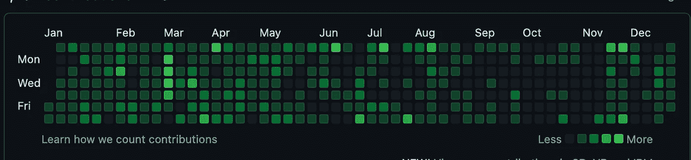
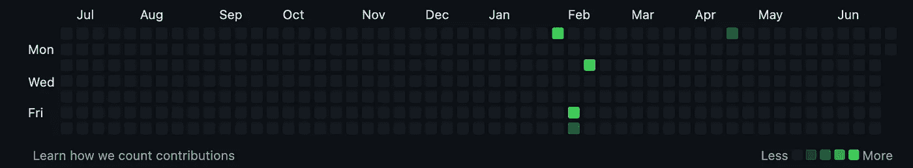

# 如何快速找到软件开发工作

> 原文：<https://blog.devgenius.io/how-to-land-a-software-developer-job-fast-5d3ada0beff2?source=collection_archive---------2----------------------->

向山跑去的人

当我第一次涉足软件开发时，我意识到自己处于劣势。我在酒店行业有 7 年的经验，没有计算机科学学位，我在数学学位中学到的大部分知识都已经忘记了。然而，在我开始学习写代码的几个月内，我设法获得了我的第一个软件开发员的职位。

在这篇文章中，我们将讨论我是如何做到这一点的，并希望帮助你给你一些关于你如何能做到同样的想法。如果你没有计算机科学学位，也不要担心，快速找到一份软件开发人员的工作仍然是可能的！

在这样的文章中，讨论一点背景总是值得的，这样你就可以理解我的情况，并看看如何将这篇文章与你自己联系起来。当我决定成为一名软件开发人员时，我在一家酒店做经理。我一周工作将近 50 个小时，经常轮班。

我涉猎了一些 VBA，发现我会对编码感兴趣。我研究了各种类型的软件开发，并决定加入！理想情况下，我希望能够辞去我的职位，专注于职业转型。然而，由于财政原因，这根本不可能。所以，我不得不在日常工作之余为转行做好准备。

# 你想成为什么样的开发人员

你需要做的第一件事就是决定你想做什么样的软件开发。软件开发在某种程度上是一个总括术语，它包含了许多职业道路，如 web 开发、机器学习和系统学习。

在线研究各种类型的开发以及它们需要什么样的工作是一个好主意。一旦你对你想要追求的有了更好的理解，是时候了解职业道路有什么要求了。然后，你将能够明确你需要学习的编程语言和技能。

当我经历这个过程时，我决定成为一名全栈开发人员。我发现我需要学习 HTML、CSS、JavaScript 和后端语言和框架。对于后端，我选择了 Python 和 Django。

# 学习的艰辛

男人学习

一旦我完成了关于我想做什么样的软件开发的研究，是时候开始学习了！我的学习技巧是在一门课程之外编写代码。我会以 1.25 倍的速度播放视频，尽可能多地吸收信息。[试图记忆语法不是学习的有效方法](https://medium.com/@Salaah01/how-not-to-learn-software-development-6a57406cc209)所以我想确保我所有的时间都花在学习新概念上。

*但是哪里有磨呢？*

让我先说我所做的绝对不健康！我完全不鼓励它，并建议你采纳我的想法，把它淡化…很多！

我会每天学习 4 个小时。如果我在晚上 11 点结束，第二天早上 7 点轮班，我仍然会有 4 个小时的学习时间(除非我计划得很好，并且已经在工作前 4 个小时完成了一部分)。

当你开始学习如何编码时，学会保持一致是很重要的。

我的建议是从每天 1 小时开始(假设你有其他任务)。我相信，对大多数人来说，每天挤出一个小时，即使你需要进一步休息，也是可以做到的。我选择建议每天只睡一小时的原因是因为我明白激励自己有多难。努力工作没有乐趣。当你更喜欢做其他事情的时候，很难激励自己去做一些事情。

只要你能坚持每天至少一个小时，你就能建立一致性。你也可能会发现你学习的时间超过了一个小时。如果真是这样，太好了！

每天一小时的学习能让你走多远？

这个问题很难回答，真的要看你选择的职业道路，以及那一个小时你能有多大的成就。例如，如果你正在学习 Python，你可能会发现每天一个小时足以完成整个课程。但是，你的职业选择可能需要更多的技能，这需要更多的时间。

简而言之，你投入的时间越多，你学得就越快。

# 一旦你学会了一门编程语言

一旦你学会了一门编程语言，是时候开始考虑你可以建立一个项目了。*已经？*是的！

软件开发更多的是解决问题，而不是编码。我发现人们经常犯的一个错误是一头栽进教程地狱。重要的是[避免教程地狱](https://medium.com/me/stats/post/6a57406cc209)，尽管它看起来很有成效，但它会减慢你的发展。

我完成学习如何写 HTML、CSS 和 JavaScript 的第一个项目是一个[小 JavaScript 游戏](https://github.com/Salaah01/rgb-game)。一旦你学完了你的第一门编程语言，花些时间做一个小项目，然后上传到 GitHub 上。这有助于提高你的编程技能和解决问题的能力。

# GitHub 的力量承诺

假设你是一名招聘经理。你面前有很多简历。有些候选人有计算机科学学位，有些没有。所有候选人都声称他们知道所需的编程语言，所以没有区别。你真正需要的是某个求职者脱颖而出，对吗？

作为一名求职者，你如何确保自己脱颖而出？

Github 投稿！

下面是一张地图，显示了我在 2021 年对 GitHub 的贡献:

2021 年 Salaah01 的 GitHub 贡献图。

下面是一张图，展示了别人的 GitHub 贡献(我就不点名羞辱了):

一个不活跃的 GitHub 贡献图

如果你是招聘经理，你会觉得这两张图中的哪一张更有吸引力？哪个申请人似乎对软件开发更有热情。如果你要聘用其中一名应聘者，你认为谁更有可能努力工作以取得进步？

这是招聘经理会问的一些问题。当招聘经理在招聘初级开发人员时，他们知道无论他们雇佣谁，都可能需要一些支持。问题是，谁将从这种支持中获益最大？

鉴于 GitHub 贡献图的强大功能，您应该确保每天都进行编码和提交。如果您有私有存储库，请更新您的设置以显示来自您的私有存储库的贡献。别担心，这不会暴露你的任何代码，只会更新图表。

这是我看到很多人没有做的事情。这是向潜在雇主展示你是一笔好投资的好方法。

# 投资组合网站

如果你要成为一名网络开发人员，你应该有自己的作品集网站。对于一个 Web 开发者来说，我相信这是绝对必须的！这是一个展示你能力的绝佳机会。

与 GitHub 贡献类似，投资组合网站并不是每个人都可以利用的。这对你来说是个好消息！这是你从竞争中脱颖而出的另一种方式。

你的网站应该包含:

*   关于你自己的信息
*   你的简历(记得删除任何敏感信息，如你的地址)
*   您的项目
*   GitHub 和 LinkedIn 的链接

创建一个网站可能具有挑战性。我建议从一个简单的网站开始。大多数网站开发者倾向于前端或后端，所以不会期望你有一个最华丽的网站。对于那些申请后端工作的人来说尤其如此。

为了收集一些灵感，你可以看看[我的作品集网站](https://www.iamsalaah.com/)和其他网站。

# 工作申请

两个人面试一个求职者

你一直在努力工作，现在你已经准备好发送你的申请了！求职的最佳方式是什么？事实是，我不确定。不过，我可以告诉你我的技术，让你知道什么是成功的，什么是失败的。

## 喷雾祈祷法

LinkedIn 和其他网站可以让你很容易地申请工作。他们通常有办法让你上传简历，一旦上传，你只需按一个按钮就可以申请工作。你移动鼠标和点击的速度越快，你申请的速度就越快。

我称之为喷雾祈祷法。这听起来很棒，但对我来说从来没有效果。相反，我发现使用这些网站，完成一个外部应用程序会更成功。事实上，我在 Indeed 上找到了我的第一份工作，我必须到公司网站上申请这份工作。

## 招聘人员

招聘人员可能是你找到工作的好方法。你要做的第一件事就是把你在 LinkedIn 上的“工作机会开放”状态设置为开放。毫无疑问，一些招聘人员会联系你，他们可以帮你筛选申请。

招聘人员的伟大之处在于他们有能力为你争取一席之地。他们可以为你提供很好的职业建议，帮助你获得满意的薪水。

就我个人而言，我对招聘人员的经历喜忧参半。我发现很多招聘人员和我进行了初步的交谈，然后就从这个星球上消失了。然而，另一方面，在招聘人员的帮助下，我设法找到了两份不错的工作。因此，尽管他们可能是一个很好的选择，但要确保你不是完全依赖招聘人员来帮你找到第一份工作。

# 工作面试

你终于被邀请参加面试了！恭喜你！但是你应该期待什么呢？

你应该做的第一件事是调查这家公司。了解这家公司是做什么的，通过求职申请，试着弄清楚你可能会被要求做什么样的工作。这说起来容易做起来难，但至少你要对公司做一些调查。如果你能证明你花时间研究了这家公司，这项研究可能对公司有用。

一般来说，工作面试分为两部分。面试官会问一些问题，试图了解你的经历，并对你的个性有更多的了解。面试的第二部分将是一个技术挑战。有时，这两个部分被分成两个单独的面试。

性格与沟通>技术技能

如果你是初级开发人员，你的面试官已经知道你不是编程专家。他们期望你需要一些指导，并且很可能已经准备好给你了。记得在面试中保持谦逊，表现出你渴望学习和为公司做贡献。请务必参考任何现有项目，并花时间询问任何澄清性问题。

# 摘要

让我们总结一下，你的旅程应该分为四个部分:

*   研究
*   学问
*   使展现
*   应用

**研究**

你的旅程应该从研究开始。了解软件开发的不同领域，并发现哪一个最吸引你。一旦你收集了这些信息，找出需要哪些技能，并为自己制定一个计划。

**学习**

开始学习就业所需的技能。确保你每天至少学习一小时。

**展示区**

一旦你学会了一门编程语言，就开始做项目。随着你写的代码越来越多，你会发现你自然会成为一个更好的开发者。

一旦你完成了一个项目的构建，你总是可以学习一项新技能，然后构建一个包含该技能的项目。这个循环应该是连续的。

还有什么应该是连续的？您在 GitHub 上的提交！记得每天做一些事情来展示你对编码的热情。

**应用**

在完成前两项任务的同时，开始申请工作。就我个人而言，我在早上申请工作时运气更好——也许是因为它在邮件列表的首位？

如果你觉得这篇文章有趣，请鼓掌。如果你觉得其他人可以从这篇文章中受益，请分享。当然，如果您想获得更多有用的软件开发内容，请记得关注。