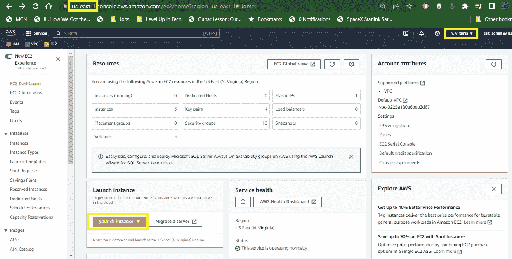
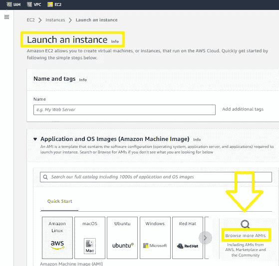
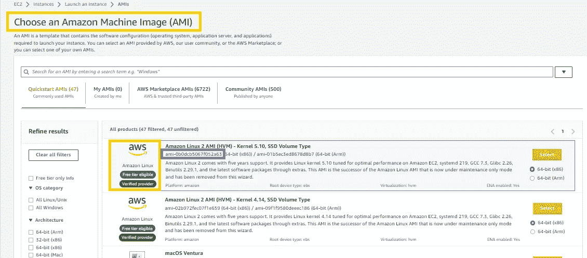
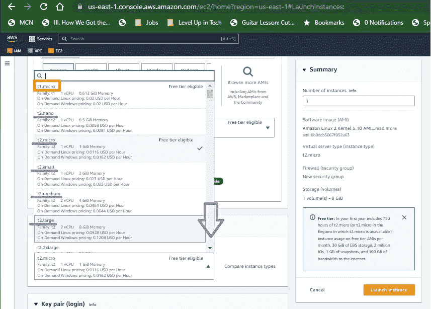
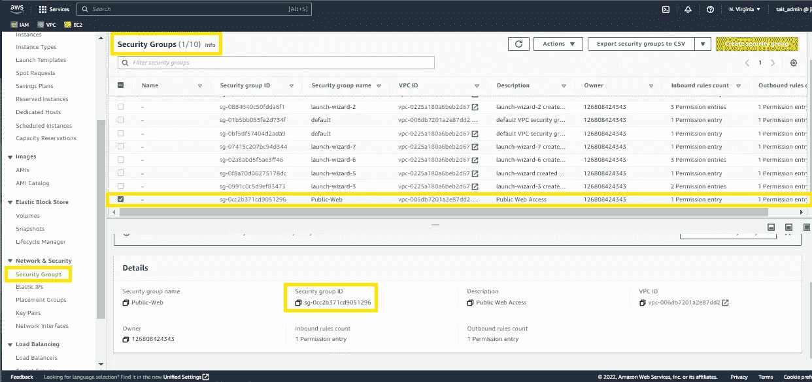
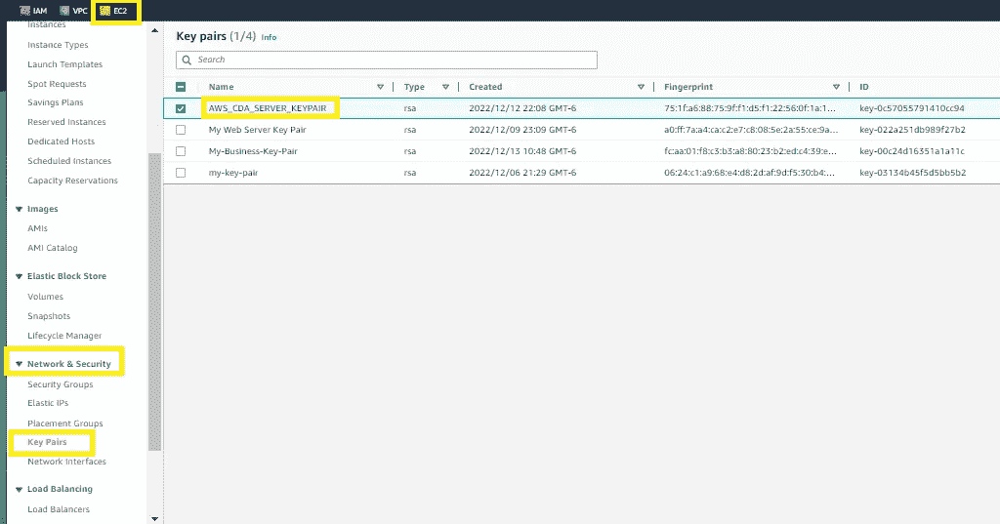
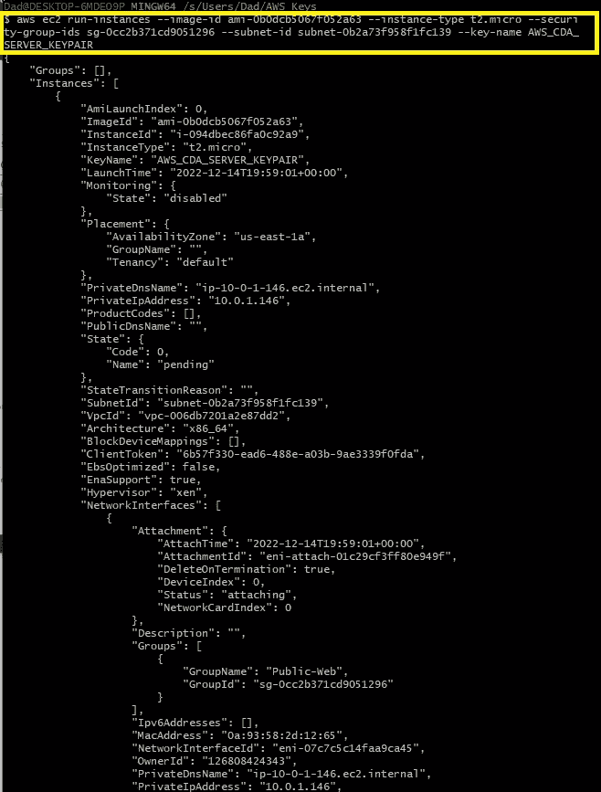
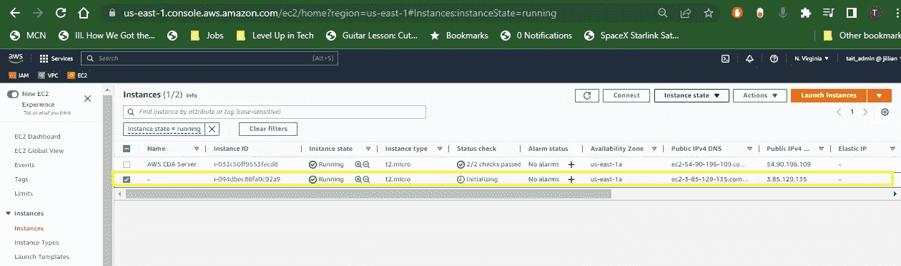
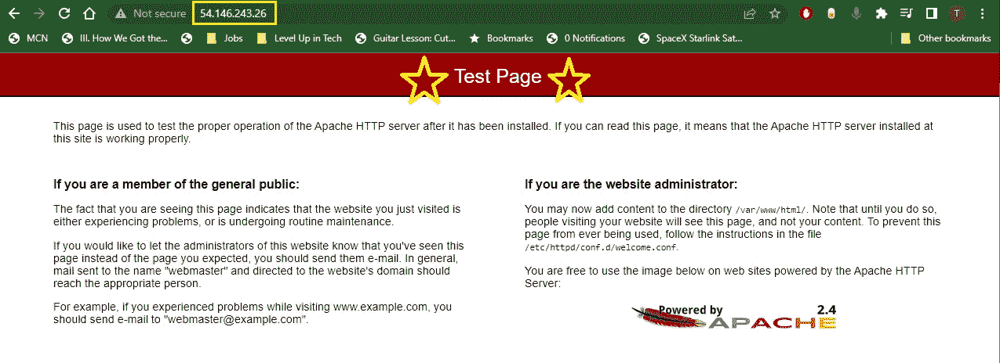
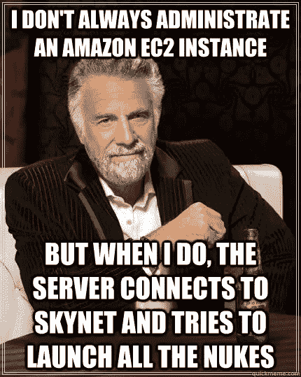

# 如何通过 AWS CLI 启动 AWS EC2 实例

> 原文：<https://blog.devgenius.io/how-to-launch-an-aws-ec2-instance-via-the-aws-cli-797b6ca5635c?source=collection_archive---------8----------------------->


在[之前的文章](https://medium.com/@tait.hoglund/save-your-business-up-to-31-by-going-cloud-49a4237f9814)中，我向您展示了如何通过 web 浏览器中的控制台启动 AWS EC2 实例。下面是如何从 AWS CLI 完成同样的事情

# 先决条件

*   [一个 AWS 账户](https://aws.amazon.com/free/?trk=78b916d7-7c94-4cab-98d9-0ce5e648dd5f&sc_channel=ps&s_kwcid=AL!4422!3!432339156165!e!!g!!aws%20free%20tier%20account&ef_id=Cj0KCQiA4uCcBhDdARIsAH5jyUmMO48IA_4exuYqiuLZa7fuSlGeH_mDa9NqBV_Pe3FNYImCoc5LWXoaAtpTEALw_wcB:G:s&s_kwcid=AL!4422!3!432339156165!e!!g!!aws%20free%20tier%20account&all-free-tier.sort-by=item.additionalFields.SortRank&all-free-tier.sort-order=asc&awsf.Free%20Tier%20Types=*all&awsf.Free%20Tier%20Categories=*all)——注册是免费的，他们甚至在你的第一年提供“免费级”服务。
*   Internet 访问，以及安装在本地计算机上的 AWS CLI
*   了解基本的 AWS CL 命令
*   建立了路由表的 VPC 和子网
*   一个已建立的 AWS 密钥对和安全组，允许进出公共互联网的入站和出站流量(0.0.0.0/0)

# 步骤 1:理解我们的命令

下面是我们最终将在 AWS CLI 中运行的命令

```
aws ec2 run-instances --image-id ami-0b0dcb5067f052a63 --instance-type t2.micro --security-group-ids sg-0cc2b371cd9051296 --subnet-id subnet-0b2a73f958f1fc139 --key-name AWS_CDA_SERVER_KEYPAIR --user-data file://serverspinup.sh
```

如您所见，在运行我们的命令之前，我们需要收集大量的<values>。以下是每个值的含义、如何根据您的需求定义它们以及它们的位置。</values>

**— image-id <值>** 是亚马逊机器图像(AMI)。它用于指定您想要安装的操作系统的类型。AMI 值因地区而异。

**—实例类型<值>** 选择满足您的计算、内存、网络或存储需求的实例类型。要查看选项的详细列表，请从 EC2 仪表板访问启动 EC2 实例向导。

**—security-group-ids<value>**AWS 中的安全组充当 EC2 实例的虚拟防火墙，它们控制进入实例的流量以及离开实例的流量。

**-subnet-id <值>** 子网提供了您的 VPC 内的一系列 IP 地址，我们的 EC2 实例将连接到这些地址。子网在您的组织内提供屏障和控制。

**—Key-name<value>**密钥对由一个公钥和一个私钥组成，作为一组安全凭证来验证您的身份，以便从命令行访问 EC2 实例和其他 AWS 资源。

**-用户数据文件:// <值>** 这最后一个字段是可选的，但是一旦我们的 EC2 实例启动，它允许我们引用一个文件(或脚本)来运行命令。此字段对于运行常用命令(如包更新、安装 web 服务器等)非常有用。

# 步骤 2:定位和设定我们的价值观

**在 EC2 实例仪表板中定位您的 image-id <值> :** 开始。确认您正确的 AWS 区域，从 EC2 仪表板中单击橙色的“启动实例”



在启动 EC2 实例之前，通过您的 AWS 帐户仔细检查您所在的地区是一个很好的做法

从“启动实例”菜单中，单击“浏览更多 ami”



复制您希望安装的特定应用程序和操作系统中的 AMI ID，并作为 image-id 的值插入。



**定位您的实例类型<值> :** 从您的 EC2 仪表板访问启动 EC2 实例向导。在实例类型下，滚动并找到您的特定实例，复制名称并将其粘贴到实例类型值<的值>中。



**找到您的- security-group-ids <值> :** 开始在 AWS 控制台的 VPC 仪表板中，在左侧菜单中，向下滚动找到“Security Group”链接。在“安全组”菜单中，选择分配给 VPC 的安全组。在下面的子菜单中，复制您的“安全组 ID”。将您的值粘贴到安全组 ID <值>中。



**定位您的子网 id <值> :** 通过您的 AWS 帐户访问您的 VPC 管理控制台。单击左侧 ide 菜单中的子网链接，选择您的子网并从子菜单中复制子网 ID


**查找您的密钥名<值>** 要查找您的密钥名，请从 EC2 仪表板开始，在左侧菜单的网络&安全下，单击“密钥对”链接。复制密钥对的名称。



# **可选:步骤 3:定义我们的用户数据<值>**

这是一个可选字段，允许我们在启动 EC2 实例后运行命令或脚本。一旦启动，该字段中的命令将会执行。这为我们节省了时间。

这是我将要导入的一个示例脚本。如果您对这些命令感到好奇，我在以前的文章中详细介绍了这个脚本，并鼓励您查看一下- [**绝对初学者的 Bash 脚本基础自动化**](https://medium.com/devops-dev/basic-automation-with-bash-scripts-for-absolute-beginners-d09d04d930f) 。

让我们在当前的 director 中创建我们的脚本，并用 nano 命令定义它。

*注意，我们的脚本假设 Linux 安装了 RedHat 或 CentOs*

```
nano serverspinup.txt
```

在 nano 中，我们键入我们的服务器启动脚本:

```
!#/bin/bash

#Script to Automate Linux Server Spin Up by Tait Hoglund

sudo yum update -y
sudo yum install -y httpd
systemctl start httpd
systemctl enable httpd
```

点击[Ctrl + X]退出 nano。点击“y”将您的更改保存到您的文件 serverspinup.sh。点击[ENTER]确认更改并退出 nano

# 步骤 4:在 AWS CLI 中运行我们的命令

在我们执行命令之前。确保您运行 AWS 配置了正确的公钥和私钥以及区域。如果不这样做，您可能会得到一个错误。

```
aws configure
```

终于到了在 AWS CLI 中执行命令的时候了:

```
aws ec2 run-instances --image-id ami-0b0dcb5067f052a63 --instance-type t2.micro --security-group-ids sg-0cc2b371cd9051296 --subnet-id subnet-0b2a73f958f1fc139 --key-name AWS_CDA_SERVER_KEYPAIR --user-data file://serverspinup.sh
```



您应该会收到类似如下的输出。如果您没有收到任何输出，这意味着您的启动不成功

最后，在浏览器中确认您的启动。您应该看到 EC2 实例正在运行



在进行状态检查时，您的实例可能会说“挂起”。给它一两分钟，然后点击刷新。您可以通过单击“名称”列下的“编辑”图标字段来编辑名称

我们也可以通过提取公共 IP 地址并将其粘贴到另一个浏览器窗口来确认这一点:



看到 Apache 测试页面证实了我们更新包和安装 Apache 的命令是成功的

如果你觉得这些内容有帮助，我会很感激你的“关注”、“鼓掌”或评论。

直到下一次:前进！

