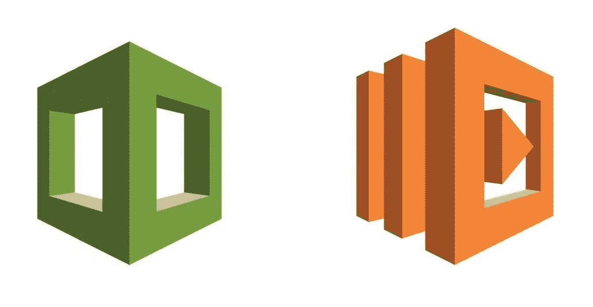

# 如何使用 Lamba 函数启动 AWS CloudFormation

> 原文：<https://blog.devgenius.io/how-to-launch-aws-cloudformation-using-lamba-function-3182101fa1da?source=collection_archive---------4----------------------->

基础设施代码简介| AWS 自动化| Python 3

如果您经常设置需要随需应变的环境 AWS 和资源，并且希望有某种方法来自动化该过程。基本上，调出那些 AWS 资源，如 EC2 实例、数据库等；并在不需要的时候把它们拆掉；这篇博客文章可能适合你。

AWS CloudFormation & Lambda 徽标

出于本文的目的，我假设您熟悉 AWS 平台及其服务。以及用 Python 编码。

但是让我们简单回顾一下术语和定义:

## **基础设施即代码| IaC**

IaC 就是管理和供应资源和基础设施(如网络、虚拟机、负载平衡器、连接拓扑等)的过程。)通过格式化的机器可读文件——使用与 **DevOps** 团队使用的源代码相同的版本。

这些基础设施的管理和供应也可以通过自动化来完成；而不是物理硬件配置或交互式配置工具。

此外，这些基础设施的管理和供应被定义为代码。通过版本控制，代码变得可重用和可跟踪，并且可以根据需要轻松地更新、提炼或修改。

> **Chef** 、 **Puppet** 和 Ansible 都是配置管理工具，旨在安装和管理现有服务器上的软件，而【CloudFormation 和 **Terraform** 是供应工具，旨在供应服务器本身(以及其余的基础设施，如负载平衡器、数据库、网络等)。)—资料来源:[k21academy.com](https://k21academy.com/terraform-iac/why-terraform-not-chef-ansible-puppet-cloudformation/)

> **云的形成**

AWS **CloudFormation** 是一项服务，它为开发人员提供了一种创建相关 AWS 和第三方资源集合的简单方法。然后他们可以按照自己的需要或要求进行调配和管理。

使用 AWS CloudFormation 涉及到使用 ***模板*** 和 ***堆栈*** 。创建一个模板来描述 AWS 资源及其属性。因此，创建了一个堆栈，然后 CloudFormation 提供模板中描述的资源。在这里了解更多—*来源:AWS 网站。*

> **堆栈**

一个**栈**是 AWS 资源的集合，可以作为一个单元来管理。堆栈中的所有资源都由堆栈的 AWS CloudFormation 模板定义。例如，堆栈可以包括运行 web 应用程序所需的所有资源，如 web 服务器、数据库和网络规则。如果您不再需要这个 web 应用程序，您可以简单地删除这个堆栈，它的所有相关资源都会被删除。CloudFormation 确保所有堆栈资源都被适当地创建或删除。在这里了解更多****——****来源:AWS 网站。**

> ***模板——云形成模板***

*一个**模板**是组成堆栈的 **AWS** 资源的声明。**模板**存储为文本文件，其格式符合 JavaScript 对象符号(JSON)或 YAML 标准。因为它们只是文本文件，所以您可以在任何文本编辑器中创建和编辑它们，并在您的源代码控制系统中使用其余的源代码来管理它们。*

*CloudFormation 模板提供了额外的功能，可用于构建复杂的资源集。这些模板也可以在多个上下文中重用。在这里了解更多****——****来源:AWS 网站。***

**在**模板**中，您声明想要创建和配置的 **AWS** 资源。以下是一个 Web 服务器云信息模板的示例:**

**Web 服务器— EC2 CF 模板**

# **希腊字母的第 11 个**

**AWS **Lambda** 于 2014 年 11 月推出。它是一种无服务器计算服务，运行您的代码以响应事件，并自动为您管理底层计算资源。**

**您可以使用 AWS **Lambda** 通过定制逻辑扩展其他 AWS 服务，或者创建自己的后端服务，在 AWS 规模、性能和安全性方面进行操作。**

*   **你在 AWS Lambda 上运行的代码叫做 ***Lambda 函数*****
*   **Lambda 函数是 ***无状态的—*** Lambda 可以快速启动所需数量的函数副本，以适应传入事件的速率。**

**将代码上传到 AWS Lambda 后，您可以将您的功能与特定的 AWS 资源相关联(例如，特定的亚马逊 S3 桶、亚马逊 DynamoDB 表、亚马逊 Kinesis 流或亚马逊 SNS 通知)。然后，当资源改变时，Lambda 将执行您的函数，并根据需要管理计算资源，以便跟上传入的请求。在这里了解更多****——****来源:AWS 网站。****

**现在，下面是我编写的一个 python 脚本，用于设置一个 Lambda 函数，该函数在给定模板和包含模板中定义的资源属性的其他参数的情况下部署 CloudFormation 堆栈:**

**上面的 Lambda 函数是用两个变量建立的:**

*   **模板 Url**
*   **参数文件**

**这些参数是指向输入模板 URL 和参数文件的 URL。**

**如果将来您想要使用不同的模板和输入参数进行测试，您可以使用 Lambda 控制台来更新 Lambda 函数的环境变量。**

> ****Lambda 函数已被授予管理员角色，允许 AWS CloudFormation 创建您的模板中定义的任何 AWS 资源。****

**如果你想更进一步，设置一切运行在底部和从你的手机推；发布在 AWS 上的初始教程可以在这里找到:[点击按钮部署 CloudFormation 堆栈](https://aws.amazon.com/blogs/infrastructure-and-automation/deploy-cloudformation-stacks-at-the-click-of-a-button/)**

> ***如果你喜欢这篇文章；你可能也喜欢* [**AWS 安全:用 Python**](https://blog.usejournal.com/aws-security-monitoring-services-health-status-with-python-6d5ffce790ee) 监控服务健康状态**

> **干杯！！！**