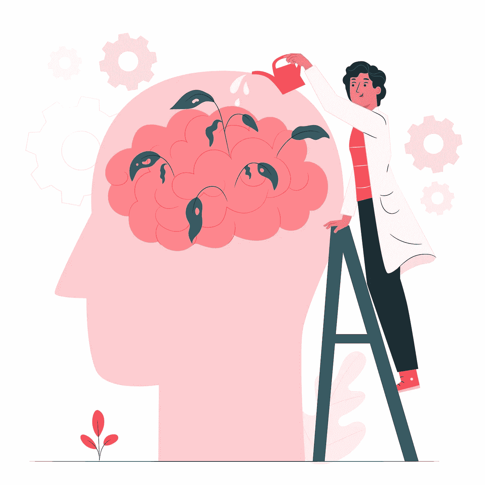

# 如何更有效地学习任何东西

> 原文：<https://blog.devgenius.io/how-to-learn-anything-more-effectively-71b3e67147ae?source=collection_archive---------17----------------------->

在整个教育过程中，我们被告知要学什么。我们得到了图表、表格、教科书和手册，甚至是一些零星的讲座。我们被埋在书里。然而，我们很少考虑如何学习。我们常常花几个小时钻研材料，只是为了弄懂其中的一小部分。真是浪费时间！

为了解决这个问题，我整理了帮助我掌握学习艺术的最佳生产率技巧。我在培训成为软件开发人员的过程中收集了这些技巧和技术。现在我想分享我在旅途中的发现，这样你就可以避免同样的陷阱。

但是，记住:每个人都是不同的。对我有效的不一定对你有效。所以，去尝试，去实验。根据你的学习风格调整技巧。无论是视觉还是听觉。

此外，我要感谢《零到精通》的安德烈他在提高我的工作效率方面发挥了关键作用，并激励我想要教你们所有人如何有效地学习。

# 时间是最重要的

很容易把一切都留到最后一刻。但是，不管你怎么想，死记硬背不会让你有任何进展。2009 年，一项研究发现，对于 90%的参与者来说，分散学习比死记硬背更有效。奇怪的是，72%的人认为这样更有益。

*复合学习*依赖于一个简单的原则:少而常。每天花时间复习一个话题会有更高的回忆。重复是关键。通过循序渐进，我们可以避免在考试前一天晚上筋疲力尽。

坚持不懈地工作是很有挑战性的。与我们触手可及的令人分心的世界相比，工作似乎很无聊。所以，重新框定你的作品。创建游戏来帮助你学习。开发奖励系统，让你保持动力。保持好奇心，给自己设定挑战。

最重要的是，保持乐观。消极的想法不会帮助你取得任何成就。你需要决定，工作是一个*选择*还是一个*琐事*。

如果你觉得自己做得不够，不要惊慌。记住*帕累托法则* : 80%的结果来自 20%的原因。相反，问问你自己，“这是对我时间的最好利用吗？”如果不是，那就做点别的。目标是学习，而不是看起来像在学习。因此，留意任何能帮助你实现目标的关键技能。

# 结合创意

原创很难。甚至不可能。我们能做的就是把手头的东西混在一起。但是不要绝望，生活中的一些奇迹来自混合:薄荷和冰淇淋，辣椒和巧克力，或者有争议的火腿和菠萝。

结合天赋找到自己的定位。你是编程高手，但有商业和沟通的诀窍吗？或者你是一个热爱医学的视频编辑？通过技能积累，我们可以从我们热爱的事物中创造新的机会。它给了我们目标和渴望。它提供了动力。

如果你还在努力寻找灵感，跳出你的舒适区。寻找你从未听过的观点。一定要确保你有多个导师和老师。尽管不要把老师说的一切都当作真理。问题，我怎么知道这是真的？即使你不同意，借鉴不同的观点仍然是必要的。它有助于激发灵感，教会我们批判性地思考。

但是，在探索的过程中保持开放的心态。任何事物都有利弊、平衡和权衡。没有什么是非黑即白的。不要仅仅因为你不同意某项资源就放弃它——拥抱这种分歧。

# 保持简单

当我们学习的时候，有一种把事情复杂化的倾向，试图让自己听起来很聪明。但我们不追求外表。我们想要真正的交易。阿尔伯特·爱因斯坦很好地抓住了这个想法:“如果你不能向一个六岁的孩子解释它，你自己也不理解它。”另一位物理学家罗伯特·费曼将这一概念扩展成一种帮助他学习的技术。

费曼技术包括将一个主题浓缩成一个简短而准确的解释。试试看。如果你纠结，回去练习*主动学习*，而不是被动消耗内容。我们追求质量，而不是数量。思考主题，给自己设置问题，与同事讨论想法。然后写下你所学内容的总结。试着在不看笔记的情况下做这件事。

一旦自信了，就试试这句学习新技能的经典名言:看一个，做一个，教一个。找到一种实用的方法来应用你所获得的知识，巩固你头脑中的概念。

# 永远不要错过腿日

如果你曾经去过健身房，你会看到那些家伙走来走去，巨大的胸部，像树干一样的手臂，但他们的腿骨瘦如柴。它们看起来像一个三角形。完全不平衡。好像一推就能让他们倒下。他们一直在翘腿日。

学习也不例外。在你会走路之前试着跑，你最终会一事无成。专注于基本的想法，你将建立理解的基础，这将解开向前发展的概念。你将能够找出原因，而不是死记硬背信息。

要做到这一点，你需要一个计划——学习路线图。几个小时都不知道自己要去哪里，这不是成功的秘诀。弄清楚你需要学什么，什么时候需要学。正如人们所说:聪明地工作，而不是努力地工作。*效率永远胜过勇气*。

如果你感到不知所措，把这个话题分成几大块，*分开，然后征服*！毕竟，解决了一个问题就解决了一半。通过将一个主题分解成可管理的小部分，我们可以从基础到高级地研究一个主题——每一步都通向下一步。

# 学习是一种精神状态

为了完成一项大任务，我们的大脑使用两种完全不同的思维模式。每一个都会很好的为你服务，但是两个都精通，学习就变得轻而易举了。

在*专注模式*中，我们专注于一项任务。大多数学习都发生在这个时候。这些是我们寻找的时间，我们完成事情的时间。而*漫射模式*则让我们的思绪游走。散散步，放松，不要专注于手头的问题。不仅仅是白日做梦。在你的头脑中，你的大脑正在形成想法之间的联系，并创造新的解决方案。只要确保你手边有一个笔记本就行了！

让你的思绪游走。避免电话和干扰，因为这只会消耗你大脑的注意力。分心对我们的大脑有害。缩短我们的注意力持续时间，用信息过度刺激我们。使用漫射模式放松——像搜寻食物的猎人一样搜索前方的道路。然后，当你琢磨出一个想法时，切换到聚焦模式来掌握细节。但是请记住，你不能花太长时间在专注的模式下而不使你的思维变得陈旧。

你可以尝试一下*番茄工作法*来保持你的思维不停滞。弗朗切斯科·西里洛发明了这种方法，他将工作分成 25 分钟的时间间隔，中间有短暂的休息，以帮助保持更长时间的专注。

有时候专注就像呼吸一样自然。你是否曾经全神贯注于一项任务，完全忘记了时间？你可能经历过*心流*。这个术语是由心理学家米哈里·契克森米哈创造的，用来描述一个人全神贯注于某项活动的时期。他们在“最佳状态”每一个动作都会引发下一个动作，就像音乐一样。这是未经思考的行动。

你是如何达到如此奇妙的境界的？不要把事情搞得太简单。这项任务需要挑战你的技能，以保持注意力集中，但不要太容易，太无聊。做得恰到好处，你就会…顺其自然。

# 隔开一点

我们已经讨论了临时抱佛脚的危险，但是也要小心过度学习。过度学习指的是在达到一定的精通水平后继续练习一项任务。过度学习者倾向于一天中的每个小时都工作。但这导致了倦怠。你不是机器人。用课间休息的时间来安排你的学习。即使你学得少，你也会记得多。

*间隔重复*涉及更频繁地重复新的、更难的信息。相比之下，旧的和不太难的信息显示频率较低。通常这是通过抽认卡实现的。这项技术利用了空间效应，当我们随着时间的推移将学习空间化时，我们的大脑会更有效地学习。

把你的目标想象成一堵砖墙。每砌一块砖都是朝着目标迈出的一步。但是堆积太快，砂浆不能干燥。你的大脑也一样。理解这些信息需要时间。坚持。所以，把它隔开。这也有助于开发你的分散思维模式。

# 不抱成见

长时间停留在一种心态上，你会变得像锤子一样——每个问题都会变成钉子。这被称为*爱因斯坦效应*。这是一种机械化的思维，由于先前的假设和僵化的思维模式，你无法想象新的解决方案。振作起来。问问你自己，我做错了什么？

向他人寻求反馈。理解他们的经历，看看他们如何应用到你自己的经历中。通过同情他人，我们会像他们一样思考，提供一个全新的视角。

勇于冒险。不要一遍又一遍地陷入同样的套路。把事情搞混。你永远不知道下一个想法会从哪里来，所以抓住机会。同时你的大脑在后台运转，进入扩散模式，加强神经通路。这可能很简单，比如走不同的路线去上班或在一个新的地方学习。

这些新奇的经历将与你试图记忆的信息联系在一起。把它们想象成挂信息的钩子。人类擅长回忆故事和情感，但对事实却很糟糕。将一个故事或事件与一个主题结合起来，你会创造出另一条记忆的途径。隐喻和类比也很管用，是使用费曼技巧的好方法。试着用一个故事或例子来解释一个话题。如果你能做到这一点，下次你需要记住这个话题时，就想想这个故事。

也用你的感觉！听觉、感觉、嗅觉和视觉一样都是学习的好工具。在充满艺术的花园或办公室里学习可以刺激你的感官，提高记忆力。例如，研究发现薄荷油、迷迭香油和熏衣草油可以提高记忆力、警觉性和准确性。

如果你真的喜欢通过视觉学习，制作地图和图表，图表和表格，以帮助从一个新的角度探索信息。

辛苦工作之后，你也需要放松一下。学习应该是有趣的。设定一个目标，一旦你达到了就奖励自己，如果你不承担责任。只有你能确保你学会了。未来在你手中。所以给游戏加点皮。把你自己放到线上。随着练习而来的是精通、独立、目标、自由和机会。如果这都不能激励你，那就没什么能了。祝你好运！

来源:[https://www . BBC . com/future/article/2014 09 17-the-worst-the-worst-way-to-learning](https://www.bbc.com/future/article/20140917-the-worst-way-to-learn)[https://www . goodreads . com/quotes/131591-nothing-is-original-steal-from-anywhere-the-disease-the-resonance](https://www.goodreads.com/quotes/131591-nothing-is-original-steal-from-anywhere-that-resonates-with-inspiration)[https://fs.blog/2019/10/focused-diffuse-thinking/](https://fs.blog/2019/10/focused-diffuse-thinking/)[https://en.wikipedia.org/wiki/Pomodoro_Technique](https://en.wikipedia.org/wiki/Pomodoro_Technique)[https://learning spy . co . uk/featured/should-students-be-overlearning/](https://learningspy.co.uk/featured/should-students-be-overlearning/)