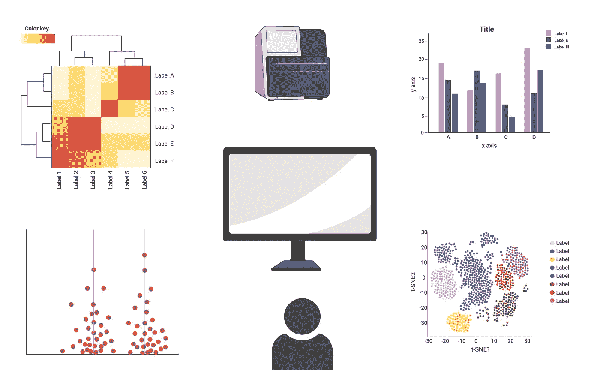

# 作为生物学家如何学习编码

> 原文：<https://blog.devgenius.io/how-to-learn-coding-as-a-biologist-95032b67c971?source=collection_archive---------4----------------------->

你好世界！

作为一名在过去 6 年中主要参与测序数据分析的微生物学家，我经常被铁杆板凳生物学家问及向生物信息学转型的问题。可能他们看到了一篇强调任何生物学家都迫切需要学习计算机编程的文章，或者在他们的电子邮件中有一个来自测序核心的数据集，或者刚刚被告知生物信息学是非学术工作的地方！不管具体的灵感是什么，我相信扩展一个人的技能组合而不是湿实验室技术永远不会是一个缺点。如果没有别的，用一些基本的数据分析技巧，你可以创建令人惊叹的新的可视化效果，在下一次会议上给你的团队留下深刻印象！

> 对于任何试图进入生物信息学世界的人来说，最大的挑战通常归结为“我从哪里开始呢？”。如果我告诉你**作为一名生物学家，你已经完成了成为生物信息学家的三分之二的路，你会怎么样？**生物信息学是生物学、统计学和计算机科学的融合，大部分生物科学研究人员已经了解一些遗传学和分子生物学，至少有基本的统计学理解水平。所以，这真的归结为学习编码，然后使用那些编码技巧和统计知识来解决生物学问题。

下一个问题是，**“我需要学习哪种编码语言？”**。如果你想学习一门语言并掌握生物信息学，我有一些好消息和坏消息要告诉你！不幸的是，你很少能只学一门语言就全身而退。我在博士论文中为 3 个临床微生物组项目设计的处理和分析数据的基本管道需要 UNIX、SQL、Python 和 r 的组合。然而，好消息是，你真正需要学习的是计算机编程的 ***基础***——理解算法如何工作，学习调试代码，以逻辑方式思考并与计算机通信。一旦你在这方面达到一定程度的能力，学习一门新的编程语言就像学习一门你已经会说的语言的另一种方言。当然，语法可能会有所不同，但核心原则基本上是相似的。

本质上，你想从什么语言开始，很大程度上取决于你的具体需求和倾向。就我个人而言，我会推荐从 **R** 或 **Python** 开始，这两者都有大量免费的在线资源，并且通常被认为对初学者友好。关于“学习在…中编码”的快速网络搜索通常会列出大量的资源——一些在线课程、教程、书籍，甚至一些深思熟虑的建议，比如“直接投入进去”。为了避免冗余，我将跳过课程和书籍的列表，而是分享一些关于学习为崭露头角的生物信息学家编码的通用提示和想法。

## **1。从你家里/手边的数据集开始**

是的，作为一名生物信息学家，你可以花更多的时间在家工作(这在 2020 年以前是一件令人高兴的事情)，但这不是我在这里谈论的。对我来说，学习一件事情的最好方法就是去做。当您开始学习编码时，让自己熟悉真实数据是什么样子是一个好主意，这样您所学的东西就不会像用您选择的语言打印“Hello World”那样抽象。虽然网上有大量的公共数据，但对我来说，最简单的选择是从本地现有的数据集开始。也许它是你生成的，也许它是另一个实验室成员或合作者生成的。它甚至可能是已经被分析过的东西。由于几个原因，我更喜欢这种类型的内部数据，而不是任何公开的数据。首先，数据的相关性，你可以通过分析它来回答的问题，对你来说总是很清楚的。其次，你会有更多的收获(你好酷的新可视化！)而不仅仅是随机的技能。最后，这将使您(和您的团队)更少依赖外部分析，并且当您使用内部数据集时，您总是可以证明您的时间&努力比您在其他人的代码库的阴暗小巷中找到的任何随机文件更好！

## 2.需要时寻求帮助

有一件事是已知的，无论你的专业水平如何，你都必须不时地(或者当你是初学者时，一直)去寻找如何做事。预计随着经验的积累，你会越来越独立，寻求帮助的频率会降低，而且只针对更复杂的问题。然而，我经常看到新手被极其宽泛的问题所困扰，比如“我如何知道我的测序数据中存在哪些物种”。我的建议是学习如何设计一个结构化的查询，并把它导向正确的渠道。我说的结构化查询是什么意思？它的基本思想是将你的问题分解成可操作的子问题，然后排队研究它们，以便以更易管理的比例寻求和接受帮助。下一节将详细介绍如何解决更大的问题！之前我提到过通过适当的渠道寻求帮助。这些渠道可以是你实验室里的某个人，一个朋友或老师，有解决你特定问题的经验，甚至可以是互联网上的陌生人，只要你在正确的地方提出正确的问题。

## 3.各个击破

在我们前面例子的上下文中，我们可以将“知道序列中存在什么物种”的问题分解为 1。“我如何处理和过滤原始测序读数”，2。“如何根据相关数据库映射我的读数”，3。"我如何解析结果以了解每个样本中的物种？"，等等。将一个较大的问题分解成块进行处理通常是一个更大的需求，正如您将通过经验认识到的那样，因为在大多数生物数据分析的情况下，几乎没有工具可以为您提供一步到位的解决方案。这也可以让你取得一些小的胜利——你可能需要更多的帮助来完成第三步，但是能够自己完成第一步和第二步会增强你的自信。

## 4.位置很重要

如前所述，在正确的*地点*提出你的问题也很重要。你不会打电话给电话公司询问你的天然气管道，那么为什么要去 [StackOverflow](https://stackoverflow.com/questions) 询问你的下一代测序质量评分问题呢？把这些留给[的 SEQanswers](http://seqanswers.com/) ！你可以找到和你有相似问题或使用相似技术的团体、聚会或论坛，加入这些团体来发表你的疑问。我知道有时候问这个问题会让人畏缩，特别是作为一个新手，但是相信我，我们都经历过(有时候仍然如此)，真的没有错误的问题，只是可能是错误的论坛！尽可能具体，并在可能的情况下添加一个示例数据，以便试图回答的人可以在回答之前在自己的系统上运行它。如果你发现有人能够帮助你，别忘了对他们表示感谢，对他们的回答投赞成票，或者请他们喝杯咖啡，当有人向你寻求帮助时，记得尽自己的一份力量！

## 5.如果它没有被写下来，它就没有发生

这一个我个人在开始的时候很纠结。我会花时间研究一种做事情的方法，并将其应用到我的工作中，但不会保存可搜索的笔记。因此，几个月甚至几年后，当我顺手忘记了我所做的事情的细节时，我将不得不浪费时间再次查找同样的事情。请注意，我没有只提到记笔记，而是添加了关键字“*可搜索*”。将脚本保存在名为“我的脚本”的目录中是不够的。我给所有初学者的建议是，你应该详细记录你所学的东西，包括哪些有用，哪些没用，就像你所做的那样(希望如此！)用你的板凳研究。将所有笔记以电子方式保存在一个可以快速查找的地方。编写程序做某事的最大乐趣之一是，你可以一次又一次地使用它，为不同的项目做相同的任务，并在其他项目中做类似的修改。这样想，你训练一个助手为你做实验，所以现在每次你需要做实验，你只需要问他们。这就是为什么存储他们的号码很重要，这样你就可以很快地联系到他们，而不必去大街上寻找他们。安全保存所有脚本并使其易于查找的一个好方法是使用 Git 库，比如 [GitHub。](https://github.com/)将您的脚本保存在本地文件夹中，并将其连接到网络，使您的工作安全、可搜索，并在必要时可共享！

## 6.再现性至关重要

我们今天在生物信息学中面临的一个主要问题是缺乏可重复性。如果你是一个新的想法，这指的是一旦你将它公之于众(例如一旦你的手稿出版)，任何人都有可能完全复制你的作品、你的程序、脚本、分析，显然是在你的许可下。令人欣慰的是，这个问题已经被认识到，我看到每个层面都在努力解决这个问题，包括在大多数研究生水平的生物信息学课程中设置研究可重复性模块。我必须向这里的任何初学者强调这一点，从第一天开始练习使你的工作可重复！根据我们之前的部分，假设你在一个很棒的期刊上发表了你的论文，并在 [GitHub](https://github.com/) 资源库中提供一个链接到你的分析。一个读者发现你的工作很有趣，并试图将相同的代码应用到他的工作中，但他们没有让它工作，因为要么你的代码只在特定的系统上工作，要么你没有足够的信息来运行它。这就是脚本中详细注释有用的地方。例如，如果您使用 R 来分析您的数据，您可以生成一个可复制的 [R Markdown](https://rmarkdown.rstudio.com/) 文件，其中嵌入了所有必要的注释和评论，以及实际的代码，因此任何阅读它的人都可以很容易地理解您做了什么以及为什么做。其他要做的事情是使用有意义的变量名，在你自己的系统之外工作的链接，并且通常遵循良好的编码实践。

> **总之** *，*我的建议是从一个你熟悉并能立即访问的数据集开始，将问题分解成单个的块，问一些聪明的问题以获得更好的帮助，做详细的笔记并遵循良好的编码实践这样当你的分析工作发表时，其他人就可以追溯你的分析工作，就像他们可以追溯你的实验协议一样。我们不必在编程工作中变成野蛮人，因为我们是热爱野生类型的生物学家！我希望这对任何阅读的人都有帮助，如果你有任何问题，请联系我。

*快乐分析！*