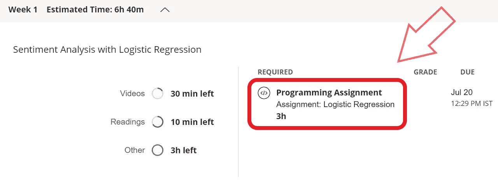
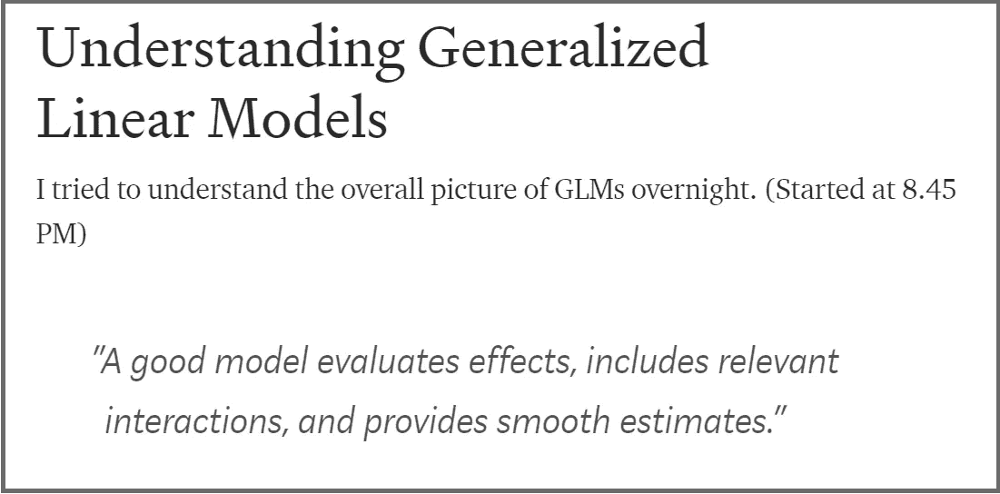

# 如何有效学习 MOOCs？

> 原文：<https://blog.devgenius.io/how-to-learn-effectively-from-moocs-aec4134b0c6d?source=collection_archive---------16----------------------->

## 我从 MOOCs 中有效学习的实践

图片来自 [Pixabay](https://pixabay.com/?utm_source=link-attribution&utm_medium=referral&utm_campaign=image&utm_content=1512838) 的[乌兹别克](https://pixabay.com/users/UzbekIL-2854934/?utm_source=link-attribution&utm_medium=referral&utm_campaign=image&utm_content=1512838)

我已经完成了几门 MOOCs 课程，目前正在学习名为*的分类和向量空间自然语言处理课程*，这是来自[*Deep Learning . ai*](https://deeplearning.ai)*的*深度学习专业化的第一门课程。我想我可以分享一下我是如何实践一些对我来说最理想的从 MOOCs 中有效学习的方法的故事。我们开始吧！**

## 选择适合你需求的 MOOC

我们知道，有大量的 MOOC 课程，来自不同的平台，涉及广泛的类别。在任何给定的主题上，都有许多好的主题。因此，我仔细检查了各种选项，并检查了以下内容，以确定某个特定的课程是否适合我。选择一门合适的课程非常重要，因为你不必选择错误的课程，不必花费大量的时间，也不必在以后某个时候放弃它。

*   **先决条件:**这是它开始的地方(选择一个主题之后)。如果我不具备开始课程所需的技能，我会检查自己是否能在一两周内学会所需的技能。

如果没有，我不继续。在开始学习那门课程之前，我先学习所需的技能。你可能认为你会赶上，但你不能。(超级聪明就可以！)

如果是的话，那么我将同时学习必备技能，并在一周内赶上。

*   **评论:**潜入各种评论:正面，负面，中性。我知道人们的期望是什么，是否能实现。我知道这个课程对什么样的人来说是完美的，对什么样的人来说不完美。此外，我使用像 ClassCentral 这样的门户网站来查看评论和评级。
*   课程/教学大纲:我将要学习的东西的蓝图对于知道我能从一门课程中期望什么是非常有用的。它也很方便，而做课程。我在后面的部分已经写了。
*   完成时间:我看看能不能*每周投入两倍以上的时间。*原因是这样的:每门课程中提到的时间仅代表观看视频和测验的时间。但是，一个人必须投入更多的时间来练习，额外的时间取决于课程的水平。此外，有报道称，MOOC 门户网站提到的建议完成时间具有误导性。
*   **介绍视频:**现在，这是一个失败者。*看入门预习让我对老师怎么教有了一个视角；如果他/她的口音是可以理解的。* 我喜欢 [Andrew NG](https://www.coursera.org/instructor/andrewng) 的课程，原因是:他平静的声音，听起来不吓人，让我觉得这门学科轻松多了。有一些 MOOCs 我中途停了下来，因为我不能正确理解老师的口音(也不想完全跟着字幕走)。
*   **已付/审核:**这个看你的消费能力了。早些时候，我很少支付课程费用。但是这里面有一个陷阱。我支付的课程，我完成了其中的大部分，并且在很短的时间内。对于免费的作业，我通常没有动力去完成，而且(在大多数课程中)一个人也无法获得评分作业。*所以，先审核课程，把课程过一遍，再交钱，万一你负担得起。* 如果你做不到，许多大 MOOCs 都会提供优惠，所以要尽量利用它们。

## 2.从每周测验/作业开始

这是我最近正在练习的一种独特的方法，并且发现很有成效。我从 Coursera(大部分)上课程，并且在我注册一个项目的时候，每周的测验/作业是可用的。在观看相应的讲座和材料之前，我开始尝试浏览每周的测验或编程作业，以了解问题是如何构成的。请注意，你的目标不应该只是知道所提问题的答案，而是更深入地理解这些概念。

在我当前的 MOOC 课程中，第一周需要完成作业

当小测验是 mcq 时，我试图在不了解选项的情况下为每个问题制定一个答案。这样，我就可以思考这个问题的概念。一旦对这个话题有了简短的思考，我就会利用这些选择。

## 3.笔记/论坛

早些时候，我习惯做手写笔记，一旦课程结束就把它放在一边，这被证明是没有用的。为了弥补现在的不足，我给它增加了更进一步的步骤:*数字化*。课程结束后，无论我在笔记中写了什么，我都试图将其制作成 word 文档(最近我正在尝试采用观念和媒介)，以便对我回忆想法有所帮助。这个数字化的过程只有一个简单的原因:*无障碍*。*你可以问我‘你为什么不一开始就用数字方式记笔记？’理由:方便和修改。对我来说，最初做手写笔记很方便。当我将它数字化时，它总结为一个修订版，很容易获取。我在下面附上了一张图片，展示了我为了修正一个概念而创作的一个媒介故事。*

我的 Notes 数字化版本的截图

另一个有效学习的方法是参加论坛。研究表明，通过论坛与同龄人互动的人比不通过论坛的人更有可能完成课程。

## 4.在下一周开始前，重新参加前一周的测验

比方说，我已经完成了 2 周的课程，即将开始第 3 周，我重新参加了前 2 周的测验，以复习之前学习的概念。我练习的另一件事是，我将每天浏览课程表，以回忆到那时为止我所学的东西。

> 幸运的是，人类的遗忘遵循一种模式。我们会成倍地遗忘。我们在测验中得到正确答案的可能性的图表随着时间的推移快速向下扫描，然后趋于平稳。
> 
> 加里·沃尔夫

## 5.结束后不要停止

***《我在结束时打开》—阿不思·邓布利多***

这是最重要的事情。过去几年里，我已经忘记了许多从 MOOCs(或任何与此相关的东西)中学到的东西，只是因为我没有实践它们。但在过去的 2-3 个月里，我一直试图重温我通过做项目(我的 MOOCs 基于数据科学)和写项目所学到的东西。此外，MOOC 可能不是你理想的学习方式。你可能想用自上而下的方法学习，然后随意探索。如果你想从这个故事中学到什么的话: ***坚持不懈地练习，学习并永远记住它。***