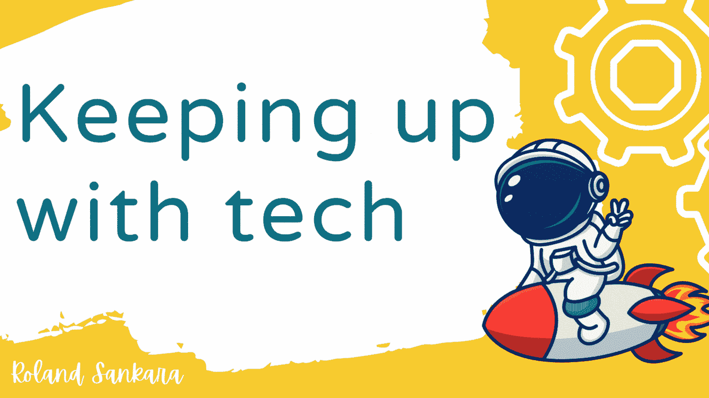
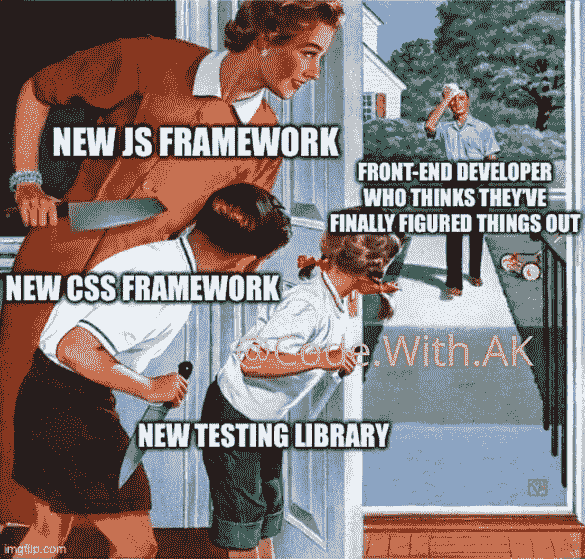
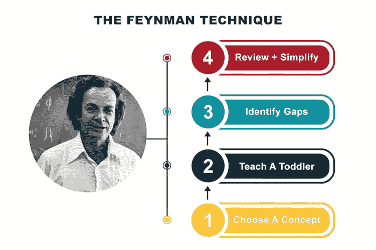

# 作为一名软件开发人员如何学习新技术(不被淹没)。

> 原文：<https://blog.devgenius.io/how-to-learn-new-technologies-as-a-software-developer-without-getting-overwhelmed-44696e2acf7?source=collection_archive---------20----------------------->

封面图片作者:[罗兰-桑卡拉](https://ug.linkedin.com/in/roland-sankara-808162192)

## *这里有一些技巧，你可以用来更快地学习和掌握新技术。*

技术生态系统正在快速发展，新的编程语言、框架和库几乎每天或者每小时都会发布。

## **挑战。**

大多数软件开发人员/工程师(包括我在内)面临的最大挑战是如何跟上所有这些新技术，更重要的是，如何学习这些工具，这似乎变得势不可挡。

围绕同一主题产生了无数的迷因，我个人承认其中许多非常幽默，热衷于阐述许多工程师在如此多的新工具和技术的出现中感受到的压力，更不用说有多少东西需要学习了。

这里有一些生动的例子；

图片来源: [https://preview.redd.it](https://preview.redd.it/wxru0webvlh61.jpg?width=960&crop=smart&auto=webp&s=60bf6aa8ee47f10d2712f79d51addf966905e8d2) 和[https://media.makeameme.org](https://media.makeameme.org/created/so-youre-telling-e553c15955.jpg)

## 概念与工具。

鉴于以上所述，对我们来说，重要的是从我们如何着手学习这些工具和技术开始，也许要弄清楚我们可能会在哪里出错。我相信，如果你花一点时间思考一下，你可能会发现一些可能的原因。

在对此做了一些研究后，我发现主要的问题是我们更关注工具，而不是我们要解决的概念或问题，因此对我们来说，这只是挑选每个新的流行产品(工具)的问题——可以这么说。

> 所以我想说的是，你需要在概念和工具之间划清界限。

这将帮助你在挑选和选择要使用的工具之前，将注意力从单纯的工具转移到对概念或问题的理解上。

> **工具只是达到目的的一种手段，因为它们的存在是为了解决问题**你会注意到，即使是解决许多问题的工具，与其他工具相比，总有一件事它们做得最好。

底线是，在选择工具时，您需要问自己这些问题；

*   *我想解决什么问题？*
*   *这个问题符合哪些概念？*
*   *我想使用的工具/技术有哪些用例？(它解决了什么)*
*   *就工具而言，有哪些其他选项，它们与我想使用的工具相比如何？*
*   *这个工具是怎么工作的？这有助于您理解您选择使用的技术。*

## **学习新工具/技术的步骤。**

既然您已经根据手头的问题决定了要使用的工具，那么是时候开始学习了。不幸的是，不能保证你会很快学会这项技术并自信地开始应用它。

的确，有些工具需要你花时间去学习，因为它们的学习曲线很陡。然而，有了正确的学习策略，你可以快速掌握新技术而不会不知所措。

这里有一些你可以遵循的步骤。许多行业专家都极力推荐它们，我可以向你保证，它们都帮助我学习和掌握了我所使用的工具；

让我们逐一回顾；

📚 1.寻找合适的资源。当一个新工具推出时，会有大量关于该技术的教程和文章，这可能会让你有点不知所措，因为互联网上有大量的信息来源。

> 然而，**对你来说，对官方文件进行优先排序是很重要的。**

*主要是因为它总是最新的，更重要的是有了* ***快速入门指南*** *，它几乎可以带你完成工具的使用。*

你也可以考虑参加实践课程或阅读可靠平台上的书籍，因为许多教育工作者/内容创作者会花时间将官方文件提炼为一个全面的学习体验，这种体验主要是基于项目的。

Youtube 上的视频会很棒，但问题是它们不能涵盖一切，而且在某些情况下不太可靠。

🚀 2.动手/实践学习。总是边做边学，努力用一个现实的项目或用例来实践，而不是随意尝试你在文档中找到的特性。

例如，如果你正在学习 ReactJS，你可能会选择用它来构建一个简单的网站用户界面。当你这样做的时候，你会发现并拼凑 ReactJS 的各种特性，比如组件、状态、可重用性等等。

*随着您的进步，您可能希望网站上有多个页面，这样您就可以了解 React 中的路由，然后实现它。在这一切结束时，您将已经涵盖了相当多的功能。*

💡 3.利用你的学习方式。我们都有不同的学习新概念的方式，这取决于我们的学习风格。

> 学习风格指的是个人吸收、处理、理解和保留信息的首选方式。

查看这份学习风格指南。[https://open classrooms . com/explore-your ' s variable-intelligence-and-learning-styles](https://openclassrooms.com/en/courses/5281811-learn-how-to-learn/5514261-explore-your-various-intelligences-and-learning-styles)

*知道什么最适合你将会影响你对资源的选择，从而加速你对工具的学习和理解。*

🤝 4.**寻求帮助。** *你可以考虑联系那些了解你正在学习的技术/工具的人。这些人可能是你社交圈中的技术导师和其他软件开发人员。有了这个，你将能够节省大量的时间，因为他们会根据他们使用技术的经验给你提供建议和指导。*

⏱️ 5 **。学的时候要有耐心。就像生活中任何伟大的技能一样，耐心是学习的关键，因为它可以让你建立良好的知识基础，从而缩小知识差距。**

😃6 **。教导他人。**
*与他人分享你的知识有助于巩固你对所用工具的理解，也有助于你认识到自己知识中的差距。你清楚地表达你对某事的知识的能力会加强你对那件事的理解。*

[*费曼技巧*](https://fs.blog/feynman-technique/) *说明了你可以如何练习这一点。我可以证明这肯定是一个伟大的技术，因为我一直在实践它并从中获益。*

图片来源:[https://www.brainzucker.com/what-is-the-feynman-technique](https://www.brainzucker.com/imgs/articles/what-is-the-feynman-technique.jpg)

👍 7.跟随行业领导者/有影响力的人/教育者。
*在 Twitter 上关注他们，订阅他们的 youtube 频道。你也可以订阅一些你感兴趣的主题的播客。有了它，你将永远紧跟行业的最新和最大趋势，并从这些人的建议、推荐、学习途径和经验中获益。*

以下是我关注的一些人。

*   [*杰夫·德莱尼(Fireship.io)*](https://twitter.com/fireship_dev) *—软件开发和内容创作者*
*   [*摩西·哈迈达尼*](https://twitter.com/moshhamedani) *—软件开发和教育家*
*   [*Victoria Lo*](https://twitter.com/lo_victoria2666)*—解决方案工程师和技术作家*
*   [*昆西·拉森*](https://twitter.com/ossia)*—Freecodecamp.org 的创始人*
*   [*布拉德·特拉弗斯*](https://twitter.com/traversymedia) *—全栈开发与教育家*
*   [*syntax . FM*](https://syntax.fm/)*—网络开发播客*
*   [*Javascript-jabber*](https://topenddevs.com/podcasts/javascript-jabber)*—Javascript 播客*
*   [*Codenewbie*](https://www.codenewbie.org/podcast)*—Dev 播客*

🔖 8.**终身学习。** *请保持冷静，要知道在科技领域的学习从未停止。用成长的心态武装自己。永远要乐于学习，并准备好成为一名终身学习者。*

就这样，朋友们。有了这么多的话，我相信如果你按照这些步骤去做，你一定会摆脱学习新技术和跟上潮流所带来的焦虑和压力。

感谢您花时间阅读本文。我希望这是有帮助的，我希望得到你对我在评论区分享的任何东西的想法。不然祝你学习一切顺利。

干杯！👋👋