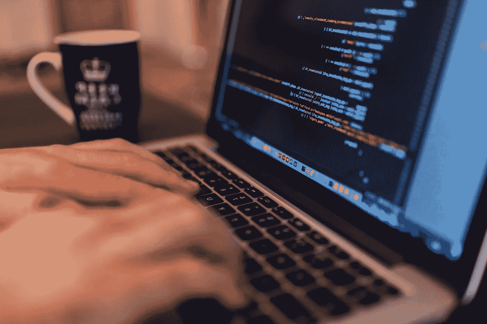

# 如何学习编程

> 原文：<https://blog.devgenius.io/how-to-learn-programming-7b43fe40c17c?source=collection_archive---------21----------------------->

`Image from [pixnio](https://pixnio.com).`

我有很多不知道甚至害怕编程的朋友，尽管编程是一个工程师所能拥有的最重要的技能之一。我们不要责怪任何人，但也许是我们如何被引入编程导致了这个问题。我对它免疫，因为我在上大学之前就知道编程的方法。我在年轻的时候借助互联网自学了编程。我试着教我的几个伙伴，但我失败了(我是一个糟糕的老师)。这是我传播知识的另一个尝试。我将讨论一个人应该如何进行编程。

# 编程到底是什么？

如果你不知道自己在学什么，不知道能从中学到什么，你就学不到东西。我不打算深究定义，但它应该给你一个基本的理解。想象一个孩子，他只知道如何做加法，减法和一些更基本的东西。现在，编程就是让简单的指令序列让孩子去做复杂的事情，数学或者其他事情。计算机只不过是除了简单的计算什么也不会做的笨机器，但是它们做得真的很快。作为一名计算机程序员，你的工作就是将现实世界中的复杂问题分解成简单的指令。相信我，这并没有听起来那么难。当计算机用 0 和 1 编程时很难，但随着编程语言的进步，现在容易多了。你对编程语言的选择决定了你想教的孩子有多聪明。编程语言水平越高，孩子越聪明。注意:更高级的编程语言仍然被翻译成简单的指令供哑机器使用。

# 我为什么要学编程？

你不必相信我的话。观看最有资格的人解释为什么编程是重要的。

我假设编程不在你的教学大纲中，如果在，那就是你的额外收获。除了视频之外，这里还有一些我个人从学习编程中得到的好处。

1.  更好地推理和解决问题。正如我之前提到的，编程就是将复杂的问题，如向世界另一端的计算机发送电子邮件，分解成简单的指令。因此，通过学习编程，你将获得将超级复杂的东西分解成超级简单的东西的超能力。相信我，这真的是一种超能力。
2.  更好地理解技术。你想成为像你祖母一样的人吗？因为如果你不与科技相处，你注定会像她一样。技术不是天上掉下来的，是过去技术的缓慢进化。编程帮助你理解一项技术是如何工作的，因此熟悉新技术变得更容易。
3.  提高你的自信心。老实说，我们的教育系统喜欢指出你是个弱智，而不是帮助你。因此，能够自己做一些事情可以极大地提升你的自信水平。你可以将这种自信引导到生活的其他领域。
4.  获得更高的社会地位。人们不理解的东西，人们往往会害怕它，而做可怕事情的人会得到尊重。不知道程序如何工作的人，倾向于尊重做程序的人。你自信心的增强也会带来更高的社会地位。这并不意味着人们会开始崇拜你，但这会提高你的社会地位。
5.  其他:还有一些更多的好处，如提高打字速度，有效利用技术，修复设备的小问题，容易找到工作等。我没有把它们都列出来，这个主题值得有自己的文章。

# 我应该从哪里开始？

就在你所在的地方。如果你正在读这篇文章，你已经有了互联网接入和一个可以上网的设备，所以你已经有了一切可以开始了。没有理由等待。

网上有很多教程，不要浪费时间去找最好的。在我看来，一个好的教程或课程足以让石头滚动。当你完成一门课程或辅导课时，大部分时间你已经知道下一步该做什么。以下是我学习新的编程语言、框架或任何与编程相关的东西所做的事情。

1.  把我日常工作的一部分奉献给它。这取决于你想在这上面花多少时间。挑战你的极限，但不要以牺牲你的幸福为代价。记住，没有健康的头脑，你将一事无成。
2.  我通常会先花几个小时去找一个合适的免费课程。我坚持为初学者提供免费课程，因为你不知道这是否会引起你的长期兴趣。我通常会去 [tutorialspoint](https://www.tutorialspoint.com/) 、 [geeksforgeeks](https://www.geeksforgeeks.org/) 、 [freecodecamp](https://www.freecodecamp.org/) 和 [youtube](https://youtube.com/) ，但你可以在谷歌上搜索，看看什么适合你。
3.  每天完成课程。你可能想在周日花几个小时，而在其他日子什么都不用做，这不好，你会简单地忘记你几天前学过的大部分东西。每天学习和练习，这样你就可以利用动力。
4.  练习，练习，再练习。学习事物的唯一方法是实践。熟能生巧。花两倍于学习的时间去练习。

是的，实际上只有四个简单的步骤。但这正是要点，将复杂的事物分解成简单的组件。

# 需要多长时间？

我不会回答这个问题。学习不是赛跑，你不需要在别人之前跑完，你只需要完成旅程。你知道你能承受多大的压力，挑战你的极限，但不要以牺牲你的健康为代价。慢慢来，完成比赛。

# 一些建议

1.  从 Python 或者 JavaScript 开始。它们简单易学但功能强大。
2.  抓住概念，理解它们，然后忘记它们。记忆不是我们在后谷歌时代做的事情。谷歌是你的朋友，向它寻求帮助。
3.  不要拿自己和别人比较。你只需要比昨天更好。
4.  不要害怕冗长的代码。它们通常只是由简单的代码块组成，试着一个块一个块地理解它们。
5.  保持一致。每天学习和练习。

# 一些资源

这里有一些学习资源。你总是可以自由探索互联网，找到你喜欢的东西。

[教程要点](https://www.tutorialspoint.com/index.htm)

[极客工作室](https://www.geeksforgeeks.org/)

[自由代码营](https://www.freecodecamp.org/)

让我