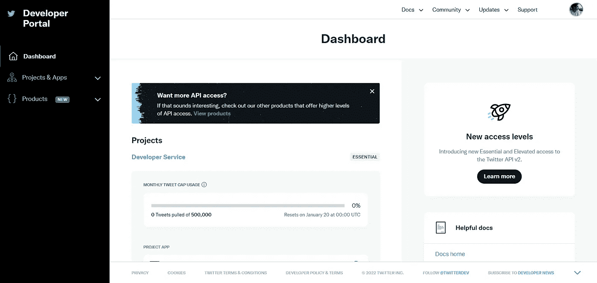
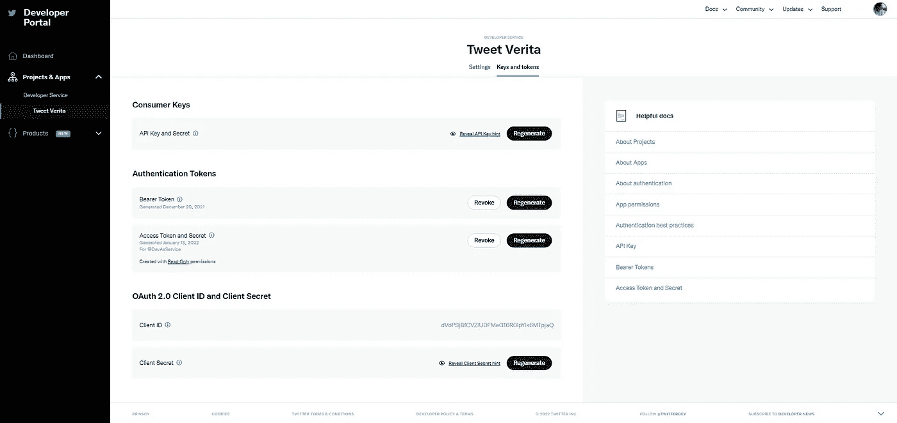
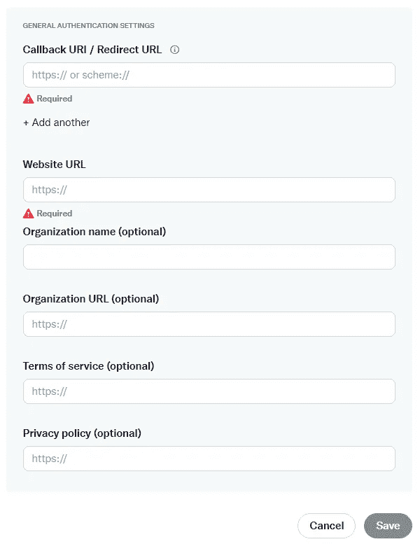
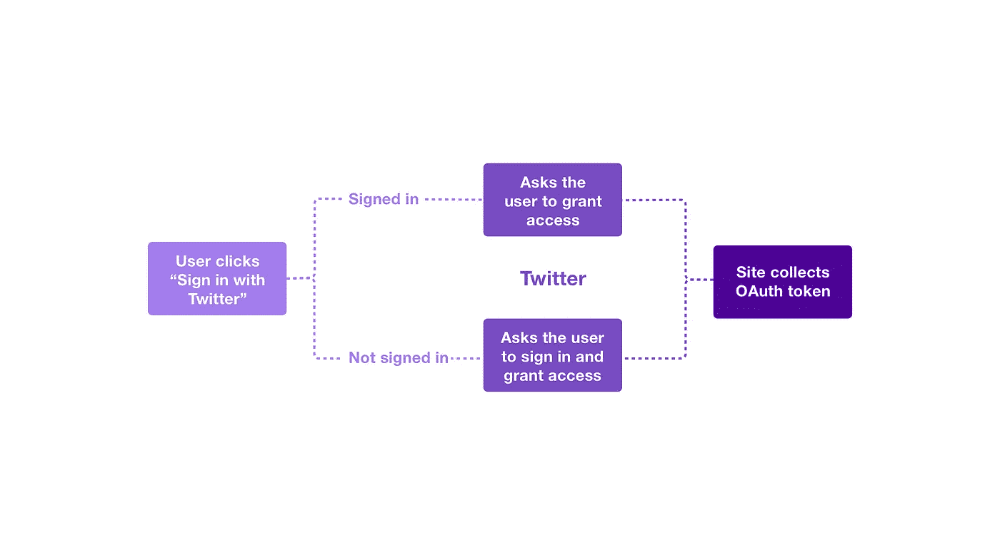
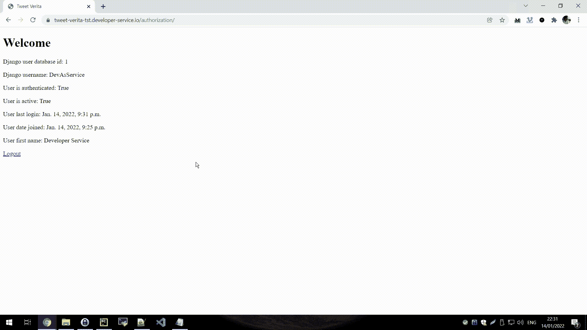

# 如何在 Django 上登录 Twitter

> 原文：<https://blog.devgenius.io/how-to-login-with-twitter-on-django-cdc11c8b470a?source=collection_archive---------5----------------------->

Django 已经提供了一个不可思议的开箱即用的认证机制，但是如果我们想将 login 与 Twitter 集成在一起呢？嗯，很简单。


亚历山大·沙托夫在 [Unsplash](https://unsplash.com?utm_source=medium&utm_medium=referral) 上拍摄的照片

大多数人使用 Twitter 阅读最新新闻，关注名人八卦，分享他们对时事的看法。

但是您也可以将它用于您的 Django 项目！

Twitter 已经成为近年来最受欢迎的社交媒体网站之一。

据统计，Twitter 是互联网上增长最快的网站，每月有超过 2 亿人使用它。

本文将向您展示如何创建一个 Django 项目，该项目可以用于 Twitter 的登录系统进行身份验证。

# 设置 Twitter 开发者账户

第一步是在 Twitter 开发人员门户中设置我们的应用程序，因为我们需要几个密钥来识别和连接我们的应用程序到 Twitter，并允许其他用户使用我们的应用程序登录。

我假设你已经有一个 Twitter 帐户，如果不是这样，那么首先创建一个 Twitter 帐户，然后回到这里。

要注册开发者帐户:

1.  登录 Twitter，验证您的电子邮件地址和电话号码
2.  去 developer.twitter.com 的[用你的基本名字、位置和用例细节注册](https://developer.twitter.com/en/portal/petition/essential/basic-info.html)
3.  审查并接受[开发者协议](https://developer.twitter.com/en/developer-terms/agreement.html)
4.  现在，您应该可以访问开发人员门户，以创建具有基本访问权限的新应用程序和项目

完成注册过程并创建项目和应用程序后，您可以访问[仪表板](https://developer.twitter.com/en/portal/dashboard):



Twitter 开发者门户——作者截图

我们需要导航到“项目和应用程序”来访问我们新创建的应用程序，然后导航到“密钥和令牌”:



Twitter 开发者门户—应用密钥和令牌—作者截图

为了允许其他用户通过我们的应用程序登录，我们需要以下一组密钥:

*   消费者密钥，这些是我们的应用程序密钥:API 密钥和 API 密钥秘密
*   OAuth 2.0 密钥，这些是我们的认证密钥:ClientID 和 Client secret

我们不需要我们的身份验证令牌，因为这些令牌将被用来在 API 上标识我们自己，我们没有这样做，我们希望标识为其他人。

另一个配置需求是 OAuth 的回调 URL，为此您需要导航到您的应用程序，然后是“用户验证设置”,然后在“常规验证设置”下填写必要的信息:



在 Twitter 开发者门户 OAuth 应用程序设置上填充回调 URL 作者截屏

为了让我们作为不同的用户(登录到我们的应用程序的那个用户)使用 API，我们需要请求许可，这意味着让那个用户登录 Twitter。

这个过程被称为三脚 OAuth，它遵循一个独特的流程。



三条腿 OAuth 流程——来源于 Twitter 开发人员文档

该流程由以下步骤组成:

1.  为我们的应用程序创建一个请求，以获得一个请求令牌，这将为我们提供一个 URL，我们将用户重定向到该 URL，以便在 Twitter 上进行身份验证；
2.  然后用户进行身份验证，并向我们的应用程序发送一个请求令牌；
3.  我们将请求令牌转换成一组可用的用户访问令牌，这些令牌不会过期，这意味着我们可以重用它们；

更多信息可以在 Twitter 开发者文档中查看。

# 设置 Django 项目

在本文中，我将使用 PyCharm 作为我们的 IDE，因为我非常喜欢它，但是您可以自由地使用任何其他 IDE。

我们在 PyCharm 上创建了一个新项目(带有一个虚拟环境)，让我们称之为“TwitterLogin”。

创建项目后，让我们用以下代码安装 Django:

```
$ pip install django
```

接下来，我们创建 Django 项目:

```
$ django-admin startproject TwitterLogin
```

然后，我们创建授权应用程序:

```
$ cd TwitterLogin
$ python manage.py startapp authorization
```

然后，我们可以编辑项目的“settings.py”文件，以包含新创建的应用程序，并更改默认登录 URL:

settings.py

我们还改变了我们读取 Django 的一些标准设置的方式，以便能够从 a '读取它们。env '，如下所述。

为了保存我们的 API 密钥和秘密，我们将创建一个。env '文件以更安全的方式存储它们:

。包封/包围（动词 envelop 的简写）

能够读懂我们的。我们将安装“python-decouple”包:

```
$ pip install python-decouple
```

这就结束了我们的 TwitterLogin 应用程序的基本 Django 项目设置，接下来我们将编写代码来执行 Twitter 登录。

# 用 Twitter 实现我们的 Django 登录

现在让我们来看看应用程序的核心，它能够让一个用户用 Twitter 登录，然后在 Django 中创建一个用户，我们可以用这个用户作为普通用户来检查访问。

为了与 Twitter API 交互，我们将使用优秀的 Tweepy 库，而不是手动编写请求，我们可以使用:

```
$ pip install git+[https://github.com/tweepy/tweepy.git](https://github.com/tweepy/tweepy.git)
```

我正在使用 Tweepy 的最新开发版本，因为我想使用一些最新版本(撰写本文时为 4.4.0)中尚未提供的特性。

有关 Tweepy 的更多信息，请访问:

[](https://github.com/tweepy/tweepy) [## GitHub-tweepy/tweepy:Python 的 Twitter！

### 从 PyPI 安装最新版本的最简单方法是使用 pip:您也可以使用 Git 来克隆存储库…

github.com](https://github.com/tweepy/tweepy) 

## 创建模型

第一步是实现我们的模型。

这些模型将用于存储在三分支 oauth 流程中使用的 oauth_token，以及最终的访问令牌和来自 Twitter 的用户信息:

authorization/models.py

## 创建 Twitter API 接口

接下来，我们创建了与 Twitter API 接口的文件，我们将创建一个名为“twitter_api”的新文件夹，并在该文件夹中创建一个名为“twitter_api”的新文件:

twitter_api/twitter_api.py

文件内容的简短描述:

*   函数' __init__ '，我们从'中读取设置。“环境”文件
*   函数' twitter_login '，我们用 Twitter API 验证我们的应用程序，并请求一个登录 URL。我们还返回访问令牌，以便以后存储它们。
*   函数' twitter_callback '，用户成功登录后 twitter 调用的回调。我们确认收到的令牌，并获得我们的最终访问令牌
*   函数“get_me”，返回 Twitter 用户的基本资料信息

## 创建授权和装饰助手文件

接下来，我们创建一个“authorization.py”文件，其中包含一些帮助函数来帮助我们完成授权过程:

授权/authorization.py

文件内容的简短描述:

*   函数“create _ update _ user _ from _ Twitter”接收一个 TwitterUser(来自我们的模型)，并确定它是否需要创建或更新一个新的 Django 用户和 TwitterUser。它还将最终令牌与创建的用户相关联。
*   函数“check_token_still_valid”用于确定用户在 Twitter 上的会话是否有效

我们要创建的最后一个(新的)文件是“decorators.py”，在这里我们将创建一个 Django decorator，帮助我们检查用户是否有一个有效的 Twitter 会话:

authorization/decorators.py

文件内容的简短描述:

*   我们基本上创建了一个装饰器，它检查前面描述的“check_token_still_valid ”,以允许用户访问页面或注销并将用户重定向到登录页面
*   当 Twitter 会话不再有效时，注销是清除 Django 日志会话的安全措施

## 创建我们的 URL 和视图文件

我们在授权应用程序文件夹中创建我们的“urls.py ”:

authorization/urls.py

我们还需要更改主“urls.py”文件，以便它可以包含我们的应用程序 URL:

urls.py

现在我们已经准备好了 URL，我们需要创建相应的视图:

authorization/views.py

我们文件内容的简短描述:

*   查看“twitter_login”，我们从 TwitterAPI 获取一个 URL，并将用户重定向到该 URL。我们还存储了 oauth_token 和 oauth_token_secret，以便能够在回调视图中使用它们
*   视图' twitter_callback '，成功登录后 twitter 调用的视图。我们首先确定我们的访问是否被拒绝，并显示相应的错误页面。如果我们有一个登录，那么我们验证并获得最终的令牌，检索基本的配置文件数据，并调用前面描述的函数来创建我们的 Django 用户。
*   查看“索引”，我们的主页。这里没有逻辑，所有的逻辑都在 HTML 模板和登录装饰器中。
*   查看“twitter_logout”，在这里我们执行一个普通的 Django 用户注销。如果没有 Django 用户登录，我们需要再次运行 Twitter 登录来验证用户。

## 创建我们的 HTML 模板

最后一步是创建非常简单的 HTML 模板来显示一些基本信息，以检查登录过程是否成功(或者查看任何错误消息)。

首先，让我们在“授权”项目文件夹中名为“模板/授权”的目录下创建“home.html”文件:

授权/模板/授权/home.html

最后，我们创建“error_page.html”模板文件:

授权/模板/授权/错误页面. html

我们现在已经准备好运行我们的项目和执行 Twitter 登录了。

# 演示和源代码

在运行我们的项目之前，我们需要为我们的模型和初始迁移执行迁移:

```
$ python manage.py makemigrations
$ python manage.py migrate
```

要运行我们的项目，我们需要的是典型的:

```
$ python manage.py runserver
```

请记住，我们的 Twitter 登录是通过我们拥有一个回调视图来工作的，Twitter 自己会调用这个回调视图来向我们返回信息。

这意味着我们的 URL 必须是可公开访问的，而不仅仅是在本地主机上运行。

在我的例子中，我安装了一个 NGINX 反向代理，将对我的域名的调用重定向到我的本地机器。

也就是说，让我们看看 Twitter 登录应用程序的运行情况:



Twitter 登录演示—作者提供的 GIF

有用！！！

虽然代码乍一看似乎很复杂，但实际上尽管有不同的文件集，在 Twitter 上登录一个用户并在 Django 中创建该用户所需的逻辑非常简单。

该项目的完整源代码可在以下网址找到:

[](https://github.com/nunombispo/TwitterLogin/tree/master) [## GitHub - nunombispo/TwitterLogin:用 Django 登录 Twitter

### 此时您不能执行该操作。您已使用另一个标签页或窗口登录。您已在另一个选项卡中注销，或者…

github.com](https://github.com/nunombispo/TwitterLogin/tree/master) 

# 结论

使用第三方身份验证提供者进行日志记录给 Django 应用程序带来了一些好处:

*   不需要注册表格
*   无需验证电子邮件地址
*   没有恢复密码流

除此之外，根据您的应用，这可能是合理的选择，也是唯一允许的方法。

在我的例子中，我用 Twitter 和 Django 实现了这个登录，因为我正在构建的 SaaS 项目是用于 Twitter 工具的，所以用户用 Twitter 登录是完全有意义的。

在推特上关注我:[https://twitter.com/DevAsService](https://twitter.com/DevAsService)

查看我的网站:【https://developer-service.io/ 

查看您可能感兴趣的其他文章:

[](https://python.plainenglish.io/the-easy-way-to-import-export-data-from-django-admin-fe17ecd012fb) [## 如何从 Django Admin 导入或导出数据

### 向 Django Admin 添加导入/导出功能的指南。

python .平原英语. io](https://python.plainenglish.io/the-easy-way-to-import-export-data-from-django-admin-fe17ecd012fb) [](https://medium.com/geekculture/django-shorts-password-validators-95285c0936de) [## Django Shorts —密码验证器

### Django 默认有一套很好的密码验证器，但是如果您想添加自己的密码验证器呢？超级简单。

medium.com](https://medium.com/geekculture/django-shorts-password-validators-95285c0936de) [](https://medium.com/geekculture/django-shorts-user-authentication-and-lockout-8f7164f88938) [## Django Shorts —用户认证和锁定

### Django 已经提供了很好的开箱即用的用户安全性，但是如果您想添加帐户锁定怎么办呢？然后…

medium.com](https://medium.com/geekculture/django-shorts-user-authentication-and-lockout-8f7164f88938) 

如果你喜欢读这篇文章，并且觉得它很有用，你可以通过注册一个中级会员来支持我。你每月只需花费 5 美元——这将使你能够访问所有的媒体报道！(我会收到一小笔佣金)

除此之外，如果你想在我发布新文章时保持更新，你可以[注册我的免费简讯](https://blog.developer-service.io/subscribe)！