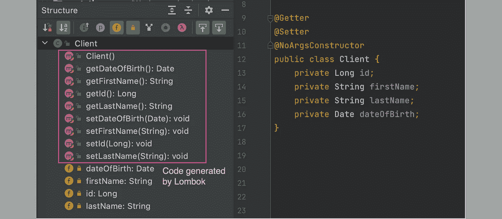
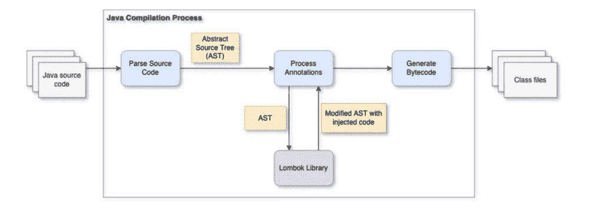
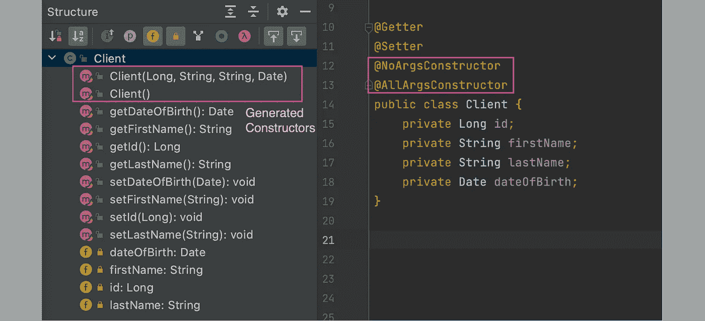
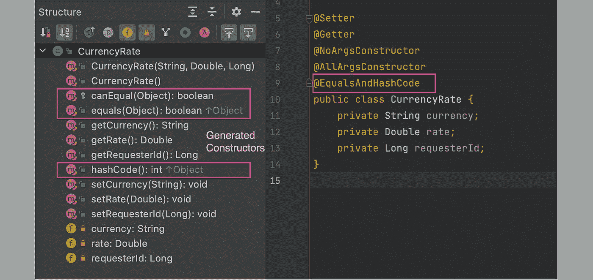
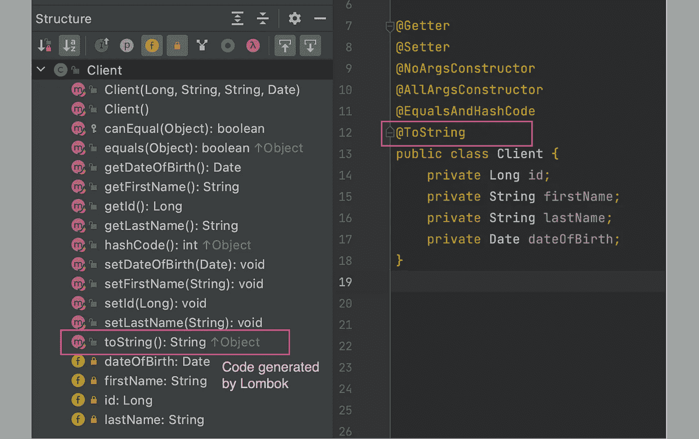
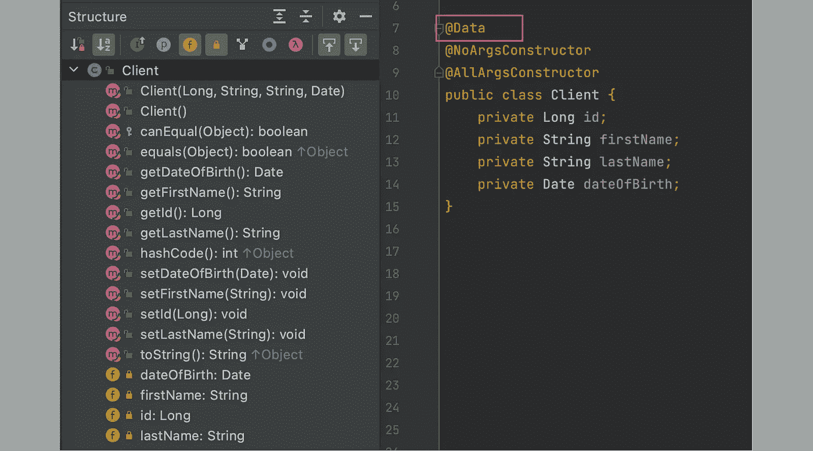
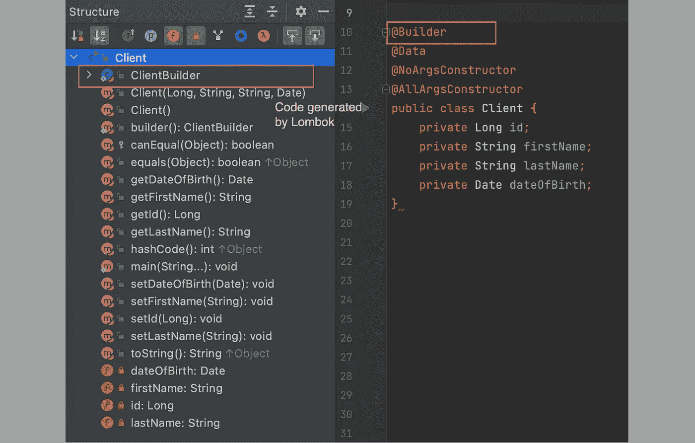
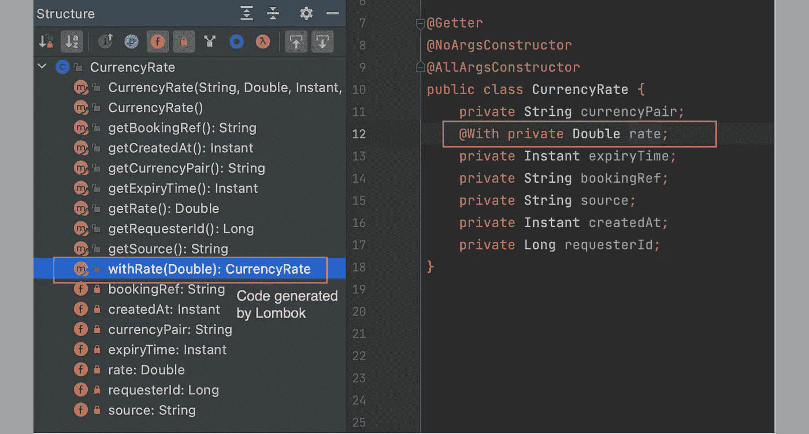
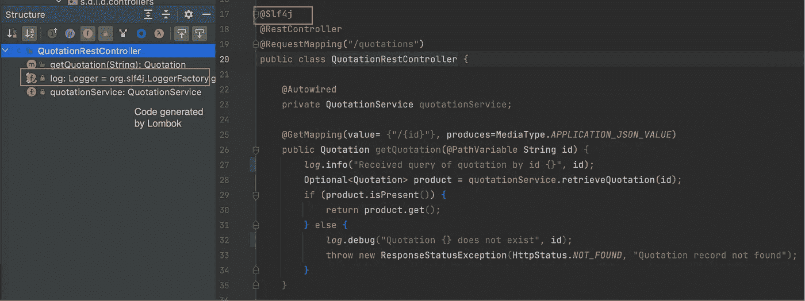

# 如何神奇地加速 Java 编码

> 原文：<https://blog.devgenius.io/how-to-magically-speed-up-java-coding-76fa1a68e0f4?source=collection_archive---------0----------------------->

## 使用 Lombok 少写多做


米兰·波波维奇在 [Unsplash](https://unsplash.com/?utm_source=unsplash&utm_medium=referral&utm_content=creditCopyText) 上的照片

不管编程语言的类型如何，样板代码的构建都是不可避免的。这既乏味又耗时，您可能会发现自己将时间花费在构建样板代码上，而不是通过编码业务功能来传递价值。

对于 Java 编程，Java bean 约定需要 setters 和 getters 来访问属性。我们需要时间来维持这些方法。例如，客户机的 Java bean 类定义具有以下属性:id、名字、姓氏和出生日期。您可以看到一个 setters 和 getters 列表以及一个默认的构造函数。尽管许多现代 IDE 支持为这些方法生成代码，但它只是帮助您在第一次生成模板，如果您重命名或删除类中的属性，则需要手动调整它们。

有没有什么方法可以消除编写样板结构代码的手工工作，并加快软件开发的速度？ [Lombok](https://projectlombok.org) 是一个奇妙的 Java 库，它就像一根神奇的魔杖，在幕后自动生成样板代码。通过使用 Lombok 批注@Setter、@Getter 和@NoArgConstructor，无需修改源代码即可生成 Setter、Getter 和默认构造函数。生成的方法在源代码中不可见，但您可以在 IDE 的代码结构视图中看到它们。客户机 Java bean 现在看起来更干净、更简单。



由 Lombok 生成的代码

# 龙目岛是如何运作的？

虽然大多数 ide 的代码生成功能实际上更新了源代码文件，但 Lombok 以不同的方式更新，方法是在不修改源代码的情况下悄悄生成的。事实上，Lombok 在编译过程中进行了修改，让我解释一下它是如何在幕后工作的。下面的过程图说明了高级 Java 编译过程。首先，Java 源代码文件被提供给编译器，编译器解析源代码并生成抽象源代码树(AST)的数据结构。接下来，它调用处理程序进行注释处理。Lombok 库被调用来处理它自己的注释，比如上面例子中的@Getter、@Setter 和@NoArgConstructor。因此，魔法在这一步开始发挥作用，Lombok 通过根据注释注入 setters、getters 和 constructor 来修改 AST。最后，AST 被转换并输出到类文件。



用 Lombok 实现的 Java 编译程序

换句话说，Lombok 通过入侵编译过程来注入代码。由于 Lombok 的工作方式，一些人反对使用它。由于无法看到生成的方法，因此如果生成的代码有问题，很难进行故障排除。然而，生产率的提高和干净的源代码的好处绝对超过了对生成代码的关注。由于该库很受欢迎并被众多项目采用，Lombok 库相当稳定。

Lombok 库不仅支持 setter 和 getter 方法的生成，还支持 logger 实例化、对象比较等其他常用代码。使用该库的次数越多，需要编写的代码就越少，从而加快开发过程。在本文中，我将向您展示流行的 Lombok 特性的用法，以及它如何加速您的代码编写。

# 如何设置龙目岛？

为了让 maven 与 Lombok 一起工作，您需要在 maven pom.xml 中包含这种依赖关系，以便 Maven 与 Lombok 一起工作。

```
<dependency>
  <groupId>org.projectlombok</groupId>
  <artifactId>lombok</artifactId>
  <version>1.18.20</version>
</dependency>
```

生成的方法在 IDE 的代码结构视图中可见，具体可以分别参考 [Eclipse](https://projectlombok.org/setup/eclipse) 和 [IntelliJ IDEA](https://projectlombok.org/setup/intellij) 。

# 构造器

构造函数是对象实例化的特殊方法。为 Java 类定义默认构造函数是最佳实践。即使 Java 编译器为您的类生成了默认的构造函数，您也需要手动定义一个，因为如果您的类没有任何参数化的构造函数，编译器不会生成默认的构造函数。您可能还需要定义参数化的构造函数，以便可以用值实例化对象。除非您有专门的逻辑来实例化类，否则您的大多数构造函数定义将类似于这个示例。它调用其父类的构造函数，并将输入参数设置为类属性。

您可以通过 Lombok annotations @ NoArgsConstructor 和@AllArgsConstructor 来避免重复的代码，这两个代码分别生成默认的构造函数和带有所有类属性的输入参数的构造函数。



由 Lombok 生成的构造函数

# 相等检查— hashCode() & equals()

作为业务功能的一部分，我们经常需要检查对象是否相同。例如，HashMap 使用 hashCode()和 equals()来确定键对象是否在同一个值中。因此，如果您想将 Java 类存储为 Map 中的关键对象，您需要覆盖这两个方法。

这是 hashCode()和 equals()的示例实现。

如果将注释@EqualsAndHashCode 添加到类定义中，将会自动生成相同的函数。



Lombok 生成了 equals()和 hashCode()

# 对象字符串转换— toString()

在日志中打印对象的默认行为是类名和哈希代码，这对调试和日志跟踪没有意义。开发人员需要自己构建 toString()，将所有字段值放入 StringBuilder 并输出到 String 当然是一项繁琐的任务。每当属性有任何变化时，保持这个方法最新的努力是令人讨厌的。

示例数据的字符串输出如下所示:

```
Client(id=1,firstName=John,lastName=Doe,dateOfBirth=Sun Aug 29 18:43:00 BST 2021)
```

Lombok 注释提供了 toString()方法的一个方便的实现，这样所有的字段值都用下面的示例输出值打印出来。这个注释节省了您维护方法的精力，因为它会自动包含字符串输出中的所有字段。如果您想从字符串输出中排除一些字段，那么可以通过将@ToString。排除对特定字段的注释。

生成的 toString()方法将产生与上面相同的输出。



由 Lombok 生成的 toString()

# 便捷的批注快捷方式— @Data

因为@ToString、@EqualAndHashCode、@Getter 和@Setter 对于大多数类定义来说都很常见，所以 Lombok 提供了一个方便的快捷方式@Data，将所有的注释放在一起。现在，类定义看起来更清晰了。



通过数据注释生成的方法

# 用于对象构造的生成器模式— @Builder

除了这些基本的通用方法，Lombok 还能够为更高级的设计模式生成代码——对象构建器和不可变设置器。

Java 中的对象构造可以使用构造函数或 setters 来完成。这些构建对象的传统方法对于简单的类定义来说工作得很好。如果你的构造函数有多个构造函数，事情会变得混乱。大多数开发人员可能都有在调用构造函数时混淆参数序列的经验。

即使构造函数很简单，也可能会混淆姓和名的参数。

```
Client client = new Client(1l, “John”, “Joe”, new Date(2000, 1, 1));
```

使用 setter 方法会更好吗？setter 的使用更加冗长，它清楚地显示了正在配置什么参数，但是它不适用于没有 setter 方法的不可变对象。

```
Client client = new Client();
client.setId(1l);
client.setFirstName(“John”);
client.setLastName( “Joe”);
client.setDateOfBirth(new Date(2000, 1, 1);
```

随着传统对象构造的限制，对象构建器的设计模式已经成为业界的流行。如果你想了解更多关于[构建器模式](https://dzone.com/articles/design-patterns-the-builder-pattern)的信息，请阅读这篇文章。

构建器模式的实现需要为构建器创建一个内部类。Lombok 允许我们通过在类定义中添加注释@Builder 来轻松地创建构建器模式。该示例显示了内部类 ClientBuilder 是使用添加到类定义中的注释生成的。



由 Lombok 生成的构建器代码

然后，我们可以使用 builder()方法获得构建器。代码可读性更强，也更容易理解。

```
Client client = Client.builder()
.id(1l)
.firstName("John")
.lastName("Joe")
.dateOfBirth(new Date(2000, 1, 1))
.build();
```

# 不可变对象的 Setter 方法— @With

不变性是近年来流行的设计模式。基于这种模式开发的应用程序是线程安全的，并且易于跟踪应用于数据模型的更改。不可变对象不能被修改，这意味着如果您想更新任何字段值，您需要克隆一个具有新字段值的新对象。

在函数式编程中，对象是不可变的，你需要通过克隆一个新的来改变它。例如，下面的示例代码将额外的费用应用于货币汇率列表。map()方法中带有新汇率的新货币汇率对象。

```
List<CurrencyRate> updatedRateList =
currencyRateList.stream()
.map(currencyRate -> new CurrencyRate(currencyRate.currencyPair, currencyRate.rate + 0.0025, currencyRate.expiryTime, currencyRate.bookingRef, currencyRate.source, currencyRate.createdAt, currencyRate.requesterId))
.collect(Collectors.toList());
```

对象构造不太可读，因为它涉及流中的许多参数。为了简化代码，让我们应用“枯萎”设计模式。这是一个快捷方式，它创建一个具有新速率值的新对象，而其余数据字段保持不变。

```
List<CurrencyRate> updatedRateList =
currencyRateList.stream()
.map(currencyRate -> currencyRate.withRate(currencyRate.rate + 0.0025))
.collect(Collectors.toList());
```

要实现这种设计模式，请定义一个名为 withRate(Double updatedRate)的方法，该方法使用带有更新后的汇率值的构造函数来创建货币汇率对象。

要使用 Lombok 启用“枯萎”设计模式，只需在字段中添加@With 注释。该注释可以应用于类级别，以便为所有数据字段自动创建“Wither”方法。



龙目岛产生的“枯萎”方法

# 记录器实例化

虽然我们不应该依赖 System.out 和 System.err 进行日志记录，但最佳实践是采用 Slf4j 和 log4j 之类的日志记录系统。需要将记录器定义为类中的静态对象，以便在类中进行日志记录。

这是一个优化这种常见模式的机会。Lombok 提供了支持记录器实例化的注释。支持多种日志系统，完整列表请参考此处的[。下面的例子应用了@Slf4J 注释，它创建了一个名为“log”的静态日志字段。](https://projectlombok.org/features/log)



由 Lombok 生成的记录器

# 字段默认值(实验特征)

有了 Lombok 生成的 setters、getters、constructors 和 builders，只需要在类定义中定义数据字段，对于定义 d to 和域对象特别有用。但是，下面 Client 的类定义里还有什么可以进一步简化的？有没有重复的模式？所有数据字段都是该类的私有成员。按照 Java bean 约定的定义，class 封装了所有数据字段，并通过 getters 和 setters 公开它们。然后，让我们通过字段默认值注释的实验特性来进一步简化代码。


@FieldDefaults 注释允许我们指定类属性的默认访问级别。因此，我们可以简单地省略每个数据字段的访问修饰符，因为 Lombok 会根据注释自动分配默认的访问级别。


# 最后的想法

Lombok 是一个神奇的工具，它可以神奇地生成样板代码，所以我们不需要担心样板代码的维护，例如 setters、getters 和 constructors，因为它会在我们编辑源代码时自动更新和生成它们。它能够显著提高生产率，并产生高度简化的代码。另一方面，如果您没有完全理解它的用法并误用注释，我们可能会遇到意外的系统行为。因此，强烈建议您通读文档，确保完全理解用法。