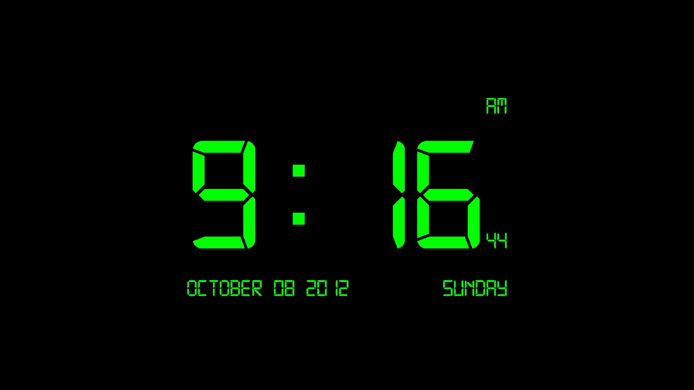
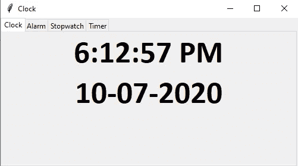

# 如何用 Python 制作时钟

> 原文：<https://blog.devgenius.io/how-to-make-a-clock-with-python-7587e107bb5e?source=collection_archive---------0----------------------->

如何用 Python 和 Tkinter 制作时钟？

来自谷歌图片的数字时钟

我们现在将制作一个支持闹钟、秒表和计时器的数字钟。它使用 Python 3。当闹钟和定时器的时间到了，它也会发出嘟嘟声。这种蜂鸣声是由 winsound 产生的。windows 中的“Beep()”和 Unix 中的“Beep”CLI。这是它的演示。

时钟演示

首先创建一个名为“Clock.py”的文件，并在编辑器中打开它。

# **导入模块**

导入以下模块。

这里我们已经导入了 Tkinter、datetime、platform(用于确定 Beep 的操作系统)、winsound(仅 Windows)、os(仅 Unix)。

# **制作一个窗口**

我们现在将创建一个 tkinter 窗口。

我们在这里做了一个简单的窗口。我们已经声明标题为“时钟”。并将其大小设置为“500X250”

# **添加 Tkinter 选项卡控件**

要添加选项卡控件，我们可以使用 Tkinter Notebook。这里我们将添加四个标签，分别用于时钟、闹钟、秒表和计时器。

我们为每个标签使用框架，然后将它添加到笔记本中。

# **创建时钟**

我们现在将创建一个数字时钟。

**添加时钟 Tkinter 组件**

我们现在将为时钟添加 tkinter 组件。

这里我们添加了两个标签，时间和日期。两者都将从功能时钟获取数据。

**制作时钟功能**

我们现在将制作一个控制时间和日期标签的时钟函数。

在这个函数中，日期和时间从 datetime 模块中获取，然后转换成 PM 和 AM 时间。你得把这个函数加在 Tkinter 初始化下面，笔记本初始化上面。

# **创建报警**

我们现在将创建一个闹铃，当时间到了，它会发出嘟嘟声。

**添加报警 Tkinter 组件。**

在这里，我们添加了一个“获取警报”输入框，警报说明告诉我们以这种格式设置警报→ HH:MM (PM/AM)。Eg 01:30 PM 表示 13:30 小时。然后设置报警按钮，调用报警功能。和警报状态标签显示关于警报、警报是否被设置以及大约时间到了。

**制作报警功能**

这里我们将创建一个由 set_alarm_button 调用的报警功能。将此功能添加到笔记本初始化之上和时钟功能之下。

这里，它从 datetime 模块中获取时间并对其进行格式化。然后检查输入的时间是否相同。如果相同，则根据操作系统发出蜂鸣声。

# **制作秒表**

我们现在将在我们的程序上制作一个秒表。

**添加秒表 Tkinter 组件**

我们现在将添加秒表的 tkinter 组件。

这里有一个秒表标签，启动，停止，重置按钮，调用秒表功能。

**添加秒表计数器功能**

我们现在将添加操作秒表的秒表计数器功能。首先我们将添加两行秒表计数器。将这些添加到 Tkinter 初始化下面和 Clock 函数上面。

这些线条告诉我们秒表的情况。现在我们将添加秒表计数器功能。加在报警功能下面，笔记本初始化上面。

操作秒表的是秒表计数器。它每一秒钟给秒表计数器 num 加 1。

**添加秒表功能**

现在我们将添加秒表功能，它控制秒表并由秒表按钮调用。

在此功能中，如果工作开始→它调用秒表计数器并将秒表运行设置为“真”。如果是停止→它将秒表运行设置为“假”。如果它被复位→它将计数器 num 设置为 66600 或 0，并运行到“假”

# **制作定时器**

我们现在要做一个计时器，当时间到了的时候会发出哔哔声。它的工作原理是秒表，但它不是在计数器中加 1，而是从中减 1。

**添加定时器 Tkinter 组件**

我们现在将添加定时器的 tkinter 组件。

这有一个 get Timer 条目，它告诉我们必须以这种格式设置计时器→ HH:MM:SS Eg → 01:30:40 表示 1 小时 30 分 40 秒。然后是启动，停止，复位按钮，调用定时器功能

**增加计时器功能**

我们现在将添加操作定时器的定时器计数器功能。首先我们将添加两行计时器。将这些添加到秒表的两条线下面和时钟功能上面。

这几行告诉我们关于计时器的事情。现在我们将添加计时器功能。将其添加到秒表功能下方和笔记本初始化上方。

操作计时器的是计时器计数器。它每一秒钟将定时器计数器 num 减 1。

**增加定时器功能**

现在我们将添加定时器函数，它控制定时器并由定时器按钮调用。

在这个函数中，如果工作开始→它获取定时器条目文本并格式化它，然后将定时器计数器设置为格式化的文本，调用定时器计数器并将定时器运行设置为‘真’。如果停止→它将计时器运行设置为“假”。如果它被复位→它将计数器 num 设置为 66600 或 0，并运行到“假”

# **启动时钟和 Tkinter**

现在是最后一部分。我们将启动时钟和 tkinter 窗口。将这段代码添加到末尾。

它将启动时钟和 Tkinter 窗口。

# **完整源代码**

这是它的完整代码

> 现在你可以简单地从终端或命令行或你的 IDE/编辑器运行你的代码。会有用的。