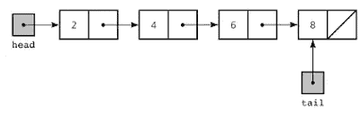
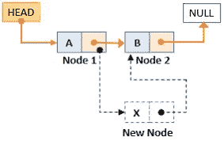
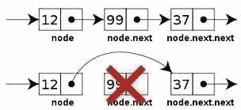

# 如何制作自定义 LinkedList？

> 原文：<https://blog.devgenius.io/how-to-make-a-custom-linkedlist-3deee9d5d9e4?source=collection_archive---------0----------------------->


数据结构被认为是你作为软件开发人员编写的每个程序的核心，也是你每次技术面试的主要部分。在这篇文章中，我们将讨论最常见的数据结构，链表，它与普通数组的速度比较，并创建您自己的自定义链表，以便更好地理解它的工作。

**一些背景检查:让我们来谈谈它是什么，它的性能比普通数组好在哪里。**

要回答这个问题，我们必须知道它看起来像什么，链表与数组非常相似，唯一的区别是元素不是存储在连续的内存块中，它们可以出现在计算机内存中的任何随机位置。



元素可以存储在内存中的任何地方，为了遍历列表，我们需要每个条目(称为节点)的地址。

这个地址与实际数据(整数、字符串或任何您想要的东西)一起存储在每个节点中。链表中的每个节点都有一个指向下一个节点的地址(在双向链表中也有一个指向上一个节点的地址)。

那么，怎么比正常列表好呢？

这取决于你的程序做得最多的是什么，是列表修改优先于你，还是从列表中检索数据优先于你。

1.  如果您的程序经常从列表中检索数据，那么您可以使用普通数组。我们知道项目的索引，使用索引从数组中获取数据通常比在链表中更快。O(1)如果你在 java 中使用数组列表。(恒定的时间复杂度，这是最好的)。
    链表就不一样了，因为在这种情况下你不知道条目的索引，你必须从头开始遍历，直到找到你要找的条目。(O(n)，如果项目在列表的最后，这是最坏的情况)。
2.  如果你的程序更侧重于列表修改，链表是你正确的选择。
    linked list 的操作比 ArrayList 的操作**快**，因为它使用双向链表，所以在内存中不需要移位。

# 如何创建自己的链表？

在这里找到源代码:[https://github . com/yudi 43/Data-Structures-Implementations/tree/master/linked list-Implementation/src](https://github.com/yudi43/Data-Structures-Implementations/tree/master/LinkedList-Implementation/src)

让我们专注于创建一个单链表，以便更清楚地了解它是如何工作的以及它是什么。我在这里使用 Java 来实现它，但是你可以在你选择的语言中应用相同的概念。

我们制作的链表将具有以下功能:

*   向列表中添加元素。
*   在列表开头添加元素。
*   在列表的某个特定索引处添加元素。
*   从特定索引中删除元素。
*   显示列表。

在整篇文章中，请记住链表是一个节点列表，一个节点包含下一个元素的**数据**和**地址**。

注意:因为我们在这里使用的是 java，所以地址不是指针，而只是对另一个节点对象的引用。

我们将需要三个基本类来实现和测试我们的自定义链表。

*   Runner 类:它包含了我们将要测试我们编写的代码的 main 方法。
*   CustomLinkedList 类:实际的链表类，你在这里的原因。
*   节点类:基本项目，基本上是我们一直在处理/操作的东西。

## 跑步者类别:

Runner 类只不过是一个保存主要函数的类，如下所示:

```
**public class Runner {
    public static void main(String[] args) {
        CustomLinkedList list = new CustomLinkedList();

        //Below are some examples of what we will be doing here...**  **list.insert(12);
        list.insert(43);
        list.insertAtStart(191);
        list.insertAt(2, 2222);
        list.deleteAt(2);
        list.show();
    }
}**
```

## 节点类:

如前所述，节点对象保存两样东西，数据本身和下一个节点的地址。(它只不过是另一个节点对象)，如下所示:

```
**public class Node {
    int data; //Data in the current node
    Node next; //Reference for the next node

    //Constructor which takes an int value which is stored as the    data in this Node object.
    Node(int data) {
        this.data = data;
    }
}**
```

## CustomLinkedList 类:

这个类的对象只包含一个名为“head”的实例变量，这是链表中的第一项。使用这个头，我们可以遍历整个列表，因为每个下一项都有一个指向它的下一项的地址，最后一项的下一项是 null。

这个类的基本结构如下所示:

```
**public class CustomLinkedList {
    Node head;
}**
```

它里面会有很多函数，我们会一个一个的讨论。

**插入(int 数据)；(**向列表添加元素 **)**
如何处理:我们需要在列表的末尾添加一个元素，除了列表为空的情况。我们遍历列表直到结束(直到我们在某个节点中发现 null 作为地址),并将其地址设置为我们想要添加的新节点。该函数如下所示:

```
**public void insert(int data) {
    Node newNode = new Node(data);
    if(head == null) {
        head = newNode;
    }else {
        Node currentNode = head;
        while(currentNode.next != null) {
            currentNode= currentNode.next;
        }
        currentNode.next = newNode;
    }
}**
```

**insertAtStart(int data)；(**在列表开始处添加元素 **)**

如何处理:这里我们只需要处理一种情况，即新节点成为链表的头。我们可以这样做:

```
**public void insertAtStart(int data) {
    Node newNode = new Node(data);

    newNode.next = head;
    head = newNode;
}**
```

我们将头节点设置为新节点的下一个节点，并将新节点设置为新头节点。

**insertAt(int index)；(**在列表的某个特定索引处添加元素 **)**

如何处理:这样想，如果你想把一个元素放在索引 1，新元素将出现在索引 0 和索引 1 的元素之间。(索引 0 处的项目将停留在索引 0 处，而索引 1 处的项目将移动到索引 2，以便为新元素腾出空间)。



因此，我们需要遍历列表，直到到达 index-1 位置的元素，因为新的项目将紧随其后。到达这个位置后，我们将该元素的 next 属性设置为新节点，并将新节点的 next 属性设置为 index，well，index(给定输入)处的项。下面的函数将使它变得清晰。

```
**public void insertAt(int index, int data) {
    if(index == 0){
        insertAtStart(data); //We already have a function to do this.
    }else{
        Node newNode = new Node(data);

        Node** currentNode **= head;
        for(int** i **= 0;** i **< index - 1;** i**++) {** currentNode **=** currentNode**.next;
        }
        newNode.next =** currentNode**.next;** currentNode**.next = newNode;
    }
}**
```

**delete at(int index)；**从特定索引中删除元素。



如何处理:要删除某个给定索引处的元素，我们需要转到 index-1 位置，并将该节点的 next 设置为给定索引上的下一个元素。通过这样做，我们可以绕过图中所示的地址，并且该索引处的项目符合垃圾收集的条件，下面的函数可以做到这一点:

```
**public void deleteAt(int index) {
    if(index == 0) {
        head = head.next;
    }else{
        Node** currentNode **= head;
        for(int** i **= 0;** i **< index - 1;** i**++) {** currentNode **=** currentNode**.next;
        }** currentNode**.next =** currentNode**.next.next;
    }
}**
```

**秀()；**显示列表:

最后，一个功能来测试我们做了什么，如果它的工作！

我们只是遍历列表并打印里面的每个元素。

```
**public void show() {
    Node** currentNode **= head;
    if(**currentNode **== null){
        System.*out*.println("Linked list is empty");
    }
    else {
        while(**currentNode **!= null) {
            System.*out*.print(**currentNode**.**data **+ " ");** currentNode **=** currentNode**.next;
        }
    }
}**
```

## 现在，让我们做一些测试！

转到 Runner 类中的 main 方法，用我们刚刚做的东西玩一玩。

下面是示例测试，控制台输出在函数调用旁边的注释中。

```
**public class Runner {
    public static void main(String[] args) {
        CustomLinkedList list = new CustomLinkedList();
        list.insert(12); //12
        list.insert(43); //12 43
        list.insertAtStart(191); //191 12 43
        list.insertAt(2, 2222); //191 12 2222 43
        list.deleteAt(2); //191 12 43
        list.show();
    }
}**
```

恭喜，你刚刚做了一个链表。现在你已经准备好回答技术招聘人员最常问的问题，“你能给我做一个链表吗？”

在这里找到源代码:[https://github . com/yudi 43/Data-Structures-Implementations/tree/master/linked list-Implementation/src](https://github.com/yudi43/Data-Structures-Implementations/tree/master/LinkedList-Implementation/src)

觉得有用？分享，按下拍手按钮。

别忘了你可以按那个按钮 50 次。

谢谢你，祝你愉快。编码快乐！