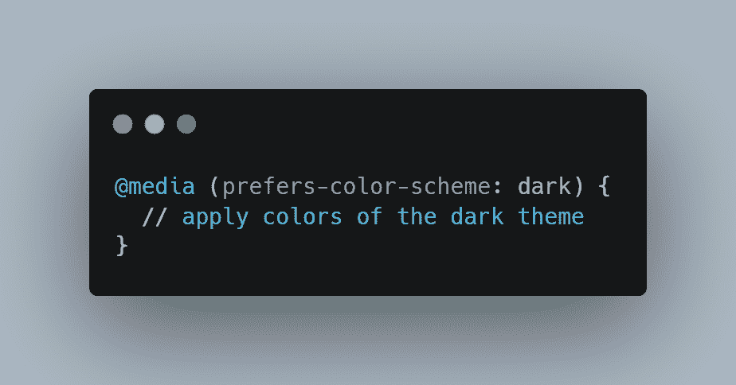
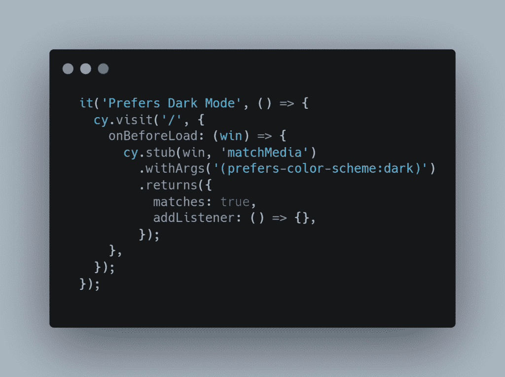
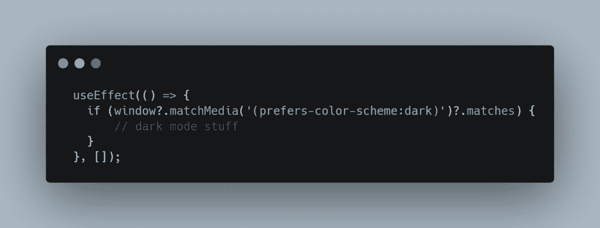
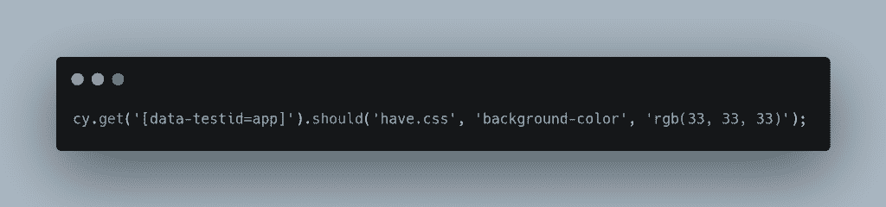

# 如何做一个柏树测试的偏好-配色方案:黑暗

> 原文：<https://blog.devgenius.io/how-to-make-a-cypress-test-for-prefers-color-scheme-dark-42337138f727?source=collection_archive---------7----------------------->

特里·维里斯迪斯在 [Unsplash](https://unsplash.com/) 拍摄的照片

在页面加载之前考虑用户的偏好变得越来越重要，以提供开箱即用的最佳体验。其中一个选项是`prefers-color-scheme`的 CSS [媒体功能](https://developer.mozilla.org/en-US/docs/Web/CSS/@media/prefers-color-scheme)。这可以通过操作系统或用户代理设置来设置。

下面是一个如何通过 CSS 设置黑暗模式的例子:

CSS 黑暗模式

作为题外话，我还有一篇关于如何在 React 中使用 CSS 变量快速设置黑暗模式的文章，点击[查看。](https://relatablecode.com/how-to-easily-add-dark-mode-to-a-react-app/)

# 柏树试验

[Cypress](https://www.cypress.io/) 是一个测试框架，让开发端到端测试变得超级简单有趣！Cypress 提供了一个在页面加载前设置变量的函数！我们可以用它来提前设置黑暗模式的偏好。

赛普拉斯黑暗模式测试

当我们访问根页面时使用`onBeforeLoad`函数，我们可以改变与`matchMedia`函数交互时发生的事情。 [matchMedia](https://developer.mozilla.org/en-US/docs/Web/API/Window/matchMedia) 是 window 对象上的一个方法，可以检查配色方案是否为深色。在我的应用程序中，当应用黑暗模式时，我使用一个钩子来检查这一点，因为它被设置为我的全局存储中的一个变量:

设置黑暗模式的挂钩

整洁！好了，Cypress 测试的以下部分可以直接查看页面的不同 CSS 属性，以确保所有内容都被正确应用:

CSS 属性的附加测试

举个例子，这个应用是我的应用的整体包装。给它一个数据测试 id，然后我测试我的黑暗模式的颜色。对于正在设置的所有不同类型的黑暗模式属性，这可以重复几次！

就是这样！如果你有任何问题或任何其他测试黑暗模式的首选方法，请在下面的评论中告诉我！

更多内容见[相关代码](https://relatablecode.com/)

*原载于 2021 年 12 月 19 日*[*【https://relatablecode.com】*](https://relatablecode.com/how-to-make-a-cypress-test-for-prefers-color-scheme-dark/)*。*