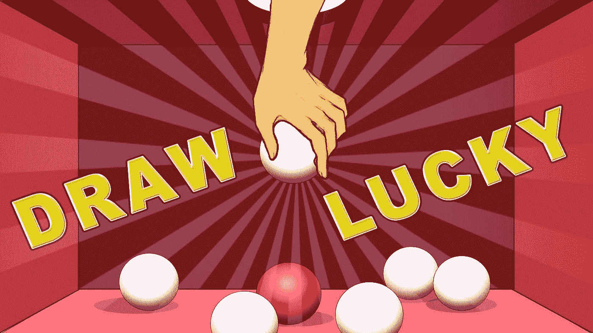

# 如何用 Python 制作幸运抽奖

> 原文：<https://blog.devgenius.io/how-to-make-a-lucky-draw-in-python-b9735a50bbe1?source=collection_archive---------8----------------------->

*同时保证随机性和公平性*



图片来自[https://www.microsoft.com/en-id/p/draw-lucky/9mv2tj823b1h?active tab = pivot:overview tab](https://www.microsoft.com/en-id/p/draw-lucky/9mv2tj823b1h?activetab=pivot:overviewtab)

我们都喜欢抽奖，尤其是当我们是幸运儿的时候。有许多关于一些周年聚会中的幸运抽奖被其他人质疑公平性的故事，甚至还有开发者在现场审查幸运抽奖代码的照片。

# 履行

假设您有 10 个人参与抽奖，用 Python 制作抽奖的最简单方法是生成一个随机数，如下所示:

```
import random
lower_limit = 1
upper_limit = 10
result = random.randint(lower_limit, upper_limit)
print(result)
```

在上面的代码中，数字将从 1 和 10 中选择，包括 1 和 10。你需要事先给每个人分配一个号码，在我们的例子中，我们简单地使用群聊中的出现顺序，这是根据加入群的时间来确定的。

但是这种方法有一个问题，除非你在所有 10 个人面前运行这段代码，否则不能保证你运行了多次并选择了最喜欢的结果来发布。

一个可能的解决方案是在指定的时间运行上面的代码，这样你就不可能多次运行它，另外，当人们能够看到倒计时时，他们会更加兴奋。

所以我们首先需要把一个给定的字符串解析成一个时间对象:

```
import datetime
at_time = '16:00'
at_time = datetime.datetime.strptime(at_time, '%H:%M').time()
at_time = datetime.datetime.combine(datetime.datetime.now().date(), at_time)
```

注意，我花了几个步骤才得到今天`16:00`的正确时间，因为`datetime.datetime.strptime(at_time, ‘%H:%M’)`实际上会返回`1900-1-1`的时间。

我们还想知道现在是什么时间:

```
cur_time = datetime.datetime.fromtimestamp(int(datetime.datetime.now().timestamp()))
```

代码`datetime.datetime.now()`实际上返回精确到微秒的当前时间，这在这种情况下是不必要的，因此为了简单起见，我们需要去掉小数部分。

现在我们可以将初始代码修改成这样:

```
import random
import datetime
import timelower_limit = 1
upper_limit = 10at_time = '16:00'
at_time = datetime.datetime.strptime(at_time, '%H:%M').time()
at_time = datetime.datetime.combine(datetime.datetime.now().date(), at_time)cur_time = datetime.datetime.fromtimestamp(int(datetime.datetime.now().timestamp()))while cur_time<at_time:
    remain_sec = (at_time - cur_time).seconds
    print(f'{remain_sec} seconds to go')
    time.sleep(1)
    cur_time = datetime.datetime.fromtimestamp(int(datetime.datetime.now().timestamp()))
print('time up! here goes ...')
result = random.randint(lower_limit, upper_limit)
print(f'the winner is {result}!')
```

# 结论和挑战

通过上面的练习，我们学到了两件事:

1.  复杂的问题通常有简单的解决方案，在这种情况下，定时解决方案既简单又优雅。
2.  Python 中的日期和时间操作可能非常棘手。

当然，上面的代码远非完美(也取决于你对完美的定义)，我们有几种方法可以改进它:

1.  将其包装在一个函数中以简化调用。
2.  默认情况下，允许传递一个`in_min=1`来倒计时一分钟，而不是传递一个时间字符串，比如`16:00`。
3.  不要使用`upper_limit`和`lower_limit`数字，允许传递一系列数字甚至名字作为参与者。
4.  不是只产生一个赢家，而是允许一次产生多个赢家，产生的顺序很重要，以区分第一价格、第二价格、第三价格等。

如果你感兴趣，我会把挑战留给用户，如果你愿意，在这里张贴你的答案或问题。