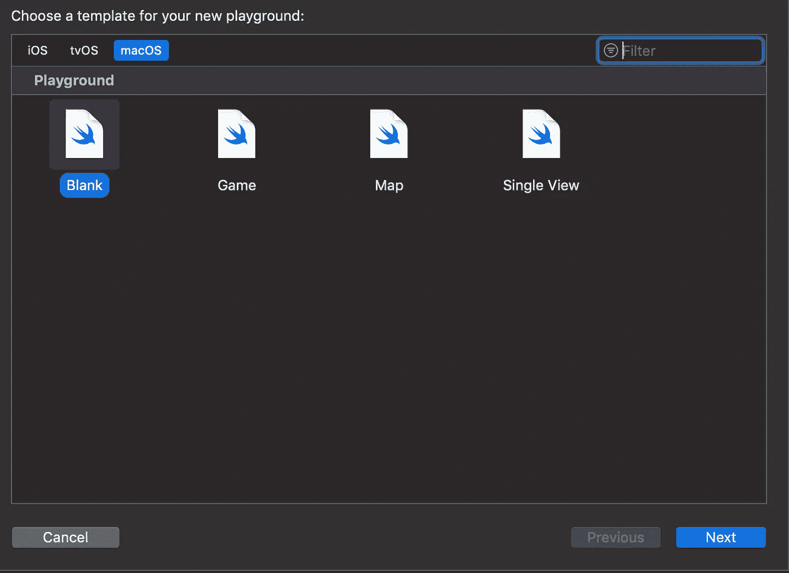
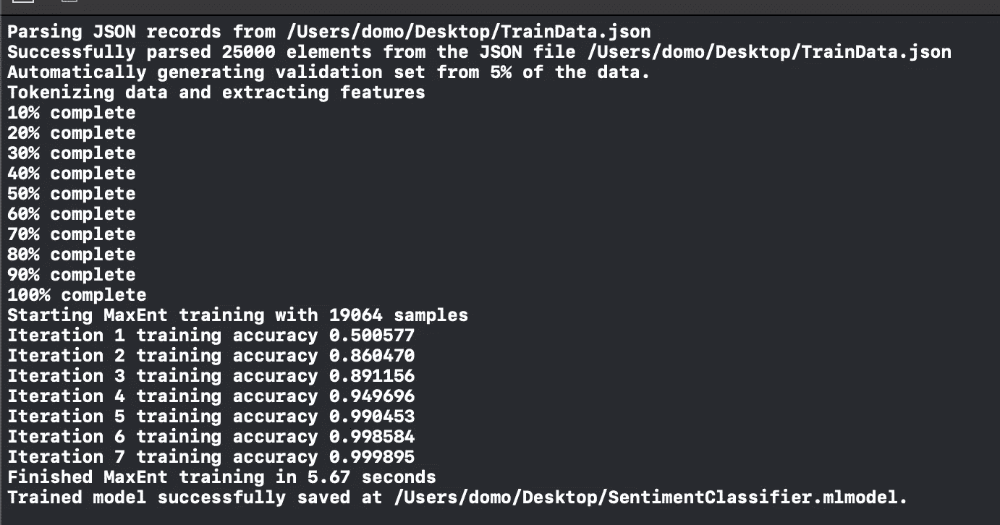
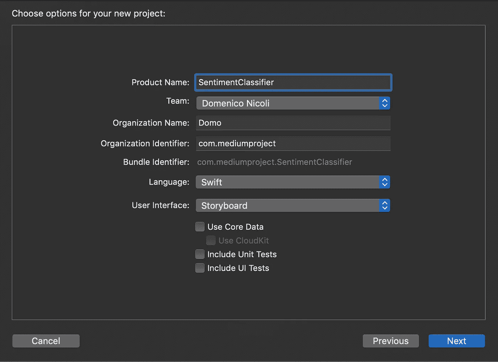
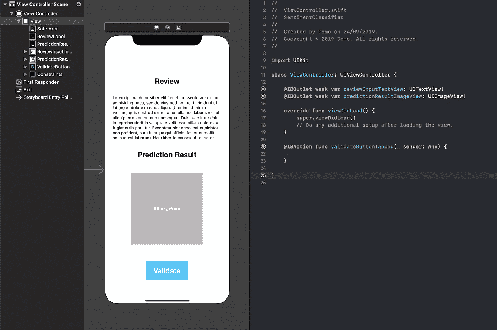
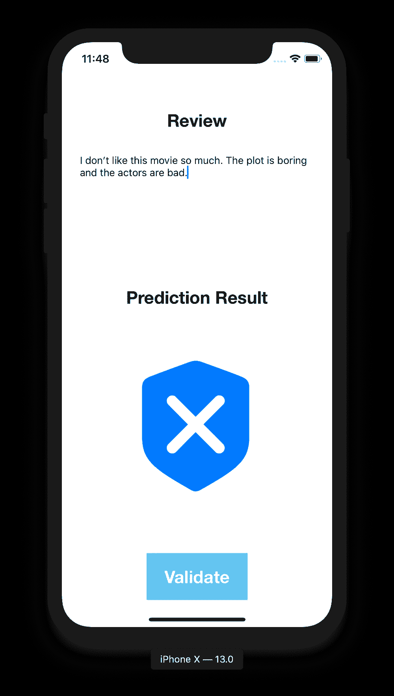
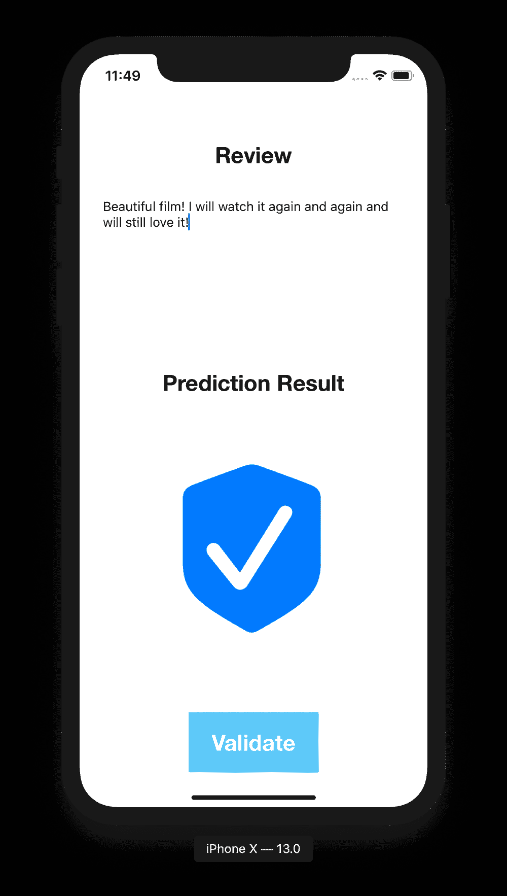

# 如何在 Swift 中制作电影评论情感分析器

> 原文：<https://blog.devgenius.io/how-to-make-a-movie-reviews-sentiment-analyzer-in-swift-ab659fabaecf?source=collection_archive---------3----------------------->

## 用机器学习理解影评情绪！

照片由[卢卡·布拉沃](https://unsplash.com/@lucabravo?utm_source=medium&utm_medium=referral)在 [Unsplash](https://unsplash.com?utm_source=medium&utm_medium=referral) 拍摄

在这篇文章中，我们将从头开始创建一个 iOS 应用程序和一个机器学习模型，它能够**理解人们对一部电影的情感**，仅仅通过评论文本。你认为很难吗？多亏了最新的苹果 ML 框架，它将只需要 10 分钟！

# 模型创建

首先，我们的 app 需要一个机器学习模型！您可能知道，要创建一个**好的模型，我们需要大量的数据**，因此，我们将使用[来自 **Kaggle** 的这个](https://www.kaggle.com/oumaimahourrane/imdb-reviews)数据集。该数据集包含一组 25，000 条电影评论，基本上有两列:用户评论和二元(负面或正面)情感分类。然后，我们的[**mltext classifier**](https://developer.apple.com/documentation/createml/mltextclassifier)算法学习**将标签**(在我们的情况下是负面/正面情绪)与输入文本的特征(我们将从我们的应用程序插入的新评论)相关联，输入文本可以是**句子、段落，甚至是整个文档**。

下载该文件，并使用类似于[的网站将`*.csv*`转换成`*.json*`文件，我们将在下一步中需要它来**训练**我们的机器学习模型！](https://www.csvjson.com/csv2json)

现在打开 Xcode Playground，选择 **macOS** 然后**空白项目**。

粘贴下面的代码，我们将使用它来训练我们的模型，并将 **##PATH##** 替换为您之前保存`*.json*`文件的路径。

现在执行**操场**上的代码。如果一切按预期进行，你应该在**输出控制台**上看到以下信息:

此外，现在应该创建新的`**SentimentClassifier.mlmodel**`。

# 应用程序创建

现在在 Xcode 上创建一个新的单视图应用程序项目。

在您的项目上导入`**SentimentClassifier.mlmodel**` 。

创建一个简单的接口，**将得到一个评论作为输入**和**返回一个图像**用于负/正预测。

现在将下面的代码复制到您的`**ViewController.swift**`文件中。在详细的这段代码中，当你点击 **Validate** 按钮时，它调用自然语言**[**predicted label 方法**](https://developer.apple.com/documentation/naturallanguage/nlmodel/2980910-predictedlabel)**返回正/负预测**，然后我们的代码**更新图像**。**

# **准备好了吗**

**我们做到了！最后一步是**跑项目，试着写一篇综述**！**

**下面你可以找到一些结果作为例子:**

********

**第一屏为负预测，第二屏为正预测**

****

****你可以在这里** **找到完整的代码** [**。**](https://github.com/domeniconicoli/SentimentClassifier/tree/master)**

****如有任何问题或建议，请在**下方留言评论！**