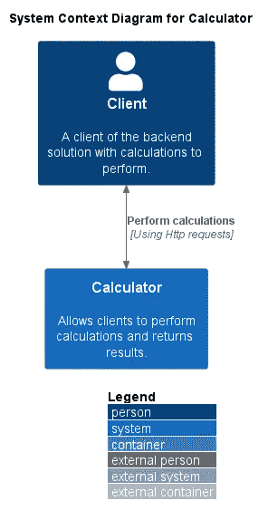
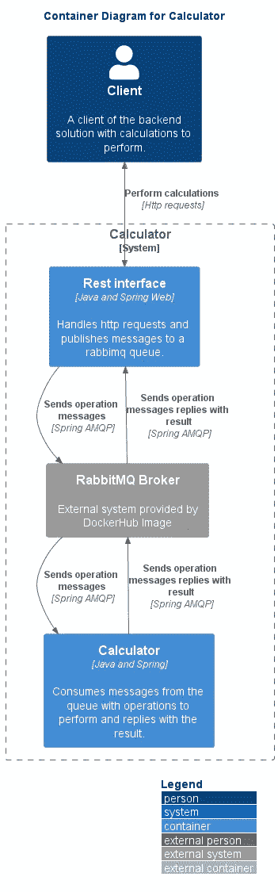

# 如何制作多模块 Spring Boot 应用程序 REST + RabbitMQ —第 1 部分

> 原文：<https://blog.devgenius.io/how-to-make-a-multi-module-spring-boot-application-rest-rabbitmq-part-1-191aa22318f0?source=collection_archive---------18----------------------->

使用 Spring Boot 迈出开发应用程序的第一步…

# 介绍

这个故事将开始一系列的故事，将展示一个迷你项目的发展，项目的目的从高层次的角度来看是简单的，执行计算。我们将使用这个故事来详细说明 Spring 提供给我们的不同功能，并希望它可以帮助任何读者获得更多的见解或新的想法来开发您的代码。在本系列的最后，代码将被共享，这样您就有机会使用它并使它适应您的需要(如果是这样的话)。

在整个故事中，你将有机会看到一堆图表，这个故事中显示的图表都是使用 [C4 模型符号](https://c4model.com/)制作的，如果你感兴趣，一定要检查一下！

# 语境

最近，我有机会使用 spring boot 做了一个小的后端项目，展示了一个使用 REST 控制器接收计算的计算器。该计算器依靠消息通信技术(RabbitMQ)与另一个负责任意精度计算的模块交换操作消息。然后，这些模块将通过消息传递来传递结果，这些结果稍后将显示在 REST 控制器返回的响应对象中。

# 索引

*   **要解决的问题**
*   **发展途径**
*   **域逻辑**
*   **项目开发**
*   **创建休息控制器**
*   **发送内容类型为 Json 的响应**

# 要解决的问题

就业务需求而言，此解决方案需要解决的问题有:

*   任意精度计算；

技术限制是:

*   多模块项目；
*   使用 RabbitMQ 交换消息；
*   记录请求；
*   在请求/响应的报头中生成唯一标识符；

下图显示了我们打算构建的基本环境:

系统上下文图。

正如你从上面的图片中看到的，从外部的角度来看，我们只是在做一个简单的计算器，它将能够为我们执行基本的计算。我们知道它将通过 HTTP 请求进行通信，但除此之外，仅此而已。从某个地方开始很重要，因此这是我们打算构建的解决方案的更大图景。

# 开发方法

为了开发这个迷你项目，我们将使用 TDD，或者至少是一种更加测试驱动的方法。我们将总是在验收测试失败的情况下编写代码，这将确保用例尚未实现，然后我们开始越来越深入地研究代码，开发和单元测试系统的其他小部分，确保我们可以通过验收测试。确保我们有这样的东西，我们进入下一个验收测试，直到他们都完成了。拥有两种测试方法将对我们有益，因为一种将测试每个小功能的输入和输出，因为集成测试部分(在我们的情况下是验收测试)将确保我们不仅没有错误地构建，而且构建需要构建的内容。

# 领域逻辑

这个项目的开发所需的领域知识非常少，最多是对什么是任意精度算术的理解(顺便说一句，我不知道，所以我必须研究一下)。但是作为一个快速而实用的定义，它可以被描述为以非常高的精度执行计算，因为你可以超越一些传统类型如 Integer(Java)的限制。
在我们的应用程序中，我们将使用 java.math 包提供的 BigInteger 类。关于可配置的精度，我们将利用 MathContext 对象。

# 开发解决方案

这个项目的开发始于一个多模块项目的创建。实际上，我们所做的是创建一个单模块项目，然后在 pom.xml 中添加一个模块，并创建正确的文件夹。对于这类项目的一般 kickstart，我们可以使用 [spring kickstarter 网站](https://start.spring.io/)。

由于我们正在进行一个多模块项目，让每个模块处理不同的职责是有意义的，记住我们确定其中一个将解决计算问题，另一个将强调请求的处理(在这种情况下，我们只考虑其余的)。此外，从消息传递的角度来看，其中一个模块是消息的消费者，另一个是消息的发布者(因为这些模块使用 RabbitMQ 消息传递相互通信)。

此时此刻，我们心中应该有这样一幅画面:

该项目的容器图。

尽管我们有图中描述的 RabbitMQ 代理，但我们必须明白它不会在这个项目中实现。这是从 [docker hub](https://hub.docker.com/_/rabbitmq/) 检索的 docker 图像，这就是为什么在图像中它被表示为灰色。

因此，正如在开发方法部分已经描述的，我们将从创建一个测试开始。我们不打算达到容器图中所描述的精确程度，但是我们将开始构建各个部分。我们相信我们不会与最初的想法有太大的不同(需求没有给我们太多的选择)。在这种情况下，测试可以覆盖完整的用例，因此我们从测试 sum 端点的暴露开始(所有代码将在本系列故事的结尾共享):

为了模拟实际的 HTTP 请求，我们使用了[放心](https://github.com/rest-assured/rest-assured)我们调用了 sum 端点，并期望状态代码为 200，内容类型为 JSON，主体包含一个带有预期结果的结果字段。进行他们的第一次测试将允许我们设置第一次端到端交互工作所需的最基本的代码。

让我们将任务分解到最后:

*   创建 Rest 控制器；
*   用内容类型的 Json 发送响应；
*   具有包含计算结果的结果字段。

在下一节中，我们将从这些主题开始，继续开发这个解决方案。

# 创建休息控制器

当您使用 Spring Web 时，在 Spring 中创建 Rest 控制器很容易。下面的代码片段显示了:

在**第 1 行**中，我们指定这个组件是一个 RestController，这将确保它为我们提供一组构建 REST 接口所需的预构建功能，如果没有这个注释，Spring 将无法理解这个类应该处理 HTTP 请求。在**第 4 行**我们开始指定应该使用哪个 HTTP 动词，在本例中，我们创建了一个 GET 端点。这里有一个小剧透，之前已经透露了 BigDecimal( **line 5** )的用法，这是目前我们可以找到的开始回答任意计算问题的方法。为了结束 Rest 控制器的创建，我们需要解释 ResponseEntity 对象，该对象将允许我们根据需要配置响应，为我们提供非常有用的方法，我们将在本故事和接下来的故事中看到。如果你有兴趣了解更多关于 Rest 控制器的知识，请随意查看官方教程[这里](https://spring.io/guides/tutorials/rest/)。

# 用内容类型的 Json 发送响应

为了设置请求的内容类型，我们使用一个非常方便的参数，该参数由定义 HTTP 动词的注释提供:

如果你看一下**第 1 行**，现在我们开始使用 produces 参数来设置我们想要发送回客户端的响应类型。

# 结论

在这个故事中，我们在春天开始了一个迷你项目的开发，我们希望这是一系列其他的故事，所以请务必继续查看更多！我们将尽可能多地描述开发这个项目所采取的不同步骤。在本系列的最后一个“部分”中，您将有机会获得代码并亲自探索它。除了查看代码，这些故事的目的还在于提供一些关于使用什么代码来解决特定问题的见解，以便您可以适应自己的需求。感谢您花宝贵的时间阅读这个故事，我们希望它能对您有所帮助。如果您有任何反馈，请务必使用下面的评论。如果你喜欢这个故事，鼓掌，如果你想继续关注这个和其他类型的故事，也可以随意关注。

# 参考

 [## 弹簧初始化 r

### Initializr 生成的 spring boot 项目正好是你快速启动所需要的！

start.spring.io](https://start.spring.io/)  [## 软件体系结构可视化的 C4 模型

### 为了创建这些代码图，我们首先需要一组通用的抽象来创建一种无处不在的语言…

c4model.com](https://c4model.com/)  [## Rabbitmq -官方图片| Docker Hub

### RabbitMQ 是一个开源的多协议消息传递代理。

hub.docker.com](https://hub.docker.com/_/rabbitmq/)  [## GitHub -放心/放心:Java DSL 用于 rest 服务的简单测试

### 用 Java 测试和验证 REST 服务比用 Ruby 和 Groovy 等动态语言更难。休息…

github.com](https://github.com/rest-assured/rest-assured)  [## 用 Spring 构建 REST 服务

### REST 已经迅速成为在 web 上构建 web 服务的事实上的标准，因为它们易于构建并且…

spring.io](https://spring.io/guides/tutorials/rest/)