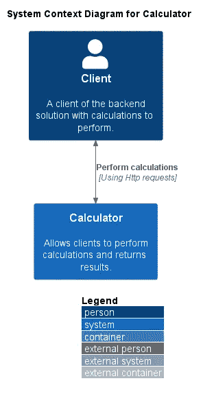

# 如何制作多模块 Spring Boot 应用程序 REST + RabbitMQ —第 6 部分

> 原文：<https://blog.devgenius.io/how-to-make-a-multi-module-spring-boot-application-rest-rabbitmq-part-6-e02e6af8498c?source=collection_archive---------11----------------------->

在本系列的最后，我们将看看我们的应用程序将增加的一些额外特性…

> TLDR:在 RabbitMQ 中配置 RPC 放置一个拦截器；解决问题。

# 介绍

本文是这个系列的第六篇也是最后一篇。今天我们将关注:

*   如何接近 RabbitMQ RPC 配置？
*   为返回给客户机的不同请求创建一个 requestId。
*   结束对困扰我们一段时间的问题的调查。

如果你想查看之前的故事，可以在这里找到。

必须提到的是，这篇文章是根据我在试验不同的应用程序和小型个人项目时的个人经验撰写的。这里采取的决定是有争议的，可能会根据您的要求而改变。其他因素也可能是对技术栈或问题的更好理解。

对于第一次阅读这篇文章的人来说，让我来介绍一下我们在这里试图构建的内容的总体环境图。在之前的文章中，这要详细得多，但我们希望这也足以让您开始:



系统上下文图。

# 索引

*   **在 RabbitMQ 中配置 RPC**
*   **创建一个唯一的 requestId 以帮助不同请求的可追溯性**
*   **重复键调查**
*   **编码和进一步工作**

# 在 RabbitMQ 中配置 RPC

在我们配置了 rabbitMQ 组件并测试了它们之间的消息发送之后，是时候再看一下代码了。现在我们将理解 rest 和计算器模块之间的 RPC 通信。

我们将从提供某种对 RPC 代表什么的理解开始。RPC 代表远程过程调用，当我们实现它时，我们得到的是发送一个请求并等待来自另一个组件(在我们的例子中是计算器)的响应。我们还应该考虑仔细检查计算器返回的消息，这样我们就可以确定我们得到的是来自的回复或实际的请求，而不是任何其他的。没有进一步的原因，让我们跳到实现:

让我们了解一下这些台词，好吗？这是 REST 模块端的实现，对于配置 RabbitMQ 本身，您可以查看本系列之前的其他内容。关于这个片段:

*   **第 12 行**——我们构建想要发送给计算器的消息。
*   **第 16 行**——我们发送消息并等待响应。
*   **第 18 行** -我们确认消息是否不为空。
*   **第 25 行** -我们添加了一个逻辑，通过检查我们发送的 **correlationID** 是否与我们收到的结果消息相同，来验证是否正确分配给我们的消息。
*   **第 26 行**——我们将消息转换成 OperationMessage 对象。

让我们引入计算器模块逻辑来接收和回复这些消息:

该片段的亮点如下:

*   **第 15 行** -监听队列的配置。
*   **第 19 行** -转换成 OperationMessage 对象。
*   **第 21 行** -执行计算并填充结果属性。
*   **第 22 行**——我们将 OperationMessage 转换成一个消息对象。
*   **第 29 行**——我们将回复发送回 rest 模块。

这些步骤结束了关于 RPC 通信配置的这一部分。

# 创建一个惟一的 requestId 来帮助不同请求的可追溯性

在分布式系统中重建事件时，通常有帮助的特性之一是添加到日志消息中的唯一 id。这有助于我们，即使请求从一个组件跳到另一个组件，我们也可以依靠这个 requestId 来了解它在系统的不同组件中执行的不同操作，从而有助于监视系统，并在需要时有助于调查。已经说过，我们将向 rest 通信添加一个唯一的请求，我们不会传播到日志或组件之间，但这很容易成为将来要添加的特性之一。没有进一步的原因，让我们得到代码:

这个片段中的亮点是:

*   **第 2 行**——这里我们实现了 HandlerInterceptor，它为我们提供了在这种情况下唯一需要覆盖的方法。
*   **第 6 行**——我们实现了向响应对象添加唯一的 requestId，这可以通过简单地请求一个**随机 UUID** 来完成。

实现完成后，我们还需要注册拦截器。为此，我们只需要做以下事情:

展示完这些之后，我们就完成了 requestId 拦截器的配置。

# 重复关键调查

本节将描述我们在开发该解决方案的过程中解决的一个问题，我们希望它能对您有所帮助。

当这个项目的开发接近尾声时，这个错误被注意到了，并且它总是被保留在待解决的待办事项中，这一次我们开始看一看，看看可以做些什么来解决这个问题。

```
Caused by: java.lang.IllegalStateException: Duplicate key x-request-id (attempted merging values 3713146d-5dff-4ec4–8b11-b3b6b603d595 and 3713146d-5dff-4ec4–8b11-b3b6b603d595)
 at java.base/java.util.stream.Collectors.duplicateKeyException(Collectors.java:135)
 at java.base/java.util.stream.Collectors.lambda$uniqKeysMapAccumulator$1(Collectors.java:182)
 at java.base/java.util.stream.ReduceOps$3ReducingSink.accept(ReduceOps.java:169)
 at java.base/java.util.ArrayList$ArrayListSpliterator.forEachRemaining(ArrayList.java:1625)
 at java.base/java.util.stream.AbstractPipeline.copyInto(AbstractPipeline.java:509)
 at java.base/java.util.stream.AbstractPipeline.wrapAndCopyInto(AbstractPipeline.java:499)
 at java.base/java.util.stream.ReduceOps$ReduceOp.evaluateSequential(ReduceOps.java:921)
 at java.base/java.util.stream.AbstractPipeline.evaluate(AbstractPipeline.java:234)
 at java.base/java.util.stream.ReferencePipeline.collect(ReferencePipeline.java:682)
 at com.example.restCalculator.adapters.interceptor.RequestIdInterceptor.preHandle(RequestIdInterceptor.java:27)
 at org.springframework.web.servlet.HandlerExecutionChain.applyPreHandle(HandlerExecutionChain.java:148)
 at org.springframework.web.servlet.DispatcherServlet.doDispatch(DispatcherServlet.java:1062)
 at com.example.restCalculator.adapters.logging.LoggableDispatcherServlet.doDispatch(LoggableDispatcherServlet.java:33)
 at org.springframework.web.servlet.DispatcherServlet.doService(DispatcherServlet.java:963)
 at org.springframework.web.servlet.FrameworkServlet.processRequest(FrameworkServlet.java:1006)
 … 39 common frames omitted
```

经过一番调查，处理这一问题的代码看起来是这样的:

也许我们的句柄，处理捕捉方法调用和添加 **x-request-id** 被多次调用，使得这个 lambda 在执行“toMap”时失败，这将在处理键时产生冲突。在这一点上，解决方案更像是一种变通方法，即在“toMap”调用之前添加一个“distinct()”:

虽然问题的根本原因没有解决，但这是目前很好的缓解措施。

# 编码和进一步工作

正如前面所有文章中提到的，你可以在这里找到这个项目的代码:【https://github.com/xalves/arbitrary-precision-calculator

在未来，我们可能会添加更多的功能，我们将简要描述一些可能会为您的项目提供一些想法的功能，并介绍一些我们可能会做的进一步工作:

*   OperationMessage 的用法应该重新定义，我们将一个类复制了两次，这显然不是一个理想的方法。
*   将这个项目整合到一个管道中，以确保我们有回归，确保我们可以继续开发，一些基本的安全检查，代码气味等…
*   在创建管道的情况下，应添加基本的林挺检查，以便该项目的样式是标准化的。
*   可以实现潜在的部署(例如，暂存版本)。
*   可以使用其他类型的通信协议来提高该解决方案的性能。
*   仍然与性能有关，在某些情况下可以使用缓存。
*   在一些方法中执行验证，一些错误流在当前版本中没有覆盖。
*   异常流，确保我们向客户端提供正确的错误消息。
*   特别注意单元测试的覆盖率，确保我们有良好的单元覆盖率，这样我们仍然可以在使用 TDD 的新开发中前进。
*   集成测试仍然没有微调。
*   单元测试并不完全“单元化”,在某些情况下，我们仍然会遗漏一些模拟，现在这并不是什么大问题，但是如果测试逐渐增加，这将是简单构建时间的一个大问题。
*   这个项目出来是非常糟糕的记录，除了媒体上写的故事没有足够的文件。

# 结论

在本文中，我们通过为 requestID 配置一个拦截器来完成解决方案的开发，解释了我们如何在 rabbitMQ 中实现 RPC 调用，并解决了在我们的一些测试中出现的一个重复的关键问题。

这是本系列文章的结尾，我们可能会继续用这个代码库编写一些代码，但是使用任意精度计算器的目标被认为已经完成了。

本系列的其他文章部分可以在这里找到:

*   [如何制作多模块 Spring Boot 应用 REST + RabbitMQ —第一部分](/how-to-make-a-multi-module-spring-boot-application-rest-rabbitmq-part-1-191aa22318f0)
*   [如何制作多模块 Spring Boot 应用 REST + RabbitMQ —第二部分](https://blog.devops.dev/how-to-make-a-multi-module-spring-boot-application-rest-rabbitmq-part-2-38f8b7b2c077)
*   [如何制作多模块 Spring Boot 应用 REST + RabbitMQ —第三部分](https://xalves.medium.com/how-to-make-a-multi-module-spring-boot-application-rest-rabbitmq-part-3-a7aa08cd423e)
*   [如何制作多模块 Spring Boot 应用 REST + RabbitMQ —第四部分](https://medium.com/devops-dev/how-to-make-a-multi-module-spring-boot-application-rest-rabbitmq-part-4-e571c43b20bf)
*   [如何制作多模块 Spring Boot 应用 REST + RabbitMQ —第五部分](https://xalves.medium.com/how-to-make-a-multi-module-spring-boot-application-rest-rabbitmq-part-5-1b07df153c4)

该系统的整个开发是通过使用不同的测试来执行的，这些测试帮助我们通过了解代码更改对系统不同部分的影响来保持更改的可管理性。

感谢您花宝贵的时间阅读这篇文章，我们希望它能对您有所帮助。对于任何反馈，请务必使用下面的评论。如果你喜欢这篇文章，鼓掌，如果你想继续关注这篇文章和其他类型的文章，也可以随意关注。