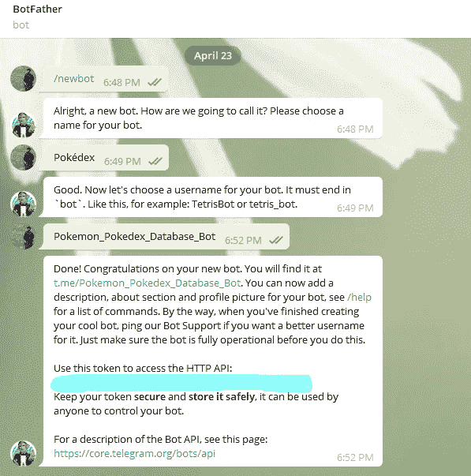
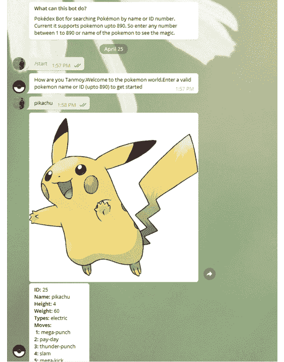

# 如何用 Python 制作 Telegram Pokédex Bot

> 原文：<https://blog.devgenius.io/how-to-make-a-telegram-pok%C3%A9dex-bot-using-python-ce2497203636?source=collection_archive---------2----------------------->


Thimo Pedersen 在 [Unsplash](https://unsplash.com?utm_source=medium&utm_medium=referral) 上拍摄的照片

对于我们 90 年代的孩子来说，口袋妖怪是一个充满情感的领域。我仍然记得我是多么疯狂地收集口袋妖怪卡片，在电视上看口袋妖怪系列，在学校参加想象中的口袋妖怪战斗。于是，我想到了做一些和口袋妖怪有关的东西。从那时起，制造类似 Pokedex 机器人的想法出现了。对于那些不熟悉 Pokedex 的人来说，它是一个保存与口袋妖怪相关信息的数字工具。在考虑为哪个平台制作机器人时，我认为 Telegram 是一个很好的选择。Telegram 现在是一个庞大的社区，而且只会日益壮大。所以让我们开始制作这个机器人。

## 口袋索引数据库:

我们必须解决的第一个挑战是我们如何获得这么多口袋妖怪的所有信息。幸运的是，我们的工作变得简单了。口袋妖怪粉丝为我们建立了一个口袋妖怪 API，我们可以免费使用。这个 [**PokeAPI**](https://pokeapi.co/) 为我们提供了一个 **RESTful API** ，可以用来为我们的项目生成所有的口袋妖怪信息。要了解更多关于 RESTful API 的信息，你可以看看这个 [**视频**](https://www.youtube.com/watch?v=SLwpqD8n3d0) 。

等等，还有呢。所以数据部分解决了，但是为了让我们的机器人更吸引人，我们将添加每个口袋妖怪的照片。这个网站为我们创造了奇迹。我们只需要给口袋妖怪的 ID，我们得到了 PNG 格式的口袋妖怪的图像。详细情况将在编码部分显示。

## **整合 PokeAPI:**

为了集成 PokeAPI，我们必须学习更多关于 API 的知识。每一个好的 API 都为我们提供了文档。PokeAPI [**文档**](https://pokeapi.co/docs/v2) 向我们展示了关于这个 API 我们需要知道的一切。基本上，我们需要在调用 API 时提供一个带有 pokemon 名称/ID 的端点。

```
https://pokeapi.co/api/v2/pokemon/{id or name}/
```

所以我们必须制作一个自定义的 python 模块，我们将在我们的主 bot python 程序中使用它。让我们将这个 python 文件命名为 pokedex.py。在我们的 pokedex.py 中，我们需要导入两个 python 库**请求**和 **json** 。使用 pip 将其安装到您的系统中。

```
pip insall requests
```

另一个包 json 是用 python 预构建的。我们将使用 *requests* 库为 API 调用发出 get 请求，我们将使用的 *json* 包用于处理我们从 API 调用中获得的输出数据。您可以看到，我们从 API 响应中得到的输出是 JSON 格式的。通过使用 json load 方法，我们需要首先将 json 输出转换成 python 字典。

```
output= ""
url = "https://pokeapi.co/api/v2/pokemon/{}/"
#get request for API information retrieval
final_url = url.format(id_name)
response = requests.get(final_url)
response = response.content
#json to python dictionary convertion
information=json.loads(response)
```

让我们看一下我们得到的一个 JSON 响应示例。筛选出我们需要的所有信息将使我们的工作变得容易。

```
{
  "id": 12,
  "name": "butterfree",
  "base_experience": 178,
  "height": 11,
  "is_default": true,
  "order": 16,
  "weight": 320,
  "abilities": [
    {
      "is_hidden": true,
      "slot": 3,
      "ability": {
        "name": "tinted-lens",
        "url": "https://pokeapi.co/api/v2/ability/110/"
      }
    }
  ],
  "forms": [
    {
      "name": "butterfree",
      "url": "https://pokeapi.co/api/v2/pokemon-form/12/"
    }
  ],
  "game_indices": [
    {
      "game_index": 12,
      "version": {
        "name": "white-2",
        "url": "https://pokeapi.co/api/v2/version/22/"
      }
    }
  ],
  "held_items": [
    {
      "item": {
        "name": "silver-powder",
        "url": "https://pokeapi.co/api/v2/item/199/"
      },
      "version_details": [
        {
          "rarity": 5,
          "version": {
            "name": "y",
            "url": "https://pokeapi.co/api/v2/version/24/"
          }
        }
      ]
    }
  ],
  "location_area_encounters": "https://pokeapi.co/api/v2/pokemon/12/encounters",
  "moves": [
    {
      "move": {
        "name": "flash",
        "url": "https://pokeapi.co/api/v2/move/148/"
      },
      "version_group_details": [
        {
          "level_learned_at": 0,
          "version_group": {
            "name": "x-y",
            "url": "https://pokeapi.co/api/v2/version-group/15/"
          },
          "move_learn_method": {
            "name": "machine",
            "url": "https://pokeapi.co/api/v2/move-learn-method/4/"
          }
        }
      ]
    }
  ],
  "species": {
    "name": "butterfree",
    "url": "https://pokeapi.co/api/v2/pokemon-species/12/"
  },
  "sprites": {
    "back_female": "http://pokeapi.co/media/sprites/pokemon/back/female/12.png",
    "back_shiny_female": "http://pokeapi.co/media/sprites/pokemon/back/shiny/female/12.png",
    "back_default": "http://pokeapi.co/media/sprites/pokemon/back/12.png",
    "front_female": "http://pokeapi.co/media/sprites/pokemon/female/12.png",
    "front_shiny_female": "http://pokeapi.co/media/sprites/pokemon/shiny/female/12.png",
    "back_shiny": "http://pokeapi.co/media/sprites/pokemon/back/shiny/12.png",
    "front_default": "http://pokeapi.co/media/sprites/pokemon/12.png",
    "front_shiny": "http://pokeapi.co/media/sprites/pokemon/shiny/12.png",
    "other": {
      "dream_world": {},
      "official-artwork": {}
    },
    "versions": {
      "generation-i": {
        "red-blue": {},
        "yellow": {}
      },
      "generation-ii": {
        "crystal": {},
        "gold": {},
        "silver": {}
      },
      "generation-iii": {
        "emerald": {},
        "firered-leafgreen": {},
        "ruby-sapphire": {}
      },
      "generation-iv": {
        "diamond-pearl": {},
        "heartgold-soulsilver": {},
        "platinum": {}
      },
      "generation-v": {
        "black-white": {}
      },
      "generation-vi": {
        "omegaruby-alphasapphire": {},
        "x-y": {}
      },
      "generation-vii": {
        "icons": {},
        "ultra-sun-ultra-moon": {}
      },
      "generation-viii": {
        "icons": {}
      }
    }
  },
  "stats": [
    {
      "base_stat": 70,
      "effort": 0,
      "stat": {
        "name": "speed",
        "url": "https://pokeapi.co/api/v2/stat/6/"
      }
    }
  ],
  "types": [
    {
      "slot": 2,
      "type": {
        "name": "flying",
        "url": "https://pokeapi.co/api/v2/type/3/"
      }
    }
  ]
}
```

对于我们的 Pokedex 机器人，我们将显示 ID、姓名、身高、体重、类型和移动。因此，可以方便地过滤掉所有这些信息，并将它们放在*输出*字符串中。

```
output += f"<b>ID:</b> {str(information['id'])} \n"
output += f"<b>Name:</b> {str(information['name'])}\n"
output += f"<b>Height:</b> {str(information['height'])}\n"
output += f"<b>Weight:</b> {str(information['weight'])}\n"
all_types=information['types']
types = ""
for type_ in all_types:
    types += f"{type_['type']['name']} "output += f"<b>Types:</b> {str(types)} \n"
all_moves=information['moves']moves = ""
#getting 5 moves of the pokemon
if len(all_moves) < 6:
    for i in range(len(all_moves)):
        moves += f"<b>{i+1}:</b> {all_moves[i]['move']['name']} \n"
else:
    for i in range(6):
        moves += f"<b>{i+1}:</b> {all_moves[i]['move']['name']} \n"
output += f"<b>Moves:\n</b> {moves} \n"
```

默认情况下，机器人将显示最多 5 个动作，这就是为什么前 5 个动作会被过滤掉，以防有更多的动作。如果你想知道为什么在这里使用 HTML bold 标签，那是因为我们将在 bot 中使用的库支持 HTML 解析模式。这将使文本更有吸引力。

现在剩下的就是展示口袋妖怪的形象了。可以借助数据库部分提到的网站进行。

```
if information['id'] <= 890:
    photo_url = f"[https://pokeres.bastionbot.org/images/pokemon/{information['id']}.png](https://pokeres.bastionbot.org/images/pokemon/{information['id']}.png)"
```

我们将展示口袋妖怪高达 890，因为这是数据库可以提供图像的极限。

为了整理一下，让我们创建一个 Pokedex 函数，它将 pokemon ID/name 作为参数。Pokedex 模块的最终代码如下所示。

## 主机器人:

最后，是机器人部分。现在，当有人请求数据时，我们必须连接到 telegram 并发出响应。Telegram 为此提供了自己的 API。我们不打算直接使用他们的 API，而是使用一个非常流行的包来制作电报机器人，称为 **python-telegram-bot** 。让我们将它安装到我们的系统中

```
pip install python-telegram-bot
```

它们提供了许多功能，使我们的工作变得容易。我不打算介绍它们提供的所有很酷的特性，但是你可以从[文档](https://python-telegram-bot.readthedocs.io/en/stable/)中了解更多。

**创建 Bot:**

转到 [**机器人父亲**](https://t.me/botfather) 创建一个新机器人。



复制 API 令牌代码，新建一个 python 文件“ *config_file.py* ”，并将令牌代码粘贴到变量 **api_key** 中。

```
api_key = ''
```

现在，让我们制作机器人的主要部分。创建一个新的 python 文件 **bot.py.** 为 start 命令和 help 命令创建两个函数。如果我们的机器人在运行过程中遇到任何错误，需要另一个函数来处理错误。

```
def start_command(update,context):
    username = update.message.chat.first_name
    update.message.reply_text(f"How are you {username}.Welcome to the pokemon world.Enter a valid pokemon name or ID (upto 890) to get started")def error(update,context):
    print(f"{update} caused error {context.error}")def help_command(update,context):

    update.message.reply_text("Please Enter a valid pokemon name or ID (upto 890) to get info")
```

**开始命令(/start)** 提示用户输入口袋妖怪的名字/ID，并以他们的名字问候他们。这些命令处理程序接受两个参数 update 和 context。回复文本方法用于回复用户发送的文本。要了解更多关于各种方法和功能的信息，请阅读 [**文档**](https://python-telegram-bot.readthedocs.io/en/stable/) 。

下一个函数将用于用户向机器人发送消息时的响应。

```
def message_response(update,context):text = str(update.message.text).lower()
    username = update.message.chat.first_name
    print(username)
    if text in ("hi","hello","yo","whats up"):
        response = (f"<b>How are you doing {username}.Enter a pokemon name or id to get info </b>")
    else:
        response,photo_url = pokedex(text)
        if response != None and photo_url != None:
            chat_id = update.message.chat_id
            context.bot.send_photo(chat_id=chat_id,photo=photo_url)
        else:
            response = "Sorry didn't understand you. Please Enter a <b>valid</b> pokemon name or <b>ID (upto 890)</b> to get info"
```

在这里，如果用户发出类似“嗨”/“你好”这样的信息，我们会问候用户。否则，根据用户提供的口袋妖怪的名称/ID，给出带有口袋妖怪信息以及口袋妖怪图像的响应。如果没有给出有效的口袋妖怪名称或 id，我们会要求用户输入有效的名称或 ID。

我们已经到了主要功能的最后部分。

```
def main():
    updater = Updater(config_file.api_key,use_context = True)
    dp = updater.dispatcher
    dp.add_handler(CommandHandler("start",start_command))
    dp.add_handler(CommandHandler("help",help_command))
    dp.add_handler(MessageHandler(Filters.text,message_response))
    dp.add_error_handler(error)
    updater.start_polling(3)
    updater.idle()
```

首先也是最重要的，updater 被初始化为我们之前存储的 api_key。然后调度程序在那之后被初始化。接下来，我们添加两个命令处理程序，用于处理电报中的 **/start** 或 **/help** 命令。还添加了**消息处理器**用于处理用户发送的任何消息。最后一个是增加了一个**错误处理器**。每 3 秒更新一次，调用 Start polling 方法。

就这样，我们的机器人完成了。综上所述，最终的 bot.py 如下所示。

只需转到 bot.py 目录并运行 python 文件。瞧啊。奇迹开始发生了。在电报中找到你的机器人，开始发送消息来看看魔法。



我们有了自己的 Pokedex 机器人。要观看这个机器人的现场演示，请访问 [**这里**](https://t.me/Pokemon_Pokedex_Database_Bot) 。完整代码可以在 [**Github**](https://github.com/Tanmoy-Sarkar/Pokedex-Telegram-Bot) 中找到。