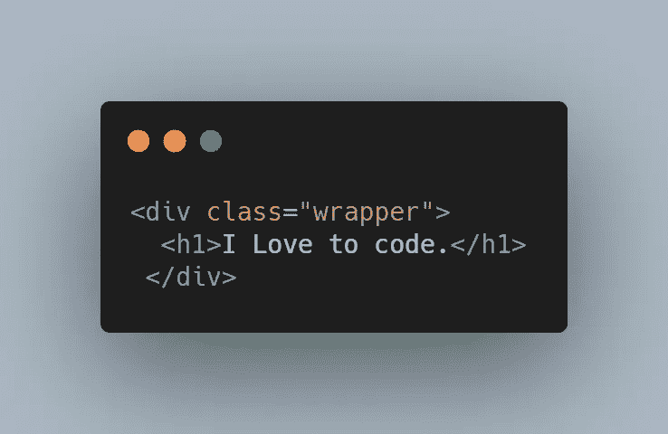
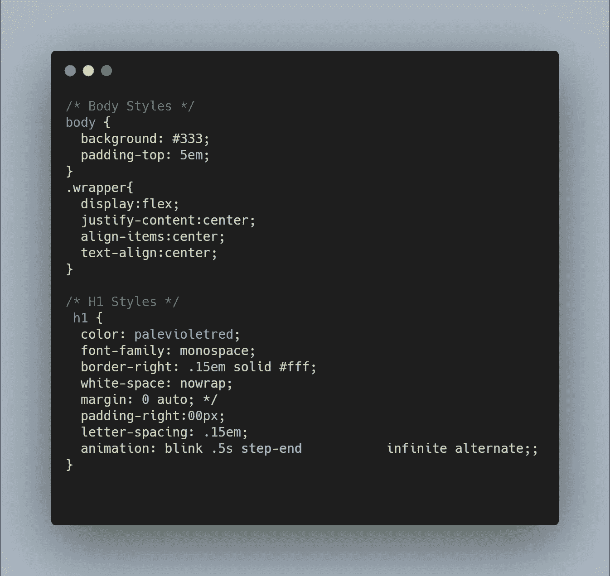
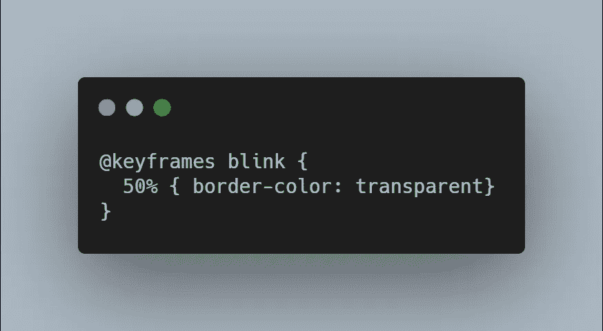
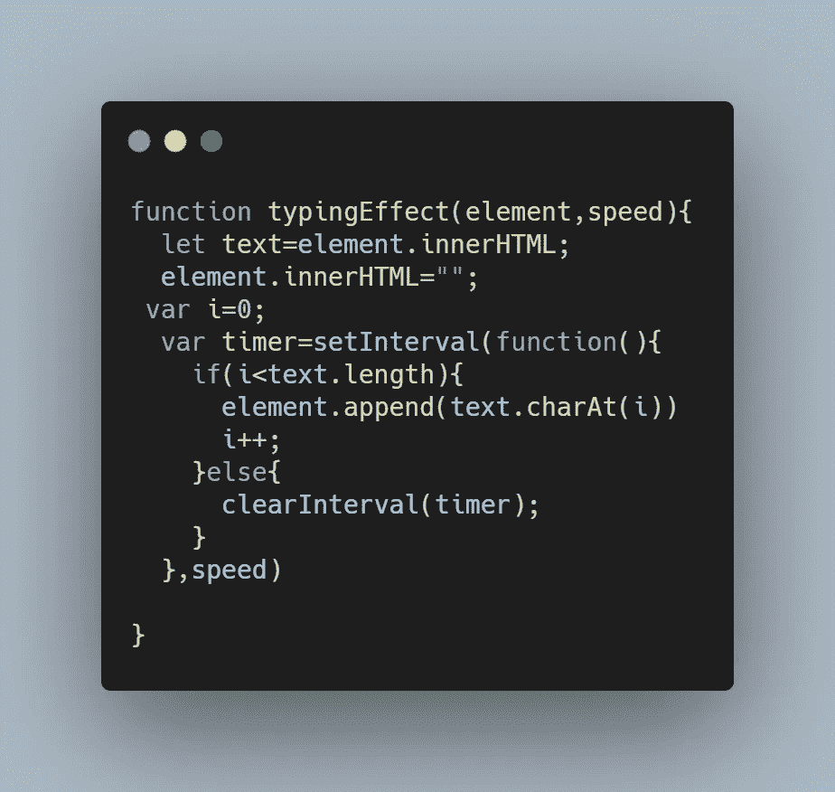
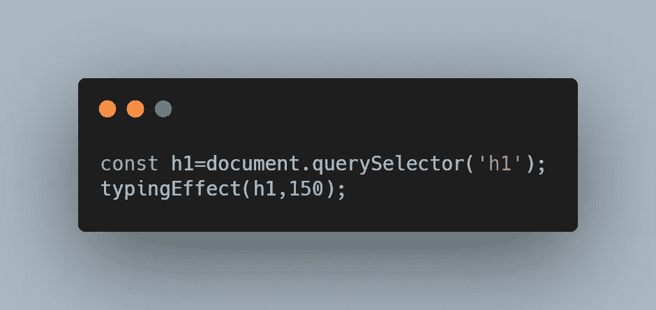

# 如何使用普通 JavaScript 制作打字机效果

> 原文：<https://blog.devgenius.io/how-to-make-a-typewriter-effect-using-vanilla-javascript-5cb4fc2706e9?source=collection_archive---------2----------------------->

*如何用 javascript 制作一个很酷的老派效果*

由[马库斯·温克勒](https://unsplash.com/@markuswinkler?utm_source=medium&utm_medium=referral)在 [Unsplash](https://unsplash.com?utm_source=medium&utm_medium=referral) 上拍摄

今天我将向你展示如何创建如下所示的打字机效果。

# 添加 HTML

第一步是添加 HTML 标记，该标记只包含一个 div，该 div 带有一个包装器类，该包装器类用一些文本包围 h1 元素。这个包装类将允许我们使用 CSS。

# 添加 CSS

下一步是给这个标记添加一些样式。这是你可以定制的地方，因为你可以设置*颜色*和*边框颜色*的值给你想要的*。*同样需要注意的是，包装类不是必需的，它仅用于将文本置于屏幕中央。

*注意:为了代替单独设置每个属性，我使用了 border-right 速记属性来分别设置粗细、边框类型和颜色属性*

在阅读这些风格的时候，你可能已经注意到有一个名为 blink 的动画，时长 0.5 秒。这个动画的目的是创建打字效果产生的脉冲效果。这是通过将 border-color 属性从其原始颜色动画化为透明，然后再还原来实现的，这由 CSS 的 step-end 属性决定。动画关键帧的代码如下所示。

# 添加 Javascript

现在有趣的部分来了，使用 javascript 来实际创建输入效果。这个过程的第一步是创建一个函数，实际上是把字母一个接一个地加起来，我决定把它叫做…打字效果！我知道多么原始。

这个 typingEffect 函数接受两个参数:h1 元素和一个名为 speed 的变量。在将元素参数引用到变量*文本之后，*我们将*元素*参数 innerHTML 值设置为”，有效地清除了它的文本。实际的输入效果是由 setInterval 函数引起的，该函数将一个 char 附加到仍然保存原始文本的 text 元素上。音程。由速度参数决定。

现在，我们要做的就是使用 document.querySelector()来引用 h1 元素，并将其传递到如下所示的键入函数中。

# 结论

到目前为止，您已经阅读完了本文，应该知道如何使用普通 javascript 创建基本的打字效果。如果你想查看源代码，你可以从这个代码笔查看:[https://codepen.io/azizbooker/pen/wvgqqpZ](https://codepen.io/azizbooker/pen/wvgqqpZ)

我希望你有一个伟大的休息一天！

以下是一些进一步的阅读材料:

 [## 每个开发人员都应该知道的 10 个 VS 代码快捷键

### 简单的快捷方式可以极大地提高你的生产力

medium.com](https://medium.com/dev-genius/10-vs-code-shortcuts-every-developer-should-know-f2d1058cfe8e)  [## 编写 CSS 助手类如何提高我的生产力

### 为什么在编写 CSS 时应该开始使用助手类

medium.com](https://medium.com/dev-genius/how-writing-css-helper-classes-improved-my-productivity-c2360d0dab78)  [## 每个开发人员都应该知道的 4 种数据结构

### 每个开发人员都应该知道的数据结构概述

bookeraziz.medium.com](https://bookeraziz.medium.com/4-data-structures-every-developer-should-know-368d156ea384)