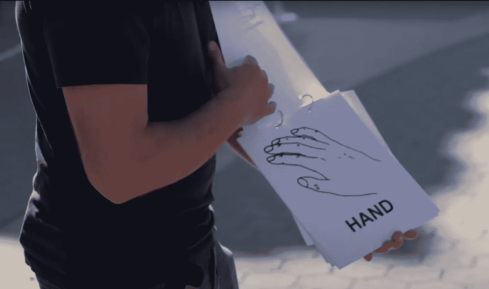

# 如何让数据科学变得更简单(针对学生！)

> 原文：<https://blog.devgenius.io/how-to-make-data-science-easier-for-students-dcea7a8829a5?source=collection_archive---------5----------------------->

# Python 扫盲项目简介

亚当·诺瓦克斯基在 [Unsplash](https://unsplash.com/s/photos/data-science?utm_source=unsplash&utm_medium=referral&utm_content=creditCopyText) 上的照片

## 我们大多数人是如何学习的

我们许多人认为，作为学生，当老师的内容与我们的学习风格相匹配时，我们学得最好。这一因素如何影响我们学习数据科学的方式？

今天，作为一名机器学习工程师，我知道我有时会看着这个领域近年来的发展，忘记刚开始是什么样的:所以我和一名即将进入大学主修数据科学的大三学生(姑且称她为“艾比”)坐在一起，采访了她的经历。艾比告诉我的第一件事就是“我一直都很善于分析。观察力敏锐。”正如你所料，我的受访者继续提到这是她学习数据科学的原因，所以她可以在气象学或商业智能等领域更深入地进行数据分析。

乍一看，我认为我的受访者已经找到了选择数据科学的最佳人选，并将在她的职业生涯中一帆风顺。事实上，Abby 最近在 PTC 公司完成了一份数据分析和商业智能分析师实习生的暑期工作，所以我继续问她在那里的经历是怎样的。

但在我告诉你她说了什么之前，这里有另一个故事可能会让你吃惊…

## 你是哪种学习者？

由 [Rohan Makhecha](https://unsplash.com/@rohanmakhecha?utm_source=unsplash&utm_medium=referral&utm_content=creditCopyText) 在 [Unsplash](https://unsplash.com/s/photos/question?utm_source=unsplash&utm_medium=referral&utm_content=creditCopyText) 拍摄的照片

这是洛杉矶市中心的一个晴天。一名男子正站在一个购物中心外繁忙的街角。穿着休闲的黑色 t 恤和牛仔裤，他正在和路过的行人进行社交实验。

他拦住去商店的人，问了一个简单的问题。

“你是哪种学习者？”

大部分人回复“视觉。”还有人说“听觉”，或者“我从阅读博客中学到的东西最多”。一个人甚至对他说，学习是一项“接触运动”，因此当他用手做某事时，他学得最好。

这不是一个虚构的故事:这个社会实验(不可否认，它不是在教育研究的科学严谨性下进行的)实际上是由 Derek Muller 在去年 7 月进行的，Derek Muller 是著名的科学教育家，也是广受欢迎的 YouTube 频道 [Veritasium](https://www.youtube.com/channel/UCHnyfMqiRRG1u-2MsSQLbXA) 的创始人。穆勒最终在他的视频中展示了什么？

*根据一个人的学习风格量身定制并不能真正提高他们的教育水平！在询问了人们的学习风格后，穆勒对每个参与者进行了一个简短的记忆测试，并根据学习风格进行了划分:对于一半的视觉学习者，他向他们展示了 10 幅不同物体的图像，并要求他们告诉他他们看到了什么。然后，对于另外一半视觉学习者，他给了他们同样的测试，但是他没有展示图片，而是简单地说出了他拥有的物品的名称。在一天结束时，两组人都没有明显地胜过另一组人，尽管一组人接受测试的方式符合他们的学习风格。在他的视频和描述中，穆勒还引用了支持这一发现的学习风格的评论文章。*

因此，如果找到适合你的学习风格和/或兴趣的**不是**帮助我们作为学生取得成功的东西，那是什么呢？

# 重新思考学习之旅

让我们回到 Abby 身上——她告诉我，虽然她对自己的领域非常感兴趣，也非常专注，但她确实面临着许多技术挑战，特别是在用 Python 编程来实现工作中的数据可视化方面。

下面的列表包含了她在编码时遇到问题时摆脱困境的一些策略，我毫不怀疑许多数据科学学生和机器学习工程师会有同感:

*   将堆栈溢出，
*   对于 Tableau 或 Qlik Sense 等任务，切换到其他分析工具
*   从导师或同事那里获得帮助

## 这里少了什么？

要明确的是，这些策略都没有问题！我相信许多数据科学家和工程师读到这里都会有同感，并会说这只是走出教室，在现实世界中使用技能的过程的一部分。根据 Abby 所说的进一步说，*这个*就是我认为的问题 *:*

她最大的挑战不仅仅是知道在她编码时要采取什么步骤，而是 T2 如何确定她代码的哪一部分没有被破坏。她用的是图书馆吗？代码的语法？这些错误是由于误用了她在课堂上学到的概念知识吗？在编码的时候，搞不清楚会让人感到失落。我相信，为学生提供解决这些问题的工具不仅会让数据科学教育更像学生在真实的研究和行业世界中看到的东西；这是一条通往更有成效的工作和更有成就感的职业生涯的道路。

# 主动学习范式

我必须对你坦白:我仍然认为自己是数据科学的学生，我也想知道如何更好地应用我在课堂上学到的信息来解决现实世界的问题。所以我自私地问自己:有什么*可以帮助我们更好地培养这种技能吗？*

到目前为止，我找到的最佳答案比我预期的更加微妙。让我们重温一下德里克·穆勒。虽然他的视频确实证明了将人们归类为“视觉”学习者并不能真正表明他们对视觉学习内容的反应有多好，但他以另一项试验结束了他的社会实验:他对他的参与者进行了同样的记忆测试，以评估他们对他拥有的物品列表的记忆有多好。除了这一次，他同时使用*多种*形式的内容显示对象:他显示图片，*和*在其下方提供文本标签，*和*同时说出对象的名称(例如，“蜡烛”、“鸭子”、“心”等)。)给参与者。

《教育中最大的神话》 (2021)中的德里克·穆勒。

结果呢？所有的参与者在记忆测试中都做得更好。穆勒在视频中解释说，他认为提高学习的不是具体的内容，而是“学习者脑袋里面正在发生的事情”(穆勒，[《教育中最大的神话】](https://youtu.be/rhgwIhB58PA))。

换句话说，我们的目标是帮助学生进行主动学习，这也是我想帮助将更多信息带入数据科学教育世界的想法。

*   厌倦了课本上枯燥的段落？让我们用**更多相关的例子。**
*   习题集没有意义吗？更多相关练习的时间到了。
*   内容“就是没有意义吗？”让我们试试**结合沟通方式**，用文字和文本和音频，而不是拘泥于一两种。

# 认识 Python 扫盲项目

数据科学是一个快速发展的领域，社区也在不断发展:在 [Stack Overflow 2021 开发者调查中，](https://insights.stackoverflow.com/survey/2021?_ga=2.236209345.190202062.1628102352-126161871.1625855113#section-most-popular-technologies-other-frameworks-and-libraries)Python 数据科学库(如 NumPy 和 Pandas)是一些排名最高的工具，受访者表示他们喜欢使用这些工具，并希望继续使用。

如果您已经做到了这一步，那么您很有可能也是这个充满激情的社区的一员，并且关心如何让数据科学教育变得更好。如果是这样，我诚挚地邀请您查看“ [Python 扫盲项目](https://github.com/UPstartDeveloper/Python-Literacy-Project)”的 GitHub 资源库，这是一个开源项目，我和我在[德雷克塞尔大学](https://www.linkedin.com/in/milad-amir-toutounchian-84508128/)的教授 Milad Toutounchian 一起启动，收集所有最好的例子和练习，以帮助学生积极学习数据科学的 Python 编程。我们希望有一天将这些材料纳入名为*主动学习范式的数据科学基础的新电子教科书中。*更重要的是，我很高兴能从社区中收集到关于我们目前为止在项目中的内容的反馈，并使用开源作为一种方式来提升每个试图学习数据科学的人！