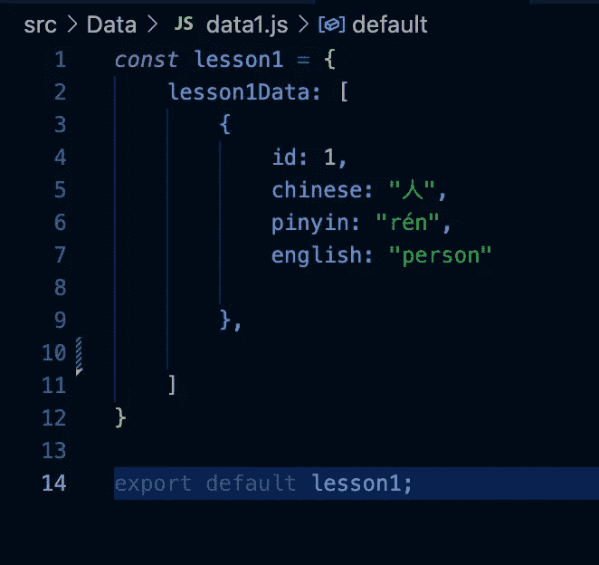
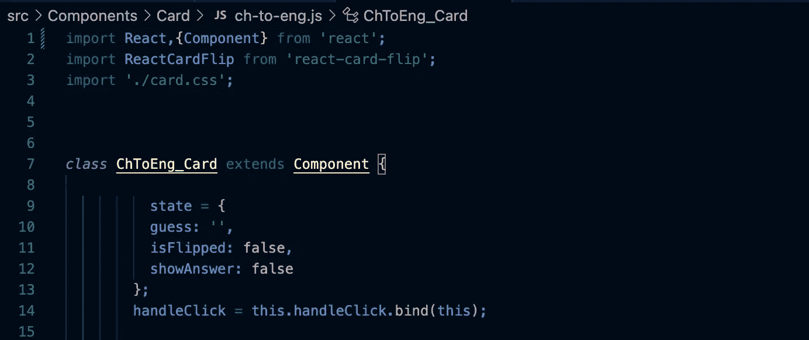
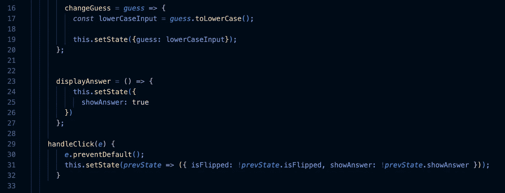
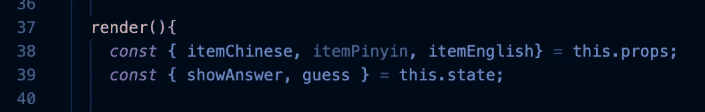
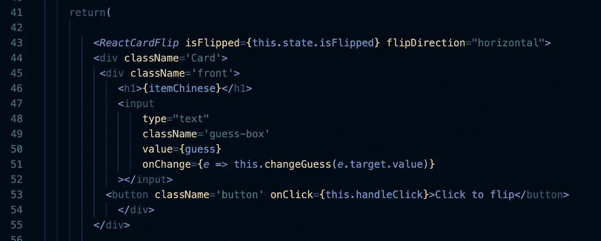
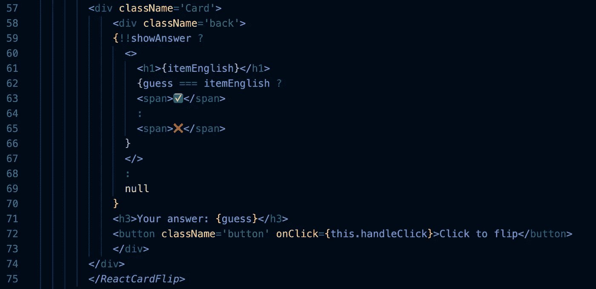
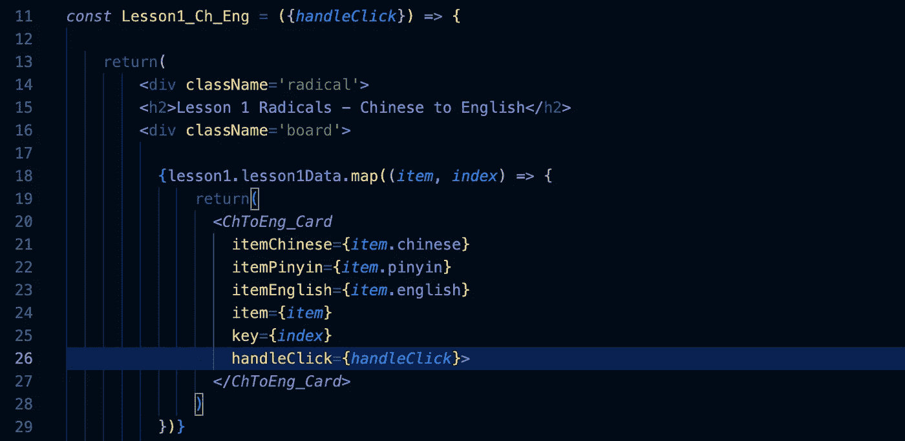

# 如何制作 Flashcards🃏

> 原文：<https://blog.devgenius.io/how-to-make-flashcards-15da8ee0944c?source=collection_archive---------11----------------------->

你将在那些“JavaScript 项目”文章中看到的项目中，有一个“教育应用”的建议。所有这些在概念上都很好，但很容易陷入一个充满可能性的无底兔子洞，并就最佳教学方式展开辩论。我不能帮你做所有的事情，但是如果你认为抽认卡对你和你的应用有好处，那就系上安全带吧！注意:我在这里用的是普通话，但这也适用于几乎任何主题/语言。

## 第一步:设置好你的数据

你需要在抽认卡中设置你要测试的内容。这可以是你的应用程序的数据库的形式，或者(像我一样)一个简单的。带有 JSON 数组的 js 文件。如果您对后一个选项感兴趣，它需要看起来像这样:

## 步骤 2:导入反应卡翻转

我强烈推荐使用像 React-Card-Flip 这样的工具来为你做大部分代码方面的工作。如果有您更喜欢的类似功能的包，请随意使用，但是有些格式可能会有所不同，所以请记住这一点。我们一会儿会做很多自己的事情。下面是 React-Card-Flip 文档的链接:[https://www.npmjs.com/package/react-card-flip](https://www.npmjs.com/package/react-card-flip)

## 步骤 3:设置卡组件

现在我们需要制作卡片组件，…通过制作一个组件，因为我们需要状态。这里还需要导入 ReactCardFlip 或者类似的东西。使卡成为扩展组件的类。调用 state 并将其设置为 guess，这将是一个空字符串，isFlipped，false，showAnswer，也是 false。还要做一个 handleClick 等于 this.handleClick.bind(this)，这个后面会用到。

## 第四步:我们需要的功能

现在我们需要一些函数来让一切正常工作。首先，displayAnswer 将是一个 setState 函数，它将 showAnswer 更改为 true。接下来，handleClick(e)，调用 e.preventDefault()，然后我们会将 State 设置为一个相当复杂的 ternery。基本的逻辑是，无论 isFlipped 的当前状态是什么，都要使它相反，showAnswer 也是如此。

## 步骤 4.5(可选):更改猜测

这是一个可选功能。如果你不希望大写字母计入用户的猜测中，你需要创建一个函数，自动将猜测设置为小写(或大写，你做你)。该函数将 guess 作为参数。制作一个常量，类似 lowerCaseInput，并将其设置为 guess.toLowerCase()。现在我们将猜测状态设置为较低的输入。

## 第五步:卡片本身(封面版)

现在是卡本身。在 render 语句下，调用你将需要的这个抽认卡的数据作为道具。同样带入 showAnswer 和 guess 作为 this.state，在 return 下调用 ReactCardFlip 组件。将 is lipped 设置为 is lipped 状态。ReactCardFlip 需要包住卡的正面和背面。在名为 ReactCardFlip 的 Card 中制作两个 div，分别环绕正面和背面(我知道这似乎是多余的，但它不会工作)(这也将使设计卡片更容易，因为您可以只设计卡片并结束一天的工作)。现在我们将制作卡片的正面。制作一个名为 front 的 div。将我们在 props 中提出的问题称为文本标签(h1、h2、p 或您喜欢的任何名称)。现在输入一个信息。创建类型文本，给它一个类名，值将是 guess。

如果要将猜测重置为全小写，添加 and onChange 并将其设置为等于 e = > this . change guess(e . target . value)。

最后，我们需要一个按钮，让用户提交他们的猜测。制作一个按钮，给它一个类名，并将 onClick 设置为 this.handleClick 我们之前制作的。

## 第六步:卡片本身(后一版)

在第二个卡片 div 下，创建一个名为 back 的 div。我们现在将制作一个三元组来确定将要显示的内容。做有条件的！！showAnswer 强制给出绝对正确或错误的答案，而不是正确或错误的答案。如果是真的，显示答案，如果猜测与答案相同，显示并检查是否不是 x。如果 showAnswer 是假的，让它返回 null。我建议让用户的猜测也显示出来，这样他们就可以看到他们的答案是错误的。我还会在另一边有一个按钮，允许他们翻转卡片，再试一次。(从正面复制粘贴按钮即可)。

## 第七步:给卡片打电话

现在我们有了我们的卡，但它需要被调用才是有用的。当您这样做时，请确保将 handleClick 作为页面的参数引入，这样当您在卡中调用 handleClick 时，它就不会抛出错误。我会通过数据映射，为每个项目创建一个卡片。

## 注意:如果你想在不同的卡上测试不同的东西，那么你需要制作一个不同的卡来测试。

如果有什么不清楚的，这是我的 GitHub。希望这对你有帮助！编码快乐！👩‍💻

GitHub:[https://github.com/ReaganADavenport/Learning-Radicals](https://github.com/ReaganADavenport/Learning-Radicals)

演示:【https://youtu.be/vJXXCwyScaw 