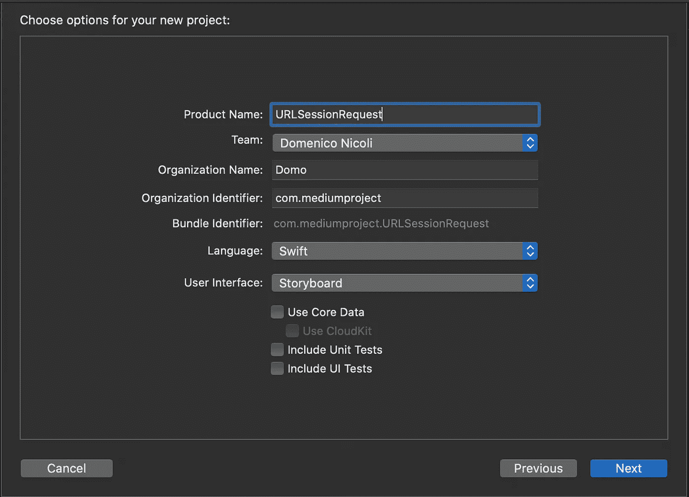
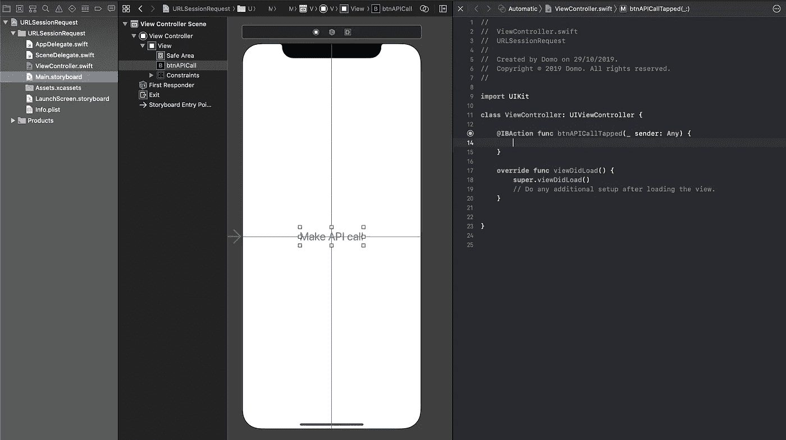
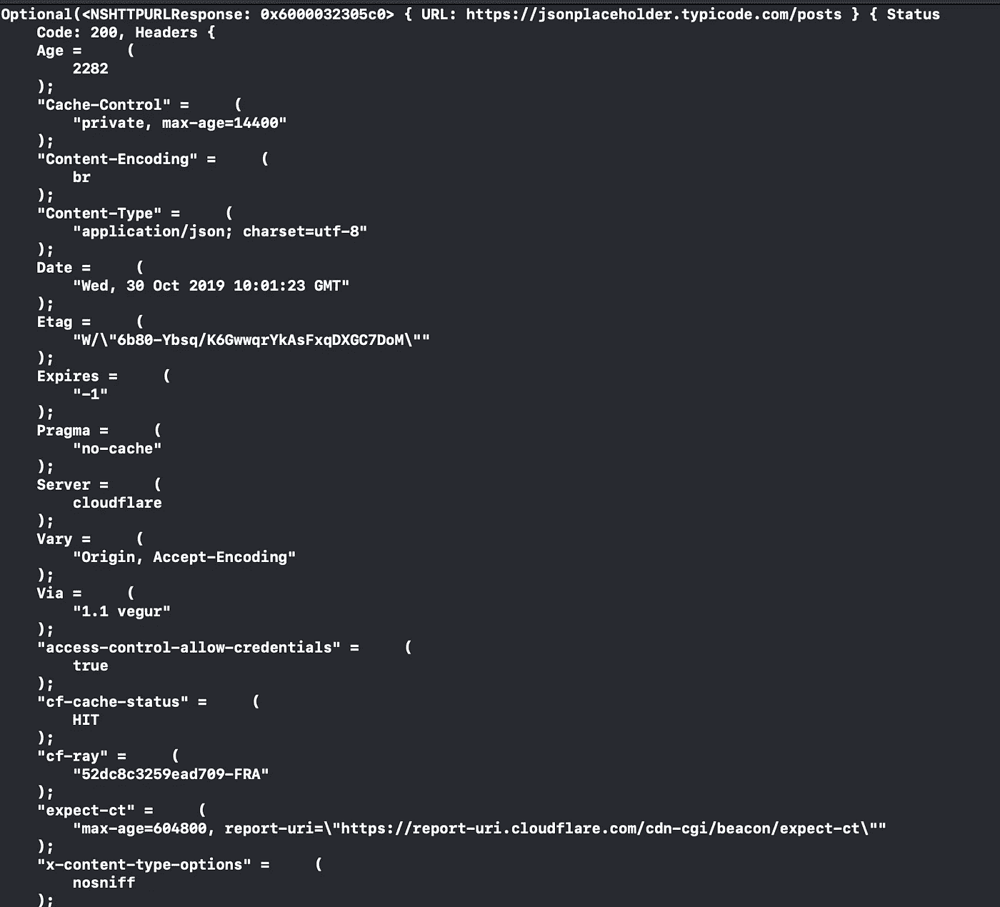
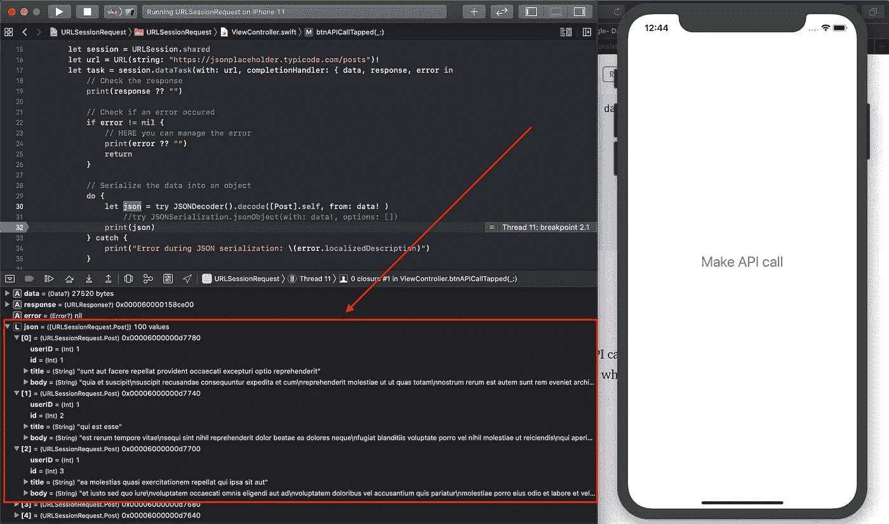

# 如何在 Swift 中使用 URLSession 进行 HTTP 请求

> 原文：<https://blog.devgenius.io/how-to-make-http-requests-with-urlsession-in-swift-4dced0287d40?source=collection_archive---------0----------------------->

## 不使用第三方库进行 HTTP 请求的更快方法


谢尔盖·佐尔金在 [Unsplash](https://unsplash.com?utm_source=medium&utm_medium=referral) 上拍摄的照片

# 介绍

如今，应用程序不断地从网络上下载数据。当您使用应用程序进行搜索时，会调用一个端点。结果数据被下载，放入一个对象中，然后在几毫秒内显示给你。

为了发出 HTTP 网络请求，开发人员通常倾向于添加第三方项目，如 [Alamofire](https://github.com/Alamofire/Alamofire) 。但是通常这个库的功能比需要的多，占用了很多无用的空间。

在本文中，我们将讨论如何使用`URLSession`发出 HTTP 请求并将 JSON 结果序列化为一个对象。

# 入门指南

首先，打开 [Xcode，](https://developer.apple.com/xcode/)创建一个新项目。选择单视图应用程序。



现在，在屏幕中央创建一个按钮，点击它将调用我们的 API 方法。



# 履行

首先，我们需要发出 HTTP 请求。对于这个例子，我将使用来自 [jsonplaceholder 的一个端点，](https://jsonplaceholder.typicode.com)一个伪在线 REST API，用于测试和原型开发，每个月有超过 3.5 亿个请求！

这个端点将返回一个包含`userId`、`postId`、`title`和`body`的帖子列表。

```
let session = URLSession.shared
let url = URL(string: "https://jsonplaceholder.typicode.com/posts")!
```

然后，我们将创建一个调用 [URLSession.dataTask](https://developer.apple.com/documentation/foundation/urlsession/1407613-datatask) 方法的`dataTask`。这将创建一个任务，从 URL 集中检索内容，并在请求完成时调用一个处理程序:

```
let task = session.dataTask(with: url, completionHandler: { data, response, error in
    // Check the response            
            print(error)             
            print(response)                                              
    })
    task.resume()
```

**注意:**不要忘记在最后调用`task.resume()`，否则请求不会被执行。

如果您现在运行代码，您将在控制台中看到 HTTP 响应，如下所示:



你可能在问我们的数据在哪里，对吗？简单来说:在`dataTask`方法返回的`data`参数中。如果我们尝试打印它，我们将看到 JSON 作为字符串返回——但是我们需要在一个自定义对象中使用它。我们如何做到这一点？

我们可以使用`userId`、`id`、`title`和`body`作为属性手动创建我们的类，或者使用 [quicktype.io](https://app.quicktype.io) 以更快的方式创建。

```
import Foundation

class Post: Codable {
    let userID, id: Int
    let title, body: String

    enum CodingKeys: String, CodingKey {
        case userID = "userId"
        case id, title, body
    }

    init(userID: Int, id: Int, title: String, body: String) {
        self.userID = userID
        self.id = id
        self.title = title
        self.body = body
    }
}
```

然后返回到您的`ViewController`文件中，将前面的代码改为如下:

```
let session = URLSession.shared
        let url = URL(string: "https://jsonplaceholder.typicode.com/posts")!
        let task = session.dataTask(with: url, completionHandler: { data, response, error in
            // Check the response
            print(response)

            // Check if an error occured
            if error != nil {
                // HERE you can manage the error
                print(error)
                return
            }

            // Serialize the data into an object
            do {                
                let json = try JSONDecoder().decode([Post].self, from: data! )
                    //try JSONSerialization.jsonObject(with: data!, options: [])
                print(json)
            } catch {
                print("Error during JSON serialization: \(error.localizedDescription)")
            }

        })
        task.resume()
```

# 是时候测试一下了

我们终于准备好启动我们的应用程序，并尝试进行 API 调用。

由于我们的应用程序还没有一个真正的接口，我将在我们将 JSON 解码成我们的对象的地方放一个断点。



带有数据的对象

如果我们在 variables 视图上添加我们的对象，我们将看到它包含我们从端点正确获得的所有数据。

[](https://www.buymeacoffee.com/nicolidomenico)

**这里** **可以找到完整的代码** [**。**](https://github.com/domeniconicoli/UIActivityViewControllerExample/tree/master)