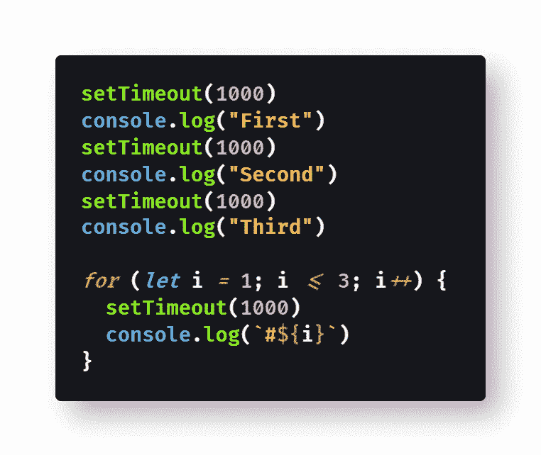
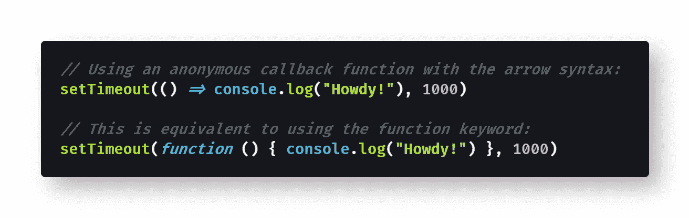
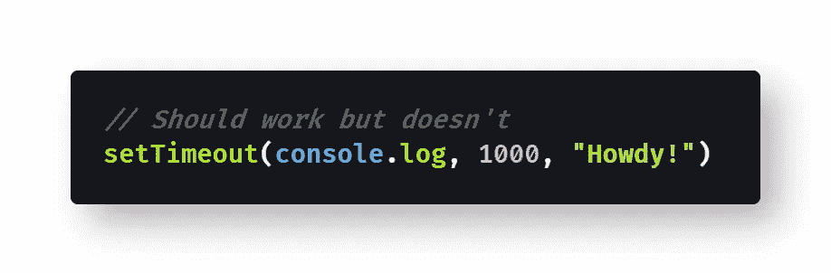
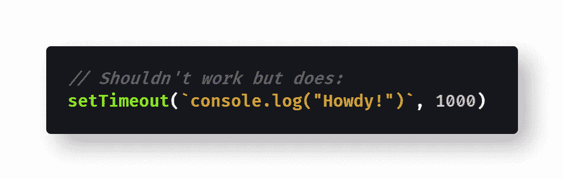
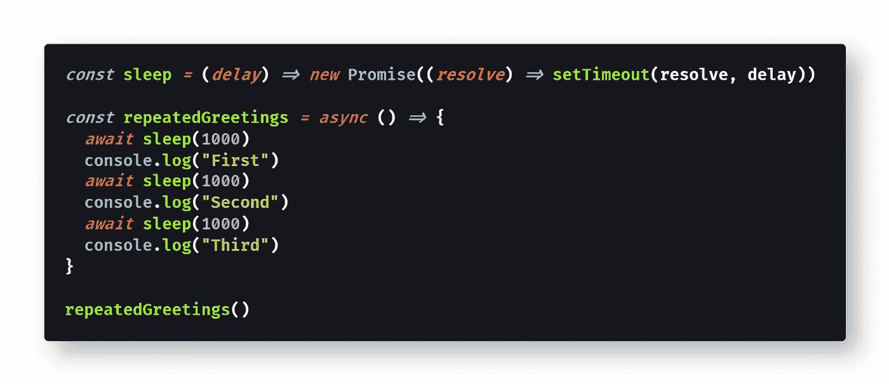
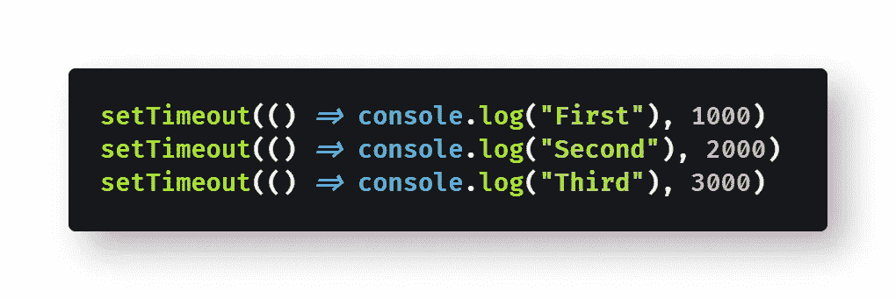
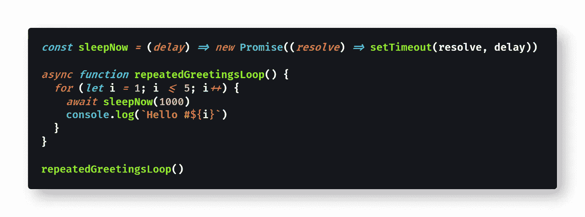
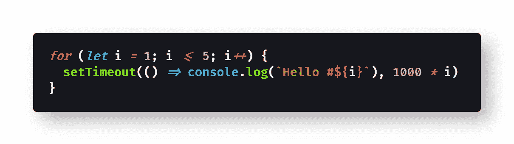

# 如何让 JavaScript 休眠或等待

> 原文：<https://blog.devgenius.io/how-to-make-javascript-sleep-or-wait-d95d33c99909?source=collection_archive---------0----------------------->

## JavaScript 没有一个`sleep()`函数可以让代码在恢复执行之前等待一段指定的时间。那么如果你需要 JavaScript 等待，你会怎么做呢？

凯特·斯通·马西森在 [Unsplash](https://unsplash.com?utm_source=medium&utm_medium=referral) 上拍摄的照片

> 在计算中，睡眠是 Unix、类 Unix 和其它操作系统中的一个命令，它把程序的执行暂停一段时间— [维基百科](https://en.wikipedia.org/wiki/Sleep_(command))

假设您想要将三条消息记录到 Javascript 的控制台中，每条消息之间有一秒钟的延迟。JavaScript 中没有`[sleep()](https://en.wikipedia.org/wiki/Sleep_(command))`方法，所以你尝试使用下一个最好的方法，`[setTimeout()](https://developer.mozilla.org/en-US/docs/Web/API/WindowOrWorkerGlobalScope/setTimeout)`。

> "`[WindowOrWorkerGlobalScope](https://developer.mozilla.org/en-US/docs/Web/API/WindowOrWorkerGlobalScope)` mixin 的`**setTimeout()**`方法(和`Window.setTimeout()`的继承者)设置一个定时器，一旦定时器到期，它就执行一个函数或指定的代码段。"— [MDN 文档](https://developer.mozilla.org/en-US/docs/Web/API/WindowOrWorkerGlobalScope/setTimeout)

不幸的是，`setTimeout()`并不像你想象的那样工作，这取决于你如何使用它。您可能在 JavaScript 循环中的某个时候尝试过，并发现`setTimeout()`似乎根本不起作用。

问题产生于将`setTimeout()`误解为`sleep()`函数，而实际上它是按照自己的规则工作的。

在本文中，我将解释如何使用`setTimeout()`，包括如何使用它来创建一个睡眠函数，该函数将导致 JavaScript 暂停执行并在连续的代码行之间等待。

如果你只是快速浏览`setTimeout()` [文档](https://developer.mozilla.org/en-US/docs/Web/API/WindowOrWorkerGlobalScope/setTimeout)，它似乎需要一个“延迟”参数，以毫秒为单位。

回到最初的问题，在调用`console.log()`函数之间，您尝试调用`setTimeout(1000)`等待 1 秒钟。

不幸的是`setTimeout()`不是这样工作的:

[查看原始代码](https://gist.github.com/djD-REK/b823cd65732e7a8df0b8b1280b146d44)作为 GitHub 要点

这段代码的结果是完全没有延迟，就好像`setTimeout()`不存在一样。

回头看看文档，你会发现问题在于第一个参数实际上应该是一个函数调用，而不是延迟。毕竟，`setTimeout()`实际上并不是一个`sleep()`方法。

您重写代码，将一个[回调函数](https://developer.mozilla.org/en-US/docs/Glossary/Callback_function)作为第一个参数，将必要的延迟作为第二个参数:

[查看原始代码](https://gist.github.com/djD-REK/d3ac1f181c3d3a3194adba3b66eb7a54)作为 GitHub 要点

这导致在 1000 毫秒(1 秒)的单一延迟后，所有三个[控制台日志](https://developer.mozilla.org/en-US/docs/Web/API/Console/log)信息一起显示，而不是每次重复呼叫之间延迟 1 秒的预期效果。

在我们讨论如何修复这个问题之前，让我们更详细地检查一下`setTimeout()`函数。

# 检查`setTimeout()`

你可能已经注意到了上面第二段代码中箭头函数的使用。这些都是必要的，因为您需要向`setTimeout()`传递一个匿名回调函数，它将运行您希望在超时后执行的代码。

在匿名函数中，您可以指定在超时期限后要执行的任意代码:

[将原始代码](https://gist.github.com/djD-REK/65564550009246a9b28f886327316c8a)视为 GitHub 要点

理论上，您可以将函数作为第一个参数传递，将回调函数的参数作为其余参数传递，但这似乎对我来说从来都不合适:

[查看原始代码](https://gist.github.com/djD-REK/f15fcae7708cd93b20a52dab88b41108)作为 GitHub 要点

人们使用一根绳子来解决这个问题，但是不建议这样做。从字符串执行 JavaScript 存在安全风险，因为任何坏人都可能运行以字符串形式注入的任意代码。

[查看原始代码](https://gist.github.com/djD-REK/3200f6bc170d41769f337af52d95c280)作为 GitHub 要点

那么为什么`setTimeout()`在我们的第一组代码示例中失败了呢？看起来我们使用它是正确的，每次都有 1000 毫秒的重复延迟。

原因是`setTimeout()`作为[同步代码](https://developer.mozilla.org/en-US/docs/Glossary/Synchronous)执行，对`setTimeout()`的多个调用都同时运行。对`setTimeout()`的每次调用都会创建[异步代码](https://developer.mozilla.org/en-US/docs/Learn/JavaScript/Asynchronous/Introducing)，该代码将在给定延迟后执行。由于代码片段中的每个延迟都是相同的(1000 毫秒)，所有排队的代码在 1 秒钟的延迟后同时运行。

如上所述，`setTimeout()`实际上不是一个`sleep()`函数；相反，它只是将异步代码排队以供以后执行。幸运的是，可以使用`setTimeout()`在 JavaScript 中创建自己的`sleep()`函数。

# 如何写一个睡眠函数

T 通过[承诺](https://developer.mozilla.org/en-US/docs/Web/JavaScript/Reference/Global_Objects/Promise)、`[async](https://developer.mozilla.org/en-US/docs/Web/JavaScript/Reference/Statements/async_function)`和`[await](https://developer.mozilla.org/en-US/docs/Web/JavaScript/Reference/Operators/await)`的能力，你可以编写一个`sleep()`函数，它将按照你期望的那样工作。

然而，您只能从`async`函数中调用这个自定义的`sleep()`函数，并且您需要使用`await`关键字。

这段代码片段演示了如何编写一个`sleep()`函数:

[查看原始代码](https://gist.github.com/djD-REK/66279195e05dc3e92a56d577ed9f961f)作为 GitHub 要点

这个 JavaScript sleep()函数完全按照您的预期工作，因为`await`会导致代码的同步执行暂停，直到承诺得到解决。

# 一个简单的选择

答或者，当您首先调用`setTimeout()`时，您可以指定增加超时。

以下代码等效于上一个示例:

[查看原始代码](https://gist.github.com/djD-REK/7c0711804ea9ad6de1209da3324a8c3b)作为 GitHub 要点

使用递增超时是可行的，因为代码都是同时执行的，所以指定的回调函数将在同步代码执行后的 1 秒、2 秒和 3 秒执行。

就我个人而言，我非常喜欢这种方法，尽管如果不使用某种类型的变量来跟踪(或猜测)超时时间，就无法创建这样的睡眠函数。

# 它能循环工作吗？

如你所料，以上暂停 JavaScript 执行的选项在循环中都能很好地工作。让我们看两个简单的例子。

下面是使用自定义`sleep()`函数的代码片段:

[查看原始代码](https://gist.github.com/djD-REK/1cda61a6c8ae3ef7a80713d44f4b8376)作为 GitHub 要点

下面是一个代码片段，它更简单地使用了递增超时:

[查看原始代码](https://gist.github.com/djD-REK/71f565ae11c6e56d5ab72e35d71d46a2)作为 GitHub 要点

同样，我更喜欢后一种语法，尤其是在循环中。

# 结论

J avaScript 可能没有`sleep()`或`wait()`函数，但是使用内置的`setTimeout()`函数创建一个函数是很容易的——只要你小心使用它。

单独来看，`setTimeout()`不能作为`sleep()`函数工作，但是您可以使用`async`和`await`创建一个定制的 JavaScript `sleep()`函数。

采用不同的方法，您可以将交错的(递增的)超时传递给`setTimeout()`来模拟`sleep()`功能。这是因为所有对`setTimeout()`的调用都是同步执行的，就像 JavaScript 通常做的那样。

希望这能帮助您在代码中引入一些延迟——只使用普通的 JavaScript，不需要任何外部库或框架。

编码快乐！👍💻🔥😊🖖

# 延伸阅读:JavaScript 中的`sleep()`

*   [James Hibbard](https://medium.com/u/e3b33a68b484?source=post_page-----d95d33c99909--------------------------------) 在[网站上有一篇关于`sleep()`vs`wait()`的好文章:](https://medium.com/u/f211fb76f1fd?source=post_page-----d95d33c99909--------------------------------)

 [## JavaScript - SitePoint 中的延迟、睡眠、暂停和等待

### 许多编程语言都有一个睡眠功能，它会将程序的执行延迟给定的秒数…

www.sitepoint.com](https://www.sitepoint.com/delay-sleep-pause-wait/) 

*   [Flavio Copes](https://medium.com/u/fe1c14f6cde?source=post_page-----d95d33c99909--------------------------------) 在他的博客上提供了一些关于`sleep()`和[的背景资料:](https://flaviocopes.com/javascript-sleep/)

 [## 如何让你的 JavaScript 函数休眠

### 有时，您希望函数暂停执行一段固定的时间(秒或毫秒)。在编程中…

flaviocopes.com](https://flaviocopes.com/javascript-sleep/) 

*   Ravinder L 在他的博客上有一个`sleep()` [的替代实现:](https://medium.com/@raviinit/hold-on-a-second-sleep-wait-or-delay-functionality-using-javascript-8521c7cecf0e)

 [## 稍等一下！使用 JavaScript 的 sleep()、wait()或 delay()功能

### 如何使用 JavaScript 实现 sleep()、wait()或 delay()功能或行为？

medium.com](https://medium.com/@raviinit/hold-on-a-second-sleep-wait-or-delay-functionality-using-javascript-8521c7cecf0e) 

*   [John Au-Yeung](https://medium.com/u/5253c50d76c1?source=post_page-----d95d33c99909--------------------------------) 在升级编码中对`sleep()` [进行了更深入的探讨:](https://levelup.gitconnected.com/wheres-the-sleep-function-in-javascript-69dc15d54ac8)

 [## JavaScript 中的睡眠功能在哪里？

### 我们可以毫不费力地找到它。

levelup.gitconnected.com](https://levelup.gitconnected.com/wheres-the-sleep-function-in-javascript-69dc15d54ac8) 

# 延伸阅读:异步 JavaScript

*   阿莎·曼德瓦娅·🖋️💻🍕在他的博客上讨论`async`和`await` [:](https://medium.com/javascript-in-plain-english/async-await-javascript-5038668ec6eb)

 [## 如何在 JavaScript 中使用异步 Await

### 把同步 JS 变成异步 JS！

medium.com](https://medium.com/javascript-in-plain-english/async-await-javascript-5038668ec6eb) 

*   [刘哲](https://medium.com/u/7ec6bd4cf41f?source=post_page-----d95d33c99909--------------------------------)在他的博客上对`async`和`await` [有着清晰&透彻的指引:](https://medium.com/@zellwk/an-introduction-to-javascripts-async-and-await-edb313356677)

 [## JavaScript 的异步和等待简介

### 异步 JavaScript 从来都不容易。有一段时间，我们使用回调。然后，我们用承诺。现在，我们有…

medium.com](https://medium.com/@zellwk/an-introduction-to-javascripts-async-and-await-edb313356677) 

*   [Gokul N K](https://medium.com/u/32d167073cdb?source=post_page-----d95d33c99909--------------------------------) 提供了`async` [在更好的编程中的有用例子](https://medium.com/better-programming/understanding-async-await-in-javascript-1d81bb079b2c):

 [## 理解 JavaScript 中的异步等待

### 何时以及如何使用 async 和 await 的经验法则和示例

medium.com](https://medium.com/better-programming/understanding-async-await-in-javascript-1d81bb079b2c) 

*   AJ Meyghani 在他的博客上写了一篇关于异步 JS [的文章:](https://medium.com/@ajmeyghani/async-javascript-a-pocket-reference-2bb16ac40d21)

 [## 异步 JavaScript，袖珍参考

### JavaScript 异步编程基础

medium.com](https://medium.com/@ajmeyghani/async-javascript-a-pocket-reference-2bb16ac40d21) 

*   [Nikhil Mohadikar](https://medium.com/u/951481faa856?source=post_page-----d95d33c99909--------------------------------) 在他的博客上有关于事件循环[的精彩插图:](https://medium.com/swlh/asynchronous-javascript-in-depth-1e66c65f96fe)

 [## 深入了解异步 Javascript。

### 来自 Ruby 这样的同步代码执行背景，我总是对 javascript 如何执行感到困惑…

medium.com](https://medium.com/swlh/asynchronous-javascript-in-depth-1e66c65f96fe) 

*   [MDN 文档](https://developer.mozilla.org/en-US/docs/Web/JavaScript/Guide/Using_promises)中有一些关于[使用承诺](https://developer.mozilla.org/en-US/docs/Learn/JavaScript/Asynchronous/Promises)的有用文章:

 [## 利用承诺

### 是表示异步操作最终完成或失败的对象。既然大多数人都是…

developer.mozilla.org](https://developer.mozilla.org/en-US/docs/Web/JavaScript/Guide/Using_promises)  [## 承诺优雅的异步编程

### 承诺是 JavaScript 语言的一个相对较新的特性，它允许您将进一步的操作推迟到…

developer.mozilla.org](https://developer.mozilla.org/en-US/docs/Learn/JavaScript/Asynchronous/Promises) 

*   [Danny Moerkerke](https://medium.com/u/258f47a22015?source=post_page-----d95d33c99909--------------------------------) 在他的博客中讲述了异步 JS [的要点:](https://medium.com/swlh/what-you-need-to-know-about-asynchronous-programming-in-javascript-894f90a97941)

 [## 关于 JavaScript 中的异步编程，您需要知道什么

### 你不能犯这个错误

medium.com](https://medium.com/swlh/what-you-need-to-know-about-asynchronous-programming-in-javascript-894f90a97941) 

[David Clode](https://unsplash.com/@davidclode?utm_source=medium&utm_medium=referral) 在 [Unsplash](https://unsplash.com?utm_source=medium&utm_medium=referral) 上拍摄的照片

德里克·奥斯丁博士是《职业规划:如何在 6 个月内成为一名成功的 6 位数程序员 一书的作者，该书现已在亚马逊上架。