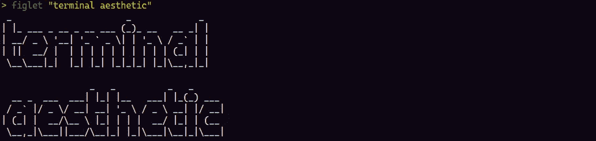
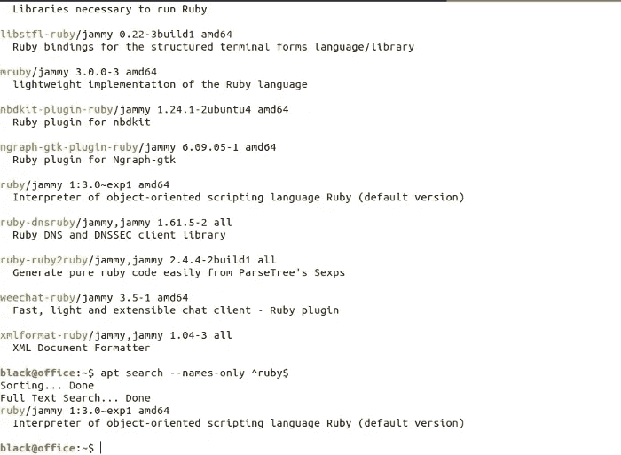
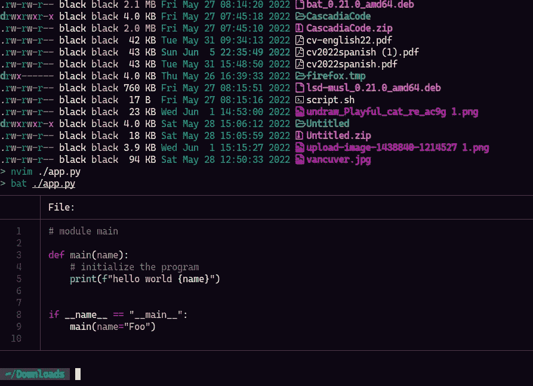
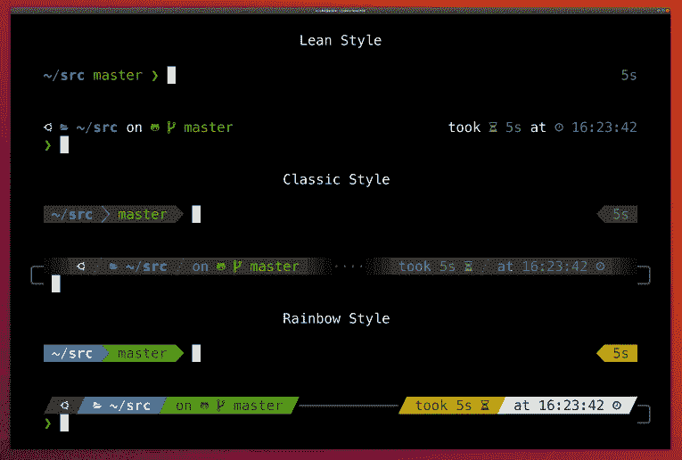
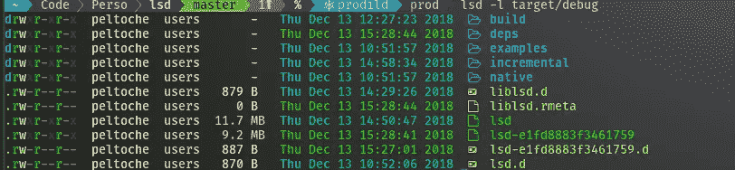
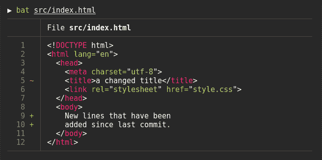
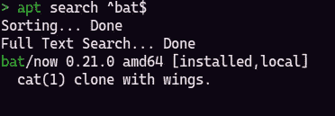
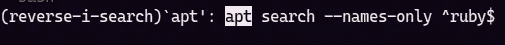
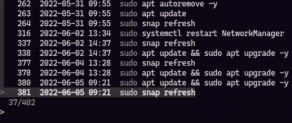

# 如何让外观成为你的*nix 终端美学

> 原文：<https://blog.devgenius.io/how-to-make-look-your-nix-terminal-aesthetic-eb34658ede2d?source=collection_archive---------4----------------------->

当你必须进行系统升级或提交/推送/拉取时，你是使用用户界面还是使用终端？如果你使用用户界面来制作终端，那么你的终端可能是这样的吗？

或者长这样。

因此，如果这是你的第一种情况，那么这个指南可以让你的终端看起来更好。

现在你可以看到，提示样式看起来比默认的要好，这是因为我已经安装了 zsh，在它的上面我有 oh-my-zsh。哦，我的 zsh 是一个管理 zsh 设置的框架，zsh 是一个交互式命令解释器。因此，如果当您在终端中键入 zsh 并输入时，它显示为未安装，那么让我们安装它。

在 linux 中，只需使用发行版的命令进行安装。

如果你有一台 mac，zsh 是系统的默认外壳。安装 oh-my-zsh 只需要从官方页面下载。

现在你已经安装了 zsh。所以这一步只针对 **linux** 用户。然后将 zsh 设置为您的默认系统 shell。

现在当你重启你的终端时，你会看到默认的主题，它比你之前的更漂亮。但是我们将安装一个更好的 **powerlevel10k** 。

这个主题是一个更加用户友好和全彩色的主题，我真的很喜欢。

要安装它，只需从它的官方 github 库克隆 repo。

当您重新启动 zsh 会话时，您将看到安装程序正在运行。因此您可以使用您喜欢的配置。但是记住一件重要的事情，使用这个主题之前你需要安装书呆子字体。所以我向你推荐 [CaskaydiaCove](https://github.com/ryanoasis/nerd-fonts/releases/download/v2.1.0/CascadiaCode.zip) ，我已经把它安装在我的系统里了。我将为您留下下载它的链接，在您安装它之后，在您的终端仿真器中设置字体，然后重启您的 shell 会话并运行 **powerlevel10k** 安装。

现在你想这样做，当你列出当前工作目录中的文件时，结果看起来棒极了，有图标和颜色:

这是因为我安装了一个拥有超能力的 **ls** 命令，这是[LSD。](https://github.com/Peltoche/lsd)

要安装这个，你可以使用你喜欢的包管理器，比如 **pacman** 或者 **dnf** 。但是对于 debian/ubuntu 你必须下载最新的版本并从 [**dpkg**](https://github.com/Peltoche/lsd/releases) 文件中安装。

 [## 释放 Peltoche/lsd

### 从 zwpaper 添加对- dereference 的支持从 0jdxt 添加窗口(Scoop)添加更多 wmv、wma 和其他图标…

github.com](https://github.com/Peltoche/lsd/releases) 

现在我们将结束本指南，但是如果您从事系统管理工作，或者如果您是一名开发人员，并且您需要阅读带有编辑器代码格式的文件，这将是一个非常好的工具。

您可以从首选的软件包管理器安装此软件包。如果你是 mac 用户，你可以使用 **brew** 。

最后，我会推荐你安装一些强大的 zsh 插件，在你工作的时候赢得时间。

第一个是 zsh-自我暗示:

 [## zsh-自动建议/install . MD at master zsh-users/zsh-自动建议

### 鱼一样的自我暗示。创建一个帐户，为 zsh 用户/zsh 自动建议的发展作出贡献

github.com](https://github.com/zsh-users/zsh-autosuggestions/blob/master/INSTALL.md) 

要安装它，只需克隆 repo:

然后把这个加到你的~/里。zshrc 并找到插件列表，因此您将添加插件:

结果将是这样的:

接下来是[zsh-fzf-历史-搜索](https://github.com/joshskidmore/zsh-fzf-history-search)。当你在终端中输入 ctrl-r 时，你会看到一个程序，可以让你搜索历史中以前的命令。因此，这可以帮助您记住您已经键入的命令，您可能不想重新键入，因为是一个很大的命令。所以你可以从这一点出发:

对此:

要安装它，请运行以下命令:

完成上述步骤后，将插件添加到您的插件列表中:

我希望你喜欢这个指南，致以最诚挚的问候！