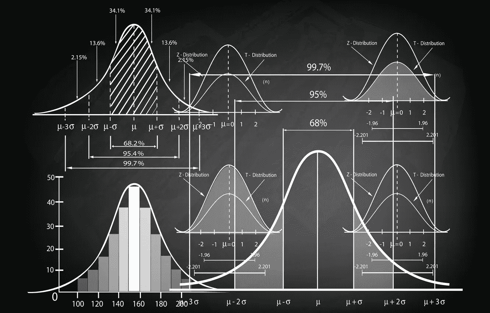
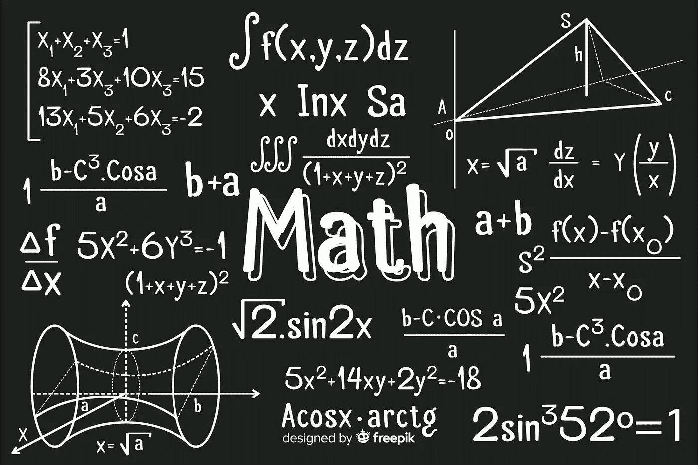

# 如何让统计学学习变得更简单

> 原文：<https://blog.devgenius.io/how-to-make-statistics-learning-easier-941421647237?source=collection_archive---------2----------------------->

***大概，要学的最复杂的数学概念。***

统计学被认为是唯一一个最终结论取决于个人对数据的解释的数学分支。因为这个特点，使得统计学很难学。在这里，我给大家介绍一下如何让统计学学习变得更简单。

## 1-选择简化课程

学习统计学的一个主要关键是选择简化的课程。在不同的网站上有很多资源需要时间、计算机和承诺。更重要的是，你可以按照自己的进度完成，不用担心最后期限。因此，学习会变得更加舒适，不会有在给定时间内完成和通过的压力。

## 2-适当记笔记

像数学一样，统计学需要适当和简单的笔记来理解它的概念。更重要的是，记笔记会帮助你记住一些你需要在继续之前记住的某些话题。做适当笔记的另一个好处是在你需要的时候帮助你记录你的进步。

## 3-学习用于统计的编程语言

近年来，编程成为统计人员最重要的工具。在这之前，你必须学习 Excel 和 SPSS 来做分析。现在，有了 python、R、Tableau 和 Power BI，进行所需的分析和可视化变得简单多了。此外，这些语言有专门的课程来做分析，不像大多数其他平台提供的。Coursera 成为最知名的学习统计分析的平台。所以，学习做统计分析真的可以帮助你学习统计学。

## 4-继续学习不同的统计概念

不幸的是，基本的统计概念普遍不足。因为大多数分析需要理解复杂的统计概念，持续学习成为平滑统计学习过程的要求。因此，渴望学习统计学的其他概念将有助于平稳这一过程。

## 5-最重要的是，在学习统计学之前先学点数学

首先，统计学需要对数学的理解。从概率开始。随着时间的推移，随着学科的发展，所需的数学变得更加苛刻。它导致进一步的主题学习起来很复杂，并且在一段时间内会变得很累。因此，在学习过程中，学习统计数学会让你的生活变得更容易。

*你是如何让你的统计学学习变得更容易的？如果你正在学习统计学，请在下面的评论区分享你的经验。*