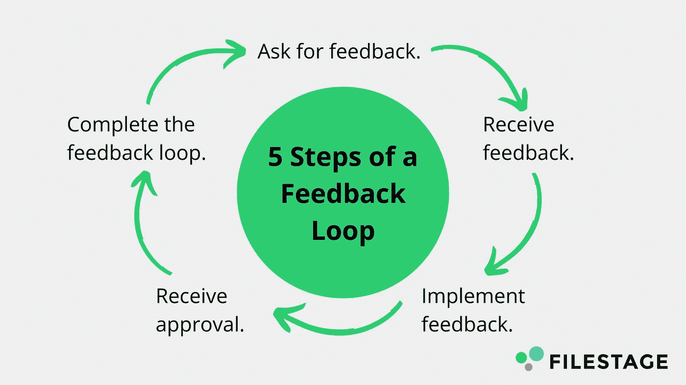
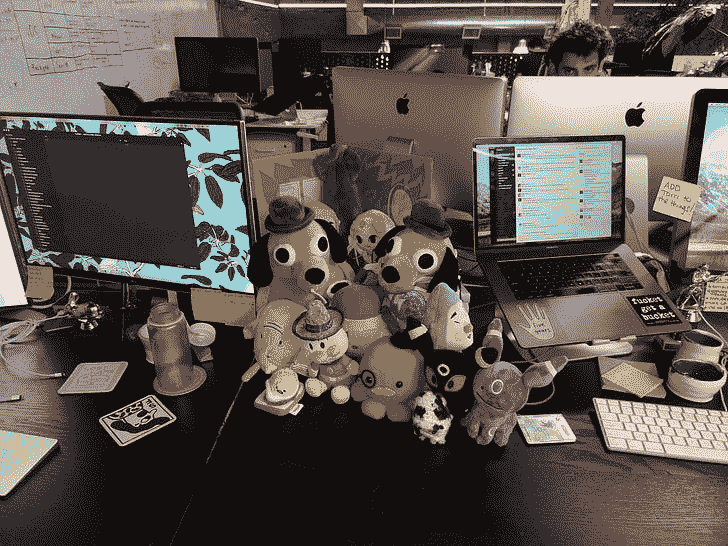

# 不熟悉技术？如何粉碎它，充分利用你的新工作

> 原文：<https://blog.devgenius.io/how-to-make-the-most-of-an-office-job-as-a-20-something-today-b8e0d6959cb0?source=collection_archive---------4----------------------->

## 关于如何表现自己以及你在新工作中可以期待什么的注意事项

在疫情期间，我受邀参加了几个脸书团体，里面都是年轻的千禧一代和年长的 Zoomers，他们都对自己的科技职业感到不抱幻想和失望。他们只有 23 或 24 岁，却以一个 35 岁以上的人的疲惫态度说话！

现在我不会粉饰任何事情；我确实认为，随着时间的推移，企业生活变得越来越缺乏创新和满足感，我觉得当我开始职业生涯时(大约十年前)，全球商业格局比今天更有希望和鼓舞人心。

也就是说，我认为在科技行业，朝九晚五的办公室生活仍然是可能的。所以，在你准备放弃之前，假设美好的办公室生活再也不可能了，收拾好你所有的东西，过着流浪的生活(并且[可能会因为不负责任的行为而被驱逐出境](https://www.vulture.com/2021/01/kristen-gray-deported-from-bali-after-viral-twitter-posts.html))，让我们考虑一下如何在办公室环境中建立成功的生活。

# 不要相信你的人生道路会是直线清晰的，要注意并在模糊中寻找机会

来源:一篇关于[如何将模糊化为行动](https://medium.com/@nstjohn10/turning-ambiguity-into-action-a-framework-52043fbedd6a)的媒体文章，作者[尼克·斯特约翰](https://medium.com/u/fc30963b1e29?source=post_page-----b8e0d6959cb0--------------------------------)

我经常看到 20 多岁的年轻人希望他们的工作高度结构化，并有一个非常线性的进展。

这种预期并不奇怪；许多高成就的千禧一代和 Zoomers 在结构化的环境中长大，并被告知——无论是通过同龄人比较含蓄地还是通过老师或父母明确地——如果他们要在这些环境中脱颖而出，他们将在生活中超越他人。

在学校，他们将完成一些工作，进入下一年或下一个班级，最终毕业。同样，他们希望他们的工作也能按计划进行；也许 N 个项目之后就给升职加薪了？

不幸的是，工作通常不是这样的(至少在科技领域是这样的)。

你的经理希望是为你的最佳利益着想，但是他们可能不知道你想从你的职业生涯中得到什么。如果你不想成为一名经理，为什么他们会来找你要求你成为一名经理？也许你想换一个不同的角色，但是除非你抓住他们，让他们和你一起制定一个计划，否则你的经理怎么会知道呢？

你不能指望你的经理能读懂你的心思，给你你想要的机会。

那么现实是，即使你有时表达了所有你想要的东西，你的经理也可能无法帮助你。如果是这样的话，积极主动，看看你周围有没有你可能错过的机会，包括其他角色，其他工作，甚至其他公司。

时刻注意寻找机会，尤其是当你的职业道路没有完全朝着你想要的方向发展的时候。积极主动地研究你的选择，询问你想要什么，如果你没有得到，不要回避离开的情况。

# 不要被动的等待(或者躲避！)来自同事和经理的反馈，学会重视并主动要求反馈

来源:[文件阶段](https://filestage.io/blog/feedback-flow-and-cycle/)

很难打破你期望你的环境被结构化的模式。事实是，即使你在一家结构严谨的公司工作，公司生活也很少像学校那样井然有序。工作任务可能不会像学校作业那样明确，因为几乎总是有一些模糊之处。你在工作中的表现很少是可量化的数字，而是定性的反馈。另外，随着你的进步、公司重组和商业趋势的转变，你的工作和对你的期望也在不断变化。学会接受并生活在模糊中，而不是[渴望可量化的反馈](https://www.youtube.com/watch?v=zNJmQ4TNhFQ)。

在学校，很容易看到一个数字和你到底错在哪里。然而，在现实生活中，做什么“正确的事”总是模棱两可，从不明显。如果你得到的反馈表明你需要成为一个更好的沟通者，要求提供你所做的不被认为是良好沟通的具体例子，并与你的经理就下次你可以做什么进行头脑风暴。

即使这可能会令人害怕，也要主动接触你的同事，向他们寻求反馈。想想下一次你需要反馈的时候——比如在你做了一个演示，开了一个会议，或者提交了一些工作之后——在那个时候问同事他们对你的工作有什么看法。

在行业中，我们经常努力缩短产品发布周期，这样我们可以更频繁地迭代产品。同样，你可以主动缩短你的反馈周期，这样你就可以更频繁地重复自己。

# 不要指望你的工作能调节你所有的人际关系，成为你全部的社交生活，一定要让自己充满乐趣，并向他人伸出援手

我的最后一个小组在场外的一个密室里，我们一起民主地计划

我在年轻人身上看到的一个不切实际的期望是等待他们的人力资源或设施团队来处理所有社交活动的规划，以及等待工作在社交上类似于大学。

是的，一些公司有员工资源小组和共同爱好俱乐部。然而，需要一家公司像你高中或大学的秋季交易会那样运作是不现实的期望:完成社交活动和活动的报名表格。现实世界有几乎无限的活动和人，需要通过自我发现和决心来发现。

公司举办联谊会或者出钱买棒球票好不好？当然了。没有那些计划好的活动是否意味着你不能让自己开心？绝对不会。

如果你发现自己在工作中希望更多的娱乐和社交活动，问问你的经理你是否能为你的团队计划一个活动，或者只是计划一个工作之外的活动。不是规划师？向你的经理或队友表达你的想法，看看你能帮上什么忙。

最糟糕的情况是，你得不到公司的认可，但你总是可以接触你喜欢的同事，在下班后的空闲时间做些事情。

# 一定要努力成为你想看到的文化和变化

这是我和我的桌子在工作时的样子。是的，我 30 多岁了…然后呢？

当我们回到办公室生活时，每个人都会心情不好，四处寻找可以成为文化大使的人。不要等着你的首席执行官或老板把你带到一个充满团队凝聚力和乐趣的愉快的办公室，而是看看你能做些什么来帮助实现它。

不，我没有无知或天真到认为每个办公室都会允许你在桌子上吹萨克斯管(如上图 Yammer 所示)，但你可以做一些事情来尝试建立你想从所有早期观点中看到的文化:

*   建议你的团队或组织重新评估 COVID 之前效率低下或不公平的流程:“现在我们回到了办公室，我认为我们应该讨论如何召开会议/评估工程水平/与设计团队合作等”
*   与你的老板或队友交谈，表达你新发现的缩短反馈周期的愿望:“我真的很想在 X 方面有所提高，所以如果你能在我做 X 的时候给我提供反馈，我会很高兴的。只要给我发一条宽松的消息/给我发一封电子邮件/到我的办公桌前/等等”
*   建议更多的团队活动，甚至可以提一个建议:“我听说现在很流行扔斧子！我们有团队出游的预算吗？我们还没见过面呢！”

我祝每个人好运，因为我们正在恢复某种形式的正常。我可能会在某个时候回到办公室，我迫不及待地带来一些毛绒动物和乐器来活跃气氛。我已经说服一个同事为他公司的办公室买了一桶啤酒。

不确定性带来了新的机会，因此感谢新冠肺炎，我们都有了一个新的机会，以我们希望的方式(重新)定义我们的职业、团队和关系。

你想创造什么样的公司文化和环境？

 [## 喜欢这篇文章？考虑给我买杯茶吧！

### 我过去常常把我的文章放在中等收费的墙后面，但当谈到教育时，我完全关注可访问性，所以现在它们都是免费的。如果你觉得你从这篇文章中得到了一些东西，并且有一些闲钱，请考虑给我买杯茶来表示你的支持！🫖

www.buymeacoffee.com](https://www.buymeacoffee.com/karomancer)