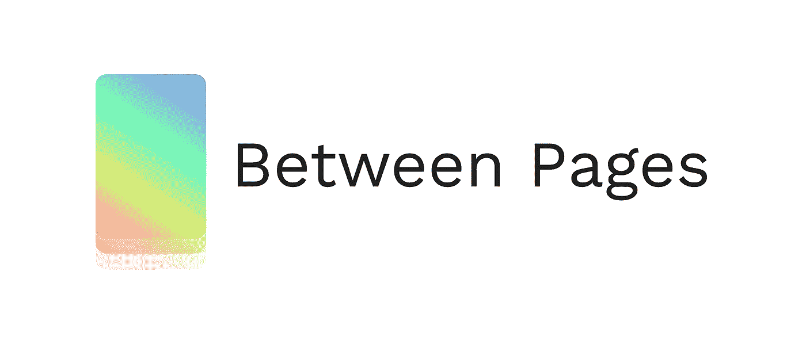

# 如何在 react native 应用程序中的页面之间进行过渡？

> 原文：<https://blog.devgenius.io/how-to-make-transitions-between-pages-in-your-react-native-app-29b75f101024?source=collection_archive---------3----------------------->



库页间徽标

# 中间页是干什么用的？

当在 react 本机应用程序上使用动画在页面之间移动时，帮助您制作动画并改善用户体验的库。页面之间使用 react native 本身调用的底层本地库 Animated，从而允许路线之间的所有动画以高 FPS 播放。

开发 Between Pages 是为了在导航之前创建从简单到复杂的动画，在每条路线之前恢复整个屏幕，使运动自然。记住，不建议在页面之间进行路由管理。

## 示例:

# 如何申请

在开始安装之前你需要看到最低要求，这样才能很好地工作，这里:[https://github.com/HubertRyanOfficial/between-pages](https://github.com/HubertRyanOfficial/between-pages)

```
npm i between-pages
```

或者

```
yarn add between-pages
```

首先，在我们开始制作屏幕动画以获得反馈之前，我们需要将提供者插入到项目的根目录中。一般是在`/App.js`里。

```
...

import { BetweenPagesProvider } from "between-pages";

export default function App() {
  return (
    <BetweenPagesProvider>
      <Main />
      {/*.........*/}
    </BetweenPagesProvider>
  );
}
```

# 第一次转变

在任何已经在我们的通用提供程序中的屏幕中，我们可以使用 Between 类型进行转换，这是我们可以使用下一个页面或屏幕进行的转换类型。

让我们看一个例子，假设我们在一个名为 Main 的屏幕上，下一个屏幕是 Home。因此，我们希望使用 useBetweenPages 传递下一个 route 组件(如第一个参数)动画过渡到下一个屏幕:

```
...

import { useBetweenPages, BetweenTypes } from "between-pages";

import Home from "./Home";

const Main: React.FC = () => {
  const { startTransition } = useBetweenPages(<Home />);

  const handleAnimation = () => {
    startTransition(
      // First parameter are animation type, duration and others thing about animations.
      {
        type: BetweenTypes.FADE,
        duration: 3000,
      },
      // Second parameter is a callback that happens when the animation is finished.
      () => {}
    );
  };

  return (
    <View style={styles.container}>
      <Text
        onPress={() => handleAnimation()}
        style={{ fontSize: 30, fontWeight: "bold", color: "#FFFFFF" }}
      >
        Page 1
      </Text>
    </View>
  );
};

...
```

在这种情况下，我们可以看到，导入页面之间的使用，您可以指定组件将被动画。所有类型的动画都在 BetweenTypes 对象中，下面是所有类型的动画。

您可以通过以下方式访问动画类型:

```
...

import {  BetweenTypes } from "between-pages"; 
```

记住[仓库](https://github.com/HubertRyanOfficial/between-pages)有更多的细节和配置。

# 你猜对了！👍😁

非常感谢，希望对伟大的 React 社区有所帮助。❤🙌

R [储存库](https://github.com/HubertRyanOfficial/between-pages)

[GitHub](https://github.com/HubertRyanOfficial)

**Tapedin:** @hubertryan

[推特](https://twitter.com/hubertryanoff)

[Instagram](https://www.instagram.com/hubertryanofficial)

非常感谢，希望对伟大的 React 社区有所帮助。❤🙌


休伯特·瑞恩标志