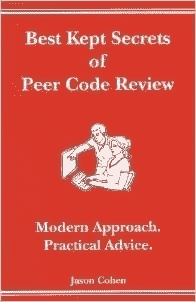

# 如何让你的代码审查员喜欢你

> 原文：<https://blog.devgenius.io/how-to-make-your-code-reviewer-like-you-465f0ea2af9e?source=collection_archive---------5----------------------->

在 [Unsplash](https://unsplash.com?utm_source=medium&utm_medium=referral) 上由[海拉戈斯蒂奇](https://unsplash.com/@heylagostechie?utm_source=medium&utm_medium=referral)拍摄的照片

当我们谈论代码审查时，我们关注的是审查者。

但是编写代码的开发人员和阅读代码的人对评审同样重要。

本文讨论了最佳书籍，这些书籍展示了当您是作者时参与代码评审的最佳实践。

你将非常擅长将你的代码发送出去进行评审，以至于**你的评审员会喜欢你**。

# 罗伯特·c·马丁的《干净的代码:敏捷软件工艺手册》

干净的代码

即使是糟糕的代码也能运行。但是如果代码不干净，它会使开发组织陷入困境。

每年，都有无数的时间和大量的资源因为糟糕的代码而被浪费。但不一定非要这样。

这本书最大的优势在于它包含了大量的代码示例，包括一些冗长而深入的示例。

许多章节不是仅仅列出干净代码的规则或原则，而是仔细阅读这些代码示例并反复改进它们。

这本书是每个专业软件开发人员的必读之作，如何想轻松通过代码评审。

**强烈推荐！**

## 同行代码评审的最佳秘密:现代方法。实用建议。(现代方法。实用建议。)Smart Bear Inc.

同行代码评审的最佳秘密

来自行业专家的十篇实用文章，给出了有效的同行代码评审的具体技术。

这本书好看又短；它为代码审查提供了可行且有用的提示。

**强烈推荐！**

## [3-学习由 Packt 出版公司审核的 Gerrit 代码](https://amzn.to/2KbV4su)

学习 Gerrit 代码审查

学习 Gerrit code review 是一个实用的指南，为您提供安装、配置和使用 Gerrit Code Review 的分步指导。

学习 Gerrit code review 是一个实用的指南，为您提供安装、配置和使用 Gerrit Code Review 的分步指导。

使用这本书，通过使用一套独特的、统一的、可用于 LDAP 认证的方法，以及将 Gerrit 与 Jenkins 和 GitHub 集成，可以加快您对 Gerrit 的采用。

非常实用和简洁的书，指导你通过代码审查和 Gerrit 设置的基本原则。

## 戴维·托马斯和安德鲁·亨特的《实用程序员》

务实的程序员

这本书不会教你代码，有时你可以阅读，但主要思想是成为一个更好的程序员，更好地思考，解决问题，自己思考算法。

它被分成几个主题。你可以边看边读，或者从头到尾跟着封面读。

这本书没有特定的语言或“食谱”可循，实际上它会打开你的思维，让你思考得更好。

**我认为这本书是每个程序员的必读之作。**

# 结论

当您参与代码评审时，寻找阻碍进展或浪费精力的模式。

你越重视评审员的时间，评审员产生的高质量反馈就越多。

如果你要求他们解开你的代码或管理简单的错误，你们两个都会遭殃。

当批评别人的作品时，情绪会变得激动，但是要意识到可能会让你的评论者感到被攻击或不被尊重的陷阱。

**奖励:**

一个普通程序员的工作环境需要长时间坐在办公桌前，周围都是小工具。

这里的现实是，程序员很有可能患上某些健康疾病和与计算机相关的伤害。

从我的个人经历来看，我有时会因为长时间坐在电脑前，有时是错误的姿势，而患上背痛。

我推荐一款 [**姿势矫正器**](https://amzn.to/3lPCzYl) **来**恢复正确的姿势，有助于预防背部、颈部和肩部疼痛的发作。**姿势矫正器**有助于在坐着、站着、躺着或进行其他日常活动时调整姿势。

我每周写一篇关于编程的文章，感谢作为我的撰稿人在 [**patreon**](https://www.patreon.com/zelakioui) 上支持我:-)

一些您可能感兴趣的相关文章:

[1-让代码比你发现的更好](https://selcote.com/2020/12/07/make-the-code-better-than-you-found-it/)

[2–4 本软件架构实用书籍](https://selcote.com/2020/08/12/4-practical-books-for-software-architecture/)

[3-设计不能被示教](https://selcote.com/2020/06/17/the-design-cannot-be-taught/)

[有史以来最好的 4-6 名程序员](https://selcote.com/2020/10/27/6-best-programmers-of-all-time/)

来源:selcote.com