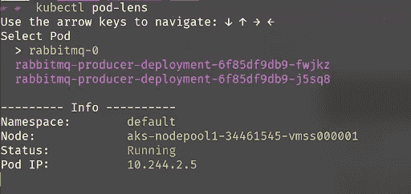
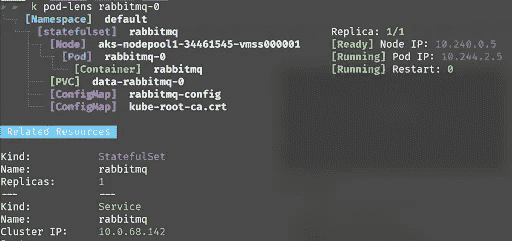
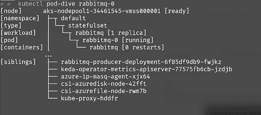
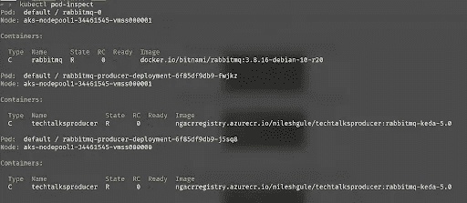
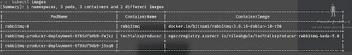
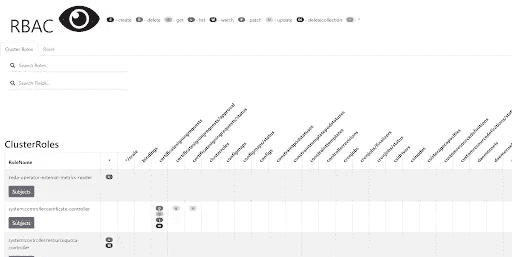
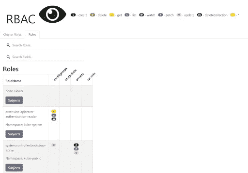

# 如何使用 Krew 包管理器管理 Kubectl 插件

> 原文：<https://blog.devgenius.io/how-to-manage-kubectl-plugins-using-krew-package-manager-34b5f1b7820c?source=collection_archive---------2----------------------->

# 背景

目前， [**Kubernetes**](https://kubernetes.io) 是最流行的容器编排平台。是与 Kubernetes 集群交互的最流行的命令行工具。Kubernetes 是相当可扩展的。在这篇文章中，我们将看到如何利用 kubectl 插件管理器 [**Krew**](https://krew.sigs.k8s.io/) 来扩展 Kubectl 的功能。

# Krew 插件管理器

你可能听说过包管理器，比如用于 Mac 的**， [**Chocolatey**](https://chocolatey.org/) 或者用于 Windows 或者 Linux 的。这些软件包管理器帮助我们在操作系统上搜索、安装、卸载和升级软件包或软件。类似于包管理器，也有插件或扩展。这些有助于扩展工具或程序的功能。插件或扩展最常见的例子是浏览器和集成开发环境(IDE ),如 Visual Studio、IntelliJ Idea、Eclipse 等。**

**我希望你现在已经了解了插件和包管理器的内容。回到这篇博文的主题，我们将看看 Krew，它是一个专门针对 kubectl 的包管理器。作为 kubectl 的插件管理器，Krew 执行 3 项主要活动**

1.  **发现 kubectl 插件**
2.  **将它们安装在您的机器上**
3.  **保持插件最新**

**在撰写本文时，krew 发布了 151 个 kubectl 插件。Krew 是跨平台的，可以在 Windows、macOS 和 Linux 上运行。请注意，有些插件只能在特定的操作系统上工作。**

**在视频中，我们可以看到如何安装 Krew 和使用不同的插件。**

# **Krew 命令**

**以下是视频中演示的一些与 krew 相关的命令**

*   **krew install krew —在系统上安装 krew**
*   **kubectl krew 列表—列出已安装的插件**
*   **kubectl krew 搜索—搜索可用插件**
*   **ku bectl krew install[插件名称] —安装插件**
*   **ku bectl krew info[插件名称] —获取关于插件的信息**
*   **kubectl krew 卸载[插件名称] —卸载插件**
*   **kubectl krew 更新—更新插件的索引**
*   **kubectl krew 升级—升级插件版本**

# **有用的 Kubectl 插件**

**在视频中，演示了这些插件。**

## **豆荚状透镜**

**Pod-lens 插件显示了与 Pod 相关的不同对象的层次结构，如名称空间、容器、与 pod 交互的服务、相关的永久卷声明(PVC)、机密等。**

****

**输出显示了一个交互式选项，用于选择名称空间中的窗格。默认情况下，它显示所选 pod 的摘要，一旦我们选择了一个单独的 pod，插件就会列出所有的依赖项。**

****

## **吊舱式潜水**

**吊舱式潜水提供了吊舱的最小视图。与 pod-lens 相比，它显示了 pod 的分层视图以及在同一节点上运行的同级 pod。这对于了解某个特定 pod 当前计划运行的节点上正在运行什么其他 pod 非常方便。**

****

## **pod-检查**

**吊舱检查有点类似于吊舱潜水。它不是显示层次结构，而是以表格形式描述信息。**

****

## **形象**

**我特别喜欢图片插件。它给出了 Kubernetes 集群中容器图像的信息。这对于了解集群中运行的所有映像以及这些映像的来源非常方便。在输出的顶部还有一个快速总结，列出了名称空间、窗格、容器和不同版本图像的数量。**

****

## **RBAC-视图**

**rbac-view 插件提供了有关集群角色和角色的详细信息。**

********

# **结论**

**Krew 在使用插件扩展 kubectl 的功能时非常方便。这使得搜索、安装和管理插件变得更加容易。如果没有 Krew，就很难知道有哪些插件可用以及如何保持更新。我在这里只展示了少数几个插件。如果你使用过任何其他的 kubectl 插件，并发现它很有用，请推荐使用 Youtube 视频或这篇博文上的评论。我很乐意听到观众/读者对 krew 和不同的 kubectl 插件的反馈。**

**直到下一次，激情编码，精益求精。**

***原载于 2021 年 8 月 29 日*[*【https://www.handsonarchitect.com】*](https://www.handsonarchitect.com/2021/08/how-to-manage-kubectl-plugins-using.html)*。***