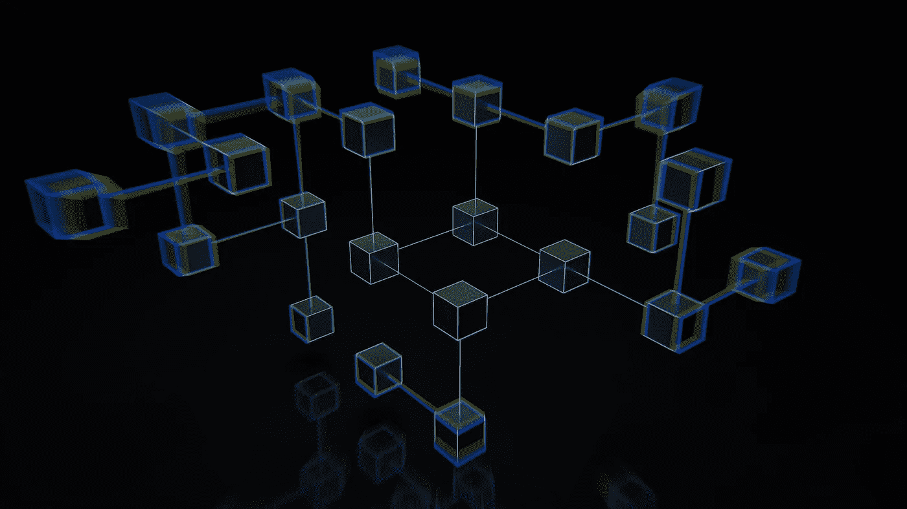
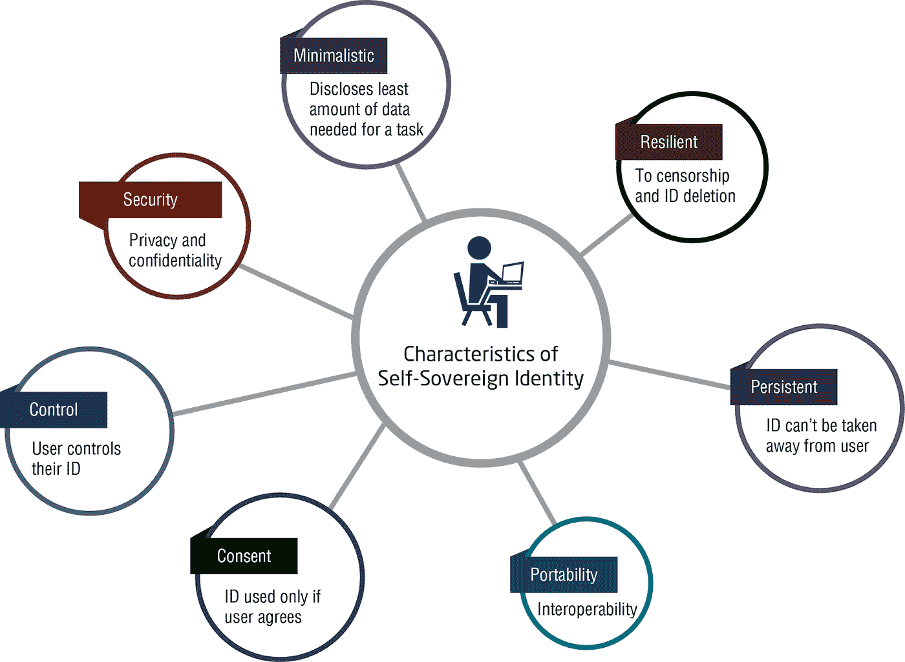
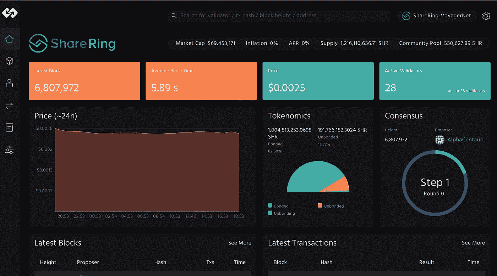
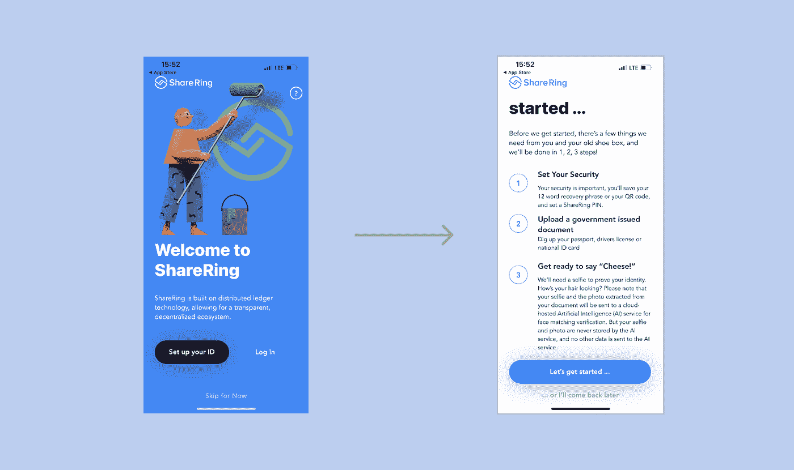

# 如何在区块链上管理自己的数字身份？

> 原文：<https://blog.devgenius.io/how-to-manage-your-digital-identity-on-the-blockchain-e03f13271db4?source=collection_archive---------7----------------------->

[照片](https://unsplash.com/photos/T9rKvI3N0NM)由 [GuerrillaBuzz Crypto PR](https://unsplash.com/@theshubhamdhage) 在 Unsplash 上拍摄

身份是我们生活中的一个重要因素。我们生活在一个一切都围绕身份的社会。

大约 8 个月前，我丢失了我的第二个号码。这包括放弃那个号码，因为我有我的主要号码。我想找回这个号码，这样我就可以继续使用它，但我不是太想这样做，因为这可能是一个紧张的过程，所以我离开了它。当时这似乎是一个更容易的选择，但我开始意识到这给我的数字身份带来了许多问题。

把我和我的第二个号码联系在一起的网站数量惊人。我们都知道，如果你在某个网站的 id 或密码遇到问题，他们通常会向你的电子邮件或手机发送一个代码来解锁。但是如果那个手机号码已经不存在了，你也不再有你以前的工作邮箱了，那该怎么办呢？

没有电话号码，您就无法进行验证，这就带来了一个无尽的循环，您必须通过这个循环才能恢复对网站、系统和应用程序的访问。以我为例，有一个主要的储蓄应用程序与我的第二个号码 PiggyVest 相关联。我花了很长时间才在 PiggyVest 上换了电话号码，并能取钱。

这个轶事涉及到我们的[数字身份](https://insights.digitalmediasolutions.com/articles/what-is-digital-identity)的各个方面。

# 什么是数字身份？

数字身份是存在于网上的关于个人、组织、团体、社区等的信息体。例如，这包括您的用户名和密码、安全号码、指纹等等。简而言之，你的数字身份包含了你在网上的一切，包括图像、银行账户信息等。

我们都有这样或那样的数字身份。作为用户，我们最关心的是隐私和安全。特别是如果我们使用金融科技应用程序，用户非常想保护他们的钱，甚至经常连配偶都不知道他们伴侣的银行应用程序的密码。

在集中式系统中，您的数字身份由提供身份的实体控制。而且在安全方面，没有隐私，因为他们知道你的身份。这就是为什么维护您的数字身份伴随着许多风险，最常见的是**隐私、安全和身份盗窃。**

这就是为什么在区块链上管理您的数字身份是重要且有益的。

# 数字身份和区块链

如前所述，您的数字身份非常重要，而您的数字身份面临的最大风险之一就是安全性。

在 web3 中，数字身份可以以你的钱包地址或私钥的形式出现，这可以让你访问许多分散的应用程序。目前，NFTs 还可以作为某些社区、活动甚至组织的数字标识。

区块链及其相关工具是人们用来使数字身份管理更加通用、安全和灵活的最新技术。因此，了解[区块链技术](https://101blockchains.com/blockchain-technology-explained/)对当前网络和数字身份的变革性影响非常重要。

当用户在平台或 DApp(去中心化应用)上注册一个[自我主权身份](https://en.wikipedia.org/wiki/Self-sovereign_identity)时，用户也在创建和注册一个去中心化标识符(DID)。

[来源](https://www.nec.com/en/global/solutions/blockchain/blockchain-for-digital-identity.html)

DID 是理解区块链在管理数字身份中的用途的一个重要概念。它是特定个人、组或对象的匿名标识符。一个例子是你的钱包地址。一个人可以使用一个私钥生成多个钱包地址，没有人能够跟踪其中一个与另一个之间的链接。

# 使用区块链技术进行数字身份认证的好处

在您的数字身份中使用区块链技术有很多好处。

## 安全性和隐私

区块链技术最重要的特征之一是不变性。它使得以不可变和加密的方式维护数据成为可能，从而保证了每一部分数据的安全性。因为数据是通过加密技术加密的，所以数字签名可以确保隐私。

## 信任

区块链在分布式账本和共识机制中维护通信元数据，这有助于跨多个节点验证数据的真实性。这是它值得信赖的地方。此外，元数据不能被人类改变或控制的事实增加了它的可靠性。

## 简单

区块链通过简化与每个利益相关方相关的流程，为身份发布者、身份所有者和身份验证者设定了明确的角色。

# 使用共享管理您的数字身份

[**共享**](https://www.sharering.network/) 是一个身份管理生态系统，使用第 1 层协议进行验证。这对于保护和管理您在区块链上的数字身份非常有用。

这是一个你可以控制你自己的身份和信息的平台。

为了与区块链技术的加密功能保持一致，该功能可以保护隐私，您可以将您的信息存储在一个称为共享库的库中。在这里，即使共享也不能访问你的数据。

# 入门指南

为了开始分享，你需要从你的应用商店下载他们的应用，这取决于你的设备是使用 [iOS](https://apps.apple.com/us/app/id1557434411) 、 [Android](https://play.google.com/store/apps/details?id=network.sharering.application) 还是 [Galaxy](https://galaxystore.samsung.com/detail/network.sharering.app) 。

下载应用程序后，您需要做的第一件事是设置您的帐户。“登录”和“设置您的 ID”会将您带到同一个页面，如果您还没有帐户，您需要在该页面注册。

按照说明进入注册页面(上图中的第二个页面)，在这里您需要设置安全措施并上传必要的文档。请确保将您的机密短语保存在安全的地方，因为它是您的仪表板的入口。然后点击“我们开始吧。”

验证文档后，只需几分钟，您将被带到您的仪表板。

通过设置您的帐户，您的**共享 ID** 已经创建，可用于访问一系列内容，如服务、活动等。您还可以创建 NFT，让您能够参加元宇宙的现场和数字活动。这些 NFT 充当你在活动中的身份，就像你在传统活动中的请柬一样。

# 结论

数字身份正日益成为全世界人民日常社会和经济生活的一部分。它对个人来说至关重要，因为它使他们能够行使自己的权利，利用服务、学习和投票等。但是，在当前的数据管理系统中，存在着许多重大问题。

在区块链上管理您的数字身份是将数字身份管理带入未来的理想方式。区块链有助于创建分散的标识符和验证凭据，您可以将这些标识符和凭据合并到跨不同平台的数字身份中。创建一个完全由您控制和拥有的数字身份。

确保您了解更多关于区块链的数字身份管理，并思考您现在和将来可以做些什么来保护和维护您的身份！