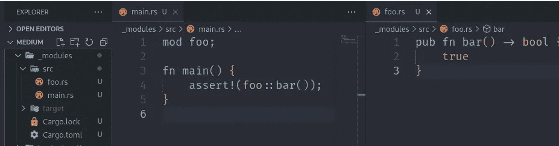

# 如何:在 Rust 中修改

> 原文：<https://blog.devgenius.io/how-to-mod-in-rust-b2da3e1ff0f2?source=collection_archive---------4----------------------->

代码库的组织是一个项目中不被注意的英雄之一。当它好的时候，你通常感觉不到，但是一旦你进入一个代码组织得很差的开发中… **你会在你自身最深处注意到它**。

今天我们将谈一谈 **Rust 模块**以及如何使用它们将我们的代码库分成不同的、易于导航的文件夹和文件。不，抱歉，这不是关于如何为游戏《Garry 的锈》的 Mod 创建者*创建 mod-救命，我不能停止说 Mod-。*

# 老兵

我们都喜欢我们的项目被分成独立的、有意义的文件，以及直观地组织在文件夹中，并带有相关的组件。Rust 允许我们轻松地为自己定义模块。每个文件中的代码都被打包到一个与文件同名的模块中，我们可以在我们的`main.rs`中用`mod <file>`来声明它。



通过声明 foo 模块，我们现在可以访问它的所有公共成员

好的，**但是** **文件夹呢？没有一个具有相当规模的项目可以不将相关代码存储在文件夹中而得到管理，但是如果我们创建一个`bar`文件夹并用`mod bar`声明它就不行了，对吧？不，对于 Rust，我们过去需要更多的 mod - *帮助-* ，我们需要`mod.rs`。**

## 优秀的老式汽车

任何带有`mod.rs`文件的文件夹都会被转换成一个模块。在该文件中，我们可以添加我们希望在模块的第一级中可用的任何代码。例如，如果我们制作了`foo/mod.rs`并在内部复制了相同的`bar`函数，上面例子中的`main.rs`仍然可以工作。

但是我们希望文件夹包含更多的文件，对吗？是的，**我们做**，mod 文件将允许我们声明它们，因为它知道这些文件的存在。我们只需要将`mod <file>`添加到 mod.rs 中，该文件的公共成员将对模块中的其他组件可用，如果它们被加上了`pub`，任何可以访问该 mod 的文件也将能够查看这些成员

main.rs 和的内容。/calc/

# 新人

我们已经看到了过去我们是如何构建所有 Rust 项目的，但是我们都知道有很多同名的文件是多么令人沮丧- *是的，我说的是你，* `*index.js*` -对吧？想要通过搜索轻松地导航到文件，以错误的文件结束，或者让 IDE 选项卡填充完整的路径名，以区分所有相似的文件。

这就是为什么 [**这个 RFC**](https://github.com/rust-lang/rfcs/blob/master/text/2126-path-clarity.md) 出现了，以及它如何最终提供了一种在项目中声明文件夹模块的新方法。怎么会？简单，像这样:

```
./foo/mod.rs -> ./foo.rs
```

## 崭新的<module>。同悦</module>

2018 年版**增加的新方式就是这样。一个具有相同名称和相同文件夹级别的文件将像我们在其中有一个`mod.rs`一样工作。有道理对吧？第一个例子展示了`foo.rs`和`mod foo`如何足以创建模块`foo`，因此额外的文件夹应该只是向该模块添加内容。**

与相同的文件。/calc/mod.rs 但这次只是 calc.rs

请记住，这两种类型是互斥的，如果您试图同时使用这两种类型，编译器会对您大喊大叫。**那家伙给你的选项是更简洁而不是相反**，保存在 mod*——这肯定是像正文里的第 27 个“mod”什么的——*。

```
error[E0761]: file for module `calc` found at both "src/calc.rs" and "src/calc/mod.rs"
 --> src/main.rs:1:1
  |
1 | mod calc;
  | ^^^^^^^^^
  |
  = help: delete or rename one of them to remove the ambiguity
```

# 哪一个

好了，我们已经看到了 Rust 提供的两种方式，那么让我们来看看两者的相同优点和缺点:

*   `<module>.rs`可以从任何单个文件构建。将文件转换成`mod.rs`模块需要重构。
*   `mod.rs`更含。所有的代码都在一个文件夹里。
*   `<module>.rs`降低噪音，没有几十个`mod.rs`档。
*   `mod.rs`名称更能描述文件的通常内容。
*   `<module>.rs`当它也包含模块根级代码时效果更好。
*   `mod.rs`与它的对应物相比，看到它为它所公开的接口写满了数百行文档，伤害会小一些。

## 所以…

哪一个？


黄金国是梦工厂的杰作之一，我爱这两个呆子

你劫持我通过所有这些职位，不回答我应该使用哪一个？是的，是的，我做到了。我的意思是，如果我们有两种选择，我认为我们能做的最好的事情就是用我们认为最适合每种情况的方法。

任何时候我发现自己想要做一个`foo/foo.rs`而没有编译器对我大喊大叫？`<module>.rs`。这个`/enemy`只是包含了一个游戏过多的敌人吗？`mod.rs`因为它让我想起了`index.js`。但是所有这些敌人都实现了`Enemy`特性吗？然后我觉得含有那种特质的`enemy.rs`比较好。他们也实现`Spawnable`吗？他妈的，让我们回到`mod.rs`这样它就可以容纳两者，而不用用名字遮蔽另一个。感谢上帝这是灵活的。

你看到了吗？**两者都好**。请不要把它们混在一起。

# 奖金

作为一个小小的奖励，记住`pub use`是存在的，它可以帮助你声明和隐藏模块，同时你可以公开它的成员。这有助于基于位于模块根的代码做出决策。你可以像这样暴露它，并且仍然把它分开。

切断这种重复的路径感觉很好

# 奖金 2

下面的 Reddit 帖子包含了一个关于这个主题的很好的讨论，以及一个展示不同之处的漂亮图片。去看看。

关于 Rust 中模块层次结构的 Reddit 讨论

和往常一样，回购中有完整的源代码:

[](https://github.com/kriogenia/medium/tree/main/modules) [## 中等/主要克里金属的模块/中等

### 存放我的媒体帖子中使用的示例的存储库

github.com](https://github.com/kriogenia/medium/tree/main/modules)