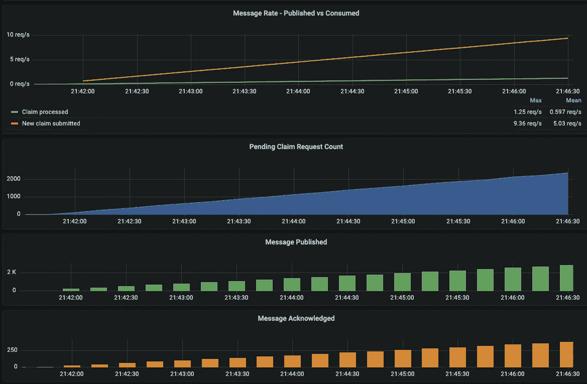

# 如何监控 Spring Boot 消息驱动服务的系统性能

> 原文：<https://blog.devgenius.io/how-to-monitor-system-performance-of-a-spring-boot-message-driven-service-48b9b91ab5ef?source=collection_archive---------0----------------------->

## 让我们来看一下有用的系统指标——吞吐量、消耗率、处理时间和处理结果


卢克·切瑟在 [Unsplash](https://unsplash.com/s/photos/visualization?utm_source=unsplash&utm_medium=referral&utm_content=creditCopyText) 上的照片

没有适当监控的系统配置是失败的。

尽管您的系统提供了很棒的功能，但是服务是不受控制的，因为您不知道系统的健康状况和性能。

您需要能让您了解系统状态和性能的系统指标。通过简单地轮询服务的端点并监控响应时间，可以很容易地观察到使用 RESTful APIs 的服务。然而，消息驱动服务在后台运行，并以异步方式处理请求。如果没有 RESTful API 接口，服务基本上对你是不可见的，知道服务内部发生了什么是一个挑战。

假设我们有一个保险索赔处理服务，它是一个消息驱动的服务，从消息队列接收索赔请求，并将审查结果输出到另一个队列。


保险索赔处理服务

现在的任务是监控服务的性能。一种简单的方法是在系统日志中记录流程时间，然后从日志文件中提取性能指标。很简单，不是吗？

尽管添加时间测量的代码是一项简单的任务，但是为从系统日志中提取数据构建脚本并使这个过程自动化将需要您付出努力。将代码添加到您想要跟踪性能的所有系统逻辑也将是一项单调乏味的任务。

与依赖系统日志获取性能指标不同，Spring Boot 的 Actuator 等成熟的库为您提供了一种无需编码即可自动获取系统指标的便捷方式。加上 Prometheus 和 Grafana 的现成服务器堆栈，系统指标可以显示在一个有意义的系统仪表板中。下面的 Grafana 仪表板示例显示了保险索赔处理服务的吞吐量和处理时间。


保险索赔处理 Grafana 仪表板

事实上，设置这样一个仪表板既简单又直接。它只涉及配置和简单的编码，如果你想捕获应用程序特定的统计数据的话。在本文中，我将向您展示如何使用 micrometer 和 Prometheus 和 Grafana 的流行服务器堆栈来实现 Spring Boot 消息驱动服务的系统监控。

# 用于观察的服务器堆栈

就系统监控而言，Prometheus 和 Grafana 是出色的现成服务器堆栈。下面的高级组件图清楚地说明了系统指标的数据流。Prometheus 定期通过 REST endpoint 从应用服务和 RabbitMQ 等公共组件中获取指标。然后，Grafana 从 Prometheus 中提取指标，并作为仪表板展示的前端。


用于观察的服务器堆栈

# 消息驱动服务的系统度量

第一步是支持系统指标的生成。对于基于异步消息的服务，有 3 种方法可以获得系统信息:

*   消息代理度量
*   Spring Boot 预置指标
*   自定义指标

## 消息代理度量

对于具有消息驱动服务的系统架构，使用消息代理是一种常见的做法。它充当服务间消息传输的中心枢纽。因此，您可以找到已发布消息、已确认消息、处理速率等的计数器。比如 RabbitMQ 为普罗米修斯提供了一个插件。启用插件后，所有系统信息将通过两个端点公开:

*   `GET /metrics` —对于聚合指标
*   `GET /metrics/per-object` —针对单个交换机和队列的指标

以下是端点响应示例的屏幕截图


RabbitMQ 聚合指标


每个对象的 RabbitMQ 指标

基于来自 RabbitMQ 的指标数据，我们可以使用以下图表创建一个 grafana 仪表板示例:

*   消息速率—发布到队列的索赔请求和从队列中消耗的索赔
*   队列中待处理的索赔请求数
*   发布到交易所的索赔请求的数量
*   已确认的索赔请求数

这些图表让我们了解了系统的性能。让我们看一下第一个消息速率图表，您可以看到索赔处理服务每秒处理大约 1 个请求，但是每秒大约有 10 个传入请求。显然，随着队列中挂起请求数量的增加，该服务消耗消息的速度不够快。



Grafana 仪表板— RabbitMQ 指标

## Spring Boot 预置指标

接下来，Spring Boot 的致动器支持普罗米修斯的度量列表，它通过 HTTP 端点公开信息。对于与消息队列相关的集成，Spring Boot 提供了以下带有前缀 **spring_integration_，**的度量，它们是消息监听器和发送器的计数器和处理时间:

*   `spring_integration_send_seconds_sum` —总处理时间
*   `spring_integration_send_seconds_count` —消息请求总数
*   `spring_integration_send_seconds_max` —最大处理时间


Spring Boot 执行器消息队列度量

要为 prometheus 启用 metric endpoint，请对 Maven pom.xml 和 application.yaml 应用以下配置。

**Maven pom.xml**

将 Spring Boot 执行器和测微计添加到 maven pom.xml 的依赖项中

```
***<*dependency*>
<*groupId*>***org.springframework.boot***</*groupId*>
<*artifactId*>***spring-boot-starter-actuator***</*artifactId*>
</*dependency*>******<*dependency*>
<*groupId*>***io.micrometer***</*groupId*>
<*artifactId*>***micrometer-registry-prometheus***</*artifactId*>
<*scope*>***runtime***</*scope*>
</*dependency*>***
```

**Application.yaml**

配置 Spring Boot 为普罗米修斯公开端点

```
**management**:
  **endpoints**:
    **web**:
      **exposure**:
        **include**: prometheus
```

基于性能指标，可以创建 Grafana 图表来显示索赔请求的处理率和平均处理时间。


Grafana 图表— Spring Boot 致动器

## 自定义指标

如果需要特定于应用程序的信息，message broker 和 Spring Actuator 提供的系统指标可能不适合业务需求。例如，业务运营可能有兴趣了解按状态划分的索赔审查结果的数量，这样他们就可以预测索赔案例跟进的工作量。

在这个例子中，我将向您展示如何创建一个计数器来跟踪索赔结果的数量(按状态——已批准、已拒绝和需要跟进)。我们将基于一个名为 Micrometer 的库来构建指标，该库支持不同类型的指标，如计数器、计时器和计量器。

下面的示例代码在类构造函数中注册了新的计数器名称。新的指标名称是“claim.result ”,带有标识索赔状态的标记“status”。在索赔审查过程结束时，我们根据审查结果的状态增加相应的计数器。

随着新指标的注册，Spring Actuator 将在执行器的端点中包含这些指标。示例响应数据显示了新添加的指标“`claim_result_total`”。


Spring Boot 自定义指标

然后，我们可以基于计数器创建有趣的 Grafana 图表。它显示给定时间段内的索赔审查状态计数，一个饼图显示一段时间内结果状态的百分比和数量。


Grafana 图表—自定义指标

# 探索保险索赔处理服务的系统仪表板

让我们设置服务器堆栈，并为保险索赔处理服务创建一个仪表板。查看这个 GitHub 库，docker compose 定义提供了所有配置和组件。

[](https://github.com/gavinklfong/spring-test-container-demo) [## GitHub-gavinklfong/spring-test-container-demo

### 这个存储库的目的是演示一个全自动集成测试的实现，使用…

github.com](https://github.com/gavinklfong/spring-test-container-demo) 

一旦您克隆了存储库，在终端控制台中将目录更改为`<your local repository>/docker-compose`,然后运行这个命令来启动整个服务器栈。

```
docker compose -p “insurance-claim-demo” up
```

确保您的本地计算机上安装了 docker 引擎，并且以下端口可用:9090、5672、15672、15692 和 8080

## 格拉夫纳

使用默认的登录 id: admin 和密码:admin 进入 Grafana 门户网站`[http://localhost:3000](http://localhost:3000)`。

您需要将 Prometheus 配置为默认数据源。转到配置→数据源并创建一个新的数据源。


Grafana —配置

将`[http://prometheus:9090](http://prometheus:9090)`设置为数据源的 Prometheus 服务器的 URL。


Grafana 数据源

然后，点击“上传 JSON 文件”并在`<your local repository>/docker-compose/Claim-Request-Processing-Dashboard.json`中选择仪表板文件


Grafana —导入仪表板

然后，您将能够看到这个没有数据的仪表板。


保险索赔仪表板

要将示例索赔请求输入到系统中，运行此命令以在独立的容器中启动索赔请求生成器。

```
docker run --rm -e REQ_PER_SEC=4 \
-e SPRING_PROFILES_ACTIVE=docker \ 
--network=insurance-claim-demo_default \
whalebig27/demo-insurance-claim-driver
```

您将在系统控制台中看到收到的索赔审查结果。数字将出现在 Grafana 仪表板中。然而，由于声明请求生成器每秒向消息队列提供 4 个声明请求，声明处理器每秒只能处理大约 1 个声明。因此，您将观察到，随着生成器运行一段时间，挂起的索赔请求的数量在增加。

通过调整每秒请求数的参数“REQ_PER_SEC ”,您可以随意试验不同的吞吐量设置，并观察 Grafana 仪表板中的结果。


保险索赔处理仪表板

# 最终想法

系统度量是维护系统健康的关键信息，它不仅提供系统状态，还提供其他有用的信息，如处理时间和系统性能指数。从消息驱动的服务中收集系统指标很容易，因为默认情况下，Spring Boot 执行器会自动生成一组全面的系统指标，并通过 HTTP 端点公开信息。

当 Prometheus 和 Grafana 的服务器堆栈神奇地将系统指标转化为有意义和有影响力的仪表板时，探索指标是很有趣的。您探索得越多，就越能理解系统行为，并有助于系统调优和优化。