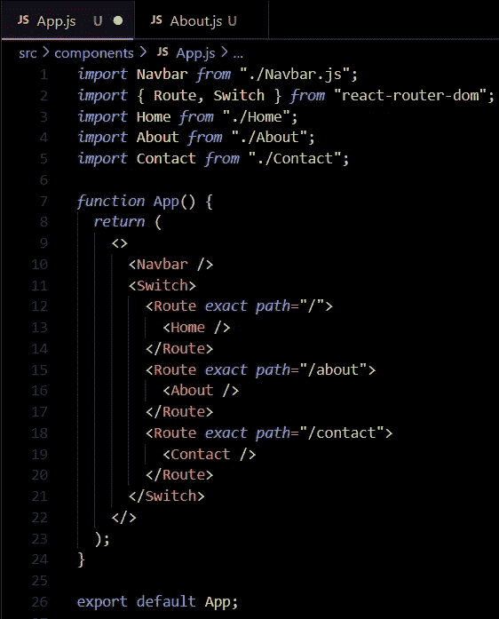
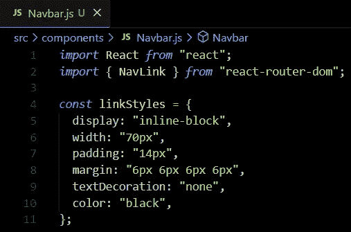

# 如何使用 React 路由器浏览链接

> 原文：<https://blog.devgenius.io/how-to-navigate-through-links-using-react-router-fd70077ccc0d?source=collection_archive---------4----------------------->

# 什么是 React 路由器？

***React 路由器*** 是 **React** 中用于路由的库。它帮助我们浏览一个 **React** 应用程序中的各个组件。创建一个小应用程序将帮助你练习和理解如何开始使用 ***React 路由器*** 。因此，让我们创建一个小的 **React** 应用程序。我们将使用 ***React 路由器*** 在这些组件之间导航。

**要开始使用 React 路由器，我们需要安装 react-router-dom:**

$ npm 安装 react-router-dom@5

**注意:对于这个例子，我们将使用 *React 路由器版本 5。***

**安装后，我们首先需要从 react-router-dom 导入 browser router:**

***注:我们从一个*** [***创建-反应-app***](https://github.com/facebook/create-react-app) ***开始。让我们首先在这个新创建的 react 应用程序中编辑我们的 index.js 文件。***

# 为什么我们要用 BrowserRouter 包装我们的应用组件？

***浏览器*路由器**组件是使用**路由**的关键。这是我们声明如何使用**反应路由器**的地方。注意，在我们的[**create-react-App**](https://github.com/facebook/create-react-app)的 index.js 中，BrowserRouter 组件包裹着我们的 **App** 组件。这让我们可以在应用程序的任何地方使用 ***Route*** 组件和其他 **React Router** 组件。

**现在让我们打开 App.js 文件并开始编辑:**

1.  **首先我们必须导入*路线*路线**

*从“react-router-dom”导入{ Route}*

将路径组件导入我们的 App.js 文件

**2。**现在我们可以使用我们的 **Route** 组件来包装我们的 **Home、About、**和 **Contact** 组件，以便我们可以将它们用作链接，如下所示。

# **路由组件**

***路由*** 组件有一个 ***路径*** **属性**，我们可以用它来输入我们的 **URL** 。如果用户导航到 ***路径*** **属性**中的 **URL** ，我们将呈现包装在 ***路径*** 组件中的*子组件*。

# 开关组件

我们目前设置它的方式是可行的，但是它将总是**呈现**home 组件，即使我们在我们的 **URL** 中的“/”后面键入了错误的字符串。解决这个问题的一种方法是使用***React-Router-Dom***中的 ***开关*** 组件。

1.  **从*导入*开关*反应路由器***

从“react-router-dom”导入{ Route，Switch }

从 react-router-dom 导入路由和交换机。

2.现在让我们用一个 ***开关*** 组件来包装我们目前所拥有的。

3.现在让我们在 ***路径*** 之前添加一个 ***精确*** 属性，这样它将指定一个精确的 **URL** 来渲染我们的*子组件*。

添加一个精确的属性，以便我们的子组件只使用这个特定的 URL 进行渲染。

太好了，如果我们在浏览器中输入链接，例如“/”、“关于”或“/联系人”，我们的链接就会正常工作。现在我们只需要给它添加一个 onClick 功能，这样它就可以根据我们在导航栏中点击的单词来浏览每个 URL。

# 使用 NavLink 添加 onClick 功能

我们可以继续添加一个 *onClick* **prop** 和 **functions** 来处理链接导航，但是 ***React Router*** 有一个更简单的方法。React 路由器允许我们使用 ***Link*** 或 ***NavLink*** 。 ***链接*** 适用于标准**超链接**而**样式**不是优先选项。对于这个例子，让我们使用 ***导航链接*** ，这样我们就能够将**样式**添加到显示在**导航栏**中的链接中。

1.  **从*导入*nav link*React 路由器***

从“react-router-dom”导入{ NavLink }

从 react-router-dom 导入 NavLink

2.让我们使用 ***NavLink*** 组件将我们的链接包装在我们的 **Navbar.js** 中。这将允许我们使用样式，例如“ ***活动的*** ”类，当显示的是 **URL** 时，**样式化**单词/链接。

3.**我们必须使用“to”属性和“exact”属性来阐明我们在 *NavLinks* 组件中的路径。**

厉害！我们现在能够使用我们的导航栏，这样当点击时，它**有条件地**呈现我们的 ***家******关于*** ，以及 ***联系人*** 组件。

# 添加 CSS

现在没有任何**样式**看起来有点奇怪，所以让我们添加一些**内联 CSS** 。你可以随意添加它，但是在这个例子中，我们将使用**内嵌样式**来添加它。然而，有一些**造型**在幕后进行，如我们的**导航条类**和 **ul 标签**。如果它看起来不完全像显示的那样，简单地添加符合你想要的外观的 **CSS** 。

使用 NavLink 添加包含 activeStyle css 功能的内联 CSS。

这里我们添加了我们的样式**道具**和一个常量" ***链接样式*** "。我们还添加了一个内嵌的 ***activeStyle*** ，将选中的**链接**的背景改为黄色。

我们现在知道如何使用***React 路由器*** 来浏览我们的导航栏链接！