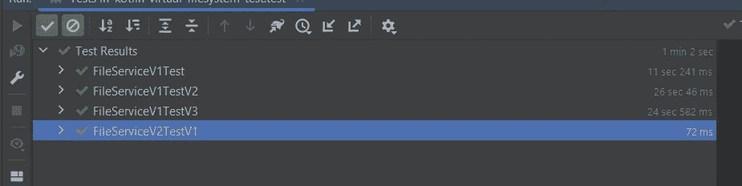

# 如何优化与文件相关的测试

> 原文：<https://blog.devgenius.io/how-to-optimize-file-related-tests-1140e500aa0c?source=collection_archive---------4----------------------->


在今天的文章中，我想展示如何使用虚拟文件系统来运行与文件相关的测试，而不需要清理在执行过程中创建的文件和目录，并且与本地文件系统相比，还减少了 IO 操作的时间。

在处理文件(创建、写/读、删除、压缩)的应用程序中，有必要在测试中创建文件和目录，运行测试，并在测试完成后清理文件，以便不会对后续测试产生副作用，也不会破坏本地文件系统。

现在挑战已经很明显了，让我们从设置 IntelliJ 开始，在一个具体的简短例子中展示它。

这是我想为之编写测试的生产方法:

该方法获取一个文件列表和一个文件名，并从中创建一个具有指定名称的 zip 文件。为简单起见，所有文件都在一个目录级别上。

在下一步中，我将为此方法创建测试。我从一个非常简单实用的方式开始。

## 使用自定义临时目录

在第一次测试之前，我在项目目录中创建了一个定制的临时目录，并在测试执行之后清除它。在该类所有测试结束时，该目录将被删除。

测试类的第一个版本如下所示:

在测试类中使用临时目录的处理会导致@AfterAll 注释不起作用的问题，因为它需要是静态的，这对于 Kotlin 中的类的方法是不可能的(只能对伴随对象的方法这样做)。

为了删除 test 类中对 test 目录的处理，并且能够在其他测试类中重用它，我将相关代码移动到一个自己的类中，我可以将它作为 Junit5 扩展包含在 test 类中。我只需要为此实现相应的接口。

测试扩展需要是一个单独的对象来使用*毕竟*回调方法需要从一个静态上下文中调用。

只要没有并行运行的测试使用这个临时目录测试扩展，这个解决方案就可以工作。为了减少这个问题，还有一个可能的选择，那就是为每个测试类使用一个唯一的临时目录。

## 为每个测试类使用单独的目录

为了能够并行执行多个测试类，每个测试类都必须使用自己的临时目录。因此，我为每个测试类创建一个目录，而不是为所有的测试类创建一个目录。对于这个解决方案，我还做了一个额外的改变。我没有在项目目录中创建临时目录，而是使用临时用户目录(由系统变量“ *java.io.tmpdir* ”指定)。随机 UUID 函数用于创建随机序列的简单函数。

这个解决方案比第一个好，但仍有一些缺点。首先，在一个测试类中并行运行测试方法是不可能的，其次，要对本地文件系统进行大量的 IO 操作。

在展示消除这一缺点的解决方案之前，我不想隐瞒还有一个 JUnit5 的板载解决方案，它为测试提供了一个临时目录。

## 使用 Junit5 临时目录

Junit5 带来了它自己的扩展，它的工作方式与上面那个非常相似( [TempDir](https://junit.org/junit5/docs/5.4.1/api/org/junit/jupiter/api/io/TempDir.html) )。它使用*文件*或*路径*的功能来创建临时文件，并使其可用于测试。使用 Junit5 的 *TempDir* 的测试如下所示:

有了它，就没有必要编写定制代码，而且在测试执行之后就可以进行清理了。因为可以为每个测试方法使用一个临时目录，所以可以并行执行它们。剩下的就是写入本地文件系统。

因此，让我们在另一个解决方案中优化最后一个缺点。

## 使用虚拟文件系统

对于 Java，有一个虚拟文件系统的实现可用，它可以用来消除上述解决方案的其余缺点。虚拟文件系统被称为 [**Jimfs** 。](https://github.com/google/jimfs)通过向 *build.gradle.kts* 添加以下依赖项，可以在应用程序中使用它:

```
*testImplementation*("com.google.jimfs:jimfs:1.2")
```

为了使用 **jimfs** ，有必要更新应测试的方法的实现。当前使用的*文件*类只适用于真实的文件系统，所以在测试中不可能用虚拟文件系统来替换它。只有 NIO2 API 可用于此，所以第一步是更新方法，改为使用*路径*。

有了这个改变，就可以在测试中使用 jimfs 文件系统了。因为没有必要在测试后清理目录，所以清理步骤不再是必要的。为了能够并行运行一个类的测试方法，我将 singleton 对象改为 class。

将虚拟文件系统与本地文件系统进行比较的性能优势在这个示例测试用例中并不重要，因为只创建了较少的文件，而且文件大小也非常小。

为了获得真实的性能差异，有必要增加测试中的 IO 操作，同时增加文件大小。所以我创建了一个小的帮助器方法，在每个测试文件中添加 1000 次测试字符串。经过这一小小的改动，4 个测试类的比较如下所示:



与本地文件系统测试相比，使用虚拟文件系统的测试只需要很少的时间。但是因为将文件保存在内存中，所以与本地文件系统的使用相比，内存的使用量更大。这不是免费的…但在大多数情况下，速度比有效的内存使用更重要。

有一个更真实的例子。最近我发布了第一个版本的 ktor-encryption-server ，它也与文件操作紧密相关。这是在测试中引入虚拟文件系统的最初原因。在测试中引入虚拟文件系统之前，我一直保留测试中创建的小文件，以避免过多增加测试运行时间。有了虚拟文件系统，现在可以用更大的文件运行更真实的测试场景。

暂时就这样了。你可以在 Github 上找到仓库的代码:[https://Github . com/PoisonedYouth/kot Lin-virtual-file system-test](https://github.com/PoisonedYouth/kotlin-virtual-filesystem-test)