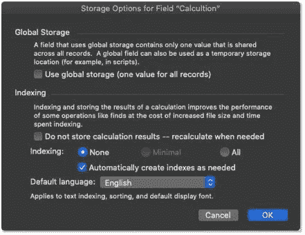
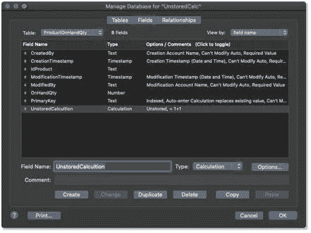
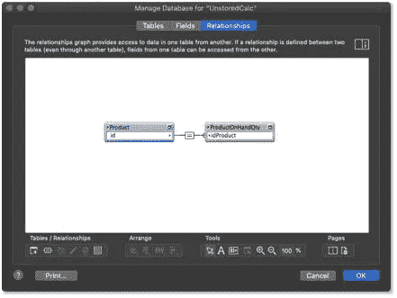
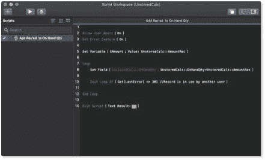

# 如何优化 FileMaker 未存储的计算函数

> 原文：<https://blog.devgenius.io/how-to-optimize-filemaker-unstored-calculation-functions-b84472abefba?source=collection_archive---------10----------------------->

总有改进的空间，这当然适用于定制应用程序开发。我们已经讨论了在设计我们的定制 FileMaker 应用程序时需要注意的一些事情，例如当我们[远程访问 FileMaker](https://blog.supportgroup.com/accelerate-how-we-access-filemaker-remotely?utm_source=BlogPost-2020-08-20&utm_medium=Medium&utm_campaign=traffic)时如何有效地部署它们，以及提高记录创建和修改的[性能](https://blog.supportgroup.com/optimize-filemaker-server-performance?utm_source=BlogPost-2020-08-20&utm_medium=Medium&utm_campaign=traffic)。单单缓解这些瓶颈就能把我们信赖的旧通勤车改造成我们梦寐以求的热门汽车。但是，即使是运转最好的机器也可能需要不时地进行一些内部重组，才能继续运转。

通常情况下，当我们作为问题解决者开始我们的旅程来创建杀手级应用程序，以改善我们的工作流程并解决我们复杂的工作规律时，我们往往会关注让应用程序工作的最起码的要求。在这一点上，我们优先考虑功能而不是形式，但最终，我们会回到优化应用程序处理任务的方式。以库存跟踪系统为例，一个主要功能可能需要以下简单计算:

收到的库存-发运的库存=库存。

但是这种简单的计算往往会变得更加复杂:

(订单上的库存——收到的库存——售出的库存，未发货的库存=可供销售的库存。

这种计算的复杂性可能会增加，因为人们希望获得有关这些数字的详细信息。随着时间的推移，这种向复杂性的自然滑动，加上我们跟踪的交易的绝对数量，将会不断增加，并共同减缓一切。我们如何在不牺牲准确性的情况下将 pep 放回老爷车？嗯，通常，答案是用其他东西代替实时的——用 FileMaker 的话来说是未存储的——计算。

# 什么是未存储的计算？

在我们讨论优化 FileMaker 中的非存储计算之前，我们先来讨论一下什么是非存储计算以及它们是如何工作的。未存储的计算字段只是手动标记为未存储的计算。如果某个计算与另一个单独的表或另一个未存储的计算存在某些依赖关系(部分计算，如字段和变量), FileMaker 会自动将该计算标记为未存储。我们可以通过查看字段列表来判断我们的计算是否未存储。

我们还可以查看现场的选项卡。

FileMaker 将某些字段指定为未存储，因为每当解决方案中的某个地方发生变化时，系统都需要很长时间来连续检查和存储这些计算的结果。因此，FileMaker 只在向用户显示这些字段时才重新计算它们。这对于当时没有使用特定数据的用户来说非常好，但是对于使用这些数据的用户来说，这是一种不同的体验。回到我们的库存示例，当前正在查看库存仪表板、输入订单或试图了解他们想要的东西是否在手边的用户会受到计算的影响。对于那些少数选择查看应用程序这些方面的人来说，这种滞后可能会非常令人沮丧。

# 商店里的其他东西

应用程序开发是一个迭代的过程。当然，我们的工作流程会不断发展，但我们也可能会找到方法，在我们的应用程序中更高效地完成工作，而不是在紧迫的期限内完成任务或完成报告。用户反馈也可能激励我们最终改进流程和/或计算。

就其本身而言，未存储的计算没有任何问题。它们是轻量级的，通常不会降低任何东西的速度。事实上，在某些情况下，它们是某些事情正常工作所必需的，或者是隐藏条件和条件格式等其他功能的唯一选项。尽管如此，在领域内，如果需要的话，我们通常还有其他选择。因此，如果我们遇到用户提到屏幕重绘时间过长或滚动时列表缓慢的情况，那么罪魁祸首很可能是某个字段中或隐藏在某个布局元素(如隐藏条件或条件格式)中的一些复杂的未存储计算。

我们如何解决这个性能问题，尤其是当我们知道一个非存储的计算是为了提高性能而设计的时候？答案是从源头捕捉变化。在我们需要的时候执行这个功能是有意义的。大多数未存储的计算跟踪不规则变化的事物，如库存水平、未付发票总额和项目进度。当一个人或流程修改或创建一些数据时，通常会发生变化，比如当我们将一项任务标记为完成，或者从客户那里收到订购的项目或付款时。这些事情中的大部分可以在事件发生时被捕获，并传递到信息阶梯上更高的另一个地方。

让我们再充实一下。例如，我们在仓库中收到一个项目，我们希望相应地增加我们的库存数量。我们可以用几种不同的方法来实现这一点，包括简单地将数据输入到字段中。但是，我们也可以创建一个脚本化的流程，该流程将捕获收到的数量，然后在后台将现有数量增加相应的数量—接收 2，添加 2。我们将在系统中的所有点上设置类似的流程，人们可以在这些点上间接修改现有量，例如装运、开具发票和处理退货。我们还可以在每个字段上设置脚本触发器来完成这项工作，甚至可以安排一个每小时在我们的服务器上运行的脚本来管理工作流。底线是，我们已经将现有量字段从一个复杂的、不断变动的计算转换为一个静态的数字字段。这个静态数字字段可以快速查找、排序并显示在列表中，不像它所取代的非存储计算。

当我们使用这种递增方法时，有一件事需要注意，特别是在多用户环境中，那就是记录锁定。因为我们直接修改记录，我们可能会遇到另一个用户手动编辑我们试图增加的主记录字段的情况。例如，他们可能试图更改项目名称。在这种情况下，我们增加现有量的尝试将被忽略，因为其他用户已经锁定了记录。因此，我们的库存数字将是关闭的。一种解决方法是将现有量字段移到一个单独的表中，并将其与产品表相关联(一对一关系)。

这允许我们增加可用数量，而不用担心其他人锁定产品记录。为了更加简单，我们通常在 increment 脚本中放置一个循环，检查记录是否被锁定，如果被锁定，脚本将等待一会儿再重试。

因为试图修改该记录的唯一操作是脚本，所以我们可能经历的延迟应该非常短暂。

# 储存性能

这些只是我们从未存储的计算中恢复性能的几种方法。请记住，未存储的计算是有帮助的，事实上，它们通常比脚本化的递增过程更容易设置和维护。我们只建议在它们导致性能问题时寻找替代品。当 v12 增压发动机的目的是小心翼翼地通过人口稠密的地区时，没有理由将它放入小型货车中。但是，如果我们的工作需要那辆小货车在沙漠中呼啸而过，也许换个发动机和一辆巨型卡车的悬挂系统就可以了！

我们对 [FileMaker 性能](https://blog.supportgroup.com/tag/filemaker-performance?utm_source=BlogPost-2020-08-20&utm_medium=Medium&utm_campaign=traffic)策略的三部分讨论到此结束。我们希望您发现我们的建议是有帮助和有成效的。查看我们其他的 [FileMaker 开发技巧和窍门](https://blog.supportgroup.com/developer-resources?utm_source=BlogPost-2020-08-20&utm_medium=Medium&utm_campaign=traffic)。

*原载于 2020 年 8 月 20 日 https://blog.supportgroup.com***。**