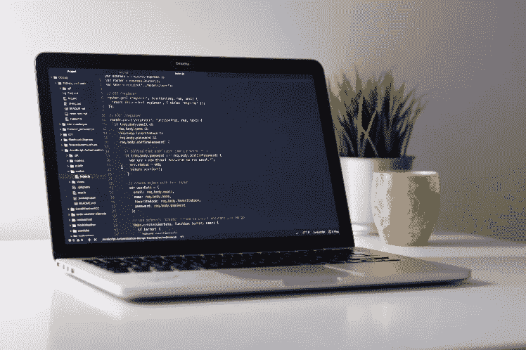
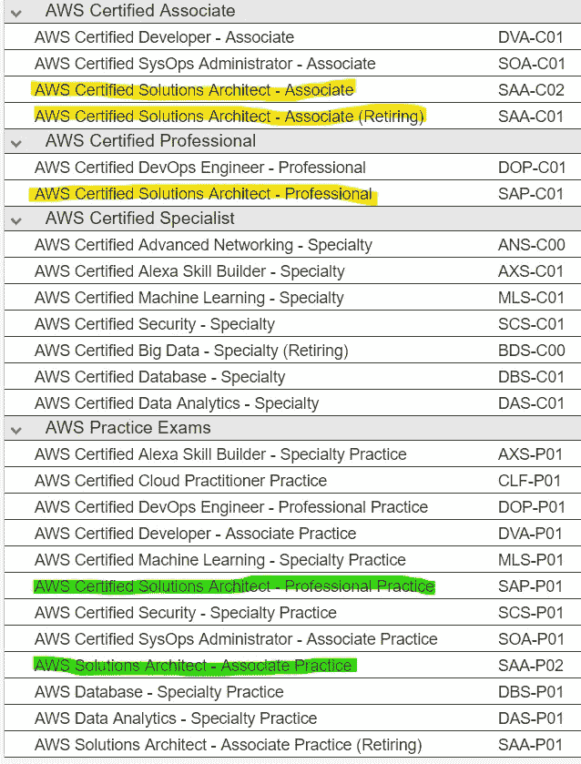

# 如何通过 AWS 认证解决方案架构师考试

> 原文：<https://blog.devgenius.io/how-to-pass-aws-certified-solutions-architect-exam-6dfe0fba9ecd?source=collection_archive---------2----------------------->

权威指南

当我与朋友和同事讨论各种认证时，我清楚地看到了许多沮丧和疑问，所以我决定写这篇文章，以便帮助所有想成为 AWS 认证解决方案架构师的人。

目前，我拥有 **AWS 认证解决方案架构师——助理**和**谷歌专业云架构师。**本文是关于 AWS 认证的，基于我获得 AWS 认证解决方案架构师助理的经验，同时许多内容也适用于专业级，助理和专业级之间的差异在下面的文章中有具体说明。

## AWS 认证的一般类型

AWS 提供的所有认证都可以在[这一页](https://aws.amazon.com/training/learning-paths/)上找到，如你所见，AWS 提供了三种不同的认证途径。这里的“路径”只不过是一种组织课程和考试并帮助你浏览它们的方式。因此，可用的路径有:

1.  基于角色
2.  解决办法
3.  对于 APN 合伙人

AWS Certified Solutions Architect 正走在基于角色的道路上，我们稍后将对此进行探讨，但首先让我简单介绍一下其他选项。在解决方案路径上，你会发现像 Alexa 技能生成器、游戏技术或数据库这样的东西——换句话说，可以通过主题而不是角色来描述的东西。在 APN 合作伙伴路径(APN 代表“亚马逊合作伙伴网络”)上，你会发现更多与业务相关的路径，这些路径跨越了其他路径中可以找到的相同类别和认证。也就是说，APN Partners path 的 AWS 技术专家和 AWS 专业服务将引导您参加 AWS 认证解决方案架构师考试。

如果你探索不同的道路，你会注意到一些事情:

1.  没有强制步骤。你可以在没有任何预备步骤的情况下安排任何考试，尽管我不建议这样做——请看下面我对最佳方法的建议
2.  AWS 建议你参加一些课程来学习和准备考试
3.  有些认证可以分为两层或两个级别——助理认证和专业认证，有些认证只有一层
4.  通常，AWS 认证云从业者被建议作为许多认证的可选初步步骤。云从业者证书基本说明你熟悉基本的 AWS 云概念。如果你刚刚开始你的 AWS 技术之旅，或者如果你根本不是一个技术人员，这个证书可能是有用的，但我想说的是，那些对 AWS 或任何其他云(如 Google Cloud、Azure 等)至少有最低实践经验的人可以轻松地完全跳过这一步。

让我们仔细看看建筑师之路。如果你在本页上详细探究，你会发现有两个级别——助理和专业。

## 助理 vs 专业

显然，助理水平的考试比专业水平的考试简单。你应该选择哪一个？如果您不确定或者您对 AWS 的经验有限，请联系 associate。我个人选择 associate 只是因为这是我的第一个 AWS 认证，现在我觉得我太沮丧了，可能应该选择 professional。但是请明智地选择，评估你的技能、知识和经验，不要害怕或偏袒。如果不确定，和同事一起去。还要考虑到，助理比专业人员便宜两倍。

两种考试有相同的结构:有 4 个答案的问题，你通常必须选择一个。有时它是多项选择答案，但是从我个人的经验来看，它主要是关于“选择一个”类型的答案。

助理级考试时间限制为 130 分钟，专业级考试时间限制为 180 分钟。

对于准水平，每个问题通常有两个完全错误答案，一个正确，一个不正确，但看起来有些合理。如果你准备充分，你应该不会有任何问题选择正确的答案。

因此，助理级别的最佳策略是:

1.  仔细阅读所有四个答案
2.  找出并放弃两个完全不正确的答案
3.  仔细看左边的两个答案，选择正确的一个

## 准备

如果你仔细研究 AWS 推荐的途径，你会发现他们建议你在考试前通过他们的课程。嗯，如果你有足够的时间和金钱，这可能是最好的方法——官方 AWS 课程可能很贵，所以如果你独自一人，你的公司不会报销它——那么你可能会想如果你能节省一些钱，不去官方课程。你可以的。基本上有两种选择:要么去参加其他公司提供的课程，而不是官方的 AWS 课程，要么自己学习。

我不能推荐任何第三方公司提供的非官方 AWS 课程。我想一定有足够好的东西，但我一个也不知道。我甚至听说过走这条路时的糟糕体验——AWS 是一个相当进化的东西，新产品和新功能不断发布，但非官方培训中心可能很容易错过它，仍然用过时的信息教你。所以我真的建议你自学，万一如果上不了 AWS 官方的课程。毕竟，一切都可以在互联网上找到，在 AWS 网站上。记住，最好的准备是亲身体验！

首先，查看[考试页面](https://aws.amazon.com/certification/certified-solutions-architect-associate/)(专业水平使用[这个链接](https://aws.amazon.com/certification/certified-solutions-architect-professional/))，查看考试会涉及哪些内容，不会涉及哪些内容。对于 AWS 认证的云架构师，你将**而不是**被要求画一些东西或写云信息模板，或 JSON 策略，或任何代码——只是从文本答案中挑选。下载并阅读考试指南。我不会在这里提供直接链接，因为它有时会更新，所以只需转到考试页面和右侧的检查区，您会看到考试指南和示例问题的链接。查看考试页面上的“推荐知识和经验”部分，确保你已经理解了提到的所有主题。浏览所有提到的主题的可用 AWS 产品，并熟悉主要产品、它们的局限性和最佳实践。确保您至少了解以下主题:

*   计算。EC2，ECS
*   存储。EBS，EFS，FSx，S3
*   数据库。RDS、DynamoDB、Aurora
*   IAM，尤其是基于角色的访问
*   网络。亚利桑那州 VPC，负载平衡器，网关

这可能看起来像一个小列表，但实际上这里的每个项目都隐藏了许多主题，学习可能需要相当长的时间，这取决于您当前的经验。

## 检查你自己

没有什么比真题更能检验你的知识了，有两种方法可以做到这一点！

我建议从**样题**开始，你可以在考试页面找到链接。它是 PDF 格式的，有十道真题，最后还提供了附有简短解释的正确答案，所以你可以写下你的答案，然后与正确答案进行比较。如果你犯了错误——多学习相关主题，当你答对所有问题时——进入下一步，即**模拟考试**。

真题用黄色标注，练习题用绿色标注

模拟考试就像真实考试的缩小版——同样的环境，真实的问题，但更便宜，更短，你可以在家在线考试，而不是去认证中心。模拟考试是付费的——目前的价格是助理级别 20 美元，专业级别 40 美元，但它真的可以为真正的考试节省时间和金钱——我真的建议先通过模拟考试，只有在成功通过模拟考试后才安排真正的考试。这不仅是检验你知识的好方法，也是让你熟悉环境的好方法，这对以后真的有帮助。

模拟考试的时间安排与真实考试相同，只需查找名称中带有“练习”的考试。此外，所有的模拟考试都集中在时间表中。也就是说，如果您的目标是 AWS 认证解决方案架构师-专业人员，那么对于实践考试，请查找“AWS 认证解决方案架构师-专业实践”。与助理级别相同。看上图，我用黄色标注了真题考试，用绿色标注了练习题考试。

## 考试日

考试当天，您应提前 15 分钟到达现场，以便有足够的时间报名并通过安全检查——您将被要求提供两张带照片的身份证，但请参考在您安排和考试时会发给您的说明。

你也不能带任何东西进去——不能带智能手机、智能手表等。我们会给你提供一支笔和一张纸，仅此而已。

记住几条**简单的规则**会对你有所帮助:

1.  虽然时间有限——助理级 130 分钟，专业级 180 分钟——但这已经足够了，不必着急
2.  问题可以被标记为待检查。如果时间允许，您可以稍后再回到任何问题，无论是否标记为复习。
3.  仔细阅读问题。有时会有错误，只是因为问题被误读了，这真的很伤人
4.  仔细看问题！真的！明白到底问的是什么。有时你可能会被问题中的大量信息分散注意力，可能会错过问题本身。
5.  仔细阅读**所有**答案。这可能看起来是太明显的建议，但是有时候人们倾向于选择第一个看起来不错的答案，而不是正确的答案
6.  不要想太多
7.  如果这是一个助理水平的考试，那么你很可能应该能够很快放弃两个完全不正确的答案，然后把注意力集中在剩下的两个上
8.  记住只有一个正确的答案。但是如果看起来有两个正确的答案，通常最完整的答案是正确的。如有疑问，选择最完整的答案
9.  回答错误不会受到惩罚。如果你根本不知道答案——选一个，也许你的猜测会是正确的

以及一些关于 AWS 产品和服务的提示，但请有所保留，不要忘记 AWS 在不断发展，一年前正确的东西现在可能不正确:

1.  如果问题是关于访问，那么基于角色的访问必须是答案
2.  托管服务始终是一个答案，而不是由您或您的团队实施的东西
3.  S3 单区域非频繁访问是 S3 唯一不跨区域复制数据的情况
4.  记住特殊的 IP 169.254.169.254，它是 EC2 的本地链路。您可以从[http://169 . 254 . 169 . 254/latest/metadata](http://169.254.169.254/latest/meta-data/)/请求实例元数据
5.  EBS 一次只能连接到一个实例
6.  EBS 卷在 AZ 内复制
7.  如果您要为数据库选择存储类型，请选择 IO 配置的 SSD
8.  如果您需要数据库，那么答案要么是 DynamoDB(如果您不需要关系数据库),要么是 Aurora(如果您需要关系数据库)
9.  Aurora 具有负载平衡和复制功能
10.  DynamoDB 中有 ACID 事务
11.  应用 LB 可以指向多个目标组，而网络 LB 只能指向一个目标组
12.  EC2 spot 实例总是比所有其他类型的 EC2 实例便宜。然而，它们并不可靠，因为它们可以被关闭或不可用
13.  与控制台中的手动操作相反，云形成是正确的答案
14.  AMI IDs 是每个地区的。同一个 AMI 在另一个地区会有另一个 ID。如果您将 AMI 复制到另一个区域，ID 将会改变

希望有帮助。

祝你学习顺利，祝你考试和认证顺利！

## 又及:值得吗？

许多人向我提到，他们不确定这样的认证是否值得花时间在他们身上。当然，真正的实践经验总是比一张证书更好，但我仍然可以说，从我的角度来看，这些认证是好的，我鼓励你完成它或任何其他相关的认证，如 AWS 认证开发人员或相应的谷歌或 Azure 认证-取决于什么对你更相关。

首先，学习和备考帮助你更好地架构知识，也提醒你一些日常工作中没有广泛使用的话题。这是更新知识和了解产品和服务最新变化的好方法。

第二，从我的个人经验来看，我可以说，将这些认证添加到 LinkedIn 真的增加了你的可见性。也许你现在没有兴趣找另一份工作，但是更引人注目总是更好，即使是为了在你的组织中更引人注目。

**祝你好运！**