# 如何使用 Python 中的机器学习进行客户细分

> 原文：<https://blog.devgenius.io/how-to-perform-customer-segmentation-using-machine-learning-in-python-adf4a23e7741?source=collection_archive---------0----------------------->

关于在 Python 中对客户数据执行 K-Means 聚类的深入教程。


[流浪的印度人](https://unsplash.com/@wanderingindian?utm_source=unsplash&utm_medium=referral&utm_content=creditCopyText)在 [Unsplash](https://unsplash.com/s/photos/sorted-buckets?utm_source=unsplash&utm_medium=referral&utm_content=creditCopyText) 拍摄的照片

# 介绍

如今有如此多的信息可供企业利用——只需要记录下来。一旦获得这些数据，就可以使用一系列分析技术。在之前的文章中，我们已经探讨了其中的两个:[流失风险分析](/how-to-predict-customer-churn-risk-using-machine-learning-in-python-b11c09759491)和[客户终身价值](/how-to-predict-customer-lifetime-value-using-machine-learning-in-python-4066344d0ab0)预测。虽然这些增加了我们可以量化客户的更多指标，但客户细分是一种整合这些指标的方式，可以揭示围绕企业客户群的可行见解。问题陈述描述如下:

***给定一组客户，他们之间有哪些相同点和不同点，结果会出现哪些群体？***

这种解决方案有助于回答更高层次的问题，即企业如何利用这些群体来实现许多目标，如客户满意度和保留率或目标营销。

在本教程中，我们将使用在我以前的文章中学到的概念，通过使用 RFM 分析的指标来丰富我们的客户数据，并包括如前所述的终身价值和流失风险等预测指标。为了一致性，我们将使用相同的 Kaggle [数据集](https://www.kaggle.com/datasets/marian447/retail-store-sales-transactions)，实现笔记本可以在这里找到[。](https://colab.research.google.com/drive/1UFa--vn4tIi-FQe-EsBZBhlVW1tFF4p_?usp=sharing)

让我们来看一下这些步骤:

*   将我们的交易数据集转化为丰富的客户特征，并使用一种称为 RFM(近期-频率-货币价值)分析的技术。
*   计算其他特征，如:客户终身价值和客户流失风险
*   使用所有度量标准，使用聚类算法寻找组。
*   解读结果。

# 步骤 1:收集数据

我们将像其他教程一样，从收集事务数据开始。我们只需要 3 列:客户标识符，交易日期/时间和交易价值，我们可以引入其他客户级别的功能，如总支出，广告参与度，位置，甚至产品偏好，但请确保在功能工程步骤中按客户汇总它们。

我们可以使用日期来提取星期几、月份、小时和所有与每笔交易相关的基于时间的特征。如果有不同类别的交易，也可以引入这些列。

**我们来看看数据集。**

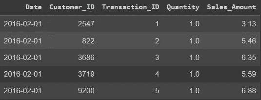

只看这些基本的事务性列，我们可以在下一步中计算一些客户级别的指标——这些对于读过我以前文章的人来说应该很熟悉。

# 步骤 2:特征工程

如果不确定分组的基础，将项目分组的任务就无法完成。换句话说，将一个项目放在一个组中而不放在另一个组中一定有原因。

这一步包括收集、计算和预测有意义的指标。或“特征”，根据这些特征对客户进行分组。

**RFM 特色**

由于实施 RFM(近期-频率-货币价值)分析以将交易数据转换为客户级别特征的详细信息已在之前的帖子中广泛讨论过，因此强烈建议查看这些信息以获得更好的理解——本文顶部链接的笔记本中也实施了这些信息。

简而言之，我们只是使用交易数据来确定:

*   **最近**:每个客户最近一次交易是多久以前？
*   **频率**:客户在多少个独特的时间段参与了业务？
*   **货币价值**:每项业务产生的平均商业价值(收入)是多少。
*   **年龄:**每位客户成为该企业的客户有多久了？

在这个例子中，我们将使用天数作为持续时间的单位。(例如，如果客户年龄为 131 岁，这意味着他们在 131 天前首次参与该业务)。

```
**Customer_ID   recency    frequency            value       age**                                     1                 131            1         8.145000       131                      2                  69            1         7.770000        69                       3                 121            1         3.640000       121                      5                   4            4        14.672500       100
```

**时态特征**

现在我们有了一些描述客户群的特征。让我们也计算一些基于时间的特征。本质上，我们试图确定客户更喜欢什么时候参与业务，以及日期对这些偏好的影响。

```
# Extract day, month, day of week and day of year from Transaction Date. df is the transaction table.
def get_temporal_features(df, date_col, id_col):
  # Get Dates and IDs of each transaction
  temp = df[[id_col, date_col]]
  # Get Day of Week
  temp['DayOfWeek'] = temp[date_col].dt.day_name()
  # Get Month Name
  temp['Month'] = temp[date_col].dt.month_name()
  # One hot encode using dummies
  dummies = pd.get_dummies(temp[['DayOfWeek', 'Month']])
  dummies[id_col] = df[id_col].values
  # Aggregate by customer
  dummies = dummies.groupby(id_col).sum()
  return dummies
```

在上面的代码中，我们将从事务中计算以下时间特征:

*   一周内顾客每天购物的次数。
*   一年中每个月顾客购物的次数。

在一周的时间里，这可能看起来像这样:

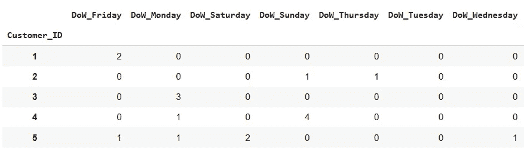

这里，客户 1 总共购买了两次，都是在星期五，而客户 2 也进行了两次交易，但一次是在星期天，另一次是在星期四。这个逻辑同样适用于月份。

**附加功能**

现在，我们可以计算客户层面的任何其他指标，还可以引入其他预测指标，如流失风险和预测生命周期价值。

我们将通过导入我们已经适合此任务的模型来完成此任务，并简单地预测我们为每个客户生成的特性。我们培训过的模型的快速总结:

*   **流失风险模型**:预测顾客下个月不会再来商店的概率。
*   **终身价值模型**:预测客户下个月的消费金额。

因为我们将模型与我们制作的 RFM 特征相匹配，所以这很简单:

```
import pickle

# Load Churn Risk and Lifetime value predictive models
churn_model = pickle.load(open(churn_model_path, 'rb'))
ltv_model = pickle.load(open(ltv_model_path, 'rb'))

# Append predictions to current data
rfm[['buy_prob', 'churn_risk']] = churn_model.predict(rfm)
rfm['pred_spend'] = ltv_model.predict(rfm)
```

请随意引入您能想到的任何其他可以在客户层面上进行聚合的功能。这里我包含了 *to_date_value* ，对客户的总价值进行编码。

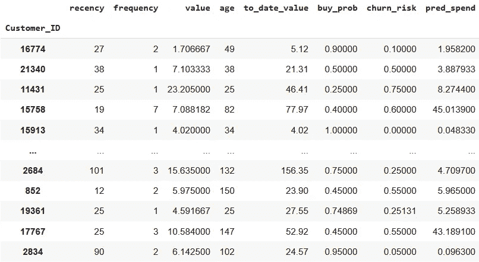

让我们整合我们拥有的所有功能，并按客户 ID 进行合并。

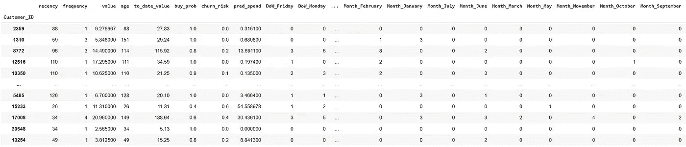

现在我们所有的描述性指标都准备好了，我们可以开始对客户进行'**聚类**。

# 第 3 步:模型(或算法)

聚类是一种无监督学习算法，是机器学习的一个分支。虽然没有真正的价值或标签可以预测，但目标是找到有见地的方法来分组我们拥有的数据点。

有 4 种主要类型的聚类算法:基于*质心*、基于*密度*、基于*分布*和*分层*。在本指南中，我们将介绍一种基于*质心*的算法，称为 K-means 聚类，因为它易于解释，并且具有直观的概念。这种算法的缺点是它对初始条件敏感，这可以通过随机性和重复得到某种程度的缓解。

K-means 聚类基于欧几里得距离，即两个数据点之间的几何距离。该算法在数据集中寻找最小化该距离的组。一个*形心*被定义为每个组的中心点。

对于两个 2D 分 ***p*** 和 ***q*** :

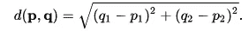

[K-Means 聚类的数学](https://muthu.co/mathematics-behind-k-mean-clustering-algorithm/):欧氏距离公式

我们可以将该算法描述如下:

*   随机设置一些初始聚类
*   计算每个数据点和每个聚类的质心之间的欧几里德距离。
*   将每个数据点分配给欧氏距离最小的聚类。
*   重新计算质心
*   重复直到质心不变。

一定要看看[引用的](https://muthu.co/mathematics-behind-k-mean-clustering-algorithm/)文章，深入了解算法背后的数学。

幸运的是，scikit-learn 有一个已经实现了这个算法的类，尽管我强烈建议您也尝试自己实现它作为一个练习。K-means 算法需要一个参数，即要查找的聚类数。然而，这往往是不为人知的。毕竟多少组才是最能说明问题的组数？这就是我们要介绍的“[肘法](https://blog.cambridgespark.com/how-to-determine-the-optimal-number-of-clusters-for-k-means-clustering-14f27070048f)”。在这里，我们将简单地将多个 K-means 算法与要查找的组的数量进行拟合，计算平方距离的总和，并根据所使用的组的数量绘制它们。

```
from sklearn.cluster import KMeans

sq_distances = []
K = range(1,15)
for k in K:
   km = KMeans(n_clusters=k)
   km = km.fit(_features)
   sq_distances.append(km.inertia_)
```

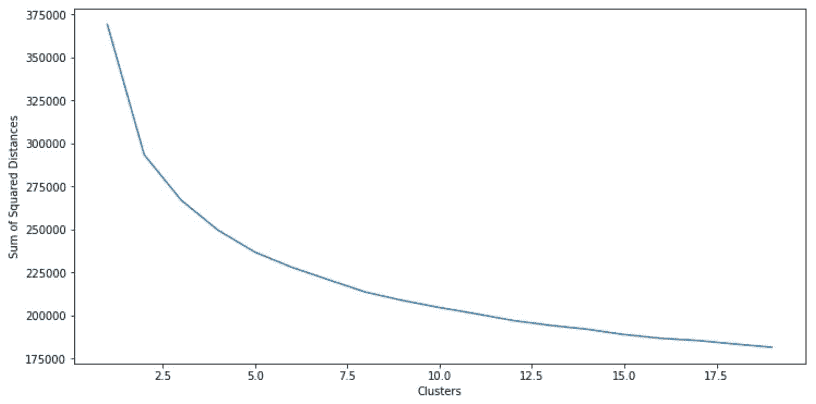

确定最佳聚类数的肘方法

我们正在寻找弯曲的峰值，它出现在大约 3-4 个聚类中，这表明这是适合 K-means 算法的理想聚类数。所以，让我们开始吧。

```
# Fit model
kmeans = KMeans(n_clusters=3).fit(_features)

# Append segments to features
features['segment'] = kmeans.predict(features)

# Append segments to normalized features
_features['segment'] = features.segment.values
```

由于 K-means 聚类算法是随机初始化的，所以每次聚类的名称都可能不同。然而，如果聚类是健壮的，您会发现实际的聚类本身具有相同的属性，并且名称被调换了。我们将通过计算每个聚类的中心来查看这些数据，以获得每个要素的平均值，并跨聚类进行比较。

# 结果

下面的图显示了 3 个聚类(在此标记为 0、1 和 2)中每个聚类的中心。为了便于观察，我把它们分开了:

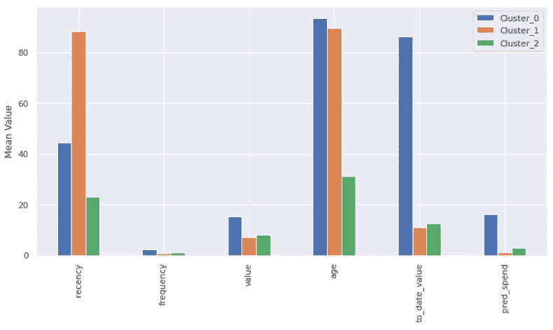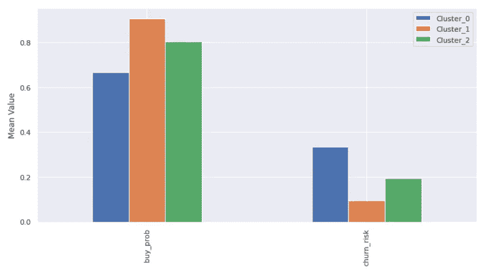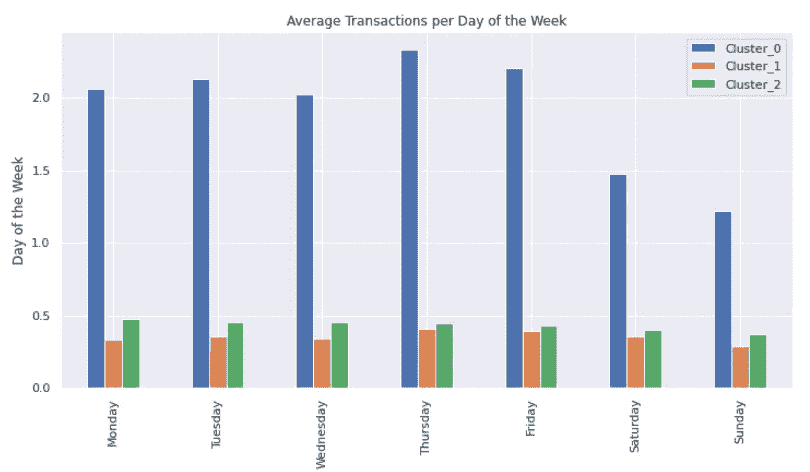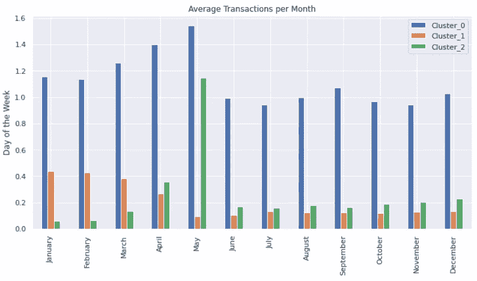

```
**Number of customers in each cluster:**
Cluster_0: 5635
Cluster_1: 5941 
Cluster_2: 2091
```

这就是你内心的数据科学家必须出现的地方。每个数据集都是不同的，并且会以不同的方式进行聚类。K-means 算法用于查找数据中的组，但是我们还没有回答这些组代表什么的问题。让我们凭直觉解决这个问题。下面的矩阵显示了与上面相同的数据，只是它突出显示了每个特征相对于其他分类的高低程度。为了清楚起见，每个特征都被归一化。

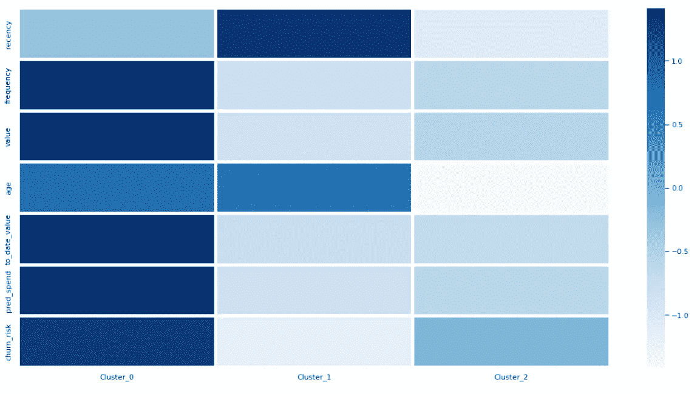

让我们快速解读一下，

**集群 0** :该集群包含最多的客户。它们具有相对较低的新近性、较高的频率、价值、今日价值和流失风险。这些是最有价值的客户，因为他们最近参与了该业务，并且参与频繁。它们还拥有最高的每笔交易平均值以及最高的最新价值。正因为如此，终生价值模型预测他们的花费会很高。由于流失风险模型预测他们**是否会在下个月**回来，所以他们的高流失风险显然是他们的低新近度。这些客户的偏好必须得到尊重，因为他们创造了大部分收入。

**第 1 类**:新近性高，年龄中等，其他低。该群集包含上次很久以前到达的客户。他们没有产生太多的收入，而且不经常，然而，他们也有一个低流失风险。这可能是因为他们的下一笔交易即将到来。这些客户值得营销，因为他们很长时间没有回来，需要一些关注。

**聚类 2** :最低的新近度和年龄。中度流失风险，其他风险相对较低。这些是最新的客户，没有足够的时间来展示他们的真正价值。他们倾向于在 5 月份购买(也许 5 月份有一个促销活动与这些客户不谋而合)。

有更多的定量方法来解释我们所创建的集群的属性，例如通过关联规则。这提供了一种自动解释集群的方法，我打算在以后的文章中介绍这一点。

# 结论

在本文中，我们收集了交易数据，并进行了有意义的转换，以生成丰富的客户数据集。然后，我们使用肘方法和 K-均值聚类来识别数据中的 3 组。我们甚至可以制作一个有趣的 3D 图来真实地可视化被发现的群体。

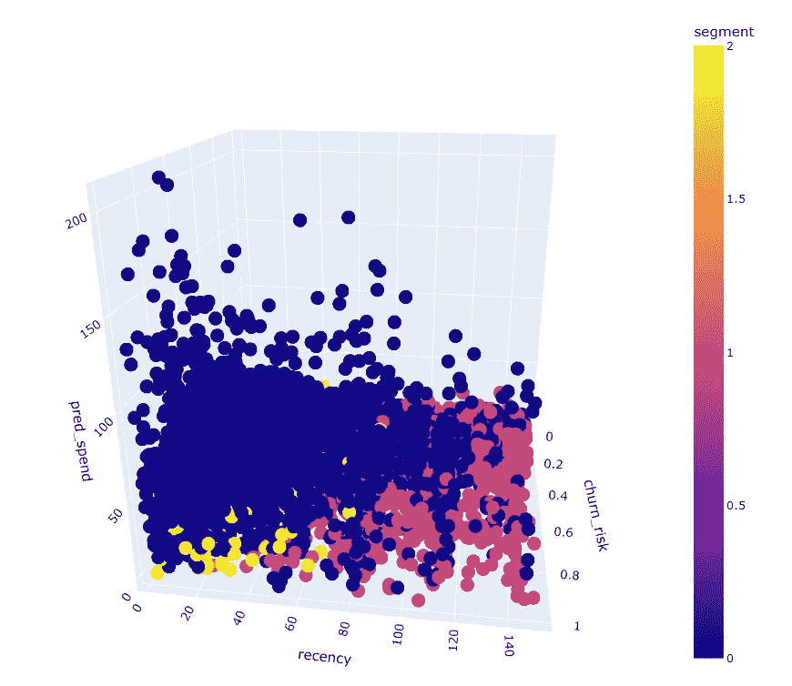

这使我们能够根据我们得出的数据驱动指标对每个组做出直觉。一旦确定了这些群体，我们就能够就如何改善与该企业现有的不同类型客户的关系提出可行的见解。

客户细分是了解客户的一种直观而有见地的方法，尤其是当它与其他数据驱动的分析技术结合使用时。它不仅是高度可解释的，而且它的复杂性可以根据所选择的算法种类逐渐增加。

我希望你喜欢这篇文章！一定要留下任何评论和建议——就像任何学习算法一样，我一直在寻求改进！

# 参考

[](https://muthu.co/mathematics-behind-k-mean-clustering-algorithm/) [## K-均值聚类算法背后的数学

### K-Means 是最简单的无监督聚类算法之一，用于将我们的数据聚类成 K 个类别。

muthu.co](https://muthu.co/mathematics-behind-k-mean-clustering-algorithm/) [](https://blog.cambridgespark.com/how-to-determine-the-optimal-number-of-clusters-for-k-means-clustering-14f27070048f) [## 教程:如何确定 k-means 聚类的最佳聚类数

### 剑桥火花大学的数据科学家和应用数据科学学生托拉·孙心怡

blog.cambridgespark.com](https://blog.cambridgespark.com/how-to-determine-the-optimal-number-of-clusters-for-k-means-clustering-14f27070048f) [](/how-to-predict-customer-churn-risk-using-machine-learning-in-python-b11c09759491) [## 如何使用 Python 中的机器学习预测客户流失风险

### 使用 Python、pandas 和 scikit-learn、RFM 分析和 SMOTE 的深入教程

blog.devgenius.io](/how-to-predict-customer-churn-risk-using-machine-learning-in-python-b11c09759491)