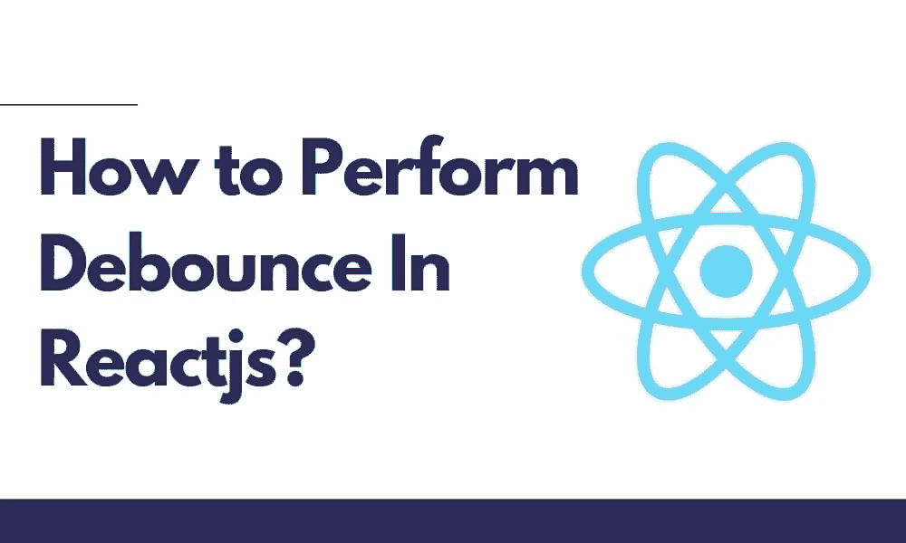

# 如何在 Reactjs 中执行去抖？

> 原文：<https://blog.devgenius.io/how-to-perform-debouncing-in-reactjs-b5efc3ab8c6a?source=collection_archive---------18----------------------->



Javascript 中的去抖是提高浏览器性能的有效方法。这是耗时的计算，因此它们可能会频繁调用或降级。基于去抖的编程实践去抖是维护耗时任务的合适选择。通常，该过程是一个方便的选项，用于限制进程中调用函数的速率。

# 什么是去抖功能？

Reactjs 中的 Debounce 或 debounce()函数主要是强制函数在运行时暂停。函数的作用是限制或减少它们被调用的次数。

最佳 [**react js 开发服务**](https://bosctechlabs.com/hire-react-developer/) 的可用性将是有效改善稳定结果的合适选择。这也是限制函数调用次数的合适选项。

# Reactjs 中的去抖如何发挥作用？

Reactjs 中的去抖是一个非常有用的过程，主要是确保为您提供超越的实际好处。例如，当有自动完成或预输入时，它需要和下拉选项一起显示。

这些主要是在为每次击键触发 API 时启用的。通常，去抖功能是快速触发 API 的实用选项之一，并且它还允许整个时间延迟属性。这些是在键入时快速添加用户的合适选项。

当您给出 300 毫秒的延迟时，用户需要一些时间或更长时间来键入下一个单词或字母。对于触发 API 来说，这是一个非常实用的选择，这个过程主要减少了 API 调用的数量，并使其变得非常重要。

## 创建 React 应用程序并安装模块:

步骤 1:使用以下命令创建一个 React 应用程序:

```
npx create-react-app react-debouncing
```

步骤 2:创建项目文件夹后，即 react-de bounding，使用以下命令移动到该文件夹:

```
cd react-debouncing
```

步骤 3:创建 ReactJS 应用程序后，使用以下命令安装所需的模块:

```
npm install lodash
```

## 无去抖的回拨:

该流程主要增加了被称为<filterlist>受理的重要环节。主要原因是他们有一个包含 200 条记录的完整名单。</filterlist>

它特别具有组件和输入，用户可以在其中键入他们需要的查询和名称，这样他们就可以在查询中被自动过滤。<filterlist>组件列表如下:</filterlist>

```
import React, { useState, useCallback } from "react";
import debounce from "lodash.debounce";
export function FilterList({ names }) {
 const [query, setQuery] = useState("");
 let filteredNames = names;
 if (query !== "") {
   filteredNames = names.filter((name) => {
     return name.toLowerCase().includes(query.toLowerCase());
   });
 }
 const changeHandler = (event) => {
   setQuery(event.target.value);
 };
 const debouncedChangeHandler = useCallback(debounce(changeHandler, 300), []);
 return (
   <div>
     <input
       onChange={debouncedChangeHandler}
       type="text"
       placeholder="Type a query..."
     />
     {filteredNames.map((name) => (
       <div key={name}>{name}</div>
     ))}
     <div>{filteredNames.length === 0 && query !== "" && "No matches..."}</div>
   </div>
 );
}
```

# 什么是去抖应用？

主要实现了去抖动，其中搜索与用户一起工作。这些主要是在搜索框中键入的，以便获得正确的结果。它主要来自服务器，所以单击服务器 API 会在最大程度上停止。

这些主要是由于频繁的服务器 API 更改而导致的，因此它们会降低服务器性能。基于去抖动的各种应用是可用的，例如内容加载网页，如 Face、Twitter 等等。这些应用程序主要允许用户保留内容并持续向下滚动。

通常，当滚动事件被频繁点击时，会产生影响。主要原因是它们包含更多的图像和视频。滚动事件利用去抖动。例如，当您在寻找去抖 handleOnChange 时

```
function debounce(fn, delay) {
  var timer = null;
  return function() {
    var context = this,
      args = arguments;   
clearTimeout(timer);
    timer = setTimeout(function() {     
fn.apply(context, args);
    }, delay);
  };
}
var SearchBox = React.createClass({
  render: function() {
    return <input type="search" name="p" onChange={this.handleOnChange} />;
  }, 
handleOnChange: function(event) {
    // make ajax call
  }
});
```

# 去抖动回拨的代码:

为了在 Reactjs 中反跳 changeHandler 函数，使用 lodash 很方便。去抖封装。这些主要是通过各种允许去抖动作的库来实现的。

```
import debounce from 'lodash.debounce';
const debouncedCallback = debounce(callback, waitTime);
```

在该过程中，debounce()函数将接受回调参数函数。这些是为其功能返回去抖版本的合适选项。主要调用去反跳函数，因为去反跳回调会被自动调用多次。

这些都是突发的，并保证在不同的等待时间调用回调。在分析过程中，这是一个非常重要的方式去抖动拟合完美。这些都是适合在<filterlist>中过滤的方法:让我们去抖 changeHandler。该过程将主要导致 300 毫秒的等待时间。</filterlist>

```
import { useState, useCallback } from 'react';
import debounce from 'lodash.debounce';
export function FilterList({ names }) {
  const [query, setQuery] = useState("");
  let filteredNames = names;
  if (query !== "") {   
filteredNames = names.filter((name) => {     
return name.toLowerCase().includes(query.toLowerCase());
    });
  }
  const changeHandler = event => {   
setQuery(event.target.value);
  };
  const debouncedChangeHandler = useCallback( 
debounce(changeHandler, 300)
  , []);
  return (   
<div>     
<input       
onChange={debouncedChangeHandler}       
type="text"       
placeholder="Type a query..."     
/>     
{filteredNames.map(name => <div key={name}>{name}</div>)}   
</div>
  );
}
```

# 使用后端代码创建项目:

使用击键时的安全 API 构建自动完成项目是很有帮助的。这些主要是增加了自定义的去抖功能，这是一个非常方便的选择使用内置的去抖功能，保证了更好的使用。

使用 node 创建简短的后端程序可以保证得到更好的字符串。获得最适合在 Reactjs 中执行去抖的 react js 开发服务，节省更多时间。

```
const express =require('express');
const mongoose = require('mongoose');
const bodyParser = require('body-parser');
const app = express();
app.use(bodyParser.json());
app.use((req,res,next) => {
res.header('Access-Control-Allow-Origin', '*');
res.header('Access-Control-Allow-Headers', '*');
next(); 
});
const Words = mongoose.model("words", new mongoose.Schema({ 
words: [String] 
}));
app.get("/api/words", async (req , res) => {
let qw = req.query.queryWord; 
let queryWord = qw.replace(/^"|"$/g, '');
const words = await Words.find({})
let wordsArray = words[0].words;
let filteredArray = wordsArray.filter(val => {
return val.indexOf(queryWord.toLowerCase()) > -1
});
res.send(filteredArray);
});
app.post("/api/words", async (req , res) => {
const newWordArray = new Words(req.body);
const savedArray = await newWordArray.save();
res.send(savedArray);
});
 const PORT = process.env.port || 5000;
mongoose.connect("mongodb://localhost/word-list-db", {useNewUrlParser: true, useUnifiedTopology: true})
  .then(() => {
  app.listen(PORT, () => console.log(`Server running on port ${PORT}`));
})
.catch((err) => console.log(err));
mongoose.set('useFindAndModify', false);
```

## 反应代码:

去抖函数有两个不同的参数。这些主要是在延迟时启用主要的调用函数，比如 getDropDown 函数。这些包括呼叫的延迟量，并确保获得快速功能。

```
import React , {useCallback, useState} from 'react'; 
import './App.css';
import axios from 'axios';
function App() {
 const [options, showOptions] = useState(false);
 const [searchString, setSearchString] = useState("");
 const [dropDownOptions, setDropdownOptions] = useState([]);
 const onInputClickHandler = () => {
   showOptions(true);
 } 
 const getDropDown = (val) => {
   axios.get("http://localhost:5000/api/words?queryWord=" + val).then(res => {
     setDropdownOptions(res.data);
   });
 }
 const onInputChangeHandler = (e) => {
   const nextValue = e.target.value
   setSearchString(nextValue);
   getDropDown(nextValue);
 }
 const setOptionsAsInputHandler = (val) => {
   showOptions(false);
   setSearchString(val);
 }
 return (
   <div className="App">
     <header className="App-header">
       <h1>Debounce In React</h1>
       <div className="Autocomplete">
         <input className="Input" placeholder="Type Something..." onClick={onInputClickHandler} onChange={onInputChangeHandler} value={searchString}/>
         <div className="Options">
           {options ?
             dropDownOptions.map(value => {
               return <div key={value} onClick={() => setOptionsAsInputHandler(value)}>{value}</div>
             })
           : null}
         </div>         
       </div>
     </header>
   </div>
 );
} 
export default App;
```

## 结论:

创建去抖动函数的最好方法是使用 useMemo()钩子。这些也是处理所有正在发生的事件的合适选项。正确的设置保证了去抖关闭的完全刷新。当去抖事件处理程序访问时，必须使用 useMemo(…，dependencies)设置依赖关系参数。

感谢您从头到尾阅读我们的文章。希望你喜欢阅读，并从我们的文章中获得一些价值。还有，让我们知道你的想法。我们不断改进我们的内容，并始终努力为您提供最好的。

如果你的企业缺乏专业人士，聘请一家 [**手机 app 开发公司**](https://bosctechlabs.com/services/mobile-app-development/) 为 app 开发解决方案，攻克技术上的东西。

继续学习！！！继续分享！！！