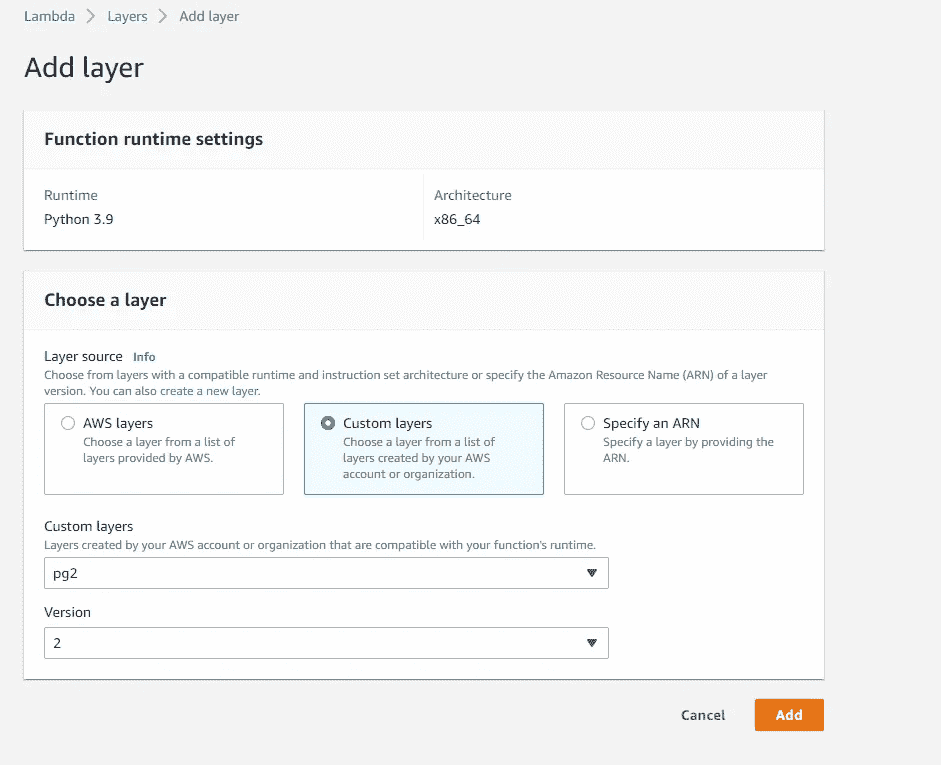

# 如何用 Python 执行 AWS lambda 的 ETL？

> 原文：<https://blog.devgenius.io/how-to-perform-etl-with-aws-lambda-using-python-84c7e48ec109?source=collection_archive---------5----------------------->

**使用 AWS Lambda，Python**


使用 AWS Lambda 的 ETL

AWS Lambda 是一个事件驱动的无服务器计算平台，由 Amazon 作为 Amazon Web Services 的一部分提供。它是一种计算服务，运行代码以响应事件，并自动管理该代码所需的计算资源。AWS Lambda 功能有助于我们专注于核心产品和业务逻辑，而不是管理操作系统(OS)访问控制、供应、扩展等。

术语“无服务器”是用词不当。幕后的 lambda 服务提供来自云提供商的资源，即服务器。它根据需要扩展 ram、CPU 和其他资源。AWS 负责维护服务器并使其保持最佳状态。这样，我们可以专注于编写代码和为业务提供价值，而不必担心底层资源的供应。开发人员所要做的就是将他们的代码带到 AWS 并进行部署。

我们将使用 Python 编写一个 lambda 函数，从 S3 读取数据，并将其加载到红移表中。我们将利用[上一次会议](/develop-aws-glue-etl-pipeline-with-python-shell-fe6f66763e9d)的代码，这样我们就可以专注于构建 lambda 函数。

完整的代码可在 [GitHub](https://github.com/hnawaz007/pythondataanalysis/blob/main/AWS%20Lambda/etl.py) 上获得。代码演练可以在 YouTube 上找到。

AWS Lambda 使我们能够:

*   用我们最喜欢的语言构建结构良好的 ETL 管道
*   Python 的易用性和预构建库的强大功能
*   以 Python 代码形式创建和管理脚本化数据管道
*   基于事件触发您的工作流

**用库创建 Zip 文件**

第一步是创建一个包含所需库的 zip 文件。通常，我们导入我们的库，如 pandas 或 *pysopg2* 来操作数据。因为我们不知道我们的代码将在哪个服务器上运行，所以我们需要确保为我们的函数提供了所需的库。因此，让我们用库创建一个 zip 文件。我有一个名为 python 的新文件夹，它是在命令提示符下打开的。我们将在这个文件夹中安装 python 库。因此，我们可以发出一个 pip install 命令，带有几个附加参数。

```
pip install --platform manylinux1_x86_64  --only-binary=:all: psycopg2-binary --target ./python psycopg2-binary
```

完成后，我们可以将文件夹压缩成一个 zip 文件。

在 AWS 中，我们推出了 lambda 服务。我们将创建一个层，并将一个 zip 文件上传到这个层。因为我们将体系结构设置为 Linux *x86_64* ，所以请确保在这里选择相同的体系结构。对于兼容运行时，我们可以选择多达 15 个，但让我们选择最新的三个。一旦我们指定了所有这些选项，单击创建按钮。我们新创建的层位于层下。


创建具有依赖关系的层

现在我们可以编写 lambda 函数来利用这一层。因此，在函数下，我们将创建一个新函数。我们将从头开始创作。为此函数提供一个名称。在运行时下，我们搜索并选择 python 3.9。默认的体系结构选项很好，让我们单击“创建”按钮。


创建 Lambda 函数

这将我们带到配置页面，在这里我们可以将一个层附加到此功能。让我们向下滚动到层选项，然后单击添加层。在这个屏幕上，我们将选择自定义层。在下拉列表中选择我们的层及其相关版本，并点击添加将该层附加到功能。



将层附加到 Lambda 函数

让我们测试一下是否可以导入所需的库。我们在函数中导入 *pyscopg2* 并部署更新后的代码。成功后，让我们测试我们的代码。我们创建一个测试事件并点击 test our code。它显示“hello from lambda message ”,表示它运行成功。

在函数中，让我们从环境变量中导入变量。我们将从环境变量中获取凭证和机密。我们在*配置*下定义环境变量。在*通用配置下*定位环境变量。使用 *os.environ['key']* 我们可以检索环境变量值。


λ环境变量

使用 pysopg2 连接方法，我们建立了到红移数据库的连接。让我们在变量中定义一个复制命令。这与上一个会话相同，但是我们更改了表名和 S3 对象路径。利用 *f* 字符串，我们传入局部变量，如 bucket name 和 role *arn* 。

```
#Obtaining the connection to RedShift
    host = os.environ['host']
    user = os.environ['user']
    password = os.environ['password']
    port = os.environ['port']
    role = os.environ['role']
    bucket = os.environ['bucket']
    con=psycopg2.connect(dbname= 'dev', host=host, port=port, user=user, password=password)

    #Copy Command as Variable
    copy_command=f"""copy  src_dimsalesterritory (salesterritorykey, salesterritoryalternatekey, salesterritoryregion, salesterritorycountry, salesterritorygroup)
    from 's3://{bucket}/public/DimSalesTerritory/RevisedDimSalesTerritory.csv' 
    iam_role '{role}'
    DELIMITER ','
    IGNOREHEADER 1;"""
```

我们从*连接*变量创建一个光标，并执行一个*截断表*命令和复制命令。在执行之后，我们将这些提交给数据库。像往常一样，不要忘记关闭光标和连接。让我们部署更新后的代码。

```
#Opening a cursor and run copy query
    cur = con.cursor()
    cur.execute("truncate table src_dimsalesterritory;")
    cur.execute(copy_command)
    con.commit()

    #Close the cursor and the connection
    cur.close()
    con.close()
```

我们的 lambda 函数准备好了。让我们单击 test 按钮来执行我们的功能。它正在执行并返回最终消息。所以函数执行是成功的。


Lambda 部署和测试

让我们查询这个表，看看这个表是否被填充了。查询成功执行我们在表中有数据。


红移表

所以，这就是我们如何编写一个 lambda 函数来在 AWS 中的服务之间移动数据。我们可以在不同的事件上触发这个 lambda 函数。最常见的情况是，一旦我们在 S3 上有了一个新文件，就会触发 lambda 函数将数据移动到 Glue catalog 或 Redshift 数据库中。

**结论**

*   我们已经使用 Python 成功地在 AWS Lambda 中实现了 ETL。
*   我们展示了如何创建一个具有包依赖关系的 zip 文件。
*   我们使用 Python 和 AWS Lambda 实现了 ETL(提取和加载)管道。
*   完整的代码可以在[这里](https://github.com/hnawaz007/pythondataanalysis/blob/main/AWS%20Lambda/etl.py)找到