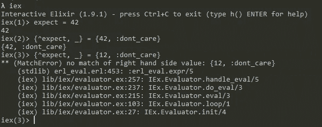

# 如何 Pin(^)在仙丹

> 原文：<https://blog.devgenius.io/how-to-pin-in-elixir-ab68aa443b1a?source=collection_archive---------1----------------------->

pin operator 是怎么回事？


照片由[捕捉人心。](https://unsplash.com/@dead____artist?utm_source=medium&utm_medium=referral)开启[防溅](https://unsplash.com?utm_source=medium&utm_medium=referral)

## 相称的

等式的右边得到匹配，然后分配给左边。相当简单！我发现非常有用的是`underscore`如果我不需要这个变量，可以避免赋值。

```
{_, value} = {dont_care, val}
```

## 销连接

等式的右边得到匹配，就这样。在这种情况下，不发生任何赋值。您需要使用 pin 操作符`^`来实现这一行为。



固定期望值

## 表壳销

中的基本固定如下面的代码片段所示。明智地使用它，不需要比较。我一直在努力与 js 比较，所以这是一个令人耳目一新的选择。

```
case var1 do
 ^var2 -> 
  # do something
 _ -> 
  #if no match
end
```

## 感谢您的阅读！