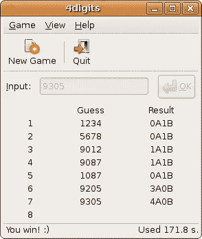
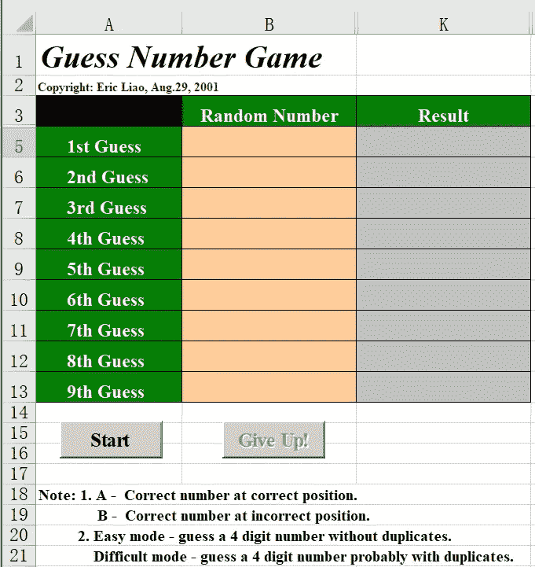

# 如何用 Python 玩牛牛

> 原文：<https://blog.devgenius.io/how-to-play-bulls-and-cows-with-python-5b9d2ae95ba4?source=collection_archive---------13----------------------->

*一款带自动解的老号码猜谜游戏*



来源:https://en.wikipedia.org/wiki/Bulls_and_Cows

[公牛和母牛](https://en.wikipedia.org/wiki/Bulls_and_Cows)是一个数字猜谜游戏，我第一次接触它是在 20 多年前，当时我还在 Excel 上写 VBA。我甚至创建了一个 Excel 版本，现在仍然有效(我曾在 2001 年和埃里克·廖(Eric Liao)一起工作，但从 2005 年开始改用我的法定姓名沙扬·廖):



作者版权

受 Wordle 游戏([如何用 Python 在 Wordle 中作弊](/how-to-cheat-in-wordle-with-python-b72e8904f868))的启发，我决定重温一下这个猜数游戏，用我新喜欢的编程语言 Python。

# 游戏规则

这个游戏的正式名称是**公牛和牛**，通常由两个玩家玩，玩家 A 编造一个没有重复数字的 4 位数，玩家 B 试图一轮一轮地猜出秘密数字。

对于每个猜测，玩家 A 将以“1 牛 2 牛”的形式向玩家 B 提供分数，这意味着在玩家 B 猜测的 4 个数字中，有 1 个正确的数字在正确的位置，2 个正确的数字在错误的位置。

例如，如果秘密数字是 5213，而玩家 B 猜中了 1234，他将得到“1 头公牛 2 头母牛”的分数，因为数字 2 是不正确的位置，而数字 1 和 3 是正确的，但出现在错误的位置。

玩家 B 的目标是达到“4 公牛 0 母牛”的分数，这意味着他猜对了整个数字。

玩家 A 通常由电脑玩，“1 牛 2 牛”分数通常简称为“1A2B”。

与 **Wordle** 相比，公牛和母牛实际上要困难得多，因为从每个分数提供的信息非常有限。比如上面的 1234 (1 牛 2 牛)的情况，你不会知道哪个数字是牛，哪两个数字是牛。

如果你愿意，事情会变得更难。例如，您可以使用 5 位数或更多位数来代替 4 位数的密码。您可以允许号码中有重复的数字，而不是没有重复的 4 位数。你甚至可以用 4 个字母的单词代替 4 位数。

# Python 实现

## 生成一个随机数

第一个逻辑步骤是生成一个 4 位随机数，如下所示:

```
import random
rndnum = random.randint(1000, 9999)
```

请注意，`random.randint`接受一个起始整数和一个结束整数，并且两者都包含在内，这与`range`不同。此外，您希望从 1000 开始，以排除任何少于 4 位数的数字。

但是，这仍然会返回具有重复数字的数字，例如 1111。以下代码扩展了随机数生成函数的无效性和通用性:

```
def gen_rand_num(digits=4, no_leading_zeros=True, no_repeating_digits=True):
    if digits>=10:
        no_repeating_digits = False
    start = 10**(digits-1) if no_leading_zeros else 0
    end = 10**digits-1
    while True:
        rndnum = random.randint(start, end)
        rndnum_str = f'{{0:0{digits}d}}'.format(rndnum)
        if no_repeating_digits:
            if len(set(rndnum_str))==digits:
                return rndnum_str
        else:
            return rndnum_str
```

实际上有一种更好的方法，通过预先生成一个有效数字的列表，用排列代替检查有效性并在无效时生成另一个数字。

## 检查用户输入的分数

要获得用户输入，您可以简单地使用 Python 中的`input`方法:

```
for i in range(10):
    guess = input(f'Round {i+1}, enter your guess: ')
```

然后，您需要做的就是对照生成的随机数逐个数字地检查用户输入:

```
def cal_score_against(guess, against):
    rndnum_str = f'{{0:04d}}'.format(int(against))
    rndnum_lst = list(rndnum_str)
    guess_str = f'{{0:04d}}'.format(int(guess))
    guess_lst = list(guess_str)
    a = sum([n==rndnum_lst[i] for i, n in enumerate(guess_lst)])
    b = sum([n in rndnum_lst and n!=rndnum_lst[i]
        for i, n in enumerate(guess_lst)])
    return f'{a}A{b}B'
```

上面代码中的列表理解比`for`循环更优雅，并且利用了 Python 中的`sum([True, False])=1`特性来计算命中次数。

## 绕成一圈

对于*公牛和母牛*的简单实现来说，这几乎就是全部了，让我们把它包装成一个循环，并尝试一下:

```
import randomdef gen_rand_num(digits=4, no_leading_zeros=True, no_repeating_digits=True):
    if digits>=10:
        no_repeating_digits = False
    start = 10**(digits-1) if no_leading_zeros else 0
    end = 10**digits-1
    while True:
        rndnum = random.randint(start, end)
        rndnum_str = f'{{0:0{digits}d}}'.format(rndnum)
        if no_repeating_digits:
            if len(set(rndnum_str))==digits:
                return rndnum_str
        else:
            return rndnum_strdef cal_score_against(guess, against):
    rndnum_str = f'{{0:04d}}'.format(int(against))
    rndnum_lst = list(rndnum_str)
    guess_str = f'{{0:04d}}'.format(int(guess))
    guess_lst = list(guess_str)
    a = sum([n==rndnum_lst[i] for i, n in enumerate(guess_lst)])
    b = sum([n in rndnum_lst and n!=rndnum_lst[i]
        for i, n in enumerate(guess_lst)])
    return f'{a}A{b}B'rndnum = gen_rand_num()
for i in range(10):
    guess = input(f'Round {i+1}, enter your guess: ')
    score = cal_score_against(guess, rndnum)
    if score=='4A0B':
        print(f'{score}, you won!')
        break
    else:
        print(score)
else:
    print(f'You lose, correct answer is: {numble.get_answer()}')**output:**
Round 1, enter your guess: 1023
2A0B
Round 2, enter your guess: 1045
0A1B
Round 3, enter your guess: 4623
2A0B
Round 4, enter your guess: 5723
2A1B
Round 5, enter your guess: 8523
4A0B, you won!
```

当然，上面的 37 行代码是一个简化的实现，您可能已经发现了一些隐藏的错误，比如没有做任何事情来处理不正确的输入。但它服务于目的。

# 懒得去玩？试试自动猜测！

像我这么懒，当然不会就此打住。我可以快速找到的一个自动猜测解决方案是通过遍历所有可能的答案并对照已知分数进行检查的蛮力方法。

```
def auto_guess(rndnum):
    print('Game started, auto guessing ...')
    start = 10**(self.digits-1) if self.no_leading_zeros else 0
    end = 10**self.digits-1
    guesses = {}
    for guess in range(start, end+1):
        valid = True
        for item, value in guesses.items():
            if cal_score_against(item, guess)!=value:
                valid = False
                break
        else:
            score = cal_score_against(guess, rndnum)
            guesses[guess] = score
        if not valid:
            continue
        if score=='4A0B':
            print(f'Round {len(guesses)}, {guess}: {score}, you won!')
            break
        else:
            print(f'Round {len(guesses)}, {guess}: {score}')**output:**
Game started, auto guessing ...
Round 1, 1023: 0A2B
Round 2, 2145: 0A2B
Round 3, 3256: 0A2B
Round 4, 4361: 1A1B
Round 5, 4530: 1A1B
Round 6, 4602: 0A0B
Round 7, 5731: 3A0B
Round 8, 5831: 3A0B
Round 9, 5931: 4A0B, you won!
```

我实际上用这种方法测试了所有 4536 个可能隐藏的数字，用了 2m11s 来完成所有的猜测。有几个最多需要 9 轮才能猜出来，比如上面的`5931`。根据[维基百科](https://en.wikipedia.org/wiki/Bulls_and_Cows)，证明所有问题都可以在 7 个步骤下解决，平均最小步骤为 5.21。我认为我的暴力算法非常成功。

# 还有一点

用 GUI 而不是我简陋的命令行版本来实现这个游戏听起来似乎可行。但是只要在你的应用程序商店上搜索*公牛和母牛*，你就会发现大量的免费版本。除非你想把它作为学习新东西的一个挑战，否则不值得付出汗水。