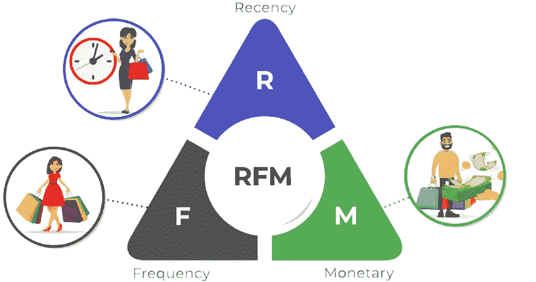
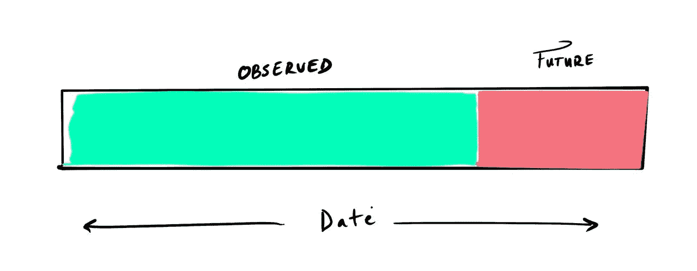

# 如何使用 Python 中的机器学习预测客户流失风险

> 原文：<https://blog.devgenius.io/how-to-predict-customer-churn-risk-using-machine-learning-in-python-b11c09759491?source=collection_archive---------0----------------------->

## 使用 Python、pandas 和 scikit-learn、RFM 分析和 SMOTE 的深入教程


Riho Kroll 在 [Unsplash](https://unsplash.com?utm_source=medium&utm_medium=referral) 上拍摄的照片

# 介绍

对于外行人来说，客户行为很难预测。毕竟，他们是有着反复无常的奇思妙想和欲望的人类。然而，对于一台每秒可以计算数千次的机器来说，趋势和模式越来越明显。企业的目标是吸引顾客，让他们反复光顾商店，每次都产生收入。然而，很难确定哪些客户可能会再次光顾，哪些客户已经对所提供的商品或服务失去了兴趣。

这里我们引入了**顾客流失**的概念:如果顾客主动返回商店，他们就被认为流失了*。而流失客户是指那些不再回来购买更多产品的人。*

**客户流失风险**是客户脱离业务的可能性。因此，我们可以将其定义为:

```
Churn Risk = 1 - Probability of purchase over a determined period
```

了解你的顾客的行为对于充分利用他们的惠顾是必不可少的。如今，我们可以利用大量可用数据来预测客户继续与您合作的可能性。这在以下方面很有价值:

*   提供数据驱动的客户级指标，帮助实施将影响业务的前瞻性决策。
*   通过添加另一个维度来执行**客户细分**，从而丰富客户数据库。
*   可以进一步准确预测客户何时会再次光顾。
*   了解您的入境和出境客户，有助于了解客户保留率以及客户群的整体健康状况。

在本教程中，使用在此处找到的[ka ggle 数据集，](https://www.kaggle.com/datasets/marian447/retail-store-sales-transactions)我们将采取以下步骤:

*   收集并整合我们的数据。
*   使用递归 RFM(近期-频率-货币值)技术将数据集转换为丰富的要素和标注。
*   拟合一个可以根据这些数据进行预测的模型。

在许多方面，这种方法与我们用于[客户终身价值](/how-to-predict-customer-lifetime-value-using-machine-learning-in-python-4066344d0ab0)的方法相似，只是我们生成标签的方式不同。我用于本教程的笔记本可以在[这里](https://colab.research.google.com/drive/1eX2t5oKvtkc54OUI7nblmpJ1jQumcg4Q?usp=sharing)找到。

# 步骤 1:收集数据

对于我们的客户数据，我们基本上只需要 3 列:客户标识符、交易日期/时间和交易值，我们也可以引入其他功能，但您应该确保在功能工程步骤中按客户聚集它们。我们可以使用日期来提取星期几、月份、小时和所有与每笔交易相关的基于时间的特征。如果有不同类别的交易，也可以引入这些列。

```
import pandas as pd

# Load transaction data from CSV
df = pd.read_csv(data_path) # path to your data

# Convert Date column to date-time object
df.Date = pd.to_datetime(df.Date)
df.head(10)
```

**输出:**


输出

# 步骤 2:特征工程



## 新近性、频率和货币价值(RFM)

[RFM](https://farapaper.com/wp-content/uploads/2018/08/Fardapaper-Discovering-recency-frequency-and-monetary-RFM.pdf) 是一种以有意义的方式量化客户的方法，在对客户特定的交易数据进行任何分析时，可以作为一个很好的基准。

*最近度*、*频率*和*货币价值*捕捉客户最近一次交易的时间、他们返回业务的频率以及每位客户的平均销售额。我们可以通过使用任何其他可用特征(如毛利润、年龄、成本保持)或其他预测特征(终身价值)或情感分析来增加这一点。

其工作方式是，我们可以将训练数据拆分成一个*观测期和一个*未来期。如果我们想预测一个客户在一年中会花多少钱，我们会将*未来期间的长度设置为一年，其余的将归入**(如下所示)。*****

****

**观察到的/未来的分裂**

**这允许我们使用在 ***观察到的*** 期间计算的特征来拟合模型，以对在 ***未来*** 期间从事业务的客户进行分类。**

```
**# Data before cut off
observed = df[df[date_col] < cut_off

# Data after cut off
future = df[(df[date_col] > cut_off) & (df[date_col] < cut_off + pd.Timedelta(label_period_days, unit='D'))]**
```

**这里我们引入截止值的概念。这就是 ***观察到的*** 周期结束的地方，并且定义了我们应该在什么日期之前计算我们的特征。**

*   ****最近:**距离最近一次交易的时间(小时/天/周)。我们需要设定一个截止值来计算最近的时间。比如:*截止日期后多少天他们做了一笔交易？***

```
**# Copy transactions
cut_off = df.Date.max()
recency = df[df.Date < cut_off].copy()

# Group customers by latest transaction
recency = recency.groupby(customer_id_column)[date_column].max()
recency = (max_date - recency).dt.days).reset_index().rename(
columns={date_column:'recency'})**
```

*   ****频率:**客户进行交易的不同时间段的数量。这将使我们能够跟踪客户进行了多少交易，以及交易发生的时间。我们还可以保留从截止日期开始计算这些指标的做法，因为这在以后会很方便。**

```
**# Copy transactions
cut_off = df.Date.max()
frequency = df[df.Date < cut_off].copy()

# Set date column as index
frequency.set_index(date_column, inplace=True)
frequency.index = pd.DatetimeIndex(frequency.index)

# Group transactions by customer key and by distinct period
# and count transactions in each period
frequency = frequency.groupby([customer_id_column, pd.Grouper(freq="M", level=date_column)]).count()
# (Optional) Only count the number of distinct periods a transaction # occurred. Else, we will be calculating total transactions in each # period instead.

frequency[value_column] = 1 # Store all distinct transactions

# Sum transactions
frequency = frequency.groupby(customer_id_column).sum().reset_index().rename(
columns={value_column : 'frequency'})**
```

*   ****货币价值**:平均销售额。这里我们简单地计算每个客户所有交易的平均销售额。在最后一步中，我们可以通过取 ***sum*** 而不是 ***mean*** 来额外添加“TotalAmountSpent”特征。**

```
**# Copy transactions
cut_off = df.Date.max()
value = df[df.Date < cut_off].copy()

# Set date column as index
value.set_index(date_column, inplace=True)
value.index = pd.DatetimeIndex(value.index)

# Get mean or total sales amount for each customer
value = value.groupby(customer_id_column[value_column].mean().reset_index().rename(columns={value_column : 'value'})**
```

*   ****年龄:**首次交易后的时间。对于此功能，我们只需找到每个客户第一次交易后的天数。同样，我们需要一个截止日期来计算截止日期和第一笔交易之间的时间。**

```
**# Copy transactions
cut_off = df.Date.max()
age = df[df.Date < cut_off].copy()

# Get date of first transaction
first_purchase = age.groupby(customer_id_column)[date_column].min().reset_index()

# Get number of days between cut off and first transaction
first_purchase['age'] = (cut_off - first_purchase[date_column]).dt.days**
```

**我们可以用下面的函数将所有这些函数包装在一起:**

```
**def customer_rfm(data, cut_off, date_column, customer_id_column, value_column, freq='M'):
  cut_off = pd.to_datetime(cut_off)

   # Compute Recency
  recency = customer_recency(data, cut_off, date_column, customer_id_column)

  # Compute Frequency
  frequency = customer_frequency(data, cut_off, date_column, customer_id_column, value_column, freq=freq)

  # Compute average value
  monetary_value = customer_value(data, cut_off, date_column, customer_id_column, value_column)

  # Compute age
  age = customer_age(data, cut_off, date_column, customer_id_column)

  # Merge all columns
  return recency.merge(frequency, on=customer_id_column).merge(on=customer_id_column).merge(age, on=customer_id_column).merge(monetary_value, on=customer_id_column)**
```

**理想情况下，这可以在某个时间段内获取有关客户保持率的信息*。这可能看起来像这样:***

```
****Customer_ID   recency    frequency            value       age**                                     1                 131            1         8.145000       131                      2                  69            1         7.770000        69                       3                 121            1         3.640000       121                      5                   4            4        14.672500       100**
```

**对于这些标签，我们将为那些在 ***未来*** 期间购买了东西的人设置 1，为所有没有购买的人设置 0。**

```
**def generate_churn_labels(future):
   future['DidBuy'] = 1
   return future[['Customer_ID', 'DidBuy']]**
```

**在某些情况下，对整个数据集执行一次这种操作并拟合一个模型来预测标签可以产生可容忍的准确性。但是，如果你仔细观察，你可能会问:*如果在观察期间发生了有趣的事情呢？问哪个问题是正确的？简单地对数据集进行一次这样的操作会忽略数据中的所有季节性，并且只查看一个特定的标签时段。这里我们介绍一下我称之为**的递归 RFM** 。***

****递归 RFM****

**让我们应用到目前为止我们所知道的 RFM，并通过数据集进行循环。**

**假设数据在年初从左边开始。我们将选择一个频率(例如，一个月)并遍历数据集，根据***(o)***计算我们的特征，并根据 ***未来(f)生成我们的标签。这个想法是递归地计算这些特征，以便模型了解客户的行为如何随时间变化。*****

****

**观察的(o)，未来的(f)**

**对于算法的这一部分，我们将首先获取数据集跨度中每个间隔的日期，并使用这些日期中的每个日期作为计算 RFM 要素和标注的截止日期。再次重申，在我们的示例中，我们选择了 1 个月的频率。**

**对于每个截止( **co** )日期:**

*   **计算截止前所有行( **i** )的 RFM 特征( **i** → **co** )**
*   **计算截止日期和截止日期后一个月之间( **i** )行的标签(**co**→**I**→**co**+**频率**)**
*   ****外部连接**基于客户 ID 创建数据集的功能和标签，以填充未进行任何交易的客户。**

**连接循环中的所有数据集。**

**这在下面的代码中实现:**

```
**def recursive_rfm(data, date_col, id_col, value_col, freq='M', start_length=30, label_period_days=30):
  # Resultant list of datasets
  dset_list = []
  # Get start and end dates of dataset
  start_date = data[date_col].min() + pd.Timedelta(start_length, unit="D")
  end_date = data[date_col].max() - pd.Timedelta(label_period_days, unit="D")
  # Get dates at desired interval
  dates = pd.date_range(
  start=start_date, end=end_date, freq=freq
  data[date_col] = pd.to_datetime(data[date_col]
  )
  for cut_off in dates:
     # split by observed / future
     observed = data[data[date_col] < cut_off
     future = data[
                    (data[date_col] > cut_off) &
                    (data[date_col] < cut_off + pd.Timedelta(
                     label_period_days,  unit='D'))
                  ]
     # Get relevant columns
     rfm_columns = [date_col, id_col, value_col]
     _observed = observed[rfm_columns]
     # Compute features from observed
     rfm_features = customer_rfm(
          _observed, cut_off, date_col, id_col, value_col
     )
     # Set label for everyone who bought in 'future' as 1'
     labels = generate_churn_labels(future)
     # Outer join features with labels to ensure customers 
     # not in observed are still recorded with a label of 0
     dset = rfm_features.merge(
          labels, on=id_col, how='outer'
     ).fillna(0)
     dset_list.append(dset)
  # Concatenate all datasets
  full_dataset = pd.concat(dset_list, axis=0)
  res = full_dataset[full_dataset.recency != 0].dropna(axis=1, how='any')
  return res

rec_df = recursive_rfm(data_for_rfm, 'Date', 'Customer_ID', 'Sales_Amount')**
```

**既然我们已经生成了数据集，现在我们需要做的就是对数据进行洗牌和执行训练/测试分割。我们将 80%用于培训，20%用于测试。**

```
**from sklearn.model_selection import train_test_split

rec_df = rec_df.sample(frac=1) # Shuffle

# Set X and y
X = rec_df[['recency', 'frequency', 'value', 'age']]
y = rec_df[['Sales_Amount']].values.reshape(-1)

# Set test ratio and perform train / test split
test_size = 0.2
X_train, X_test, y_train, y_test = train_test_split(X, y, test_size=test_size, random_state=42, shuffle=True)**
```

****注:班级失衡****

**在分类任务中，有时我们想要预测的类别在数据集中是不平衡的。例如，如果有 10 个观察值和两个类；其中 2 个可能在 **Class_0** 中，另外 8 个在 **Class_1** 中。这可能会在模型中引入偏见，因为它认为一个类别明显多于另一个类别。我们将**少数**类定义为观测值较少的一类，将**多数**类定义为观测值较多的一类。在我们的教程中，类似于这样:**

****

**补救这种情况的一种技术是在下**-采样**多数**类，或者在**上**-采样**少数**类。采样是获取数据子集以执行某种操作的实践。此外，欠采样/过采样是指我们复制(过采样)或删除(欠采样)与相关类相关的观测值。对于手头的任务和您正在处理的数据，哪个选项最适合，这绝对值得实验。****

**SMOTE ( **合成少数过采样技术)**是我们可以使用的工具。**

```
**from imblearn.over_sampling import SMOTE

oversample = SMOTE()
X_train_over, y_train_over = oversample.fit_resample(X_train, y_train)

pd.Series(y_train_over).value_counts()**
```

****输出:****

****

# **第三步:模型**

**当谈到数据科学时，机器学习(及其包含的所有内容)只是一种用于估计变量之间关系的技术。为您的数据找到合适的模型是为您的用例获得最佳结果的另一个旅程。数据科学的真正价值在于使用这些技术在现实世界中做出明智的决策。**

**对于这个例子，我们将尝试一个随机森林分类器，因为它们在实现中是即插即用的，所以它们很容易直接尝试。此外，我们将会看到过采样数据的预测是如何比较的。**

```
**from sklearn.ensemble import RandomForestRegressor

# Initialize and fit model on train dataset
rf = RandomForestClassifier().fit(X_train, y_train)

# Fit on over-sampled data as well
rf_over = RandomForestClassifier().fit(X_train_over, y_train_over)**
```

**一旦拟合，我们可以在数据框架中查看我们对测试集的预测。**

```
**from sklearn.metrics import accuracy_score

# Create Dataframe and populate with predictions and actuals
# Train set
predictions = pd.DataFrame()
predictions['true'] = y_train
predictions['preds'] = rf.predict(X_train)

# Test set
predictions_test = pd.DataFrame()
predictions_test['true'] = y_test
predictions_test['preds'] = rf.predict(X_test)
predictions_test['preds_over'] = rf_over.predict(X_test)

# Compute error
train_acc = accuracy_score(predictions.true, predictions.preds)
test_acc = accuracy_score(
predictions_test.true, predictions_test.preds)
test_acc_over = accuracy_score(
predictions_test.true, predictions_test.preds_over)
print(f"Train Acc: {train_acc:.4f}, Test Acc: {test_acc:.4f}, Test Acc Oversampled: {test_acc_over:.4f}")**
```

**输出:**

```
****Train Acc**: 0.9863, **Test Acc**: 0.8772, **Test Acc Oversampled**: 0.8671**
```

# **结果**

**有趣的是，两个数据集产生了非常相似的结果，事实上，过采样数据比不平衡数据表现更差。在这里，我们可以查看分类报告，看看预测实际上有多精确。**

****

**不平衡数据预测的分类报告**

****

**过采样数据预测的分类报告**

**我们可以看到，在这种情况下，使用 SMOTE 没有任何好处，但是，根据您的数据，您的情况可能并非如此。**

**现在我们的模型已经被训练好了，我们可以使用`predict_proba()`函数来获得与每个预测相关的概率。这是预测概率分布图。请记住，模型预测的概率是客户参与业务的可能性，我们寻找的是他们不参与的概率，因此我们可以简单地从 1 中减去每个概率。**

****

**正如预期的那样，大多数客户都在这个范围的两端。然而，最有意义和可操作的见解是在他们之间找到的。在 0.5 之前说谎的客户脱离的风险较低，因此该图表明大多数客户是健康的。另一方面，那些流失率超过 0.5 的人更有可能离职，因此关注他们的偏好是留住他们的必要条件。**

# **结论**

**递归 RFM 等特征工程技术允许使用丰富的特征来描述客户。正如这里所看到的，这些特征对于分析他们的行为和预测他们将来可能会做什么很有用。我们还讨论了如何在必要时使用 SMOTE 处理类不平衡。流失风险只是这些可预测指标之一。其他包括客户终身价值和客户细分。流失风险的特殊之处在于，它需要进一步确定客户做更具体的事情的可能性，如购买特定类别的产品，或一周中每一天参与的可能性。客户分析的潜力是深远而有洞察力的，尤其是对企业而言。**

**请务必查看我的其他文章，了解更多数据科学和商业机器学习的信息。**

**如果你喜欢这篇文章，给我更多的客户分析内容关注！**